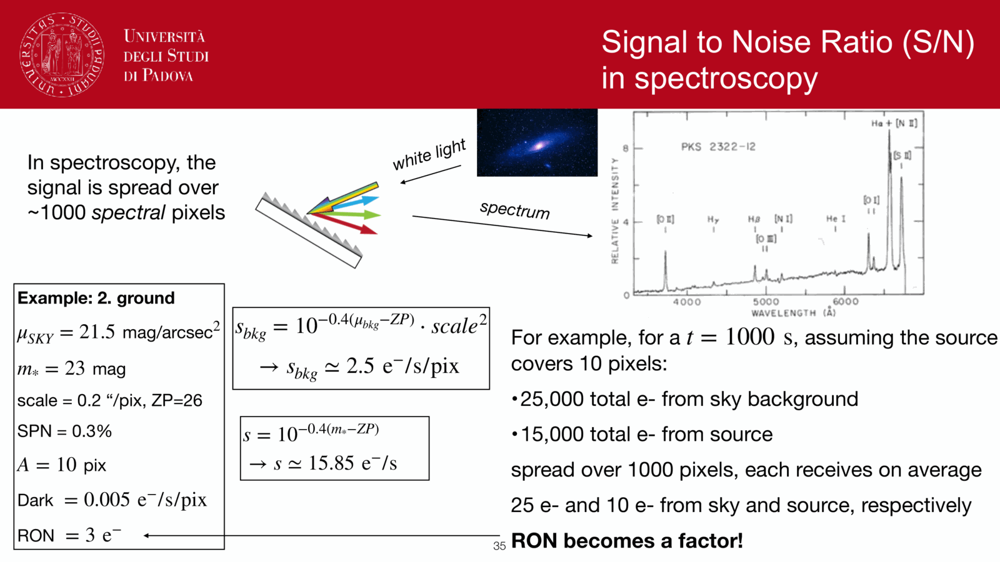
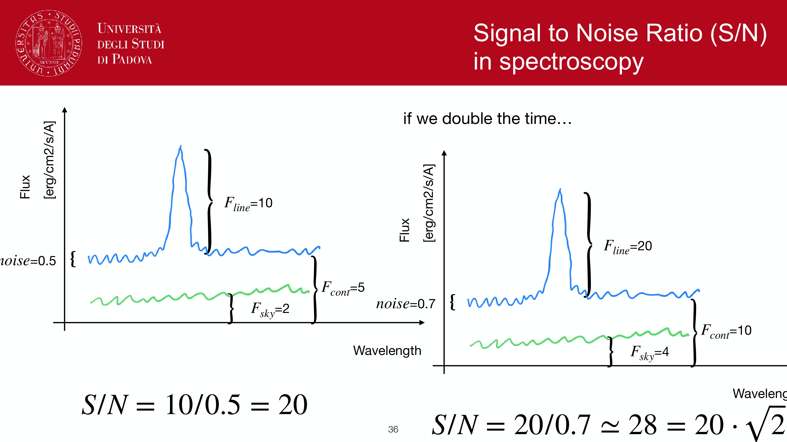


raw CCD frames are not science-ready. five calibration steps remove instrumental signatures so the resulting image is a faithful flux map.

## the steps in order

### 1. bias subtraction

removes the constant analog offset added during readout. take many zero-second exposures with the shutter closed, average them (median or sigma-clipped mean) to make a **master bias**, subtract from every science frame:
$$F_{\rm bias-corrected} = F_{\rm raw} - F_{\rm bias}$$

also use the **overscan** strip per frame to track frame-by-frame bias variations.

### 2. dark subtraction

removes thermally generated electrons. take long exposures with the shutter closed at the science temperature, scaled to the science exposure time. average to make a **master dark**:
$$F_{\rm dark-corrected} = F_{\rm bias-corrected} - F_{\rm dark}$$

usually negligible for cooled science CCDs ($D \ll 0.01$ e$^-$/s), important for room-temperature instruments. modern science observations skip this step if the dark current is below the read-noise floor.

### 3. flat-fielding

corrects pixel-to-pixel response variations and large-scale illumination patterns (vignetting, dust spots on filters). uniformly illuminate the chip and divide:
$$F_{\rm flat-corrected} = \frac{F_{\rm dark-corrected}}{F_{\rm flat}/\langle F_{\rm flat}\rangle}$$

types of flats:
- **dome flats**: lamp-illuminated white screen inside the dome. quick, controlled, but spectrum may not match sky.
- **twilight flats**: bright sky at dawn/dusk. matches sky color, harder to schedule.
- **sky flats**: median-combined science exposures, dithered to remove sources. matches all conditions but requires many science frames.
- **lamp flats** for spectrographs: continuum lamps for wavelength-independent throughput.

flats correct **multiplicative** systematics (per-pixel QE, vignetting); bias and dark correct **additive** systematics.

### 4. fringing correction (NIR/red only)

interference between sky lines (especially OH) and thin layers in the CCD produces a fringe pattern that varies with sky line strength. for I, z, and Y bands at typical CCDs:
1. construct a **fringe pattern** from many science exposures (median them).
2. scale to match individual frame's sky line strength.
3. subtract.

modern deep-depletion CCDs reduce fringing dramatically.

### 5. defects and cosmic rays

- **bad columns / hot pixels**: identified from dark frames (always-bright) or flats (always-low). flagged with a bad-pixel mask, usually replaced by interpolation from neighbours.
- **cosmic rays**: identified by their sharp pixel profile (much narrower than PSF) using algorithms like LACOSMIC (van Dokkum 2001) or astroscrappy.
- **sigma-clipping over multiple frames**: dither and stack several exposures, then per-pixel sigma-clip rejects outliers (cosmic rays appear in only one frame).

## the master pipeline

a typical photometric pipeline:
```
raw frame
  -> bias subtract (master bias)
  -> dark subtract (master dark)
  -> flat field (master flat)
  -> fringe subtract (if applicable)
  -> CR rejection
  -> astrometric calibration (WCS)
  -> photometric calibration (zeropoint from standards)
  -> source extraction
```

every modern survey runs a version of this. results are usually delivered as "calibrated" frames with WCS in the FITS header.

## quality checks

- **bias frame** should be flat at the read-noise level.
- **dark frame** should match the expected $D \cdot t$ count level.
- **flat field** should have $\sim 1\%$ pixel-to-pixel scatter and clean illumination shape.
- **science frame after flat-fielding** should have flat sky background to $\sim 0.5\%$ across the chip.

problems show up as residual gradients, donut shapes (telescope-shadow vignetting), or persistent stripes (electronic crosstalk).

## see also

- [CCD basics](./CCD%20basics.html)
- [CCD readout chain](./CCD%20readout%20chain.html)
- [CCD detectors and SNR](./CCD%20detectors%20and%20SNR.html)
- [The CCD equation](./The%20CCD%20equation.html)
- [Aperture photometry](./Aperture%20photometry.html)
- [Cosmic rays and bad pixels](./Cosmic%20rays%20and%20bad%20pixels.html)
- [Linearity and saturation](./Linearity%20and%20saturation.html)

---

## observational astrophysics course slides (Prof. Paolo Cassata)


*Calibration equation: I_cal = (I_raw - Bias - Dark) / Flat_norm.*


*Master bias, master dark, and dome/twilight flat-field creation.*


<div class="backlinks-section">
  <h4 class="backlinks-title">Linked References (10)</h4>
  <ul class="backlinks-list">
    <li class="backlink-item-wrap"><a href="./Aperture%20photometry.html" class="backlink-item">Aperture photometry</a></li>
    <li class="backlink-item-wrap"><a href="./CCD%20detectors%20and%20SNR.html" class="backlink-item">CCD detectors and SNR</a></li>
    <li class="backlink-item-wrap"><a href="./Cosmic%20rays%20and%20bad%20pixels.html" class="backlink-item">Cosmic rays and bad pixels</a></li>
    <li class="backlink-item-wrap"><a href="./Datacube%20reduction.html" class="backlink-item">Datacube reduction</a></li>
    <li class="backlink-item-wrap"><a href="./Linearity%20and%20saturation.html" class="backlink-item">Linearity and saturation</a></li>
    <li class="backlink-item-wrap"><a href="../../04_Atlas/Observational_Astrophysics_MOC.html" class="backlink-item">Observational_Astrophysics_MOC</a></li>
    <li class="backlink-item-wrap"><a href="./PSF%20photometry.html" class="backlink-item">PSF photometry</a></li>
    <li class="backlink-item-wrap"><a href="./Photometric%20standard%20stars.html" class="backlink-item">Photometric standard stars</a></li>
    <li class="backlink-item-wrap"><a href="./Python%20and%20IRAF%20tools%20for%20photometry.html" class="backlink-item">Python and IRAF tools for photometry</a></li>
    <li class="backlink-item-wrap"><a href="./Spectrum%20reduction%20pipeline.html" class="backlink-item">Spectrum reduction pipeline</a></li>
  </ul>
</div>
