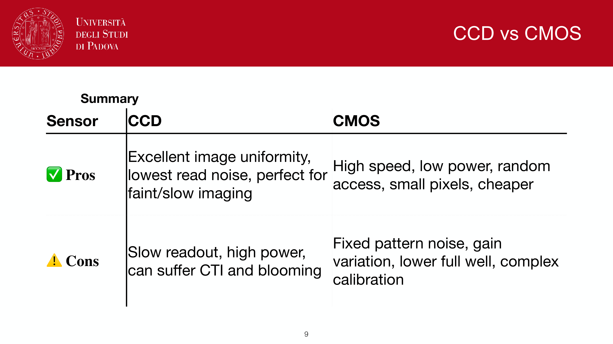
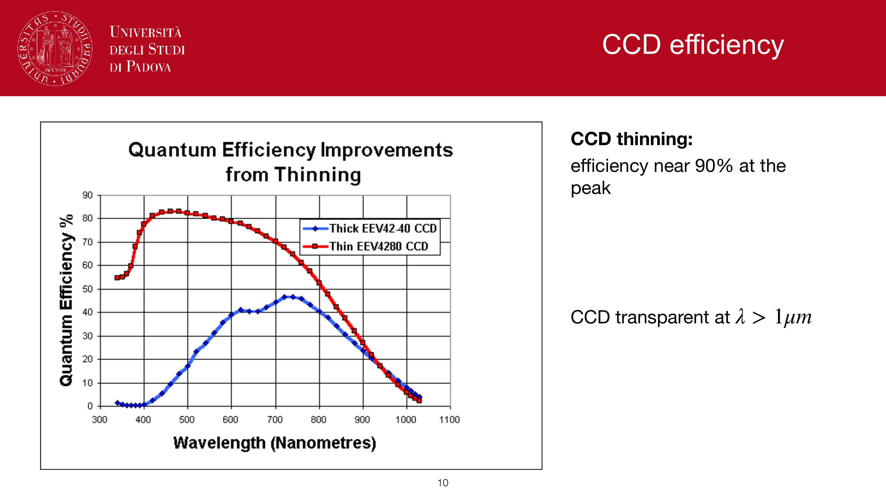
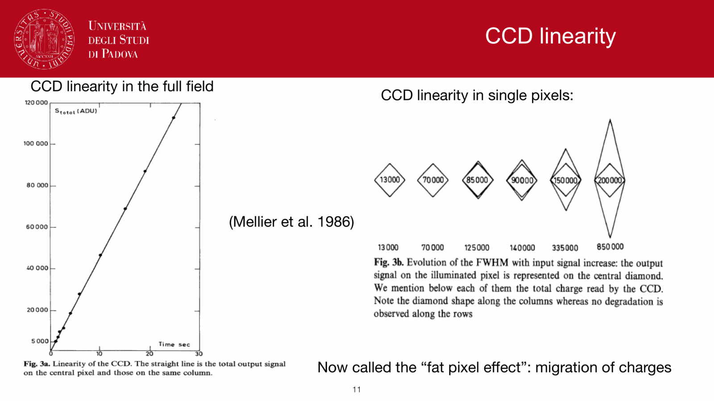
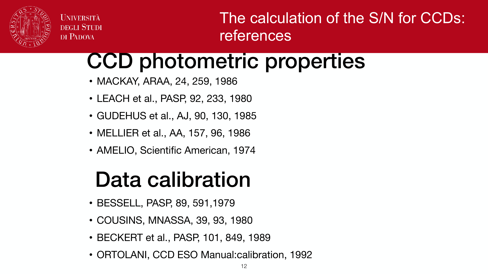
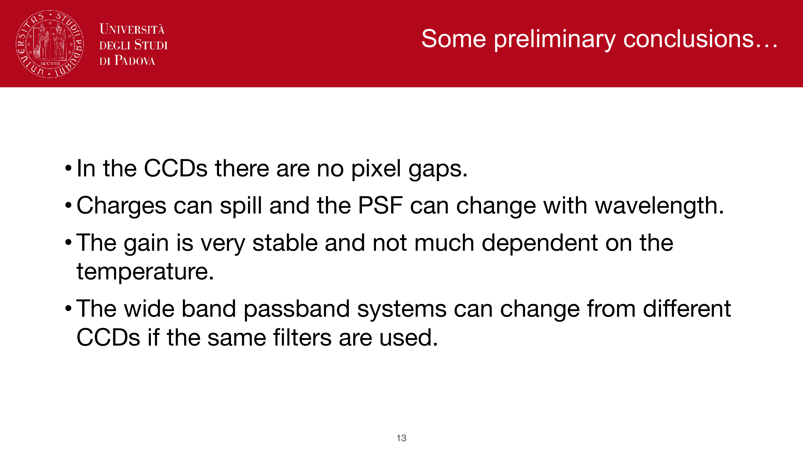
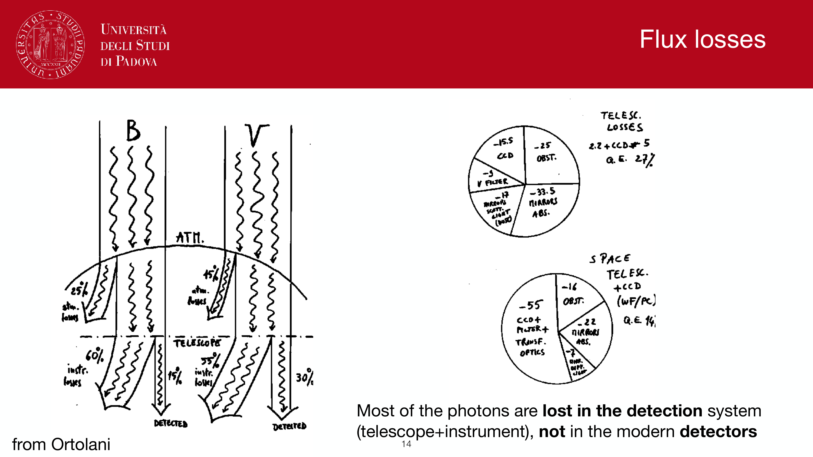
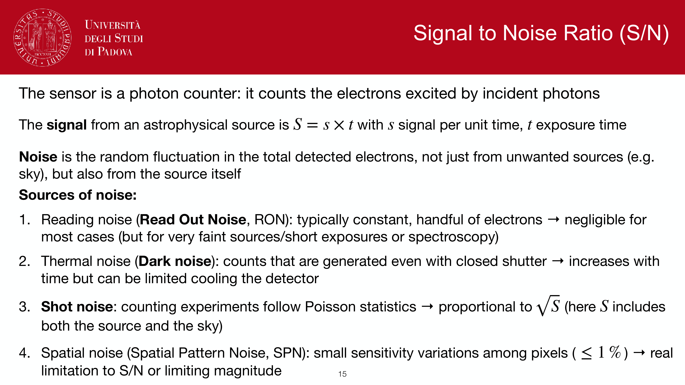
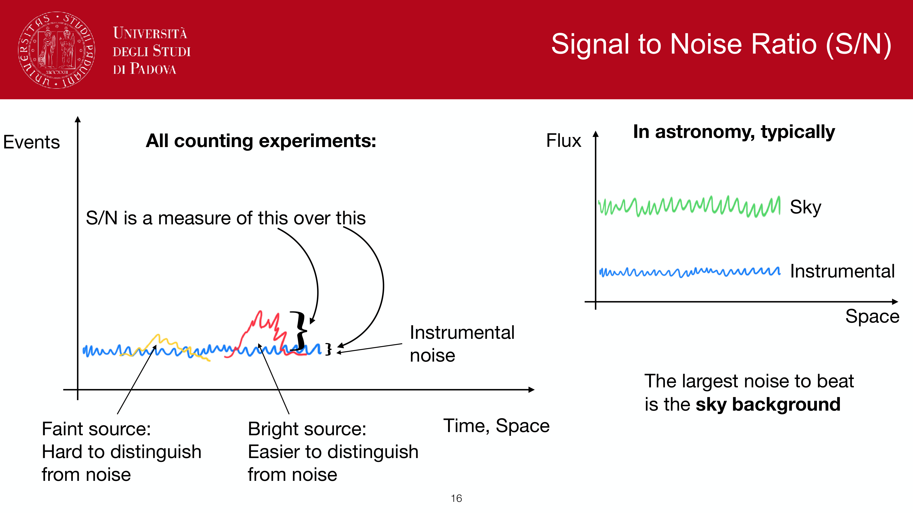


after integration, accumulated charge has to be moved off the pixel array, amplified, and digitised. this **readout chain** introduces three new specifications: gain, bias, and read noise.

## the steps

1. **parallel transfer** (slow shifts): charge in each column is shifted one row at a time toward the serial register. controlled by clocked gate voltages.
2. **serial transfer**: charge in the bottom row is shifted along the serial register to the on-chip amplifier, one pixel at a time.
3. **amplifier**: a JFET converts the small charge packet ($\sim 10^4$ electrons typical for a sky pixel) to a voltage signal.
4. **ADC**: voltage is digitised by an analog-to-digital converter, producing **ADU** (analog-to-digital units).

## gain

defined as the conversion factor:
$$g = \frac{\text{electrons}}{\text{ADU}}$$

a $g = 1.5$ e$^-$/ADU CCD records $1500$ electrons as $1000$ ADU. set by the on-chip amplifier and ADC scaling.

practical implications:
- **high gain** (large $g$, fewer ADU per electron): more dynamic range, less precision in low signal.
- **low gain** (small $g$, more ADU per electron): less dynamic range, more precision.

choosing the gain: aim for $\sigma_{\rm RN}/g \approx 1$ ADU so that read noise is just visible at the digitiser level. ADC bit depth: typical $16$-bit ADC = $2^{16} = 65\,536$ levels, sets the upper end of dynamic range with the chosen $g$.

## bias and overscan

the analog electronics are designed so that zero electrons in the pixel produce a non-zero ADU value, called the **bias level** ($\sim 1000$ ADU typically). this avoids problems near the digitiser zero-rail and ensures readout noise is properly digitised.

the bias is measured frame-by-frame from an **overscan** region: a strip of the CCD readout where the serial register clocks past the end of the actual pixels, producing zero-electron readouts whose mean is the bias.

calibration: subtract a master bias (average of many zero-second exposures) and an overscan column from each science frame.

## read noise

the unavoidable electronics noise added to each pixel each readout. it has two main sources:
- **kTC noise** in the reset transistor.
- **white noise** in the JFET amplifier.

quantified as $\sigma_{\rm RN}$ in **electrons per pixel per readout**. typical values:
- top-tier scientific CCDs (e.g. LSST, MUSE): $\sigma_{\rm RN} \approx 2$ to $5$ e$^-$/pix.
- mid-range research CCDs: $5$ to $10$ e$^-$/pix.
- consumer DSLRs: $\sim 10$ to $20$ e$^-$/pix.

**critically, read noise is per readout, not per second**. one exposure = one $\sigma_{\rm RN}$. taking $K$ shorter exposures of the same total time accumulates $K$ readouts, hence $\sqrt{K}$ more read noise than one long exposure.

read-out speed vs read noise: faster readout gives more $\sigma_{\rm RN}$. modern CCDs offer a "slow" mode for low noise and a "fast" mode for transient/imaging surveys.

## charge transfer efficiency (CTE)

each shift is not perfect: some electrons are lost or smeared. CTE is the per-pixel transfer efficiency, typically $> 0.99999$. for a $4 \text{k} \times 4$k chip, total transfers $\sim 8000$, so $\sim 0.99999^{8000} \approx 0.92$ of charge survives, marginal. for very faint sources at the far end of a serial register, CTE losses bias photometry. mitigated by **charge injection** (adding a known signal) and post-processing CTE correction.

## see also

- [CCD basics](./CCD%20basics.html)
- [CCD readout](./CCD%20readout.html)
- [CCD detectors and SNR](./CCD%20detectors%20and%20SNR.html)
- [CCD noise sources](./CCD%20noise%20sources.html)
- [The CCD equation](./The%20CCD%20equation.html)
- [Charge-Coupled Device](./Charge-Coupled%20Device.html)

---

## observational astrophysics course slides (Prof. Paolo Cassata)

*Charge transfer process: three-phase clocking potential manipulation.*

*Charge Transfer Efficiency (CTE): typical values CTE > 0.99999.*

*Parallel transfer along columns towards the serial register.*

*Serial transfer along register to on-chip output node.*

*Output preamplifier: conversion of charge packet into voltage signal Delta V = q / C.*

*Analog-to-Digital Converter (ADC): converting voltage to Analog-to-Digital Units (ADU / counts).*

*Detector gain g: definition in electrons per ADU (e- / ADU).*

*Readout speed vs readout noise trade-off (slow scan for science vs fast scan for acquisition).*


  <h4 class="backlinks-title">Linked References (7)</h4>
  <ul class="backlinks-list">
    <li class="backlink-item-wrap"><a href="./CCD%20basics.html" class="backlink-item">CCD basics</a></li>
    <li class="backlink-item-wrap"><a href="./CCD%20calibration%20steps.html" class="backlink-item">CCD calibration steps</a></li>
    <li class="backlink-item-wrap"><a href="./CCD%20noise%20sources.html" class="backlink-item">CCD noise sources</a></li>
    <li class="backlink-item-wrap"><a href="./Cosmic%20rays%20and%20bad%20pixels.html" class="backlink-item">Cosmic rays and bad pixels</a></li>
    <li class="backlink-item-wrap"><a href="./Linearity%20and%20saturation.html" class="backlink-item">Linearity and saturation</a></li>
    <li class="backlink-item-wrap"><a href="../../04_Atlas/Observational_Astrophysics_MOC.html" class="backlink-item">Observational_Astrophysics_MOC</a></li>
    <li class="backlink-item-wrap"><a href="./The%20CCD%20equation.html" class="backlink-item">The CCD equation</a></li>
  </ul>

