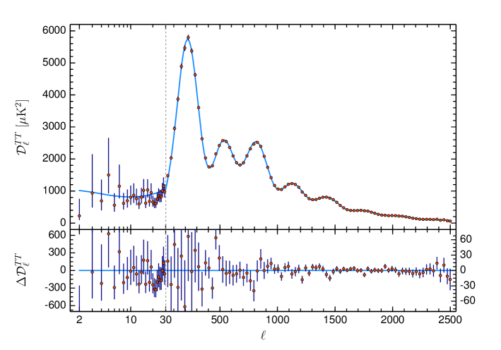
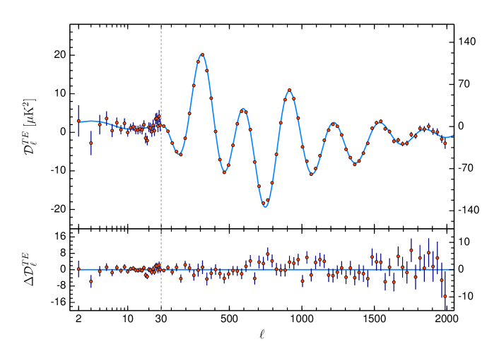


the **CMB angular power spectrum** $C_\ell$ is the variance of CMB temperature anisotropies at multipole $\ell$ (corresponding to angular scale $\theta \sim 180°/\ell$). its **peak structure** encodes most of cosmological physics.

## the definition

decompose the CMB temperature map in spherical harmonics:
$$T(\theta, \phi) - \bar T = \sum_{\ell, m} a_{\ell m}\,Y_\ell^m(\theta, \phi)$$

the **power spectrum**:
$$C_\ell \equiv \frac{1}{2\ell + 1}\sum_m \lvert a_{\ell m}\rvert^2$$

usually plotted as $D_\ell \equiv \ell(\ell+1)C_\ell/(2\pi)$ (which gives a roughly horizontal flat band at the Sachs-Wolfe plateau, easier to see structure on).

## the structure: acoustic peaks

main features:

| peak | $\ell$ | physics |
|---|---|---|
| first | $\approx 220$ | sound horizon at recombination subtends $\sim 1°$ today |
| second | $\approx 540$ | first compression after sound horizon traversal |
| third | $\approx 800$ | second compression |
| ... | ... | progressively damped by photon diffusion |
| Silk damping | $\ell \gtrsim 1000$ | exponential cutoff |

at lower $\ell$ (super-horizon), the spectrum is dominated by the **Sachs-Wolfe plateau**: photons climbing out of gravitational wells.

at high $\ell$, **secondary anisotropies** kick in: SZ effect, lensing.

## what each peak teaches

### first peak position $\ell_1 \approx 220$

set by the angular diameter distance to recombination + the sound horizon at recombination:
$$\ell_1 = \pi d_A(z = 1100)/r_s$$

with $r_s \approx 150$ Mpc (sound horizon, computable from $\Omega_b h^2$, $\Omega_c h^2$). measuring $\ell_1$ pins down the **geometry** of the universe: $\Omega_K$ to $0.5\%$ precision.

a flat universe gives $\ell_1 \approx 220$. open: smaller. closed: larger. Planck data give $\Omega_K \approx 0$.

### second / first peak ratio

ratio $C_{\ell_2}/C_{\ell_1}$ depends on the **baryon density** $\Omega_b h^2$:
- more baryons = heavier "fluid" = lower sound speed = compression peaks **enhanced** + rarefaction peaks **suppressed**.
- so a higher first/second ratio = higher $\Omega_b$.

Planck: $\Omega_b h^2 = 0.0224 \pm 0.0001$. consistent with BBN.

### third peak height

third peak's height depends on **dark matter density** $\Omega_c h^2$:
- more dark matter = larger gravity-driving forces = larger compression peaks.
- specifically: relative heights of peak 2, 3 fix $\Omega_m h^2 \approx 0.143$.

### damping tail

at $\ell > 1000$, **photon diffusion** (Silk damping) exponentially suppresses peaks. damping scale $\propto \Omega_b^{-1/2}$. tightly constrains $\Omega_b h^2$.

### Sachs-Wolfe plateau ($\ell < 100$)

dominated by the **late-time integrated Sachs-Wolfe (ISW) effect**: photons climbing out of evolving gravitational wells in the dark-energy era. provides direct probe of $\Omega_\Lambda$.

## the physical origin

before recombination: photons + baryons + electrons form a tightly-coupled fluid. perturbations oscillate as **sound waves**. at recombination, the photons free-stream away, **freezing in** the oscillation pattern.

modes that have **just completed** an oscillation at recombination $\to$ compression maximum $\to$ acoustic peak. modes at the **midpoint** of an oscillation $\to$ trough.

so the peak positions encode the sound horizon at recombination (a known scale), and the heights encode the relative pressure / gravity.

## see also

- CMB — discovery and blackbody spectrum
- [CMB anisotropies](./CMB%20anisotropies.html)
- [Polarization E and B modes](./Polarization%20E%20and%20B%20modes.html)
- [Photon decoupling and CMB](./Photon%20decoupling%20and%20CMB.html)
- [Saha equation and recombination](./Saha%20equation%20and%20recombination.html)
- [Linear evolution of perturbations in expanding universe](./Linear%20evolution%20of%20perturbations%20in%20expanding%20universe.html)
- [ΛCDM current parameters](./%CE%9BCDM%20current%20parameters.html)
- [Inflation overview](./Inflation%20overview.html)
- [Matter power spectrum and BAO](./Matter%20power%20spectrum%20and%20BAO.html)
- [Observational_Cosmology_MOC](../../04_Atlas/Observational_Cosmology_MOC.html)

---

### Observational Cosmology Data Panels & Visual Evidence

*Planck 2018 CMB Temperature Angular Power Spectrum $D_\ell^{TT} = \ell(\ell+1)C_\ell/(2\pi)$ vs multipole $\ell \in [2, 2500]$, showing acoustic peaks at $\ell \approx 220, 540, 800$ and Silk damping tail.*

*Planck 2018 Temperature-E-mode Polarization cross-correlation spectrum $D_\ell^{TE}$, confirming acoustic oscillations in phase with velocity perturbations at decoupling.*


  <h4 class="backlinks-title">Linked References (14)</h4>
  <ul class="backlinks-list">
    <li class="backlink-item-wrap"><a href="./Angular%20diameter%20distance.html" class="backlink-item">Angular diameter distance</a></li>
    <li class="backlink-item-wrap"><a href="./CMB%20-%20discovery%20and%20blackbody%20spectrum.html" class="backlink-item">CMB - discovery and blackbody spectrum</a></li>
    <li class="backlink-item-wrap"><a href="./CMB%20anisotropies.html" class="backlink-item">CMB anisotropies</a></li>
    <li class="backlink-item-wrap"><a href="./Cosmological%20evolution%20of%20perturbations%20in%20the%20cosmic%20fluid.html" class="backlink-item">Cosmological evolution of perturbations in the cosmic fluid</a></li>
    <li class="backlink-item-wrap"><a href="./Cosmological%20inflation.html" class="backlink-item">Cosmological inflation</a></li>
    <li class="backlink-item-wrap"><a href="./Curvature-dynamics%20relation.html" class="backlink-item">Curvature-dynamics relation</a></li>
    <li class="backlink-item-wrap"><a href="./Lambda%20CDM%20current%20parameters.html" class="backlink-item">Lambda CDM current parameters</a></li>
    <li class="backlink-item-wrap"><a href="./LambdaCDM%20current%20parameters.html" class="backlink-item">LambdaCDM current parameters</a></li>
    <li class="backlink-item-wrap"><a href="./Lensing%20as%20a%20cosmological%20probe.html" class="backlink-item">Lensing as a cosmological probe</a></li>
    <li class="backlink-item-wrap"><a href="../../04_Atlas/Observational_Cosmology_MOC.html" class="backlink-item">Observational_Cosmology_MOC</a></li>
    <li class="backlink-item-wrap"><a href="./Polarization%20E%20and%20B%20modes.html" class="backlink-item">Polarization E and B modes</a></li>
    <li class="backlink-item-wrap"><a href="./SVT%20decomposition.html" class="backlink-item">SVT decomposition</a></li>
    <li class="backlink-item-wrap"><a href="./Surveys%20to%20remember.html" class="backlink-item">Surveys to remember</a></li>
    <li class="backlink-item-wrap"><a href="./%CE%9BCDM%20current%20parameters.html" class="backlink-item">ΛCDM current parameters</a></li>
  </ul>

