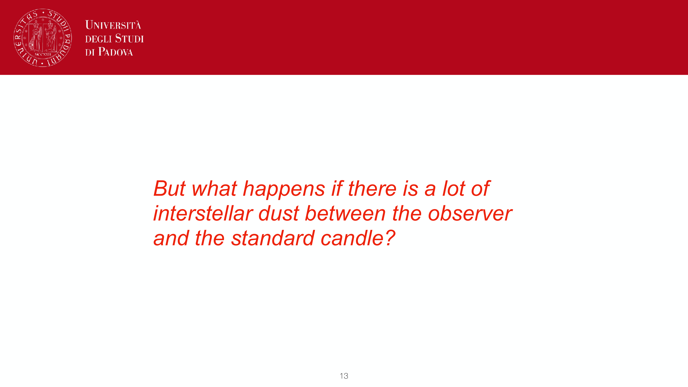
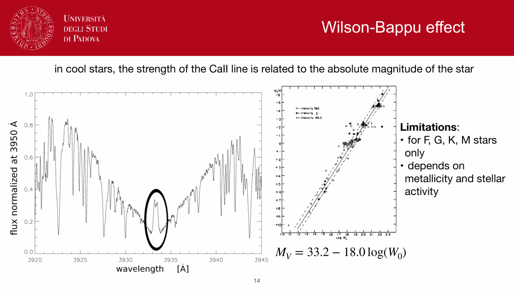
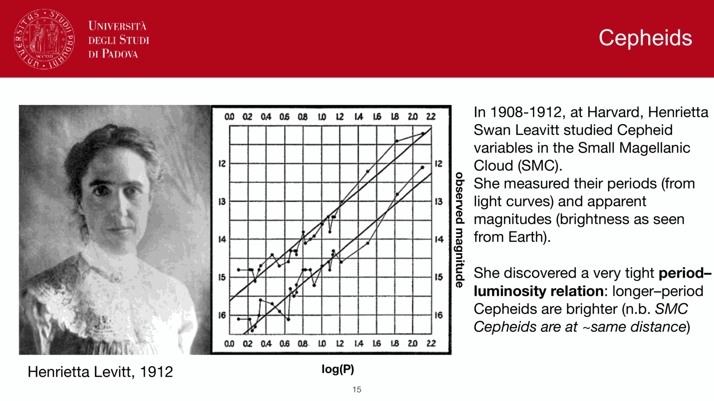
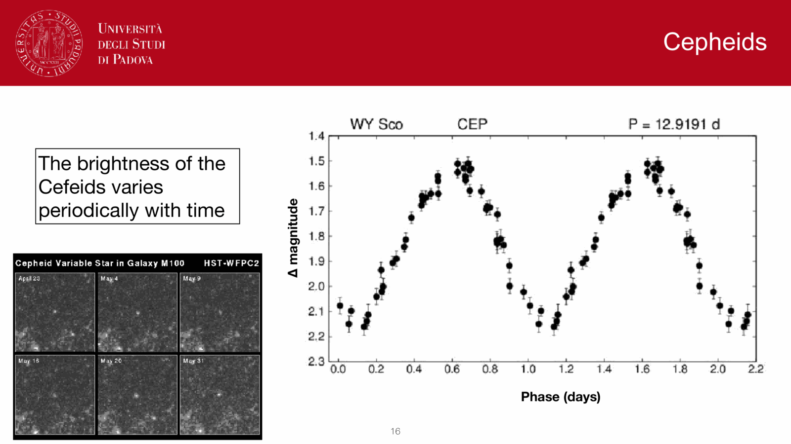
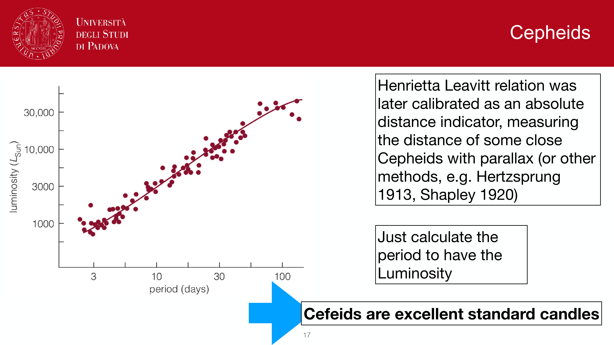
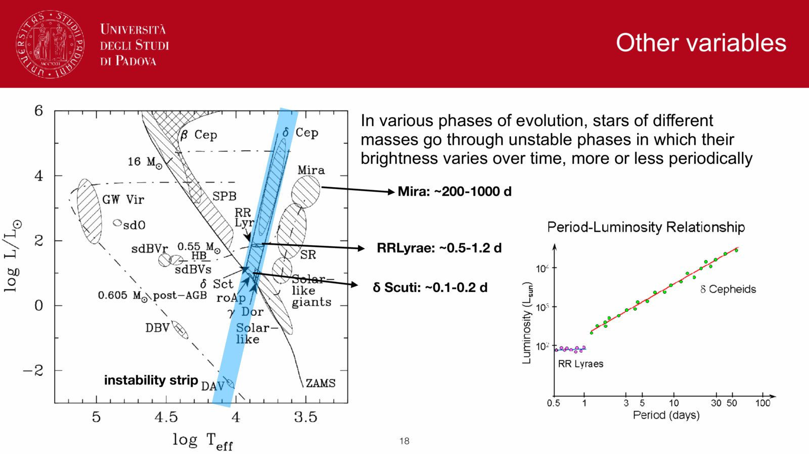

classical Cepheids obey a tight relation between pulsation period and absolute luminosity, the **Leavitt law**, discovered by Henrietta Swan Leavitt in 1908. it is the foundation of the extragalactic distance scale.

## the relation

$$\boxed{\, M_V = a + b\,\log_{10} P(\text{days}) \,}$$

with modern HST + Gaia + LMC EB calibrations: $b \approx -2.78$, $a \approx -1.35$. so a $10$-day Cepheid has $M_V \approx -4.1$; a $30$-day has $M_V \approx -5.5$.

the Wesenheit magnitude (extinction-corrected):
$$W = m_X - R(m_Y - m_Z)$$
with R chosen to make the index dust-insensitive (e.g. for HST $W = m_F555W - 2.45(m_F555W - m_F814W)$). Wesenheit relations have intrinsic scatter $\sim 0.1$ mag, much tighter than V-band PL.

## physical origin

stellar pulsation period scales with the dynamical (free-fall) timescale:
$$P \propto \rho^{-1/2}$$

since $L \propto R^2 T^4$ and $M \propto \rho R^3$, $P$ depends on $L, T_{\rm eff}, M$. pulsating Cepheids occupy a narrow **instability strip** in the HR diagram (a near-vertical band at $T_{\rm eff} \approx 6000$ K spanning a range of luminosities). along the strip, $L$ correlates tightly with period.

so the Leavitt law is a projection of the PL plane through the instability strip. the small intrinsic scatter ($\sim 0.05$ mag in NIR Wesenheit) reflects the strip's narrow width.

## the calibration ladder

three sources of zero-point:
1. **Galactic Cepheids** with Gaia DR3 parallaxes (Riess et al. 2018, 2022). $\sim 100$ Cepheids with $1\%$ parallax precision.
2. **LMC Cepheids**: $\sim 800$ classical Cepheids with NIR photometry, geometric LMC distance from eclipsing binaries (Pietrzyński 2019, $\mu_{\rm LMC} = 18.477 \pm 0.026$, $1\%$ precision).
3. **water masers** in NGC 4258, an external galaxy with a directly-determined distance.

each calibration is independent; all three agree at $\lesssim 0.05$ mag.

## metallicity dependence

Cepheid luminosity is mildly metallicity-dependent (more metal-poor = brighter at given $P$ in some studies). the slope is debated:
$$\Delta\mu \sim \gamma \cdot \Delta[Fe/H], \quad \gamma \sim 0$$ to $-0.3$ mag/dex.

minor systematic in the $H_0$ debate.

## range and use

with HST (V, I) and Wesenheit: $\sim 30$ Mpc. JWST (NIR Wesenheit): expected to push to $\sim 100$ Mpc with reduced dust uncertainty. Cepheids in SN Ia hosts are the bridge between the Galactic ladder and the Hubble flow:

```
Galactic parallax  ->  Cepheids (Gaia + LMC anchors)
                       |
                       v
                       Cepheids in nearby SN Ia hosts (HST)
                       |
                       v
                       SN Ia in Hubble flow ($cz/H_0$)
```

this is the path to $H_0$ via the SH0ES program (Riess et al.), giving $H_0 = 73.04 \pm 1.04$ km/s/Mpc.

## the Cepheid Hubble tension

the $\sim 5\sigma$ disagreement with the Planck-derived $H_0 = 67.4 \pm 0.5$ km/s/Mpc is one of the major open problems in cosmology. is the local Cepheid ladder systematically high (dust corrections, blending in distant Cepheids, metallicity term)? or is there new physics in the early universe?

JWST + TRGB cross-checks are testing the local-ladder hypothesis. early JWST results (Riess 2024) confirm the SH0ES Cepheid distances at $\sim 1\%$, leaning toward new physics.

## see also

- [Variable stars as standard candles](Variable%20stars%20as%20standard%20candles.html)
- [Distance ladder derivations](Distance%20ladder%20derivations.html)
- [Type Ia supernovae as standard candles](Type%20Ia%20supernovae%20as%20standard%20candles.html)
- [TRGB tip of the red giant branch](TRGB%20tip%20of%20the%20red%20giant%20branch.html)
- [Hubble flow distances](Hubble%20flow%20distances.html)
- [Hubble's law and cosmological redshift](Hubble%27s%20law%20and%20cosmological%20redshift.html)
- [Cepheids and supernovae](Cepheids%20and%20supernovae.html)
- [Annual stellar parallax](Annual%20stellar%20parallax.html)

---

## observational astrophysics course slides (Prof. Paolo Cassata)


*Henrietta Leavitt 1912 discovery: Period-Luminosity (P-L) relation in SMC Cepheids.*


*Classical (Type I) Cepheids vs Type II (W Virginis) Cepheids.*


*Pulsation mechanism: Eddington kappa-mechanism in the He II partial ionization zone.*


*The Instability Strip in the HR diagram: temperature bounds of Cepheid pulsation.*


*Empirical Leavitt law: M_V = -2.76 log10(P / days) - 1.40.*


*Wesenheit index W = V - R_V * (B - V): extinction-free Period-Luminosity relation.*

<div class="backlinks-section">
  <h4 class="backlinks-title">Linked References (9)</h4>
  <ul class="backlinks-list">
    <li class="backlink-item-wrap"><a href="AU%20calibration%20parallax%20and%20parsec.html" class="backlink-item">AU calibration parallax and parsec</a></li>
    <li class="backlink-item-wrap"><a href="Distance%20ladder%20derivations.html" class="backlink-item">Distance ladder derivations</a></li>
    <li class="backlink-item-wrap"><a href="Hubble%20flow%20distances.html" class="backlink-item">Hubble flow distances</a></li>
    <li class="backlink-item-wrap"><a href="Hubble%20law.html" class="backlink-item">Hubble law</a></li>
    <li class="backlink-item-wrap"><a href="Supernova%20Hubble%20diagram.html" class="backlink-item">Supernova Hubble diagram</a></li>
    <li class="backlink-item-wrap"><a href="Surface%20brightness%20fluctuations.html" class="backlink-item">Surface brightness fluctuations</a></li>
    <li class="backlink-item-wrap"><a href="TRGB%20tip%20of%20the%20red%20giant%20branch.html" class="backlink-item">TRGB tip of the red giant branch</a></li>
    <li class="backlink-item-wrap"><a href="Variable%20stars%20as%20standard%20candles.html" class="backlink-item">Variable stars as standard candles</a></li>
    <li class="backlink-item-wrap"><a href="../../04_Atlas/Observational_Astrophysics_MOC.html" class="backlink-item">Observational_Astrophysics_MOC</a></li>
  </ul>
</div>

