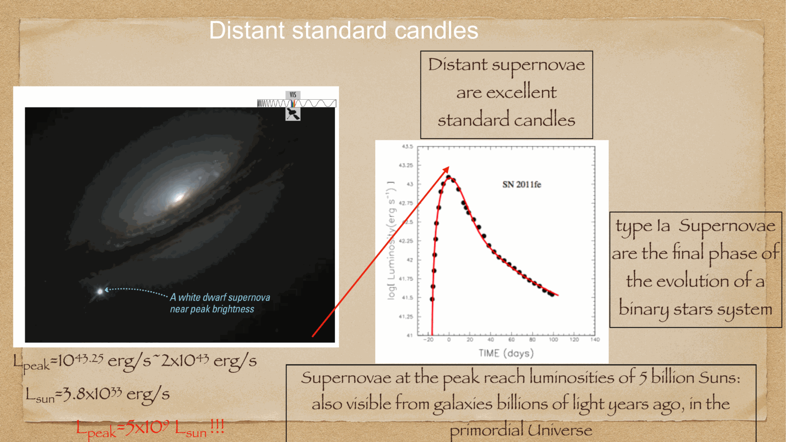
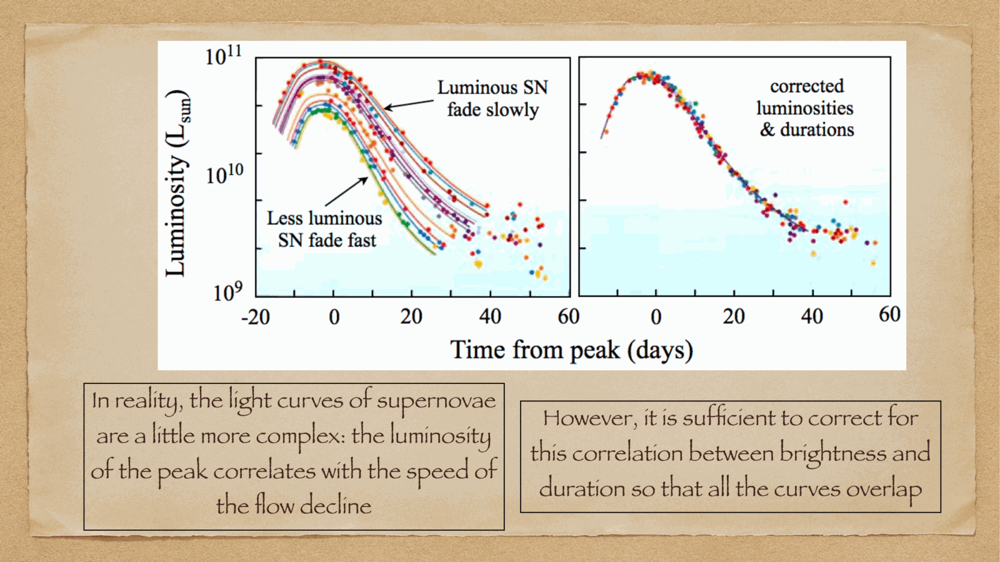
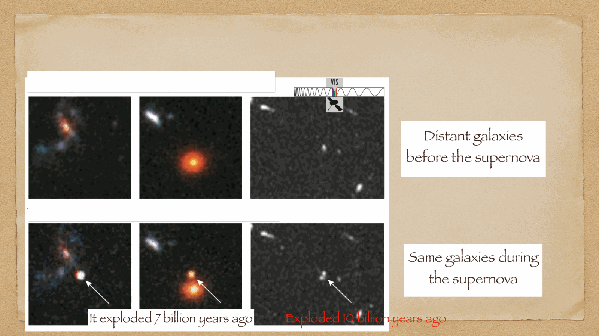
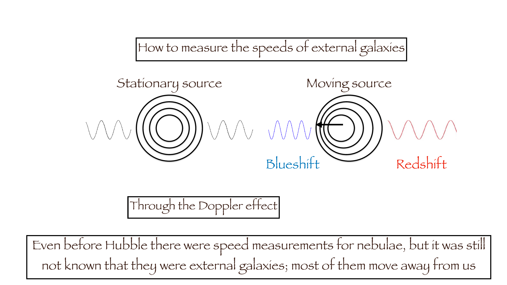
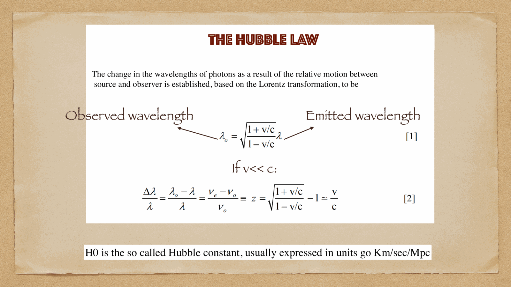

**Cepheid variable stars** (named after the prototype $\delta$ Cephei) are the supreme primary standard candles of the extragalactic distance ladder. luminous pulsating yellow supergiants ($4 - 20 M_\odot$, $L \sim 10^3 - 10^5 L_\odot$), their radial pulsations obey a tight, direct correlation between pulsation period and intrinsic luminosity.

---

## Henrietta Leavitt's discovery of the Period-Luminosity relation (1908, 1912)

working at Harvard College Observatory, **Henrietta Swan Leavitt** cataloged variable stars in the Small Magellanic Cloud (SMC):
- because all stars in the SMC are located at virtually the exact same distance from Earth, their apparent magnitudes directly reflect their relative absolute magnitudes.
- Leavitt discovered that brighter Cepheids systematically have longer pulsation periods!

$$\boxed{\, M_V = -2.76 \log_{10}(P / 10\text{ days}) - 4.16 \,}$$
(where $P$ is the pulsation period in days).

measuring the pulsation period $P$ (simply by timing the light curve variations) yields the star's **absolute magnitude $M_V$**! comparing $M_V$ with observed apparent magnitude $m_V$ immediately returns the distance modulus $\mu = m_V - M_V$.

---

## the physics of Cepheid pulsation: the $\kappa$-mechanism

Cepheids sit in the vertical **instability strip** of the HR diagram. their pulsations are driven by a thermodynamic heat-engine mechanism called the **$\kappa$-mechanism** (the "Eddington valve"), operating in the second helium partial ionization zone ($He^+ \rightleftharpoons He^{++}$) at $T \sim 40,000$ K:

1. **compression phase**: when a layer of gas contracts, its density and temperature rise. in normal gas, heating decreases opacity. but in the $He^+$ ionization zone, heating ionizes $He^+ \to He^{++}$; free electrons increase the opacity $\kappa$.
2. **heat trapping**: the increased opacity blocks outgoing radiation from the stellar interior, trapping heat and raising pressure.
3. **expansion phase**: the trapped pressure pushes the layer outward beyond equilibrium. the layer expands and cools.
4. **heat release**: cooling allows electrons to recombine ($He^{++} \to He^+$); opacity drops, trapped heat escapes, pressure drops, and gravity pulls the layer back inward, restarting the cycle!

the natural period of this radial acoustic oscillation scales with the dynamical timescale:
$$P \propto \frac{1}{\sqrt{G \bar{\rho}}} \propto \frac{R^{3/2}}{M^{1/2}}$$
because more luminous supergiants have vastly larger radii $R$, their average density $\bar\rho$ is much lower, naturally explaining why **more luminous stars pulsate with longer periods**.

---

## Edwin Hubble and the Great Debate (1923-1925)

in the early 1920s, astronomy was split by the "Great Debate" (Shapley vs Curtis): was the Milky Way the entire universe, or were spiral "nebulae" external island universes like our own?

in October 1923, **Edwin Hubble** used the newly commissioned 100-inch Hooker telescope on Mount Wilson to resolve individual stars in the Andromeda Nebula (M31). he discovered a pulsating star on photographic plate H3356, initially marking it "N" (nova) before scratching it out and writing **"VAR!" (variable)**.

measuring its period ($P = 31.4$ days) and applying Leavitt's Period-Luminosity relation, Hubble calculated that Andromeda lay at a distance of **$d \sim 900,000$ light-years** (modern value: $2.5$ million light-years / $780$ kpc)—far beyond the boundaries of the Milky Way! this single discovery proved that the universe was populated by billions of independent galaxies.

---

## the HST Key Project on the Extragalactic Distance Scale

because Cepheids are luminous supergiants ($L > 10^4 L_\odot$), the **Hubble Space Telescope (HST)** was specifically built with angular resolution sufficient to resolve individual Cepheids in galaxies out to the **Virgo Cluster ($d \approx 16-20$ Mpc)**.

the HST Key Project (Freedman et al. 2001) observed Cepheids in dozens of spiral galaxies, using them to calibrate secondary distance indicators (Type Ia supernovae, Tully-Fisher relation) and measuring the Hubble constant with an unprecedented $10\%$ precision:
$$H_0 = 72 \pm 8 \text{ km s}^{-1}\text{ Mpc}^{-1}$$

---

## see also

- [[Fundamentals_Astrophysics_Cosmology_MOC]]
- [[Parallax and standard candles]]
- [[Type Ia supernovae as standard candles]]
- [[Hubble's law and cosmological redshift]]
- [[Distance ladder derivations]]

## Linked References

- [[Annual stellar parallax]]
- [[BHs from gravitational waves]]
- [[Cepheid period-luminosity relation]]
- [[Hubble law derivation low-z]]
- [[Hubble's law and cosmological redshift]]
- [[Parallax and standard candles]]
- [[Supernova spectroscopy]]
- [[The Galactic Bulge]]
- [[Type Ia supernovae as standard candles]]
- [[Variable stars as standard candles]]
- [[Fundamentals_Astrophysics_Cosmology_MOC]]

