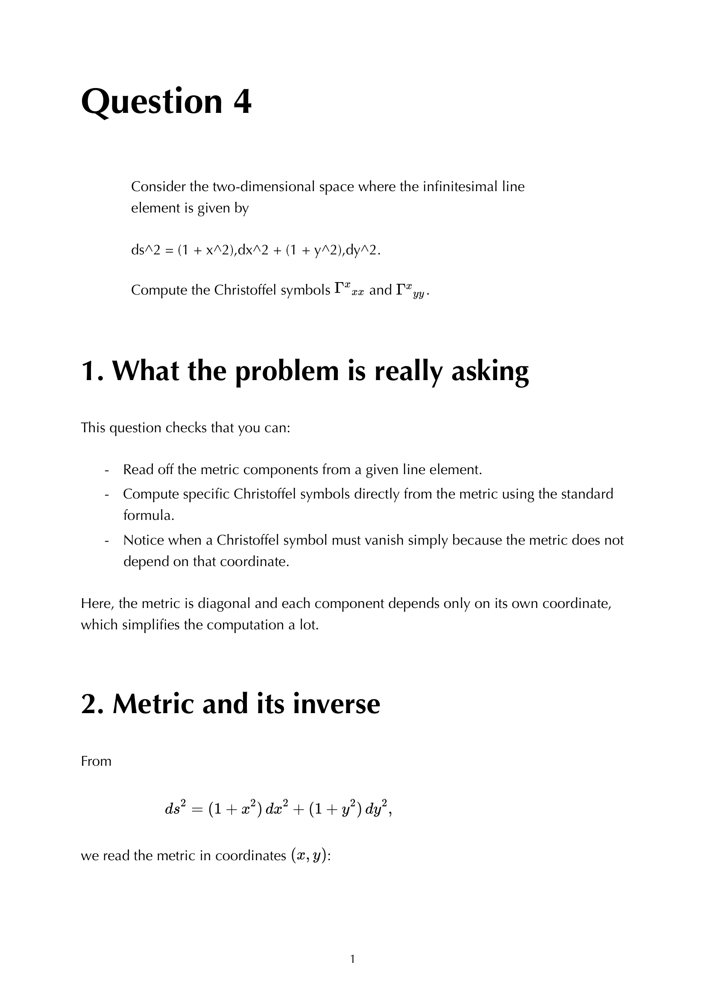


Christoffel symbols $\Gamma^\rho{}_{\mu\nu}$ are the **price of using coordinates** on a curved manifold. they encode how coordinate axes tilt as you move around. in flat space + Cartesian, they're zero. in flat space + polar, they're non-zero (axes twist around origin). on a curved manifold, they're non-zero for both reasons.

## the formula

assuming a torsion-free, metric-compatible connection (the **Levi-Civita** connection), Christoffels are uniquely determined by the metric:
$$\boxed{\, \Gamma^\rho{}_{\mu\nu} = \frac{1}{2}g^{\rho\sigma}\!\left(\partial_\mu g_{\sigma\nu} + \partial_\nu g_{\sigma\mu} - \partial_\sigma g_{\mu\nu}\right) \,}$$

so given a metric, you can mechanically compute all $\Gamma$s by partial differentiation.

## key properties

- **symmetric in lower indices**: $\Gamma^\rho{}_{\mu\nu} = \Gamma^\rho{}_{\nu\mu}$ (because LC is torsion-free).
- **not a tensor**: under coordinate changes, $\Gamma$ doesn't transform as a $(1, 2)$-tensor; the inhomogeneous term is exactly what cancels the non-tensorial part of $\partial_\mu V^\nu$ in the covariant derivative.
- **vanishes in Riemann normal coordinates** at the origin: $\Gamma(p) = 0$, but $\partial\Gamma(p) \ne 0$ if the manifold is curved.

## what they're for

Christoffels appear as corrections in:
- the **covariant derivative** $\nabla_\mu V^\nu = \partial_\mu V^\nu + \Gamma^\nu{}_{\mu\rho} V^\rho$.
- the **geodesic equation** $\ddot x^\mu + \Gamma^\mu{}_{\alpha\beta}\dot x^\alpha\dot x^\beta = 0$.
- the **Riemann tensor** (built from $\Gamma$ + $\partial\Gamma$).

so once you have $\Gamma$, you have all the geometry.

## counting

at every point of a 4D manifold, $\Gamma$ has $4 \times \binom{4+1}{2} = 4 \cdot 10 = 40$ independent components (4 upper, 10 symmetric lower pairs). most of these are zero in symmetric metrics; the practical exam tables for FLRW and Schwarzschild have ~6 to 10 non-zero ones.

## practical tip for computing

three approaches:
1. **direct from the formula**: tedious but mechanical. always works.
2. **from the geodesic equation Lagrangian**: $L = g_{\mu\nu}\dot x^\mu\dot x^\nu$. Euler-Lagrange equations directly produce $\ddot x + \Gamma\dot x\dot x$, and reading off coefficients gives $\Gamma$. faster in practice for diagonal metrics.
3. **symbolic computation**: SymPy, Mathematica, GraviPy automate this for any metric.

## examples

### flat 2D polar
$ds^2 = dr^2 + r^2 d\theta^2$. non-zero: $\Gamma^r{}_{\theta\theta} = -r$, $\Gamma^\theta{}_{r\theta} = \Gamma^\theta{}_{\theta r} = 1/r$.

### 2-sphere
$ds^2 = R^2(d\theta^2 + \sin^2\theta\,d\phi^2)$. non-zero: $\Gamma^\theta{}_{\phi\phi} = -\sin\theta\cos\theta$, $\Gamma^\phi{}_{\theta\phi} = \Gamma^\phi{}_{\phi\theta} = \cot\theta$.

### Schwarzschild (selected)
$\Gamma^t{}_{tr} = M/[r(r - 2M)]$, $\Gamma^r{}_{tt} = (M/r^2)(1 - 2M/r)$, $\Gamma^r{}_{rr} = -M/[r(r - 2M)]$, etc. see Q11 - selected Schwarzschild Christoffels for the full table.

### FLRW
$\Gamma^0{}_{ij} = a\dot a\,\gamma_{ij}$, $\Gamma^i{}_{0j} = (\dot a/a)\delta^i{}_j$. see [FLRW metric](./FLRW%20metric.html).

## see also

- [Levi-Civita connection](./Levi-Civita%20connection.html)
- [Covariant derivative](./Covariant%20derivative.html)
- [Metric compatibility](./Metric%20compatibility.html)
- [Geodesic equation](./Geodesic%20equation.html)
- [Riemann tensor](./Riemann%20tensor.html)
- [Coordinate transformations and tensors](./Coordinate%20transformations%20and%20tensors.html)
- Q1 - Christoffels for diagonal 2D metric
- Q2 - Christoffels for radial 2D metric
- Q11 - selected Schwarzschild Christoffels
- Q16 - Christoffels for a TT plane wave
- [General_Relativity_MOC](../../04_Atlas/General_Relativity_MOC.html)
- [Ch 2 - Some Differential Geometry](../../02_Literature/Book/Baumann%20GR/Ch%202%20-%20Some%20Differential%20Geometry.html)

---

### General Relativity Mathematical & Oral Defense Panel

*Question 4 Oral Exam Model Solution: 2D curved metric $ds^2 = (1+x^2)dx^2 + (1+y^2)dy^2$, explicit computation of Christoffel connections and non-zero components of the Riemann curvature tensor.*


  <h4 class="backlinks-title">Linked References (15)</h4>
  <ul class="backlinks-list">
    <li class="backlink-item-wrap"><a href="../../02_Literature/Book/Baumann%20GR/Baumann%20GR.html" class="backlink-item">Baumann GR</a></li>
    <li class="backlink-item-wrap"><a href="../../02_Literature/Book/Baumann%20GR/Ch%201%20-%20Gravity%20is%20Geometry.html" class="backlink-item">Ch 1 - Gravity is Geometry</a></li>
    <li class="backlink-item-wrap"><a href="../../02_Literature/Book/Baumann%20GR/Ch%203%20-%20A%20First%20Look%20at%20Geodesics.html" class="backlink-item">Ch 3 - A First Look at Geodesics</a></li>
    <li class="backlink-item-wrap"><a href="../../02_Literature/Book/Baumann%20GR/Ch%204%20-%20Spacetime%20Curvature.html" class="backlink-item">Ch 4 - Spacetime Curvature</a></li>
    <li class="backlink-item-wrap"><a href="./Coordinate%20transformations%20and%20tensors.html" class="backlink-item">Coordinate transformations and tensors</a></li>
    <li class="backlink-item-wrap"><a href="./Covariant%20derivative.html" class="backlink-item">Covariant derivative</a></li>
    <li class="backlink-item-wrap"><a href="../../04_Atlas/General_Relativity_MOC.html" class="backlink-item">General_Relativity_MOC</a></li>
    <li class="backlink-item-wrap"><a href="./Geodesic%20equation.html" class="backlink-item">Geodesic equation</a></li>
    <li class="backlink-item-wrap"><a href="./Levi-Civita%20connection.html" class="backlink-item">Levi-Civita connection</a></li>
    <li class="backlink-item-wrap"><a href="./Locally%20inertial%20frame.html" class="backlink-item">Locally inertial frame</a></li>
    <li class="backlink-item-wrap"><a href="./Manifold%20metric%20and%20signature.html" class="backlink-item">Manifold metric and signature</a></li>
    <li class="backlink-item-wrap"><a href="./Metric%20compatibility.html" class="backlink-item">Metric compatibility</a></li>
    <li class="backlink-item-wrap"><a href="./Parallel%20transport.html" class="backlink-item">Parallel transport</a></li>
    <li class="backlink-item-wrap"><a href="./Riemann%20tensor.html" class="backlink-item">Riemann tensor</a></li>
    <li class="backlink-item-wrap"><a href="./Schwarzschild%20Christoffels.html" class="backlink-item">Schwarzschild Christoffels</a></li>
  </ul>

