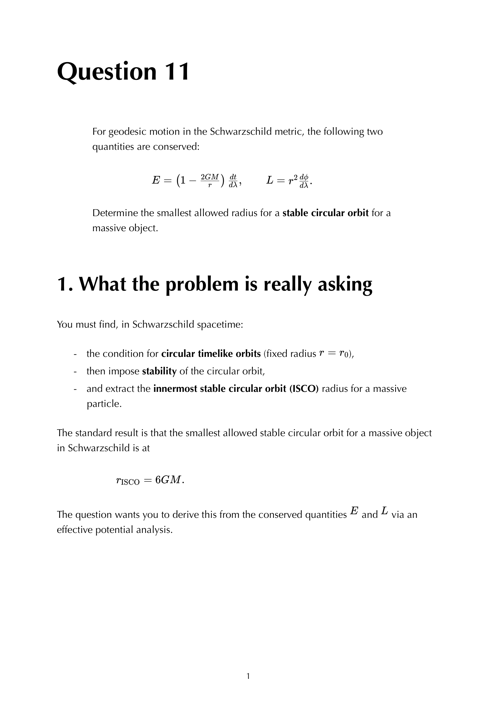
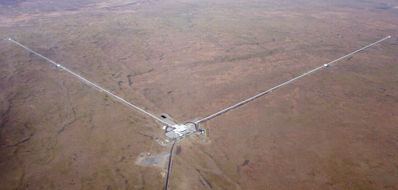

circular orbits in Schwarzschild are the GR generalisation of Kepler's circular orbits, with a characteristic deviation: **no stable circular orbit exists below $r = 6GM$**.

## the orbital frequency

for a circular orbit at radius $r$ in Schwarzschild, the orbital angular frequency $\Omega = d\phi/dt$ satisfies:
$$\boxed{\, \Omega^2 = \frac{GM}{r^3} \,}$$

**exactly the Kepler formula**, despite the GR setting. this is a famous coincidence: the Newtonian relation between orbital period and radius holds in Schwarzschild without modification (when expressed in coordinate time + Schwarzschild $r$).

## the derivation

from the geodesic equation in the equatorial plane, with $r = $ const:
$$\ddot t = 0, \quad \ddot r = 0$$

the radial equation:
$$\ddot r + \Gamma^r{}_{tt}\dot t^2 + \Gamma^r{}_{\phi\phi}\dot\phi^2 = 0$$

with $\Gamma^r{}_{tt} = (GM/r^2)(1 - 2GM/r)$ and $\Gamma^r{}_{\phi\phi} = -(r - 2GM)\sin^2\theta$ (in equatorial $\theta = \pi/2$, $\sin^2\theta = 1$):
$$\frac{GM}{r^2}\!\left(1 - \frac{2GM}{r}\right)\dot t^2 = (r - 2GM)\dot\phi^2$$

dividing:
$$\frac{\dot\phi^2}{\dot t^2} = \frac{GM}{r^3}$$

so $\Omega^2 = GM/r^3$ in coordinate time.

## ISCO: innermost stable circular orbit

at $r < 6GM$, circular orbits become **unstable** (perturbations grow exponentially). the innermost **stable** circular orbit:
$$\boxed{\, r_{\rm ISCO} = 6 GM \,}$$

at ISCO:
- $L = \sqrt{12}\,GM$.
- $E = 2\sqrt{2}/3$ (in $c = 1$ units; binding energy $1 - E = 1 - 2\sqrt{2}/3 \approx 0.057$, so $\sim 5.7\%$ of rest-mass energy is released as a particle spirals from infinity to ISCO).
- $\Omega^2 = GM/(6GM)^3 = 1/(216 G^2 M^2)$.

the binding energy at ISCO is the **maximum efficiency** of accretion onto a non-rotating BH. for Kerr (rotating), the ISCO can be much closer to the horizon and the efficiency reaches up to $\sim 42\%$ for maximal spin.

## the inner unstable orbit

between $r = 3GM$ (photon sphere) and $r = 6GM$ (ISCO), circular **unstable** orbits exist. perturbations either fall in or escape to infinity. these are not realisable as long-lived orbits; useful as separatrix solutions in dynamical-systems analysis.

## astrophysical relevance

- **accretion disks**: inner edge at $r_{\rm ISCO}$ for non-rotating BH (or smaller for rotating). inside ISCO, gas plunges in inflow. this sets the inner radius of accretion + the maximum efficiency.
- **iron K$\alpha$ line shape**: emitted by hot iron in accretion disks, broadened by Doppler + gravitational redshift. fitting the line shape gives the inner edge $r_{\rm ISCO}$, hence the BH spin.
- **EHT shadow**: the BH "shadow" angular size is set by $\sim 5GM/c^2$, related to ISCO + photon sphere.

## see also

- [Schwarzschild metric](Schwarzschild%20metric.html)
- [Schwarzschild Christoffels](Schwarzschild%20Christoffels.html)
- [Schwarzschild effective potential](Schwarzschild%20effective%20potential.html)
- [Photon sphere](Photon%20sphere.html)
- [Effective potential approach](Effective%20potential%20approach.html)
- Q12 - circular orbits and orbital frequency
- [General_Relativity_MOC](../../04_Atlas/General_Relativity_MOC.html)
- [Ch 6 - Black Holes](../../02_Literature/Book/Baumann%20GR/Ch%206%20-%20Black%20Holes.html)

---

### General Relativity Mathematical & Oral Defense Panel

*Question 11 Oral Exam Model Solution: Geodesic equations in Schwarzschild spacetime, effective potential $V_{\rm eff}(r) = \left(1 - \frac{2GM}{r}\right)\left(1 + \frac{L^2}{r^2}\right)$, stable and unstable circular orbits, and innermost stable circular orbit (ISCO) at $r = 6GM$.*

*Cambridge Lecture Diagram: Effective potential for massive particle orbits in Schwarzschild spacetime showing ISCO and horizon plunge.*

  <h4 class="backlinks-title">Linked References (5)</h4>
  <ul class="backlinks-list">
    <li class="backlink-item-wrap"><a href="Effective%20potential%20approach.html" class="backlink-item">Effective potential approach</a></li>
    <li class="backlink-item-wrap"><a href="Photon%20sphere.html" class="backlink-item">Photon sphere</a></li>
    <li class="backlink-item-wrap"><a href="Schwarzschild%20effective%20potential.html" class="backlink-item">Schwarzschild effective potential</a></li>
    <li class="backlink-item-wrap"><a href="Schwarzschild%20metric.html" class="backlink-item">Schwarzschild metric</a></li>
    <li class="backlink-item-wrap"><a href="../../04_Atlas/General_Relativity_MOC.html" class="backlink-item">General_Relativity_MOC</a></li>
  </ul>

