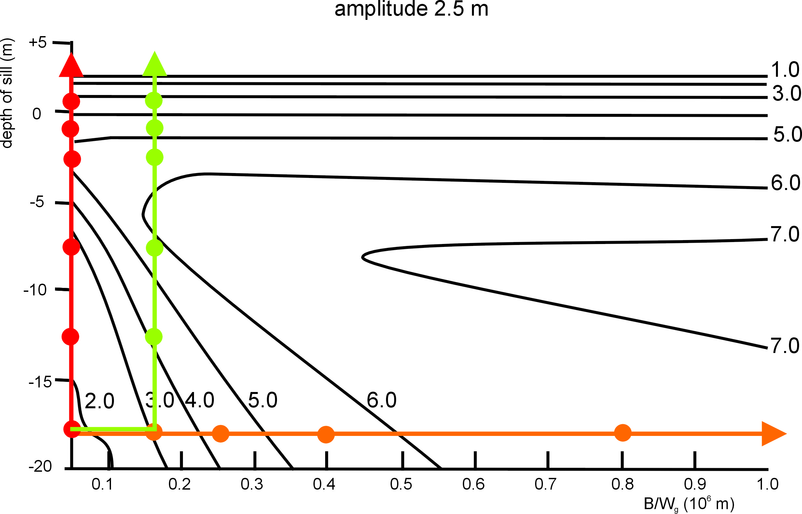

# Closure amplitude

the amplitude analog of [phase closure](interf/Phase%20closure.html). for **four** stations, a particular ratio of visibility amplitudes is **gain-independent**: it depends only on the source. closure amplitudes complement closure phases for the four-or-more-station case, providing additional gain-immune observables.

## the formula

four stations $i, j, k, l$. define:

$$A_{ijkl} = \frac{\lvert V_{ij}\lvert  \cdot \rvertV_{kl}\lvert }{\rvertV_{ik}\lvert  \cdot \rvertV_{jl}\rvert}$$

with $\lvert V\rvert$ the visibility amplitudes.

if the gain amplitude at station $i$ is $g_i$ (multiplicative), then each measured amplitude is

$$\lvert V_{ij,\rm meas}\rvert = g_i \cdot g_j \cdot \lvert V_{ij,\rm true}\rvert$$

substituting:

$$A_{ijkl,\rm meas} = \frac{g_i g_j \lvert V_{ij,\rm true}\lvert  \cdot g_k g_l \rvertV_{kl,\rm true}\lvert }{g_i g_k \rvertV_{ik,\rm true}\lvert  \cdot g_j g_l \rvertV_{jl,\rm true}\rvert} = \frac{\lvert V_{ij,\rm true}\lvert  \cdot \rvertV_{kl,\rm true}\lvert }{\rvertV_{ik,\rm true}\lvert  \cdot \rvertV_{jl,\rm true}\rvert}$$

**the gains cancel**.

## why four stations?

with three stations there are 3 baselines and 3 amplitudes. their product (or any ratio thereof) involves powers of every gain. closure happens only if I can construct a *ratio* whose gain dependence vanishes — and that requires 4 distinct stations.

formally: for $N$ stations, the number of independent closure amplitudes is

$$N(N-3)/2$$

for $N = 4$: 2 closure amplitudes
for $N = 5$: 5 closure amplitudes
for $N = 6$: 9 closure amplitudes

(combined with the $(N-1)(N-2)/2$ closure phases, this gives the total number of independent observables that survive station-based gain corruption.)

## what closure amplitude encodes

it depends on the *amplitudes* at four (u, v) points. for a point source, all $\lvert V\rvert$ are 1, so $A = 1$. for an extended source, the visibilities differ at different (u, v) and $A \neq 1$. measuring $A$ constrains the *amplitude pattern* of the source independently of phase.

closure amplitude is most useful when:
- you have *many* stations (so many independent closure amplitudes)
- gain amplitudes are unstable (a problem closure amplitude solves)
- you need amplitude calibration robust to time-varying receiver gain

## the practical use

- **radio**: closure amplitudes are computed alongside closure phases as part of the standard EHT/VLBI calibration. they are gain-independent, so they constrain the source even when individual amplitudes are uncalibrated
- **optical**: closure amplitudes get less attention than closure phases because optical interferometers usually have amplitude calibration via reference stars. but for very faint sources, where calibration is poor, closure amplitudes help

## comparison with closure phase

| property                | closure phase           | closure amplitude        |
| ----------------------- | ----------------------- | ------------------------ |
| stations needed         | 3                       | 4                        |
| corrupted by            | nothing (station-based) | nothing (station-based)  |
| sensitive to            | source asymmetry        | amplitude pattern        |
| number for $N$ stations | $(N-1)(N-2)/2$          | $N(N-3)/2$               |
| historical introduction | Jennison 1958           | Twiss-Carter-Little 1960 |

closure phase is more "famous" because it solved the phase problem. closure amplitude is "the other shoe": once you have closure phases, closure amplitudes are the natural amplitude analog.

## bispectrum, trispectrum

the closure phase is the phase of the **bispectrum** $\mathcal B_{ijk} = V_{ij} V_{jk} V_{ki}$.

the closure amplitude is related to the **trispectrum**, the product (or ratio) of four visibilities. specifically, $A_{ijkl}$ is essentially the magnitude of a particular trispectrum pattern.

these higher-order spectra are closely related to higher-order moments in the time-frequency domain (used in image reconstruction algorithms like the ones for EHT).

## use in image reconstruction

modern imaging codes (especially for EHT and high-resolution VLBI) often use:

- closure phases (gain-immune, asymmetry-sensitive)
- closure amplitudes (gain-immune, amplitude-sensitive)
- log-closure amplitudes (a more linear quantity for likelihood functions)

these are the "robust observables" that survive arbitrary station-based calibration errors. an image reconstruction that fits these gives a result that is not biased by miscalibration.

## see also

- [Phase closure](interf/Phase%20closure.html)
- [The phase problem in interferometry](interf/The%20phase%20problem%20in%20interferometry.html)
- [Self-calibration](interf/Self-calibration.html)
- [Bispectrum and triple correlation](interf/Bispectrum%20and%20triple%20correlation.html)
- [Astronomical_Interferometry_MOC](../../04_Atlas/Astronomical_Interferometry_MOC.html)
