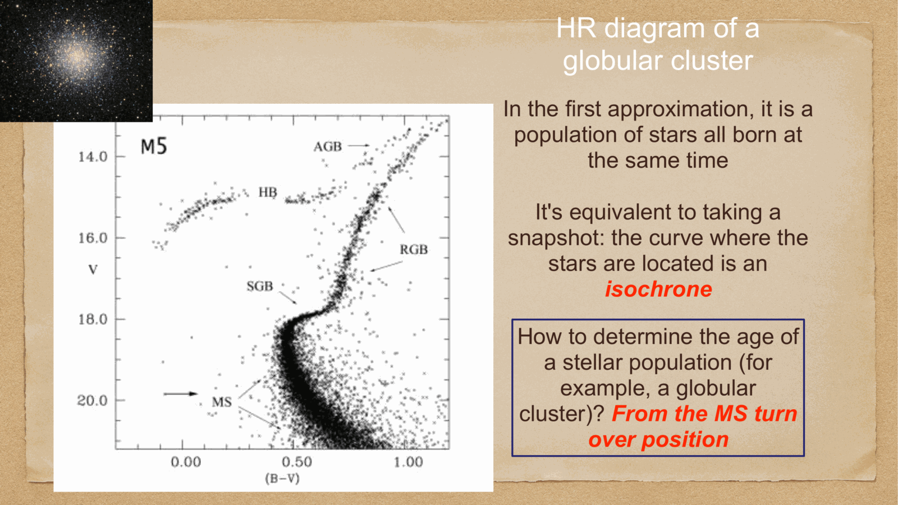
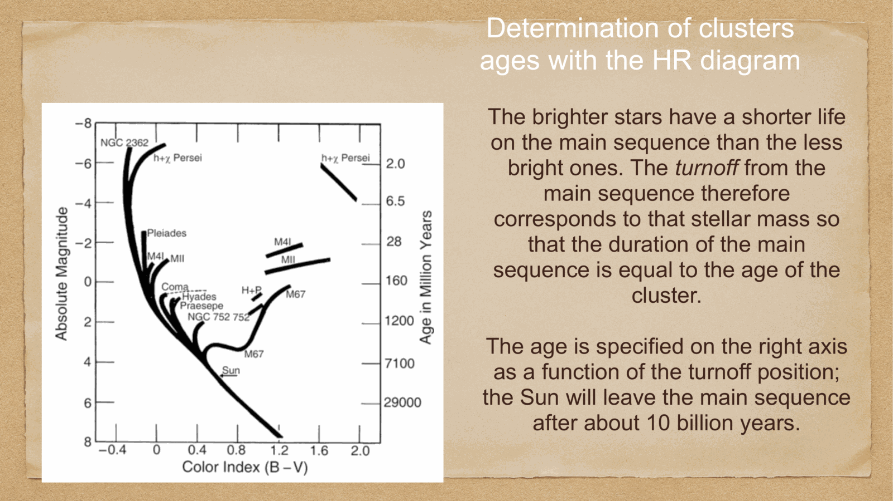
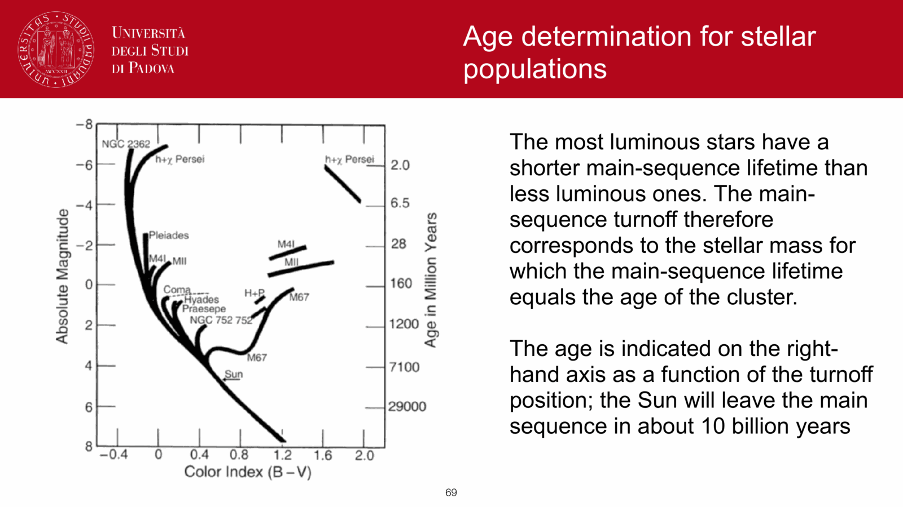
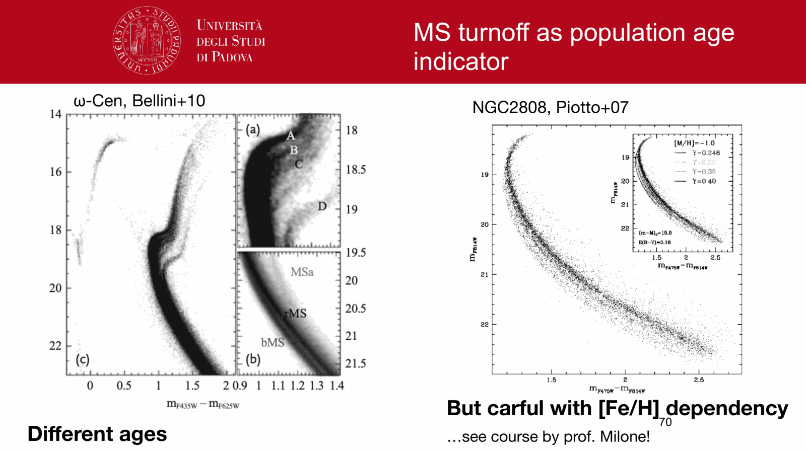
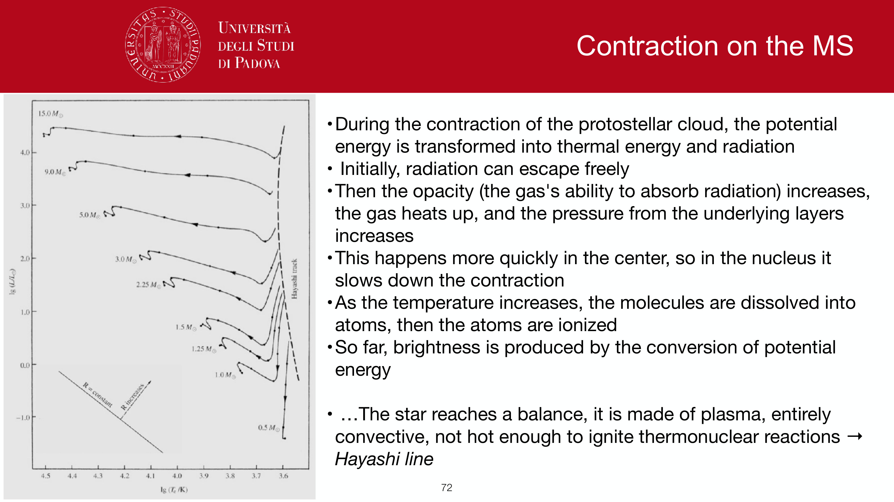
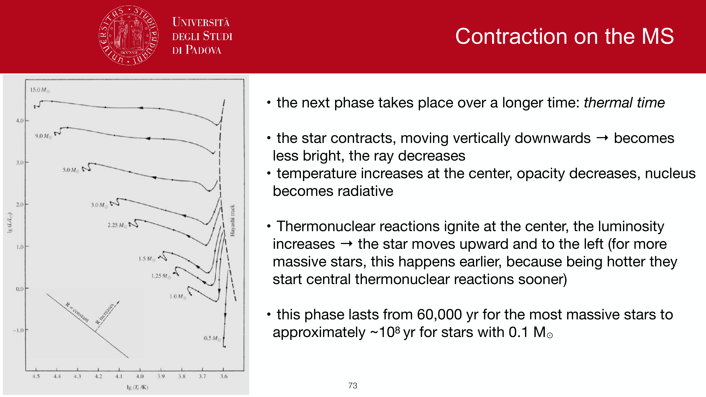
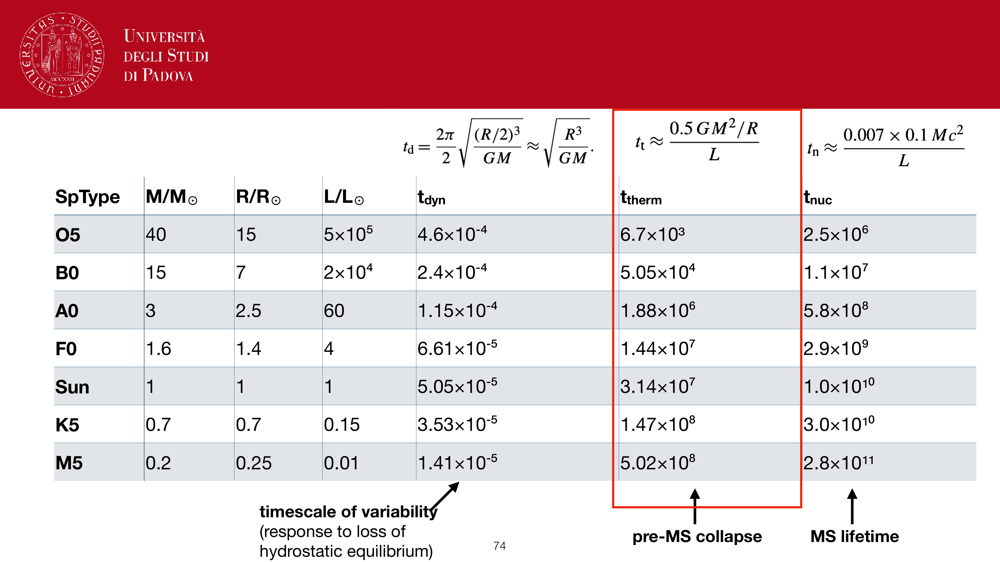
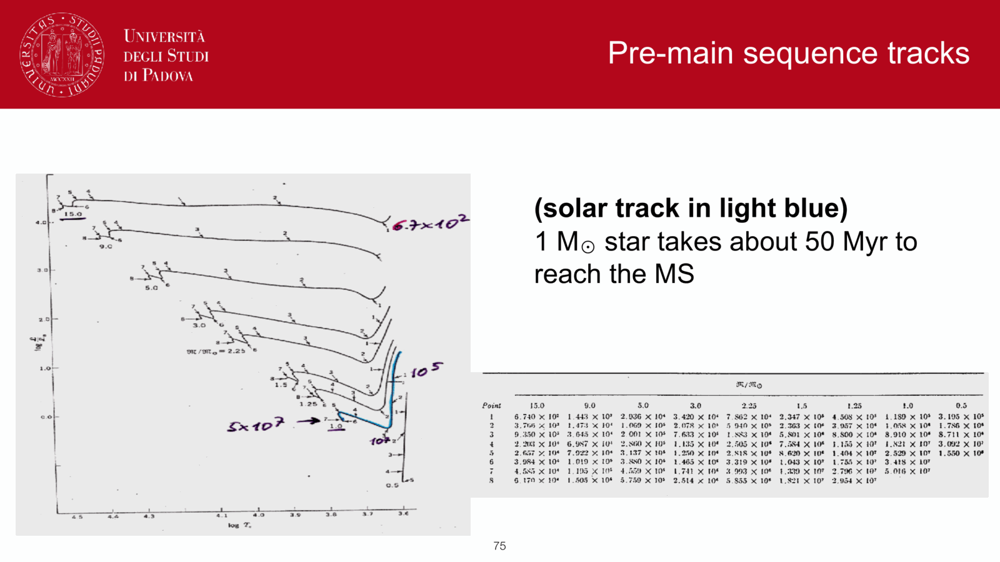
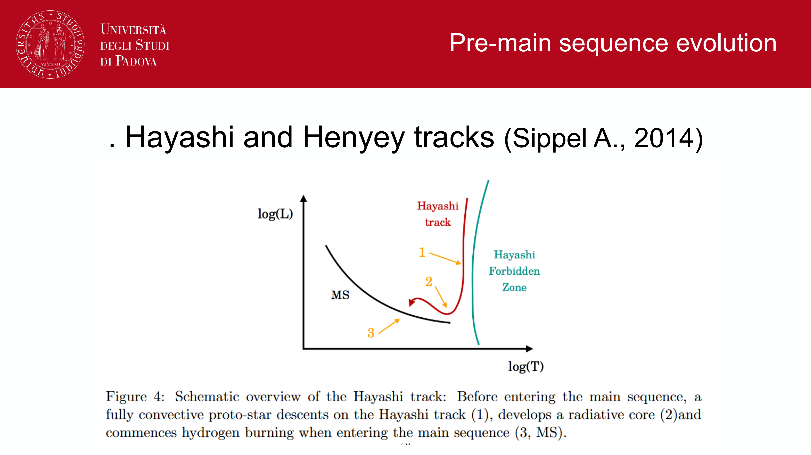

star clusters (both **open clusters** like the Pleiades and **globular clusters** like M13) are ideal natural astrophysical laboratories because all member stars share three crucial properties:
1. **same distance** $d$ from Earth (distance modulus $\mu = m - M$ is identical for all cluster members).
2. **same age** $t$ (all stars formed essentially simultaneously in a single starburst).
3. **same initial chemical composition** (same metallicity $[\text{Fe}/\text{H}]$).

consequence: plotting a cluster's color-magnitude diagram (CMD) provides a direct snapshot of stellar evolution for stars of different masses at a single fixed age: an **isochrone**.

---

## the Main Sequence Turnoff (MSTO)

as a cluster ages, stars peel off the main sequence from top to bottom, because more massive stars have much shorter lifetimes ($t_{\text{MS}} \propto M^{-2.5}$).

the highest, hottest, most luminous point still remaining on the main sequence is the **Main Sequence Turnoff (MSTO)**.
- stars with $M > M_{\text{TO}}$ have already exhausted their core hydrogen and evolved into red giants, supergiants, or compact remnants.
- stars with $M < M_{\text{TO}}$ are still burning hydrogen on the main sequence.

### determining cluster age:
measuring the luminosity $L_{\text{TO}}$ or mass $M_{\text{TO}}$ of stars at the turnoff gives the cluster age directly:
$$\boxed{\, t_{\text{cluster}} \approx 10^{10} \left(\frac{M_{\text{TO}}}{M_\odot}\right)^{-2.5} \text{ yr} \approx 10^{10} \left(\frac{L_{\text{TO}}}{L_\odot}\right)^{-2.5/3.5} \text{ yr} \,}$$

### benchmark ages:
- **young open clusters (e.g. Pleiades, h & $\chi$ Persei)**: turnoff at spectral type B or A $\implies$ ages $t \sim 10^7 - 10^8$ years.
- **intermediate open clusters (e.g. Hyades, M67)**: turnoff near F stars $\implies$ ages $t \sim 6 \times 10^8 - 4 \times 10^9$ years.
- **ancient Galactic globular clusters (e.g. M92, 47 Tuc)**: turnoff near G dwarfs ($M_{\text{TO}} \approx 0.8 M_\odot$) $\implies$ ages **$t \approx 12 - 13.5$ billion years**! 

globular clusters represent the oldest stellar populations in the Milky Way, setting a strict lower limit on the age of the Universe ($t_{\text{Univ}} > 13$ Gyr), in complete concordance with Planck CMB cosmology ($t_0 = 13.8$ Gyr).

---

## see also

- [Fundamentals_Astrophysics_Cosmology_MOC](../../04_Atlas/Fundamentals_Astrophysics_Cosmology_MOC.html)
- [HR diagram](HR%20diagram.html)
- [Stellar scaling relations](Stellar%20scaling%20relations.html)
- [Solar evolution and final stages](Solar%20evolution%20and%20final%20stages.html)
- [Stellar populations I II III](Stellar%20populations%20I%20II%20III.html)

---

## observational astrophysics course slides (Prof. Paolo Cassata)

*Main Sequence Turn-Off (MSTO) point: stars at the turn-off are exhausting core hydrogen.*

*Turn-off mass M_TO determines cluster age: age proportional to M_TO^(-2.5).*

*Isochrone fitting: theoretical curves of constant age overlaid on observational CMD.*

*Vertical method: Delta V_TO^HB (magnitude difference between turnoff and horizontal branch).*

*Horizontal method: delta(B - V) (color difference between turnoff and base of red giant branch).*

*Age of the oldest globular clusters (~12.8 +/- 0.5 Gyr) providing cosmic lower age bound.*

*Blue stragglers: stars above the turn-off formed by binary mass transfer or stellar collisions.*

*Multiple stellar populations in globular clusters (light element abundance anomalies).*

  <h4 class="backlinks-title">Linked References (12)</h4>
  <ul class="backlinks-list">
    <li class="backlink-item-wrap"><a href="Age%20estimation%20in%20unresolved%20populations.html" class="backlink-item">Age estimation in unresolved populations</a></li>
    <li class="backlink-item-wrap"><a href="Age-metallicity%20degeneracy.html" class="backlink-item">Age-metallicity degeneracy</a></li>
    <li class="backlink-item-wrap"><a href="Color-magnitude%20diagrams%20of%20clusters.html" class="backlink-item">Color-magnitude diagrams of clusters</a></li>
    <li class="backlink-item-wrap"><a href="HR%20diagram.html" class="backlink-item">HR diagram</a></li>
    <li class="backlink-item-wrap"><a href="Main%20sequence%2C%20giants%2C%20supergiants%2C%20white%20dwarfs.html" class="backlink-item">Main sequence, giants, supergiants, white dwarfs</a></li>
    <li class="backlink-item-wrap"><a href="Metallicity%20and%20chemical%20evolution.html" class="backlink-item">Metallicity and chemical evolution</a></li>
    <li class="backlink-item-wrap"><a href="Single%20stellar%20population%20SSP.html" class="backlink-item">Single stellar population SSP</a></li>
    <li class="backlink-item-wrap"><a href="Solar%20evolution%20and%20final%20stages.html" class="backlink-item">Solar evolution and final stages</a></li>
    <li class="backlink-item-wrap"><a href="Spectroscopic%20parallax%20and%20main-sequence%20fitting.html" class="backlink-item">Spectroscopic parallax and main-sequence fitting</a></li>
    <li class="backlink-item-wrap"><a href="Stellar%20populations%20I%20II%20III.html" class="backlink-item">Stellar populations I II III</a></li>
    <li class="backlink-item-wrap"><a href="../../04_Atlas/Fundamentals_Astrophysics_Cosmology_MOC.html" class="backlink-item">Fundamentals_Astrophysics_Cosmology_MOC</a></li>
    <li class="backlink-item-wrap"><a href="../../04_Atlas/Observational_Astrophysics_MOC.html" class="backlink-item">Observational_Astrophysics_MOC</a></li>
  </ul>

