
# color bimodality of galaxies

up: [Pablo_02_Statistical_properties_of_galaxies](../../02_Literature/Lectures/Observational_Cosmology/Pablo_02_Statistical_properties_of_galaxies.html) · [Observational_Cosmology_MOC](../../04_Atlas/Observational_Cosmology_MOC.html)

## the empirical fact

if you take a magnitude-limited sample of nearby galaxies and plot a histogram of one optical color (say $u-r$ from SDSS), you get **two peaks**, not one. Baldry et al. 2004 made this canonical with the SDSS DR1 sample at $z<0.08$:

- a **blue peak** around $u-r \approx 1.3$
- a **red peak** around $u-r \approx 2.5$
- a sparse **valley** around $u-r \approx 1.8$ that is *not* zero, just under-populated

the same bimodality shows up in $g-r$, $NUV-r$, and (more weakly) in restframe colors at $z \sim 1$.

## why color is the right axis

color is a $\sim$dimensionless ratio of fluxes, so it is mostly insensitive to distance and (at fixed $z$) to absolute scale. it tracks the **stellar population age + dust + metallicity**. for a stellar population, the bluest colors come from short-lived O/B stars; once star formation stops, those stars die in $\sim 10^7$–$10^8$ yr and the integrated color reddens fast. so color is, to first order, a *star-formation-state diagnostic*.

## why the bimodality is surprising

if galaxy properties were continuous (say, a smooth distribution of star formation timescales), the color distribution would be unimodal. the *gap* between the two peaks tells us that whatever drives a galaxy from blue to red happens *fast*, faster than the time spent at either end. this is the [Green valley and quenching tracks](./Green%20valley%20and%20quenching%20tracks.html) story.

## reading the figure pablo shows

Baldry 2004 fig. 1 plots $u-r$ histograms in bins of absolute $r$-band magnitude. in every bin the two-peak structure is clear, and the position of the red peak slides slightly redder for brighter galaxies (the [Red sequence and blue cloud](./Red%20sequence%20and%20blue%20cloud.html) tilt).

## connections

- next: [Red sequence and blue cloud](./Red%20sequence%20and%20blue%20cloud.html) interprets the two peaks
- mechanism: [Green valley and quenching tracks](./Green%20valley%20and%20quenching%20tracks.html)
- environment: [Galaxy color, density and morphology](./Galaxy%20color%2C%20density%20and%20morphology.html)
- mass-side picture: [Stellar mass function](./Stellar%20mass%20function.html) also bimodal at fixed $z$ (passive vs star-forming SMFs)

## key references

- Baldry et al. 2004, ApJ 600, 681
- Hogg et al. 2004, ApJ 601, L29
- Blanton & Moustakas 2009, ARAA 47, 159 (review)

---

## astrophysics of galaxies figures and slides (Prof. Alessandro Pizzella)

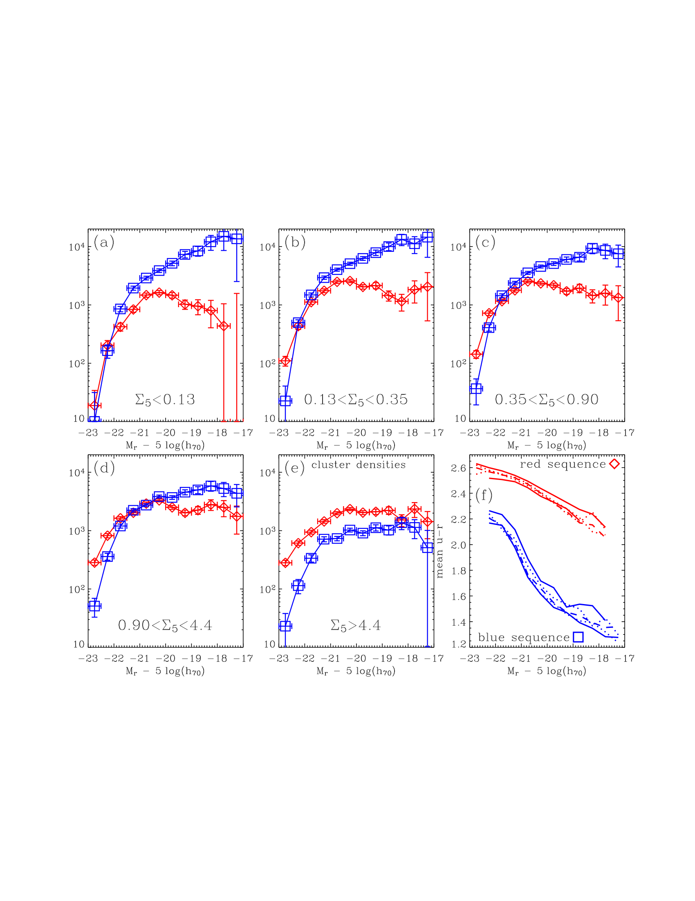
*Separate luminosity functions for red sequence and blue cloud galaxies (Baldry et al. 2004).*

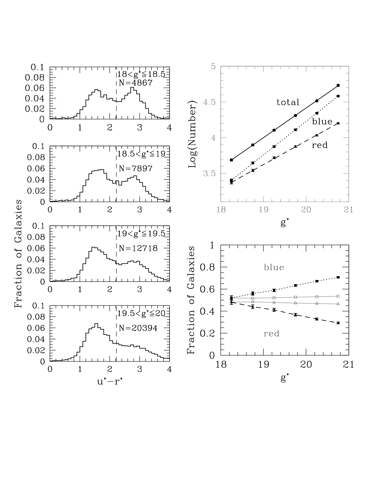
*Color bimodality distribution in SDSS u - r from Strateva et al. (2001).*

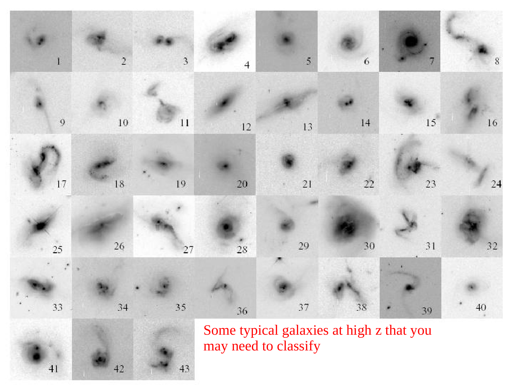
*Double Gaussian fitting to color distributions at fixed absolute magnitude.*

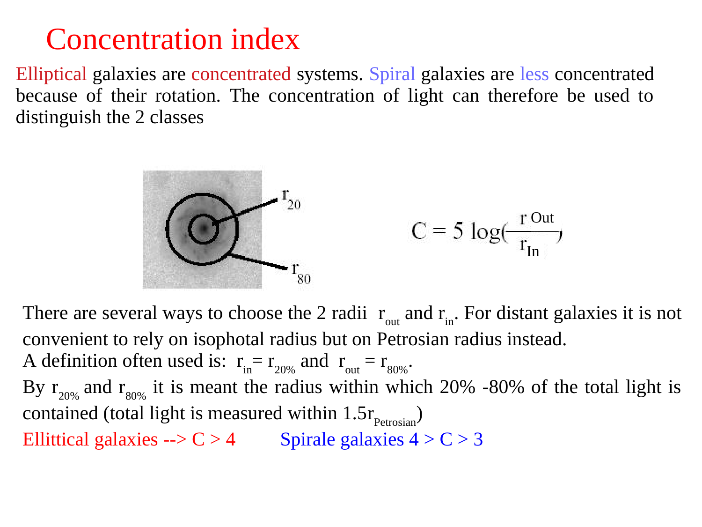
*Transition magnitude: transition from blue-dominated to red-dominated at characteristic mass M* ~ 3 x 10^10 M_Sun.*

---

## lecture slides and reference figures (Prof. Alessandro Pizzella)

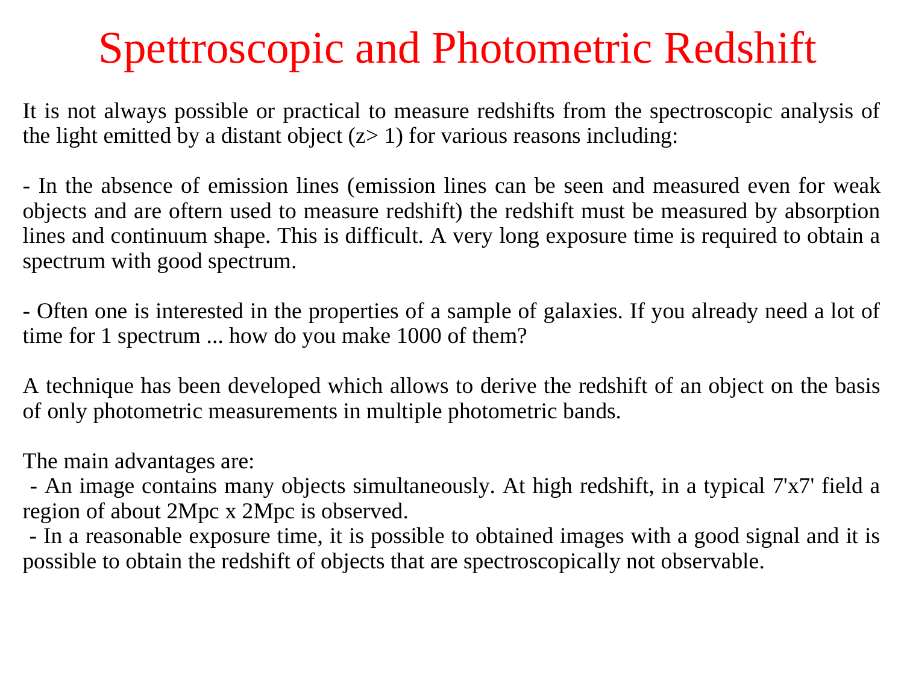

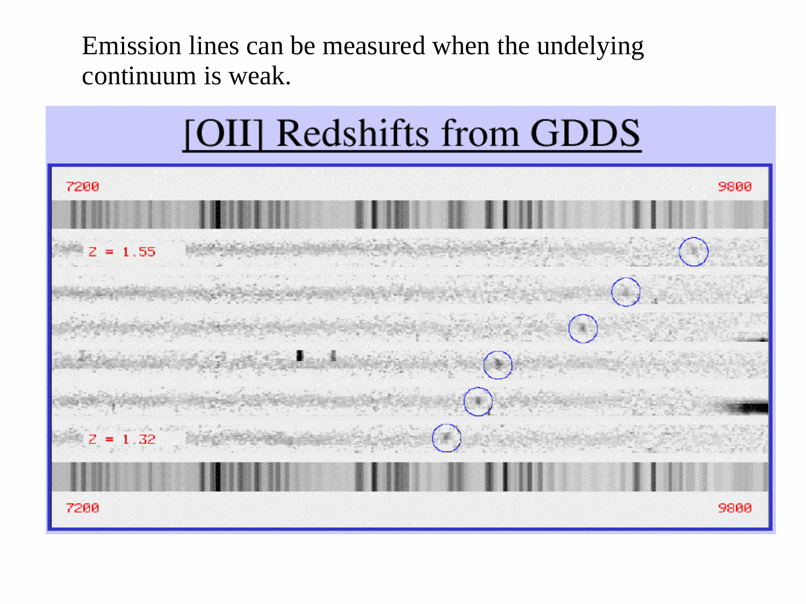

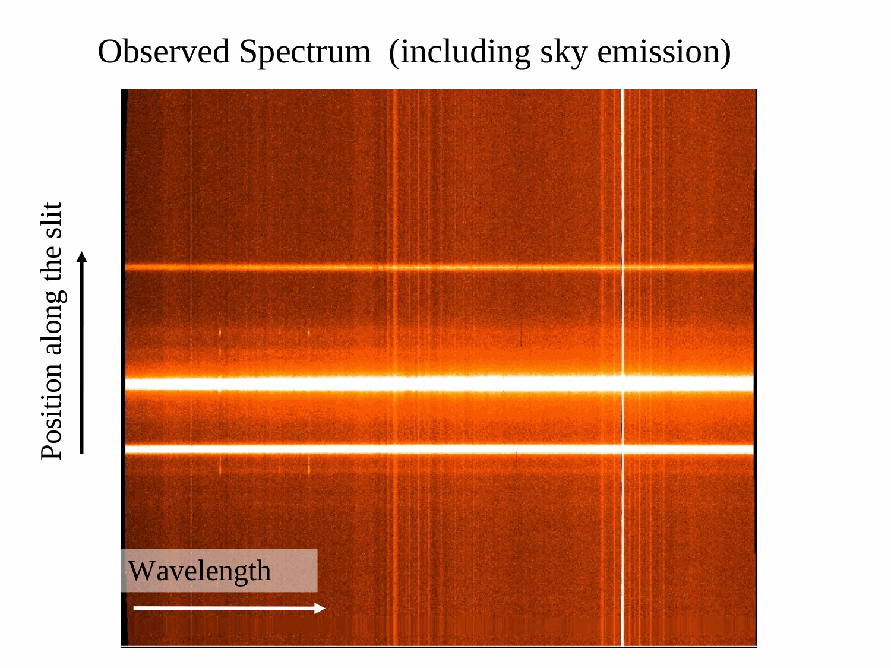

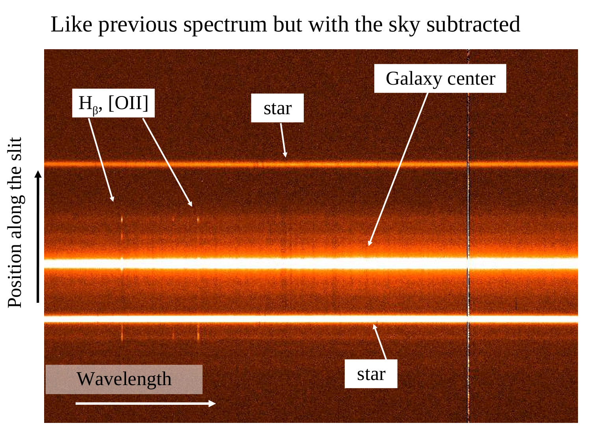

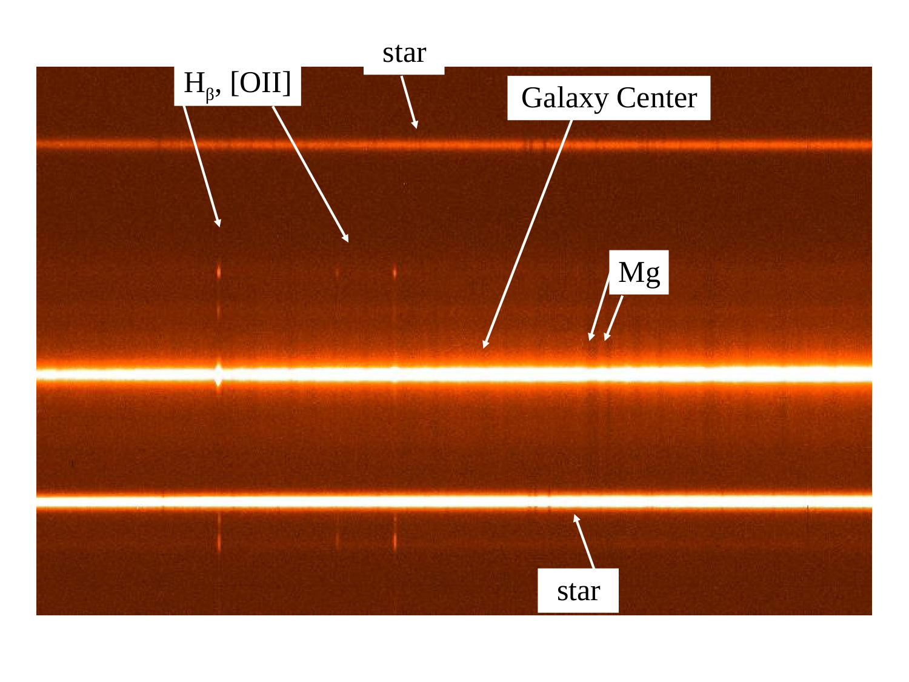

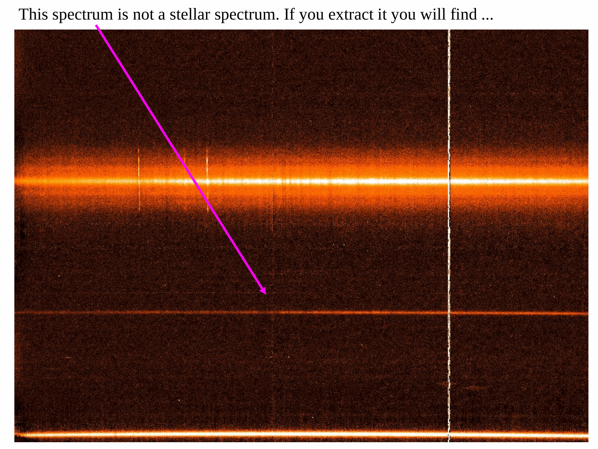

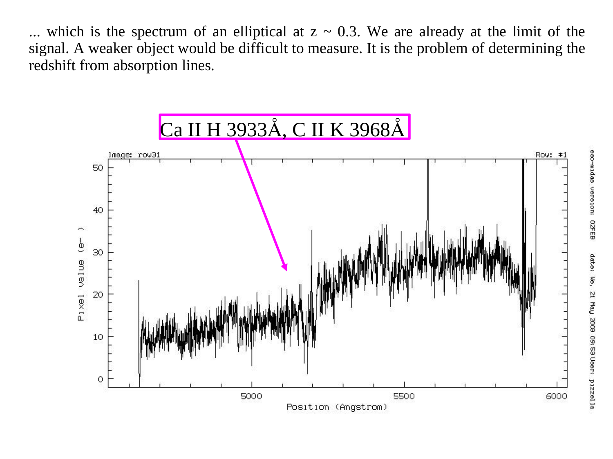

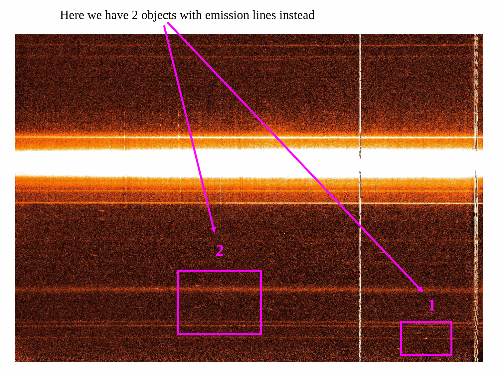

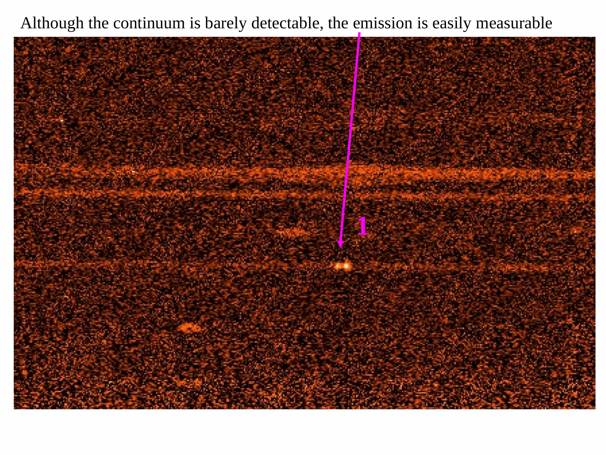

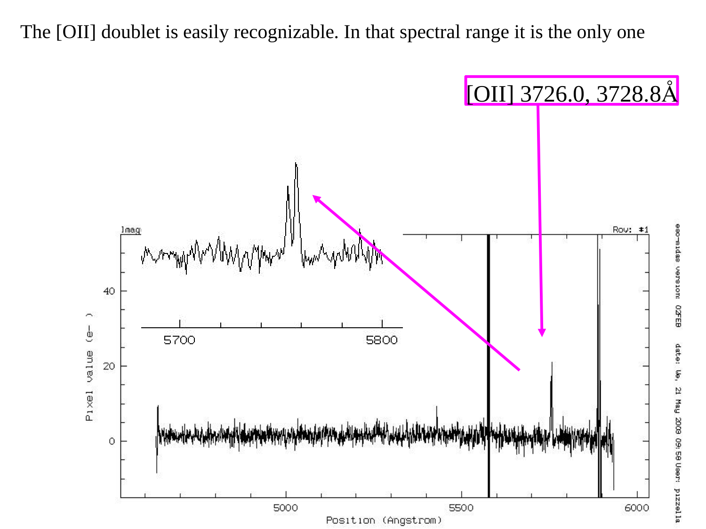


  <h4 class="backlinks-title">Linked References (16)</h4>
  <ul class="backlinks-list">
    <li class="backlink-item-wrap"><a href="../../04_Atlas/Astrophysics_of_Galaxies_MOC.html" class="backlink-item">Astrophysics_of_Galaxies_MOC</a></li>
    <li class="backlink-item-wrap"><a href="./Color%20gradients%20in%20ellipticals.html" class="backlink-item">Color gradients in ellipticals</a></li>
    <li class="backlink-item-wrap"><a href="./Color%20indices.html" class="backlink-item">Color indices</a></li>
    <li class="backlink-item-wrap"><a href="./Eigenspectra%20and%20spectral%20types.html" class="backlink-item">Eigenspectra and spectral types</a></li>
    <li class="backlink-item-wrap"><a href="./Galaxy%20color%2C%20density%20and%20morphology.html" class="backlink-item">Galaxy color, density and morphology</a></li>
    <li class="backlink-item-wrap"><a href="./Galaxy%20spectroscopy%20by%20type.html" class="backlink-item">Galaxy spectroscopy by type</a></li>
    <li class="backlink-item-wrap"><a href="./Green%20valley%20and%20quenching%20tracks.html" class="backlink-item">Green valley and quenching tracks</a></li>
    <li class="backlink-item-wrap"><a href="./LF%20by%20morphology%20and%20SED.html" class="backlink-item">LF by morphology and SED</a></li>
    <li class="backlink-item-wrap"><a href="../../04_Atlas/Observational_Cosmology_MOC.html" class="backlink-item">Observational_Cosmology_MOC</a></li>
    <li class="backlink-item-wrap"><a href="./PCA%20spectral%20classification%20of%20galaxies.html" class="backlink-item">PCA spectral classification of galaxies</a></li>
    <li class="backlink-item-wrap"><a href="../../02_Literature/Lectures/Observational_Cosmology/Pablo_02_Statistical_properties_of_galaxies.html" class="backlink-item">Pablo_02_Statistical_properties_of_galaxies</a></li>
    <li class="backlink-item-wrap"><a href="./Quenching%20and%20passive%20galaxies%20at%20high%20z.html" class="backlink-item">Quenching and passive galaxies at high z</a></li>
    <li class="backlink-item-wrap"><a href="./Red%20sequence%20and%20blue%20cloud.html" class="backlink-item">Red sequence and blue cloud</a></li>
    <li class="backlink-item-wrap"><a href="./SDSS%20overview.html" class="backlink-item">SDSS overview</a></li>
    <li class="backlink-item-wrap"><a href="./Stellar%20mass%20function.html" class="backlink-item">Stellar mass function</a></li>
    <li class="backlink-item-wrap"><a href="./Surveys%20to%20remember.html" class="backlink-item">Surveys to remember</a></li>
  </ul>

