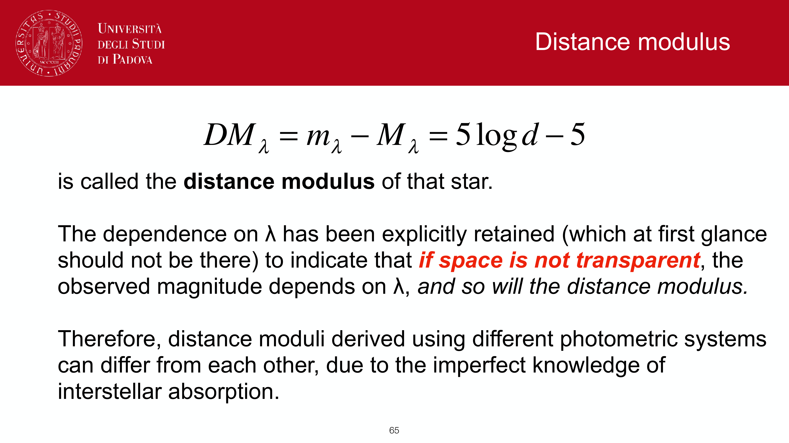
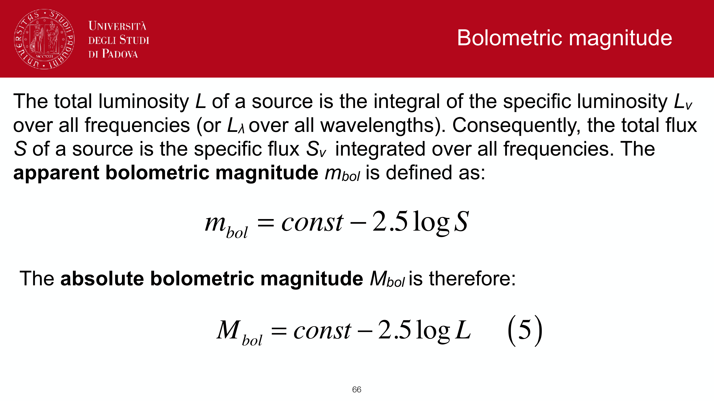
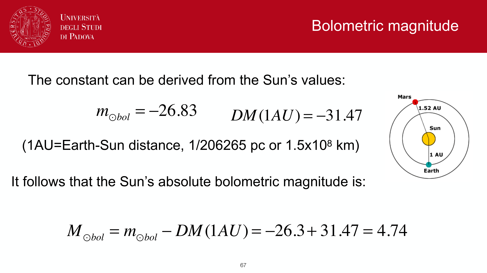
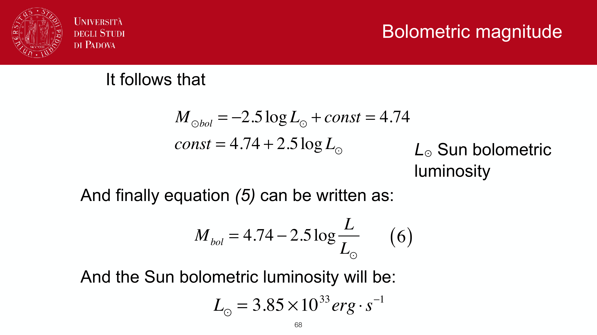

a **color index** (or just "color") is a magnitude difference between two filters of the same source:
$$\text{color} \equiv m_1 - m_2 = -2.5\log_{10}(F_1/F_2)$$

intrinsically a one-number summary of the **shape** of the SED across two bandpasses. removes distance and geometry, keeps spectral information.

## why colors are useful

- **independent of distance**: both fluxes drop as $1/d^2$, the ratio is preserved.
- **probe of temperature**: hotter blackbodies are bluer (less $B - V$ for example).
- **probe of redshift**: at high $z$, spectral features shift through filters and colors change in characteristic ways. basis of [[Photometric redshifts]].
- **probe of dust extinction**: dust reddens, so excess $E(B-V) \equiv (B - V)_{\rm obs} - (B - V)_{\rm intrinsic} > 0$.
- **probe of stellar population age**: a young SSP is bluer, an old one redder.

## common stellar color indices

| color | typical range | what it traces |
|---|---|---|
| $U - B$ | $-1$ (O) to $+1.5$ (M) | hot side of SED, useful for $T$ in early types |
| $B - V$ | $-0.3$ (O) to $+1.5$ (M) | the workhorse temperature indicator on the MS |
| $V - I$ | $-0.5$ to $+4$ | broad SED shape, less Balmer sensitivity |
| $J - K$ | $-0.1$ to $+1.3$ | NIR slope, late-type giants and dust |

example values:
- O5 V star: $B - V \approx -0.30$ (very hot, $T \approx 40\,000$ K).
- A0 V (Vega): $B - V \equiv 0$ by definition of the Vega system.
- G2 V (Sun): $B - V \approx +0.65$.
- M0 V: $B - V \approx +1.4$.
- M8 III (red giant): $B - V \approx +1.6$.

## colors as galaxy classifier

galaxy SDSS color $u - r$ shows a clear **bimodality** between:
- **blue cloud**: $u - r \lesssim 2$, star-forming spirals.
- **red sequence**: $u - r \gtrsim 2.3$, passive ellipticals.
- **green valley**: in between, transitional galaxies.

see [[Color bimodality of galaxies]] and [[Red sequence and blue cloud]] for the cosmological context.

## color-magnitude diagrams (CMDs)

plotting magnitude vs color for individual stars gives the observational version of the [[HR diagram]]. for cluster stars: a single, well-defined isochrone, with a turnoff at the mass-dependent main-sequence lifetime point.

for galaxies: a color-magnitude diagram of galaxies in a cluster shows the red sequence, used to determine the cluster redshift.

## reddening corrections

observed colors are dust-affected. correction:
$$(B - V)_0 = (B - V)_{\rm obs} - E(B - V)$$
with $E(B - V)$ from spectral fitting, Balmer decrement, or dust maps (Schlegel-Finkbeiner-Davis 1998).

reddening vector on the CMD: a parallel shift along $B - V$ proportional to $E(B - V)$, with a slope $A_V/E(B-V) = R_V \approx 3.1$ for diffuse Galactic ISM.

## see also

- [[Magnitudes and photometric systems]]
- [[Pogson magnitudes and flux relation]]
- [[Filter systems and bandpasses]]
- [[Bolometric correction and effective temperature]]
- [[HR diagram]]
- [[Color bimodality of galaxies]]
- [[Color-magnitude diagrams of clusters]]
- [[Photometric redshifts]]
- [[Interstellar absorption]]

---

## observational astrophysics course slides (Prof. Paolo Cassata)

*Color index definition: C_12 = m1 - m2 = -2.5 log10(F1 / F2) + const.*

*B - V color index as direct proxy for stellar surface temperature.*

*Color indices of blackbodies: asymptotic limit as T -> infinity.*

*Color-color diagrams (e.g. U-B vs B-V) for stellar classification and reddening determination.*

## Linked References

- [[Color-magnitude diagrams of clusters]]
- [[Filter systems and bandpasses]]
- [[Photometric standard stars]]
- [[Photometric system conversion and color terms]]
- [[Pogson magnitudes and flux relation]]
- [[Observational_Astrophysics_MOC]]

