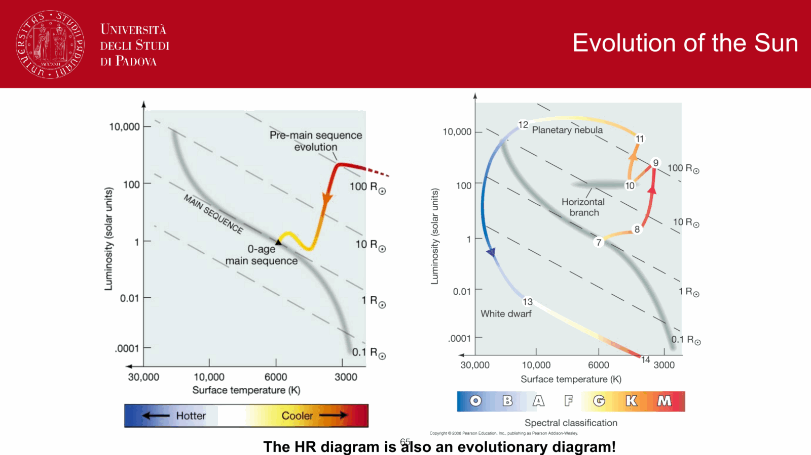
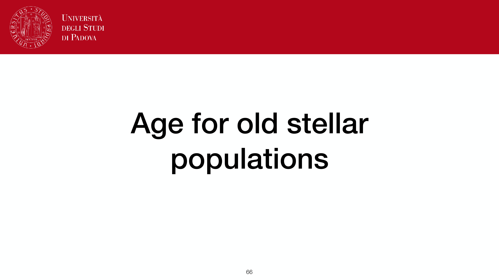
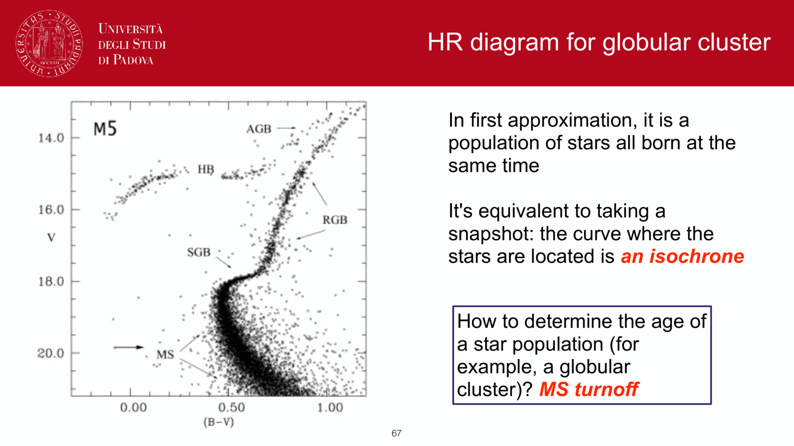
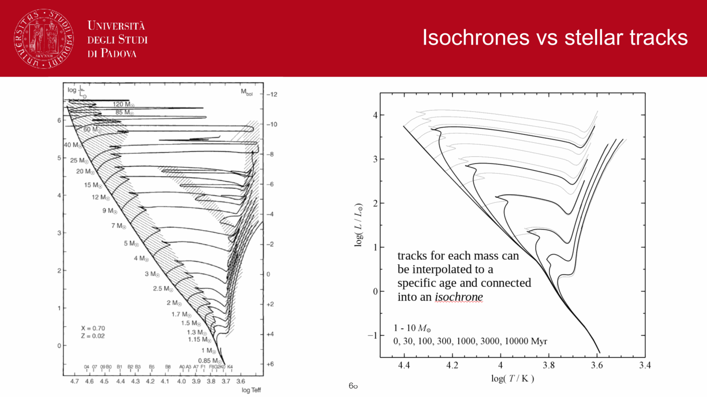



a **color-magnitude diagram** (CMD) is the observational version of the [HR diagram](./HR%20diagram.html): $M_V$ (or $M_X$) vs a color (e.g. $B-V$, $g-r$, or $V-I$). for stellar **clusters** specifically, all stars share the same age, metallicity, and distance, so a cluster CMD is a powerful diagnostic of all four parameters: age, $Z$, distance modulus, and reddening. milone et al. 2025 (A&A 696, 221) provides the modern reference CMD for NGC 6397 ($\sim 13.5$ Gyr), used as the canonical example throughout the course.

## why clusters

a cluster is essentially a **single stellar population (SSP)**: all members born in one star-formation event from the same cloud, sharing:
- distance modulus $\mu$ (uniform within $\sim 1$ pc).
- age $\tau$ (formed essentially simultaneously, $\Delta\tau \ll \tau$).
- metallicity $[Fe/H]$ (homogeneous within most clusters).
- reddening $E(B - V)$ (assumed uniform).

so the cluster CMD is a slice through the multi-parameter HR diagram at fixed $\tau, Z$. its shape is the **isochrone** for those parameters.

## the features in a CMD

main classes from bottom (faint, red) to top (bright, blue):

### main sequence (MS)
diagonal band of H-burning stars, from M dwarfs at the bottom to O stars at the top. its **upper end is set by the cluster age**: stars more massive than $M_{\rm TO}$ have already exited the MS. the position of the **turnoff** is the central age indicator.

### turnoff (TO)
where the MS bends rightward as stars exhaust core hydrogen. luminosity at TO:
$$L_{\rm TO}/L_\odot \approx (M_{\rm TO}/M_\odot)^{3.5}, \quad \tau_{\rm TO} \approx 10\,\text{Gyr}\,(M_{\rm TO}/M_\odot)^{-2.5}$$

so $\tau \sim 10\,\text{Gyr}\,(L_{\rm TO}/L_\odot)^{-0.7}$.

### subgiant branch (SGB)
short transition from TO to the base of the RGB.

### red giant branch (RGB)
H-shell-burning, ascending the giant branch with growing convective envelopes. ends at the **TRGB** (helium flash).

### horizontal branch (HB)
post-helium-flash, He-core-burning stars. blue HB in metal-poor populations, red HB / red clump in metal-rich.

### asymptotic giant branch (AGB)
double-shell-burning stars after core He exhaustion.

### blue stragglers
abnormally bluer-than-MS turnoff stars; products of mass transfer or mergers in tight binaries.

### white dwarf cooling sequence
faint blue-end remnants of stars that finished post-MS evolution.

## reading a CMD

four shifts move the isochrone in characteristic directions:
- **distance**: moves the whole CMD vertically (down for farther).
- **reddening**: moves it diagonally along the reddening vector ($A_V \approx 3.1 E(B-V)$).
- **age**: moves the turnoff diagonally; old populations have lower-mass, fainter, redder turnoffs.
- **metallicity**: moves the giant branch and isochrone position; high-$Z$ shifts redward.

so by overlaying a grid of model isochrones (Padova/PARSEC [Bressan et al. 2012], BaSTI [Pietrinferni et al. 2004, 2006], DSEP/Dartmouth [Dotter et al. 2008], MIST, Y$^2$) at different ages and metallicities, you can simultaneously fit all four parameters from a single CMD.

## observational challenges

two features of real CMDs create difficulties (Milone 2026 Lectures 2-3):

1. **zig-zag along the MS**: in UV-optical CMDs, the main sequence is not a smooth curve but shows inflections + wiggles. these reflect changes in opacity sources (H$^-$ bound-free, molecular absorption) that affect bolometric corrections at different $T_{\rm eff}$ values. the **MS knee** (where the MS bends in UV filters) is prominent in metal-rich populations (e.g. 47 Tuc; Marino et al. 2024).

2. **UV-dim stars**: some MS stars appear anomalously faint in the F275W (NUV) filter while appearing normal in optical. this has been linked to stellar activity, chromospheric emission, or unresolved binary companions with UV-excess WDs.

## proper motion cleaning

modern CMDs from HST + Gaia are cleaned using **proper-motion membership selection** (Cordoni et al. 2018). a proper-motion diagram separates cluster members (tight clump) from field stars (dispersed). this dramatically sharpens the CMD by removing foreground/background contaminants and is essential for all precise CMD studies.

## examples

### open cluster (Pop I)
Pleiades, Hyades, M67. young to intermediate age ($10^7$ to $10^{10}$ yr). well-defined MS turnoff; pre-main-sequence stars in the youngest. lots of MS, little giant branch (giants live shortly).

### globular cluster (Pop II)
M3, M13, 47 Tuc, $\omega$ Cen. old ($\sim 10$ to $13$ Gyr), metal-poor. well-developed RGB, HB with RR Lyrae instability strip, narrow MS, faint TO. ages **bound the universe**: the oldest globulars are $\sim 13$ Gyr, consistent with $\Lambda$CDM age $\sim 13.8$ Gyr.

### dwarf spheroidal galaxy
mixed-age, metal-poor populations. CMDs show extended MS + RGB + multiple turnoffs (multiple star formation episodes).

## reference papers

- **Milone et al. 2025, A&A 696, 221** — modern reference CMD for NGC 6397.
- **Cordoni et al. 2018** — proper motion cleaning of cluster CMDs.
- **Bressan et al. 2012** — PARSEC isochrones (Padova).
- **Dotter et al. 2008** — DSEP/Dartmouth isochrones.
- **Pietrinferni et al. 2004, 2006** — BaSTI isochrones.
- **Marino et al. 2024** — MS knee in 47 Tuc.

## see also

- [HR diagram](./HR%20diagram.html)
- [Cluster ages from CMD turnoff](./Cluster%20ages%20from%20CMD%20turnoff.html)
- [Stellar populations I II III](./Stellar%20populations%20I%20II%20III.html)
- [Spectroscopic parallax and main-sequence fitting](./Spectroscopic%20parallax%20and%20main-sequence%20fitting.html)
- [Variable stars as standard candles](./Variable%20stars%20as%20standard%20candles.html)
- [Initial mass function](./Initial%20mass%20function.html)
- [Stellar evolution timescales](./Stellar%20evolution%20timescales.html)
- [Color indices](./Color%20indices.html)
- [Distance modulus](./Distance%20modulus.html)
- [SFH from resolved CMDs](./SFH%20from%20resolved%20CMDs.html)
- [Isochrones and isochrone fitting](./Isochrones%20and%20isochrone%20fitting.html)
- [Stellar_Astrophysics_MOC](../../04_Atlas/Stellar_Astrophysics_MOC.html)

---

## observational astrophysics course slides (Prof. Paolo Cassata)

*Star clusters as natural laboratories: coeval, chemically homogeneous, same distance.*

*Open clusters (galactic clusters): Pop I, young, metal-rich, located in galactic disk.*

*Globular clusters: Pop II, ancient (10-13 Gyr), metal-poor, spherically distributed in halo.*

*Composite CMD of open clusters of varying ages (Pleiades, Hyades, Praesepe, M67, NGC 188).*

---

## Complete Lecture Slide Panels & Observational Evidence (Lecture 01 — Reading the CMD I: Morphology & Clusters)

> **Context**: *CMD anatomy, NGC 6397 reference sequences, star cluster taxonomy, simple stellar populations (SSPs), observational photometric errors, and completeness limits.*

The following slides from Prof. Antonino Milone's lecture series provide the direct observational, photometric, and theoretical foundations for this topic:

*Figure P01-01: L01_p14_CMD_evolutionary_phases-14.png — Observational data, CMD morphology, and diagnostics from Lecture 01 — Reading the CMD I: Morphology & Clusters.*

*Figure P01-02: L01_p23_stellar_pop_I_II-23.png — Observational data, CMD morphology, and diagnostics from Lecture 01 — Reading the CMD I: Morphology & Clusters.*

*Figure P01-03: LAntonino_p01_01.png — Observational data, CMD morphology, and diagnostics from Lecture 01 — Reading the CMD I: Morphology & Clusters.*

*Figure P01-04: LAntonino_p01_02.png — Observational data, CMD morphology, and diagnostics from Lecture 01 — Reading the CMD I: Morphology & Clusters.*

*Figure P01-05: LAntonino_p01_03.png — Observational data, CMD morphology, and diagnostics from Lecture 01 — Reading the CMD I: Morphology & Clusters.*

*Figure P01-06: LAntonino_p01_04.png — Observational data, CMD morphology, and diagnostics from Lecture 01 — Reading the CMD I: Morphology & Clusters.*

*Figure P01-07: LAntonino_p01_05.png — Observational data, CMD morphology, and diagnostics from Lecture 01 — Reading the CMD I: Morphology & Clusters.*

*Figure P01-08: LAntonino_p01_06.png — Observational data, CMD morphology, and diagnostics from Lecture 01 — Reading the CMD I: Morphology & Clusters.*

*Figure P01-09: LAntonino_p01_07.png — Observational data, CMD morphology, and diagnostics from Lecture 01 — Reading the CMD I: Morphology & Clusters.*

*Figure P01-10: LAntonino_p01_08.png — Observational data, CMD morphology, and diagnostics from Lecture 01 — Reading the CMD I: Morphology & Clusters.*

*Figure P01-11: LAntonino_p01_09.png — Observational data, CMD morphology, and diagnostics from Lecture 01 — Reading the CMD I: Morphology & Clusters.*

*Figure P01-12: LAntonino_p01_10.png — Observational data, CMD morphology, and diagnostics from Lecture 01 — Reading the CMD I: Morphology & Clusters.*

*Figure P01-13: LAntonino_p01_11.png — Observational data, CMD morphology, and diagnostics from Lecture 01 — Reading the CMD I: Morphology & Clusters.*

*Figure P01-14: LAntonino_p01_12.png — Observational data, CMD morphology, and diagnostics from Lecture 01 — Reading the CMD I: Morphology & Clusters.*

*Figure P01-15: LAntonino_p01_13.png — Observational data, CMD morphology, and diagnostics from Lecture 01 — Reading the CMD I: Morphology & Clusters.*

*Figure P01-16: LAntonino_p01_14.png — Observational data, CMD morphology, and diagnostics from Lecture 01 — Reading the CMD I: Morphology & Clusters.*

*Figure P01-17: LAntonino_p01_15.png — Observational data, CMD morphology, and diagnostics from Lecture 01 — Reading the CMD I: Morphology & Clusters.*

*Figure P01-18: LAntonino_p01_16.png — Observational data, CMD morphology, and diagnostics from Lecture 01 — Reading the CMD I: Morphology & Clusters.*

*Figure P01-19: LAntonino_p01_17.png — Observational data, CMD morphology, and diagnostics from Lecture 01 — Reading the CMD I: Morphology & Clusters.*

*Figure P01-20: LAntonino_p01_18.png — Observational data, CMD morphology, and diagnostics from Lecture 01 — Reading the CMD I: Morphology & Clusters.*

*Figure P01-21: LAntonino_p01_19.png — Observational data, CMD morphology, and diagnostics from Lecture 01 — Reading the CMD I: Morphology & Clusters.*

*Figure P01-22: LAntonino_p01_20.png — Observational data, CMD morphology, and diagnostics from Lecture 01 — Reading the CMD I: Morphology & Clusters.*

*Figure P01-23: LAntonino_p01_21.png — Observational data, CMD morphology, and diagnostics from Lecture 01 — Reading the CMD I: Morphology & Clusters.*

*Figure P01-24: LAntonino_p01_22.png — Observational data, CMD morphology, and diagnostics from Lecture 01 — Reading the CMD I: Morphology & Clusters.*

*Figure P01-25: LAntonino_p01_23.png — Observational data, CMD morphology, and diagnostics from Lecture 01 — Reading the CMD I: Morphology & Clusters.*

*Figure P01-26: LAntonino_p01_24.png — Observational data, CMD morphology, and diagnostics from Lecture 01 — Reading the CMD I: Morphology & Clusters.*

*Figure P01-27: LAntonino_p01_25.png — Observational data, CMD morphology, and diagnostics from Lecture 01 — Reading the CMD I: Morphology & Clusters.*


  <h4 class="backlinks-title">Linked References (54)</h4>
  <ul class="backlinks-list">
    <li class="backlink-item-wrap"><a href="./Age%20dating%20from%20the%20WD%20luminosity%20function.html" class="backlink-item">Age dating from the WD luminosity function</a></li>
    <li class="backlink-item-wrap"><a href="./Age-metallicity%20degeneracy.html" class="backlink-item">Age-metallicity degeneracy</a></li>
    <li class="backlink-item-wrap"><a href="./Age-metallicity%20relation%20of%20Galactic%20GCs.html" class="backlink-item">Age-metallicity relation of Galactic GCs</a></li>
    <li class="backlink-item-wrap"><a href="interf/Atmospheric%20parameters%20Teff%20log%20g%20feh%20vmicro.html" class="backlink-item">Atmospheric parameters Teff log g feh vmicro</a></li>
    <li class="backlink-item-wrap"><a href="./Atmospheric%20parameters%20Teff%20log%20g%20feh%20vmicro.html" class="backlink-item">Atmospheric parameters Teff log g feh vmicro</a></li>
    <li class="backlink-item-wrap"><a href="./Binary%20stars%20in%20CMD.html" class="backlink-item">Binary stars in CMD</a></li>
    <li class="backlink-item-wrap"><a href="./Blue%20stragglers%20in%20star%20clusters.html" class="backlink-item">Blue stragglers in star clusters</a></li>
    <li class="backlink-item-wrap"><a href="./Bulge%20CMD%20complications.html" class="backlink-item">Bulge CMD complications</a></li>
    <li class="backlink-item-wrap"><a href="./CMD%20constraints%20on%20disk%20vs%20halo%20populations.html" class="backlink-item">CMD constraints on disk vs halo populations</a></li>
    <li class="backlink-item-wrap"><a href="./Calcium%20and%20CaII%20H%2BK.html" class="backlink-item">Calcium and CaII H+K</a></li>
    <li class="backlink-item-wrap"><a href="./Calcium%20population%20vs%20T.html" class="backlink-item">Calcium population vs T</a></li>
    <li class="backlink-item-wrap"><a href="./Cluster%20binary%20fraction%20methods.html" class="backlink-item">Cluster binary fraction methods</a></li>
    <li class="backlink-item-wrap"><a href="./Color%20indices.html" class="backlink-item">Color indices</a></li>
    <li class="backlink-item-wrap"><a href="./Effects%20of%20differential%20reddening%20on%20CMD%20analysis.html" class="backlink-item">Effects of differential reddening on CMD analysis</a></li>
    <li class="backlink-item-wrap"><a href="./Extended%20main%20sequence%20turn-off%20eMSTO.html" class="backlink-item">Extended main sequence turn-off eMSTO</a></li>
    <li class="backlink-item-wrap"><a href="./Extinction%20law%20and%20Rv.html" class="backlink-item">Extinction law and Rv</a></li>
    <li class="backlink-item-wrap"><a href="./Extragalactic%20star%20clusters.html" class="backlink-item">Extragalactic star clusters</a></li>
    <li class="backlink-item-wrap"><a href="./Galactic%20GC%20two-population%20age%20structure.html" class="backlink-item">Galactic GC two-population age structure</a></li>
    <li class="backlink-item-wrap"><a href="./Globular%20clusters%20as%20SSP%20laboratories.html" class="backlink-item">Globular clusters as SSP laboratories</a></li>
    <li class="backlink-item-wrap"><a href="./Helium%20flash%20and%20horizontal%20branch.html" class="backlink-item">Helium flash and horizontal branch</a></li>
    <li class="backlink-item-wrap"><a href="./Helium%20spread%20in%20GCs.html" class="backlink-item">Helium spread in GCs</a></li>
    <li class="backlink-item-wrap"><a href="./IMF%20from%20cluster%20luminosity%20functions.html" class="backlink-item">IMF from cluster luminosity functions</a></li>
    <li class="backlink-item-wrap"><a href="./Initial%20vs%20present-day%20mass%20function.html" class="backlink-item">Initial vs present-day mass function</a></li>
    <li class="backlink-item-wrap"><a href="./Interstellar%20reddening%20and%20the%20reddening%20vector.html" class="backlink-item">Interstellar reddening and the reddening vector</a></li>
    <li class="backlink-item-wrap"><a href="./Isochrones%20and%20isochrone%20fitting.html" class="backlink-item">Isochrones and isochrone fitting</a></li>
    <li class="backlink-item-wrap"><a href="./M-dwarf%20discontinuity%20and%20convective%20merging%20instability.html" class="backlink-item">M-dwarf discontinuity and convective merging instability</a></li>
    <li class="backlink-item-wrap"><a href="./Main%20sequence%20on%20the%20CMD.html" class="backlink-item">Main sequence on the CMD</a></li>
    <li class="backlink-item-wrap"><a href="./Moving%20cluster%20method.html" class="backlink-item">Moving cluster method</a></li>
    <li class="backlink-item-wrap"><a href="./Multiple%20populations%20in%20GCs%20discovery.html" class="backlink-item">Multiple populations in GCs discovery</a></li>
    <li class="backlink-item-wrap"><a href="../../04_Atlas/Observational_Astrophysics_MOC.html" class="backlink-item">Observational_Astrophysics_MOC</a></li>
    <li class="backlink-item-wrap"><a href="./Open%20clusters%20as%20young%20SSP%20laboratories.html" class="backlink-item">Open clusters as young SSP laboratories</a></li>
    <li class="backlink-item-wrap"><a href="./PSF%20photometry.html" class="backlink-item">PSF photometry</a></li>
    <li class="backlink-item-wrap"><a href="./Photometric%20chromosome%20maps.html" class="backlink-item">Photometric chromosome maps</a></li>
    <li class="backlink-item-wrap"><a href="./Population%20I%20and%20II%20stars.html" class="backlink-item">Population I and II stars</a></li>
    <li class="backlink-item-wrap"><a href="./Red%20giant%20branch%20RGB.html" class="backlink-item">Red giant branch RGB</a></li>
    <li class="backlink-item-wrap"><a href="./Resolved%20vs%20unresolved%20stellar%20populations.html" class="backlink-item">Resolved vs unresolved stellar populations</a></li>
    <li class="backlink-item-wrap"><a href="./Single%20stellar%20population%20SSP.html" class="backlink-item">Single stellar population SSP</a></li>
    <li class="backlink-item-wrap"><a href="./Spectroscopic%20determination%20of%20Teff.html" class="backlink-item">Spectroscopic determination of Teff</a></li>
    <li class="backlink-item-wrap"><a href="./Spectroscopic%20parallax%20and%20main-sequence%20fitting.html" class="backlink-item">Spectroscopic parallax and main-sequence fitting</a></li>
    <li class="backlink-item-wrap"><a href="./Star%20cluster%20types.html" class="backlink-item">Star cluster types</a></li>
    <li class="backlink-item-wrap"><a href="./Stellar%20evolutionary%20phases%20on%20the%20CMD.html" class="backlink-item">Stellar evolutionary phases on the CMD</a></li>
    <li class="backlink-item-wrap"><a href="./Stellar%20rotation%20effects%20on%20CMD.html" class="backlink-item">Stellar rotation effects on CMD</a></li>
    <li class="backlink-item-wrap"><a href="./Stellar%20rotation%20v%20sini.html" class="backlink-item">Stellar rotation v sini</a></li>
    <li class="backlink-item-wrap"><a href="../../04_Atlas/Stellar_Astrophysics_MOC.html" class="backlink-item">Stellar_Astrophysics_MOC</a></li>
    <li class="backlink-item-wrap"><a href="./TRGB%20tip%20of%20the%20red%20giant%20branch.html" class="backlink-item">TRGB tip of the red giant branch</a></li>
    <li class="backlink-item-wrap"><a href="./UFDG%20search%20via%20deep%20CMD.html" class="backlink-item">UFDG search via deep CMD</a></li>
    <li class="backlink-item-wrap"><a href="./UFDG%20star%20formation%20histories.html" class="backlink-item">UFDG star formation histories</a></li>
    <li class="backlink-item-wrap"><a href="./Variable%20stars%20as%20standard%20candles.html" class="backlink-item">Variable stars as standard candles</a></li>
    <li class="backlink-item-wrap"><a href="./WDCS%20turn%20to%20blue%20and%20CIA.html" class="backlink-item">WDCS turn to blue and CIA</a></li>
    <li class="backlink-item-wrap"><a href="./WDCS%20vs%20MSTO%20ages%20comparison.html" class="backlink-item">WDCS vs MSTO ages comparison</a></li>
    <li class="backlink-item-wrap"><a href="./White%20dwarf%20cooling%20sequence%20on%20the%20CMD.html" class="backlink-item">White dwarf cooling sequence on the CMD</a></li>
    <li class="backlink-item-wrap"><a href="./White%20dwarf%20cooling%20theory.html" class="backlink-item">White dwarf cooling theory</a></li>
    <li class="backlink-item-wrap"><a href="./White%20dwarf%20overview.html" class="backlink-item">White dwarf overview</a></li>
    <li class="backlink-item-wrap"><a href="./Yellow%20stragglers%20and%20sub-subgiants.html" class="backlink-item">Yellow stragglers and sub-subgiants</a></li>
  </ul>

