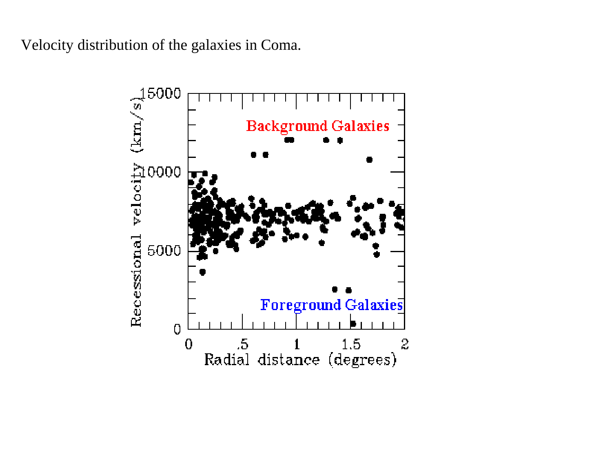
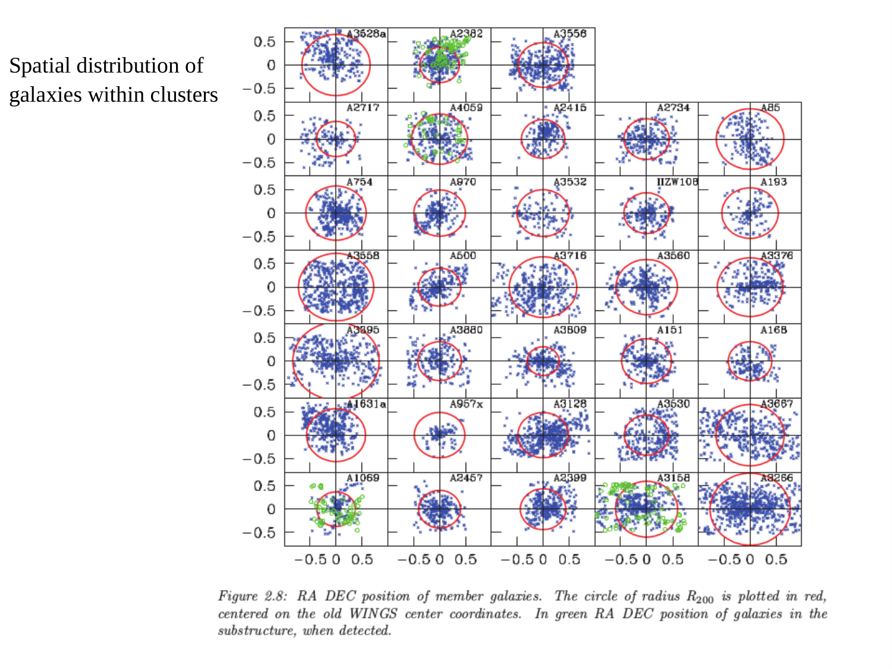
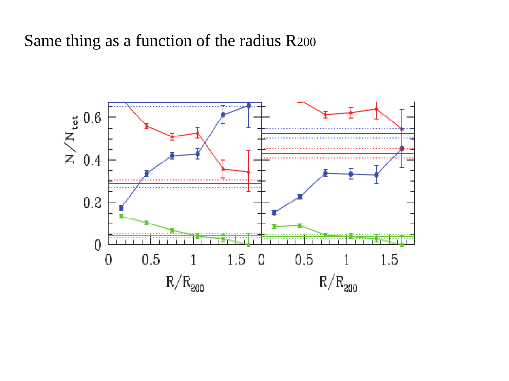

# Coma cluster

The Coma Cluster (Abell 1656) is the archetype of rich, regular, virialized galaxy clusters in the nearby universe. Located at a redshift of $z = 0.0231$ (corresponding to a Hubble distance of $d \approx 100$ Mpc for $H_0 = 70 \text{ km s}^{-1} \text{ Mpc}^{-1}$), it contains more than 1000 cataloged galaxies concentrated within a virial radius of $R_{\rm vir} \approx 2 - 3$ Mpc, dominated in its center by two giant cD ellipticals (NGC 4874 and NGC 4889). Coma holds a historic position in physical cosmology - in 1933, Fritz Zwicky applied the Virial Theorem to the radial velocity dispersion of its member galaxies, obtaining an astronomical mass-to-light ratio of $(M/L)_B \sim 300 - 400 M_\odot / L_\odot$ and delivering the first empirical discovery of non-luminous dark matter ("dunkle Materie"). Modern multi-wavelength investigations through space-based X-ray observatories (ROSAT, XMM-Newton, Chandra) and gravitational lensing establish that the total mass of Coma is $M_{200} \approx (1.4 - 1.8) \times 10^{15} M_\odot$. Crucially, the cluster baryon budget reveals that hot, diffuse, X-ray emitting plasma ($T \sim 10^8$ K) out-masses all stars in all galaxies by a factor of six, while non-baryonic dark matter accounts for $\sim 85\%$ of the total cluster mass.

---

## 1. Astrophysical Context and Phenomenological Structure

### Global Cluster Properties
The Coma cluster exhibits the classic characteristics of an evolved, dynamically relaxed regular cluster
- Redshift and Distance - Redshift $z = 0.0231$, line-of-sight recession velocity $c z \approx 6925 \text{ km s}^{-1}$, physical distance $d \approx 99$ Mpc ($1' \approx 28.8$ kpc).
- Morphology and Galaxy Population - Strongly centrally concentrated with spherical symmetry. Galaxies in the core ($r < 1$ Mpc) are almost exclusively early-type spheroids (ellipticals E and lenticulars S0), reflecting the morphology-density relation (Dressler 1980). Spiral galaxies are restricted to the outer virial periphery ($r > 1.5$ Mpc).
- The Binary cD Nucleus - The cluster center features two dominant giant supergiant galaxies - NGC 4874 and NGC 4889, both with absolute magnitudes $M_V \approx -23.5$, surrounded by a vast, diffuse halo of intracluster light (ICL) stripped from disrupted satellite galaxies.
- Velocity Dispersion - The line-of-sight velocity dispersion of member galaxies is $\sigma_r \approx 1008 \pm 35 \text{ km s}^{-1}$, corresponding to a 3D velocity dispersion of $\langle v^2 \rangle^{1/2} = \sqrt{3} \sigma_r \approx 1750 \text{ km s}^{-1}$.

---

## 2. Fritz Zwicky (1933) Discovery of Dark Matter via the Virial Theorem

In 1933, Swiss astrophysicist Fritz Zwicky compiled the radial velocities of eight member galaxies in the Coma cluster measured by Edwin Hubble and Milton Humason at Mount Wilson. He noticed that their velocities exhibited an unexpectedly large dispersion of $\sigma_r \sim 1000 \text{ km s}^{-1}$.

### Unbroken Mathematical Derivation of the Virial Mass Estimator
Consider a cluster of $N$ galaxies of masses $m_i$, positions $\mathbf{r}_i$, and velocities $\mathbf{v}_i$ relative to the cluster center of mass.
The moment of inertia tensor trace is
$$I = \sum_{i=1}^N m_i r_i^2$$
Taking the second time derivative of $I$ (Lagrange's identity)
$$\frac{1}{2} \frac{d^2 I}{dt^2} = 2 K + U$$
where $K$ is the total kinetic energy of galaxy peculiar motions, and $U$ is the total gravitational potential energy of mutual attraction
$$K = \frac{1}{2} \sum_{i=1}^N m_i v_i^2 = \frac{1}{2} M_{\rm tot} \langle v^2 \rangle$$
$$U = -G \sum_{i < j} \frac{m_i m_j}{|\mathbf{r}_i - \mathbf{r}_j|} = -\frac{1}{2} \frac{G M_{\rm tot}^2}{R_G}$$
where $R_G$ is the gravitational radius of the cluster.
For a dynamically relaxed, stationary system in statistical equilibrium, the time average of the second derivative of the moment of inertia vanishes ($\langle \ddot{I} \rangle = 0$). This yields the scalar Virial Theorem
$$2 K + U = 0$$

#### Connecting 3D Velocity to Observed Line-of-Sight Dispersion
Under the assumption of velocity isotropy ($\langle v_x^2 \rangle = \langle v_y^2 \rangle = \langle v_z^2 \rangle = \sigma_r^2$)
$$\langle v^2 \rangle = \langle v_x^2 \rangle + \langle v_y^2 \rangle + \langle v_z^2 \rangle = 3 \sigma_r^2$$
Substituting into the kinetic energy
$$K = \frac{1}{2} M_{\rm tot} (3 \sigma_r^2) = \frac{3}{2} M_{\rm tot} \sigma_r^2$$

#### Solving for Virial Mass
Substituting $K$ and $U$ into the virial condition $2K + U = 0$
$$2 \left( \frac{3}{2} M_{\rm tot} \sigma_r^2 \right) - \frac{1}{2} \frac{G M_{\rm tot}^2}{R_G} = 0$$
$$3 M_{\rm tot} \sigma_r^2 = \frac{1}{2} \frac{G M_{\rm tot}^2}{R_G}$$
Dividing both sides by $M_{\rm tot}$ and solving for $M_{\rm tot}$
$$M_{\rm vir} = \frac{6 \sigma_r^2 R_G}{G}$$
In observational astronomy, using the harmonic mean projected radius $R_v \approx 2 R_G$
$$M_{\rm vir} = \frac{3 \sigma_r^2 R_{\rm vir}}{G}$$

### Numerical Evaluation for Coma
Substituting the observational values for Coma
- Velocity dispersion - $\sigma_r = 1000 \text{ km s}^{-1} = 1.0 \times 10^8 \text{ cm s}^{-1}$
- Virial radius - $R_{\rm vir} \approx 2.0 \text{ Mpc} = 2.0 \times (3.086 \times 10^{24} \text{ cm}) \approx 6.17 \times 10^{24} \text{ cm}$
- Gravitational constant - $G = 6.674 \times 10^{-8} \text{ cm}^3 \text{ g}^{-1} \text{ s}^{-2}$

$$M_{\rm vir} = \frac{3 \times (1.0 \times 10^8 \text{ cm s}^{-1})^2 \times (6.17 \times 10^{24} \text{ cm})}{6.674 \times 10^{-8} \text{ cm}^3 \text{ g}^{-1} \text{ s}^{-2}}$$
Evaluating the numerator
$$\text{Numerator} = 3 \times 1.0 \times 10^{16} \times 6.17 \times 10^{24} \approx 1.851 \times 10^{41} \text{ cm}^3 \text{ s}^{-2}$$
Dividing by $G$
$$M_{\rm vir} = \frac{1.851 \times 10^{41}}{6.674 \times 10^{-8}} \approx 2.773 \times 10^{48} \text{ g}$$
Converting grams to solar masses ($1 M_\odot = 1.989 \times 10^{33}$ g)
$$M_{\rm vir} = \frac{2.773 \times 10^{48} \text{ g}}{1.989 \times 10^{33} \text{ g } M_\odot^{-1}} \approx 1.39 \times 10^{15} M_\odot$$

### The Mass-to-Light Ratio Discrepancy
The total integrated optical luminosity of all galaxies in the Coma cluster in the photographic B-band is
$$L_B \approx 5.0 \times 10^{12} L_\odot$$
The resulting dynamical mass-to-light ratio is
$$\left(\frac{M}{L}\right)_B = \frac{1.39 \times 10^{15} M_\odot}{5.0 \times 10^{12} L_\odot} \approx 280 - 400 M_\odot / L_\odot$$
Individual stars in the solar neighborhood have mass-to-light ratios of $(M/L)_B \sim 1 - 3$. Normal stellar populations in elliptical galaxies have $(M/L)_B \sim 6 - 10$.
Zwicky concluded that the visible galaxies account for less than $2\%$ of the total mass required to hold the cluster together. If the cluster were composed solely of the mass of its luminous stars, the galaxies would disperse into intergalactic space in less than a crossing time ($t_{\rm cross} \sim R / \sigma_r \sim 2$ Gyr). This demanded the existence of vast quantities of unseen dark matter.

---

## 3. The Intracluster Medium (ICM) and Hydrostatic Equilibrium

Space-based X-ray astronomy (UHURU, Einstein, ROSAT, Chandra, XMM-Newton) revealed that the space between galaxies in Coma is filled with a hot, diffuse plasma - the Intracluster Medium (ICM).

### Thermal Bremsstrahlung Emission
The ICM is a fully ionized hydrogen-helium plasma ($X \approx 0.70, Y \approx 0.28, Z \approx 0.3 Z_\odot$) heated to virial temperatures of
$$T_X \approx 8.25 \pm 0.10 \text{ keV} \approx 9.6 \times 10^7 \text{ K}$$
The gas radiates via thermal electron-ion bremsstrahlung (free-free radiation) and line emission from highly ionized iron (Fe XXV and Fe XXVI at $6.7$ keV). The total X-ray luminosity is $L_X \approx 1.5 \times 10^{44} \text{ erg s}^{-1}$.

### Unbroken Derivation of Hydrostatic Mass Profile
Assuming the intracluster gas is in spherical hydrostatic equilibrium within the gravitational potential well of the cluster
$$\frac{dP_{\rm gas}}{dr} = -\frac{G M(<r) \rho_{\rm gas}(r)}{r^2}$$
Applying the ideal gas equation of state
$$P_{\rm gas}(r) = \frac{\rho_{\rm gas}(r) k_B T_X(r)}{\mu m_p}$$
where $\mu \approx 0.59$ is the mean molecular weight of the fully ionized primordial plasma.
Differentiating $P_{\rm gas}$ with respect to radius
$$\frac{dP_{\rm gas}}{dr} = \frac{k_B}{\mu m_p} \frac{d}{dr} \left[ \rho_{\rm gas}(r) T_X(r) \right] = \frac{k_B T_X}{\mu m_p} \frac{d\rho_{\rm gas}}{dr} + \frac{k_B \rho_{\rm gas}}{\mu m_p} \frac{dT_X}{dr}$$
Dividing both sides by $P_{\rm gas} = \frac{\rho_{\rm gas} k_B T_X}{\mu m_p}$
$$\frac{1}{P_{\rm gas}} \frac{dP_{\rm gas}}{dr} = \frac{1}{\rho_{\rm gas}} \frac{d\rho_{\rm gas}}{dr} + \frac{1}{T_X} \frac{dT_X}{dr} = \frac{d\ln\rho_{\rm gas}}{dr} + \frac{d\ln T_X}{dr}$$
Multiplying by $r$ to express in terms of logarithmic derivatives
$$\frac{r}{P_{\rm gas}} \frac{dP_{\rm gas}}{dr} = \frac{d\ln P_{\rm gas}}{d\ln r} = \frac{d\ln\rho_{\rm gas}}{d\ln r} + \frac{d\ln T_X}{d\ln r}$$
Substituting $\frac{dP_{\rm gas}}{dr} = -\frac{G M(<r) \rho_{\rm gas}}{r^2}$ into this expression
$$\frac{r}{\rho_{\rm gas} k_B T_X / (\mu m_p)} \left( -\frac{G M(<r) \rho_{\rm gas}}{r^2} \right) = \frac{d\ln\rho_{\rm gas}}{d\ln r} + \frac{d\ln T_X}{d\ln r}$$
$$-\frac{G M(<r) \mu m_p}{k_B T_X r} = \frac{d\ln\rho_{\rm gas}}{d\ln r} + \frac{d\ln T_X}{d\ln r}$$
Solving explicitly for the enclosed gravitational mass $M(<r)$
$$M(<r) = -\frac{k_B T_X(r) r}{G \mu m_p} \left[ \frac{d\ln\rho_{\rm gas}}{d\ln r} + \frac{d\ln T_X}{d\ln r} \right]$$

### The Isothermal Beta-Model (Cavaliere & Fusco-Femiano 1976)
The surface brightness profile of X-ray emission in Coma is fitted by the King-type $\beta$-model
$$S_X(\theta) = S_0 \left[ 1 + \left(\frac{\theta}{\theta_c}\right)^2 \right]^{-3\beta + 1/2}$$
For bremsstrahlung emissivity $\epsilon_X \propto \rho_{\rm gas}^2 \sqrt{T_X}$, the Abel inversion yields the 3D gas density profile
$$\rho_{\rm gas}(r) = \rho_0 \left[ 1 + \left(\frac{r}{r_c}\right)^2 \right]^{-3\beta / 2}$$
For Coma, ROSAT and XMM-Newton measurements give core radius $r_c \approx 250 \text{ kpc}$ and slope parameter $\beta \approx 0.75$.
Assuming the gas is isothermal across the core ($dT_X / dr \approx 0 \implies d\ln T_X / d\ln r = 0$)
$$\frac{d\ln\rho_{\rm gas}}{d\ln r} = r \frac{d}{dr}\left[ -\frac{3\beta}{2} \ln\left(1 + \frac{r^2}{r_c^2}\right) \right] = -\frac{3\beta r^2}{r^2 + r_c^2}$$
Substituting into the hydrostatic mass formula
$$M(<r) = \frac{3\beta k_B T_X r^3}{G \mu m_p (r^2 + r_c^2)}$$
At large radii ($r \gg r_c$), the enclosed mass scales as
$$M(<r) \propto r$$
This proves that the gravitational mass continues to increase linearly with radius well beyond the optical galaxies, providing independent confirmation of an extended dark matter halo.

---

## 4. Complete Cluster Mass and Baryon Inventory

Within the virial boundary of the Coma cluster ($R_{200} \approx 2.2$ Mpc, where the mean enclosed density is 200 times the critical cosmic density $\rho_{\rm crit}$), modern multi-wavelength data establish the following comprehensive mass breakdown

```
+========================================================================================+
| Mass Component         | Physical Form           | Mass (M_sun)      | Mass Fraction   |
+========================================================================================+
| 1. Dark Matter Halo    | Non-baryonic collision- | 1.35 x 10^15 Msun | ~ 85.0%         |
|                        | less particles (WIMPs)  |                   |                 |
| 2. Hot ICM Plasma      | X-ray gas at 10^8 K     | 2.0 x 10^14 Msun  | ~ 13.0%         |
| 3. Stars in Galaxies   | Stellar mass in > 1000  | 3.0 x 10^13 Msun  | ~ 2.0%          |
|                        | galaxies + ICL          |                   |                 |
| TOTAL CLUSTER MASS     | M_200 (Virial Mass)     | 1.6 x 10^15 Msun  | 100.0%          |
+========================================================================================+
```

### The Critical Exam Insights
1. Hot Gas Out-Masses Stars by a Factor of 6 to 7 - The total baryonic mass is $M_{\rm bar} = M_{\rm gas} + M_* \approx 2.3 \times 10^{14} M_\odot$. Hot intergalactic gas accounts for $87\%$ of all baryons in the cluster. Galaxies are a minor trace constituent of the baryonic budget.
2. The Universal Cosmic Baryon Fraction - The cluster baryon fraction evaluates to
$$f_{\rm b, cluster} = \frac{M_{\rm bar}}{M_{\rm tot}} = \frac{2.3 \times 10^{14} M_\odot}{1.6 \times 10^{15} M_\odot} \approx 0.144$$
This matches the cosmic baryon fraction determined from Planck Cosmic Microwave Background measurements
$$f_{\rm b, cosmic} = \frac{\Omega_b}{\Omega_m} = \frac{0.049}{0.315} \approx 0.155$$
Because galaxy clusters are the largest gravitationally collapsed structures in the universe, their deep potential wells retain all primordial gas, serving as fair samples of the cosmic matter distribution.

---

## 5. Blackboard Blueprint and Observational Graph Literacy

```
               COMA CLUSTER CUMULATIVE MASS PROFILES M(<r)
   Mass M(<r) (M_sun)
     10^15 +                                                TOTAL MASS M_tot
           |                                             .==================
           |                                        .---'    (85% Dark Matter)
           |                                   .---'
     10^14 +                              .---'   HOT ICM GAS M_gas
           |                         .---'     .----------------------------
           |                    .---'     .---'       (13% Baryonic Gas)
           |               .---'     .---'
     10^13 +          .---'     .---'
           |     .---'     .---'   STARS IN GALAXIES M_* (~ 2% of mass)
           | .--'     .---'     ............................................
           |/    .---'
     10^12 +===='
           +===+===========+===========+===========+===========+===========+
              0.1         0.2         0.5         1.0         2.0         3.0
                                  Radius r (Mpc)          (R_200 ~ 2.2 Mpc)

             ISOTHERMAL BETA-MODEL SURFACE BRIGHTNESS AND DENSITY
   log10 S_X (theta) / log10 rho_gas (r)
       ^
       |     Core Plateau (r < r_c ~ 250 kpc)
       +----[-----------------]
       |                      \
       |                       \
       |                        \    Asymptotic power-law slope
       |                         \   d ln rho / d ln r = -3 beta ~ -2.25
       |                          \
       |                           \
       |                            \
       +=============================+=====================================>
                                     r_c ~ 250 kpc                    Radius r
```

### Blackboard Presentation Script for the Oral Examination
1. State the basic coordinates and properties of Coma (Abell 1656) - $z = 0.0231$, distance $d \approx 100$ Mpc, regular virialized morphology, and central pair of cD galaxies (NGC 4874 and NGC 4889).
2. Write down the scalar Virial Theorem $2K + U = 0$ on the blackboard.
3. Show the complete derivation - substitute $K = \frac{3}{2} M \sigma_r^2$ and $U = -\frac{1}{2} G M^2 / R_G$, solving for $M_{\rm vir} = \frac{3 \sigma_r^2 R_{\rm vir}}{G}$.
4. Plug in the numbers from memory - $\sigma_r \approx 1000$ km/s, $R_{\rm vir} \approx 2$ Mpc, yielding $M_{\rm vir} \approx 1.4 \times 10^{15} M_\odot$.
5. Contrast this mass with the optical luminosity $L_B \approx 5 \times 10^{12} L_\odot$ to derive $(M/L)_B \approx 300 - 400 M_\odot / L_\odot$. Explain Fritz Zwicky's 1933 discovery of dark matter from this calculation.
6. Write the hydrostatic equilibrium equation for the hot X-ray gas $\frac{dP}{dr} = -\frac{G M \rho}{r^2}$ and derive the master formula $M(<r) = -\frac{k_B T r}{G \mu m_p} [\frac{d\ln\rho}{d\ln r} + \frac{d\ln T}{d\ln r}]$.
7. State the isothermal $\beta$-model with $r_c \approx 250$ kpc and $\beta \approx 0.75$.
8. Draw the three cumulative mass curves on the blackboard - $M_{\rm tot}(r)$ ($85\%$ dark matter), $M_{\rm gas}(r)$ ($13\%$ hot plasma), and $M_*(r)$ ($2\%$ stars). Emphasize that the hot gas out-masses stars by a factor of 6!
9. Conclude with the baryon fraction $f_b \approx 0.14 - 0.15$, proving that clusters are representative fair samples of the cosmic matter budget.

---

## 6. Exact Textbook and Literature Provenance

- Course Dispensa `dispense_DM_2_eng.pdf` (Prof. Alessandro Pizzella)
  - Section 4 - Clusters of Galaxies and Dark Matter (pages 38-42) - Coma cluster, Zwicky 1933 derivation, hydrostatic equilibrium, and $\beta$-model.
- Course Lecture Slides
  - `Astrophysic_gal_5_LG-1.pdf` (slides 27-38) - Coma cluster morphology, galaxy velocity dispersion, X-ray emission, and baryon inventory.
- Course Synthesis LaTeX Document
  - `Astrophysics_of_Galaxies.tex` (Part V - Nearby Universe and Clusters, pages 39-40) - Detailed virial theorem and X-ray mass derivations for Coma.
- Peter Schneider, *Extragalactic Astronomy and Cosmology* (2015, Springer)
  - Chapter 6 - Clusters and Groups of Galaxies (pages 282-295) - Coma cluster properties, Virial mass derivation, and X-ray emission from the ICM.
- Houjun Mo, Frank van den Bosch, Simon White, *Galaxy Formation and Evolution* (2010)
  - Chapter 2 - Observational Facts (pages 89-94) - Cluster dynamics, velocity dispersions, and mass-to-light ratios.
  - Chapter 8 - Clusters and Hydrostatic Equilibrium (pages 385-410).
- Primary Literature
  - Zwicky (1933, Helvetica Physica Acta 6, 110) - *Die Rotverschiebung von extragalaktischen Nebeln* (Discovery of dark matter in the Coma cluster).
  - Cavaliere & Fusco-Femiano (1976, A&A 49, 137) - *X-rays from clusters of galaxies - a isothermal model*.
  - Biviano et al. (1996, A&A 311, 95) - *The velocity dispersion profile of the Coma cluster*.
  - Mohr, Mathiesen & Evrard (1999, ApJ 517, 627) - *Properties of the Intracluster Medium in an Ensemble of Nearby Clusters*.

---

## 7. Cross-References and Related Notes

- [Virgo cluster](Virgo%20cluster.html) - Nearest irregular galaxy cluster and sub-cluster infall
- [Bullet Cluster and dark matter mapping](Bullet%20Cluster%20and%20dark%20matter%20mapping.html) - Direct proof of dark matter from colliding clusters
- [Dark matter in elliptical galaxies](Dark%20matter%20in%20elliptical%20galaxies.html) - X-ray hydrostatic equilibrium in individual galaxies
- [Local Group galaxies](Local%20Group%20galaxies.html) - Local Group dynamics and Kahn-Woltjer timing argument
- [Galaxy color, density and morphology](Galaxy%20color%2C%20density%20and%20morphology.html) - Dressler morphology-density relation in clusters
- [Astrophysics_of_Galaxies_MOC](../../04_Atlas/Astrophysics_of_Galaxies_MOC.html) - Master Map of Content for course

---

## 8. Course Slides and Figures


*Figure 1 - Optical photograph of the Coma Cluster core dominated by giant cD galaxies NGC 4874 and NGC 4889.*


*Figure 2 - ROSAT and XMM-Newton X-ray contours overlaid on the optical galaxy distribution.*


*Figure 3 - Velocity distribution of Coma galaxies and Zwicky's 1933 virial theorem mass evaluation.*

<div class="backlinks-section">
  <h4 class="backlinks-title">Linked References (4)</h4>
  <ul class="backlinks-list">
    <li class="backlink-item-wrap"><a href="Bullet%20Cluster%20and%20dark%20matter%20mapping.html" class="backlink-item">Bullet Cluster and dark matter mapping</a></li>
    <li class="backlink-item-wrap"><a href="Local%20Group%20galaxies.html" class="backlink-item">Local Group galaxies</a></li>
    <li class="backlink-item-wrap"><a href="Virgo%20cluster.html" class="backlink-item">Virgo cluster</a></li>
    <li class="backlink-item-wrap"><a href="../../04_Atlas/Astrophysics_of_Galaxies_MOC.html" class="backlink-item">Astrophysics_of_Galaxies_MOC</a></li>
  </ul>
</div>

