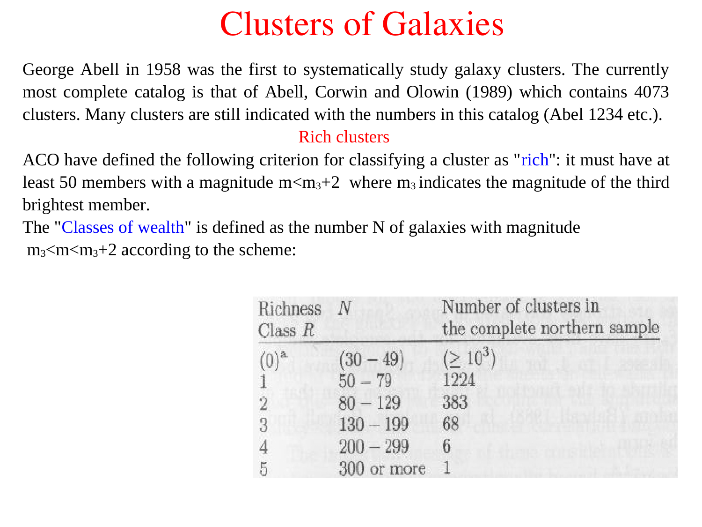
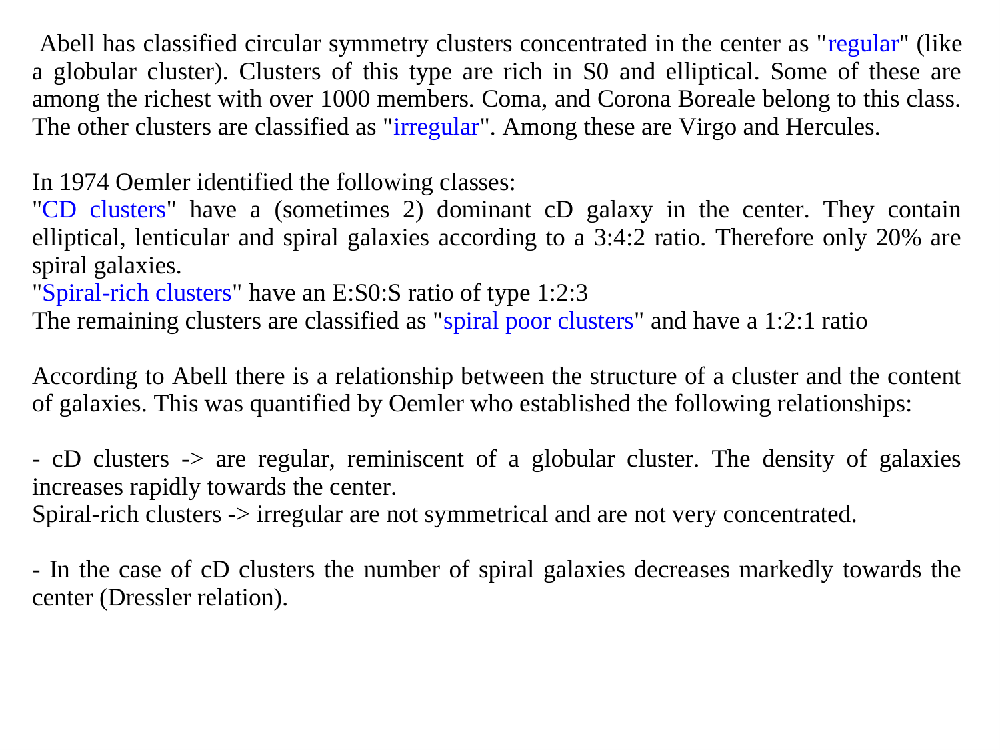
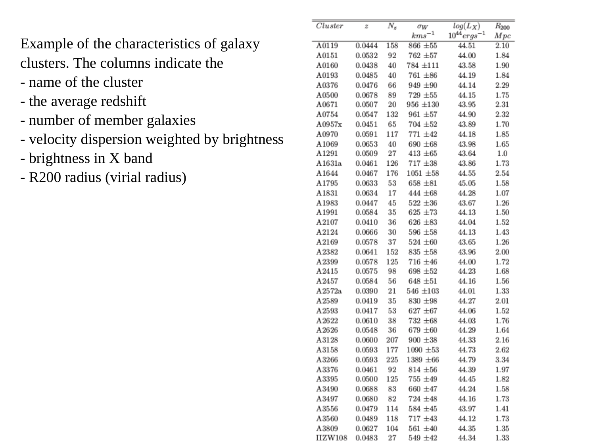
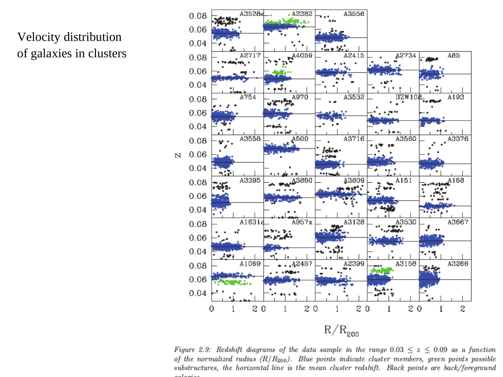
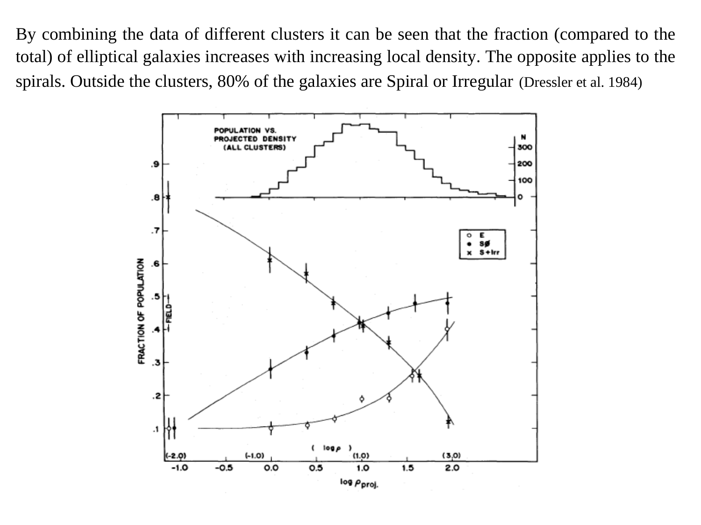
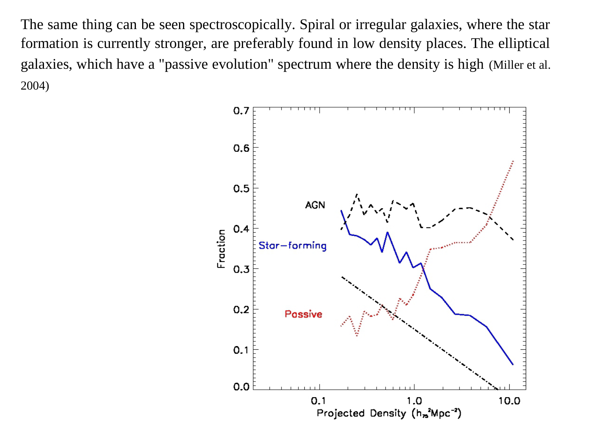
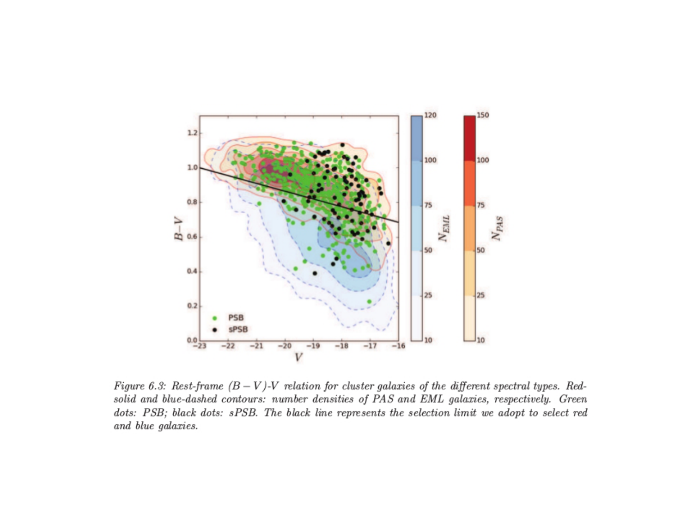
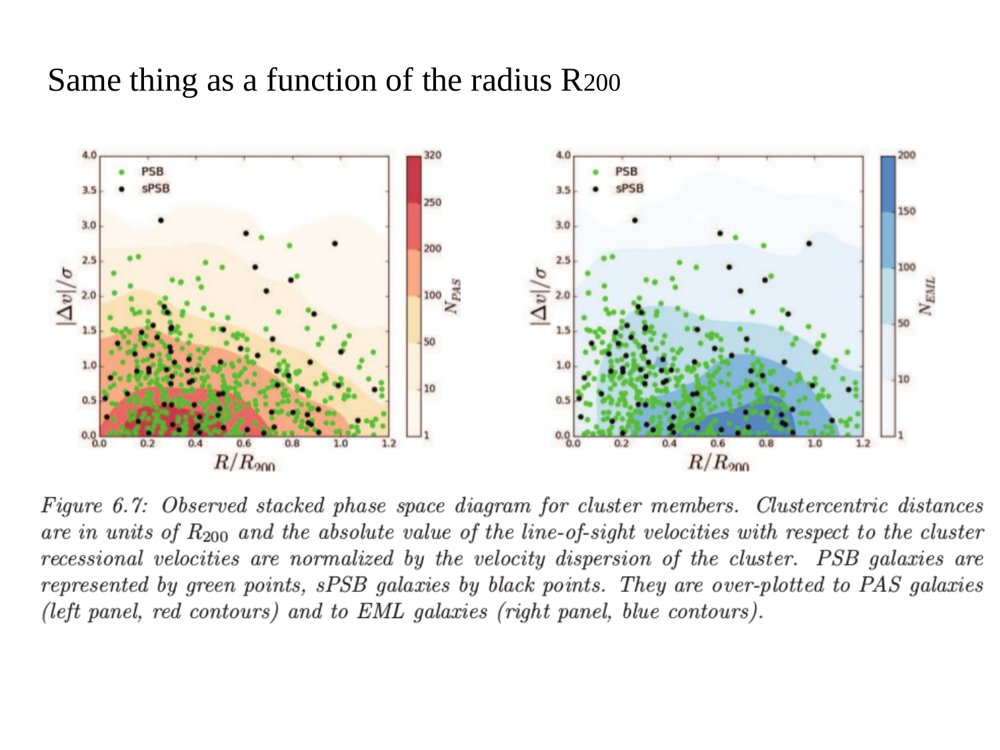
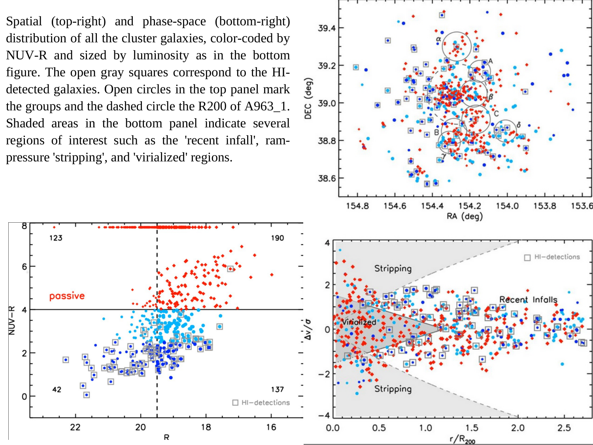


# coma cluster

up: [Astrophysics_of_Galaxies_MOC](../../04_Atlas/Astrophysics_of_Galaxies_MOC.html) · [Virgo cluster](./Virgo%20cluster.html)

## properties

The Coma Cluster (Abell 1656) is the archetype of a rich, regular, virialized galaxy cluster:

- **distance**: $d \approx 100$ Mpc ($z \approx 0.0231$).
- **total mass**: $M_{\rm vir} \approx (1 - 2) \times 10^{15} M_\odot$.
- **velocity dispersion**: $\sigma_v \approx 1000$ km/s.
- **morphology**: smooth, spherically symmetric, dominated by early-type galaxies (ellipticals and S0s).
- **two central cD giants**: NGC 4874 and NGC 4889 ($M_{\rm BH} \approx 2 \times 10^{10} M_\odot$).

## historical discovery of dark matter

In 1933, Fritz Zwicky applied the virial theorem to the observed line-of-sight velocity dispersion of Coma galaxies:

$$2\langle K \rangle + \langle U \rangle = 0 \implies M_{\rm dyn} \approx \frac{5 R_e \sigma_v^2}{G}$$

With $\sigma_v \sim 1000$ km/s and $R \sim 1.5$ Mpc, Zwicky found $M_{\rm dyn} \gg M_{\rm lum}$. The mass-to-light ratio was $M/L \sim 400 (M/L)_\odot$. Zwicky concluded that the cluster must be held together by "dunkle Materie" (dark matter), the first empirical discovery of dark matter in the universe.

## intracluster medium (icm)

Chandra and XMM-Newton observations reveal a pervasive hot gas halo:
- $T_{\rm ICM} \sim 8 \times 10^7$ K ($k_B T \sim 8$ keV).
- Bremsstrahlung X-ray luminosity $L_X \sim 10^{44}$ erg/s.
- Gas mass exceeds total stellar mass ($M_{\rm gas} \sim 5 - 6 \times M_{\rm stars}$).
- Total mass budget: $\sim 85\%$ dark matter, $\sim 13\%$ hot ICM gas, $\sim 2\%$ stars in galaxies.

## connections

- discovery context: [Dark matter on galactic scales](./Dark%20matter%20on%20galactic%20scales.html), [Bullet Cluster and dark matter mapping](./Bullet%20Cluster%20and%20dark%20matter%20mapping.html)
- cluster comparison: [Virgo cluster](./Virgo%20cluster.html)

---

## lecture slides and reference figures (Prof. Alessandro Pizzella)



  <h4 class="backlinks-title">Linked References (3)</h4>
  <ul class="backlinks-list">
    <li class="backlink-item-wrap"><a href="../../04_Atlas/Astrophysics_of_Galaxies_MOC.html" class="backlink-item">Astrophysics_of_Galaxies_MOC</a></li>
    <li class="backlink-item-wrap"><a href="./Bullet%20Cluster%20and%20dark%20matter%20mapping.html" class="backlink-item">Bullet Cluster and dark matter mapping</a></li>
    <li class="backlink-item-wrap"><a href="./Virgo%20cluster.html" class="backlink-item">Virgo cluster</a></li>
  </ul>

