the launch of the James Webb Space Telescope (JWST) in December 2021 transformed observational cosmology by pushing the observational horizon beyond $z > 10$ into the Cosmic Dawn ($< 400\text{ Myr}$ after the Big Bang).

## infrared sensitivity and spectral coverage

JWST's 6.5-meter beryllium primary mirror and instruments (NIRCam, NIRSpec, MIRI) provide unprecedented sensitivity from $0.6\text{ }\mu\text{m}$ to $28\text{ }\mu\text{m}$, observing optical and UV rest-frame emission shifted into the infrared by cosmic expansion ($1+z$):

$$\lambda_{\text{obs}} = \lambda_{\text{rest}} (1+z)$$

for a galaxy at $z = 14$, the rest-frame UV continuum at $1500\text{ \AA}$ is shifted to $\lambda_{\text{obs}} = 2.25\text{ }\mu\text{m}$ (NIRCam F200W filter), while H$\alpha$ shifts into the mid-infrared ($9.8\text{ }\mu\text{m}$, MIRI).

## the high-redshift overabundance puzzle

surveys such as JADES, CEERS, UNCOVER, and COSMOS-Web revealed an unexpected overabundance of UV-luminous galaxies at $z > 10$:
- **JADES-GS-z14-0**: spectroscopically confirmed at $z = 14.32$ (just $290\text{ Myr}$ after the Big Bang), with absolute magnitude $M_{\text{UV}} \approx -20.8$ and stellar mass $M_\star \sim 5 \times 10^8 M_\odot$.
- **JADES-GS-z14-1**: $z = 13.90$.
- **GLASS-z12**: $z = 12.11$.

under standard $\Lambda$CDM structure formation with standard star formation efficiency ($\epsilon_{\text{SF}} \sim 0.1$), the halo mass function at $z > 10$ was predicted to contain insufficient collapsed dark matter halos to produce such bright galaxies.

### proposed physical resolutions
1. **extreme star formation efficiency**: nearly $100\%$ of available gas converted into stars during stochastic, bursty formation episodes.
2. **top-heavy initial mass function (IMF)**: metal-free Population III stars yielding higher UV luminosity per unit stellar mass ($L_{\text{UV}} / M_\star$).
3. **dust-free geometry**: young systems have not yet synthesized or dispersed large dust columns, allowing unattenuated UV escape.

## little red dots (lrds)

JWST discovered a pervasive population of extremely compact, highly reddened objects at $z \sim 4 - 9$ termed "Little Red Dots":
- optical rest-frame emission is steep and red (indicating heavy dust attenuation or old stars).
- NIRSpec shows broad H$\alpha$ emission lines (FWHM $> 2000 - 4000\text{ km s}^{-1}$), indicating supermassive black holes accreting at or above the Eddington limit in low-mass hosts ($M_{\text{BH}} / M_\star \sim 1 - 10\%$ vs $0.1\%$ locally), challenging standard SMBH seed formation models.

## see also

- [Observational_Cosmology_MOC](../../04_Atlas/Observational_Cosmology_MOC.html)
- [Pablo_05_Galaxies_at_cosmological_distances](../../02_Literature/Lectures/Observational_Cosmology/Pablo_05_Galaxies_at_cosmological_distances.html)
- [High-redshift galaxy selection and Lyman break technique](High-redshift%20galaxy%20selection%20and%20Lyman%20break%20technique.html)
- [AGN taxonomy unified model and feedback](AGN%20taxonomy%20unified%20model%20and%20feedback.html)
- [Cosmic star formation history](Cosmic%20star%20formation%20history.html)

---

### Observational Cosmology Data Panels & Visual Evidence

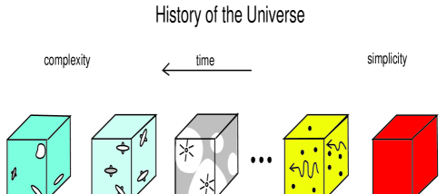
*Barkana & Loeb (2001) Figure 1: Cosmic timeline from recombination ($z \approx 1100$) through first stars ($z \sim 30$) to reionization completion ($z \sim 6$).*

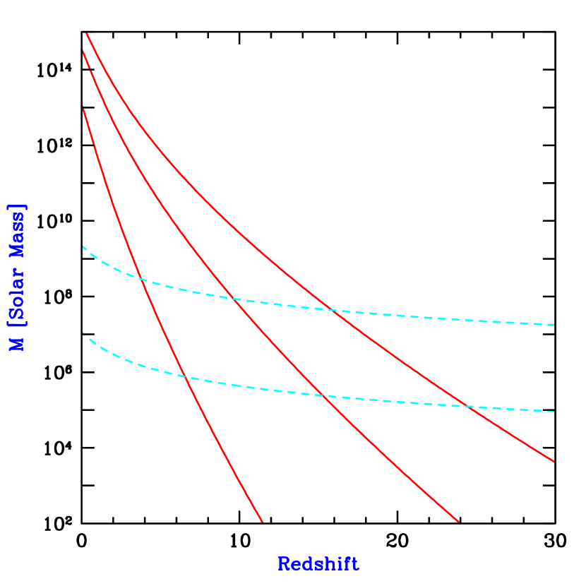
*Minimum dark matter halo mass $M_{\rm min}(z)$ required for gas collapse via molecular $H_2$ cooling vs atomic hydrogen cooling ($T_{\rm vir} = 10^4$ K).*

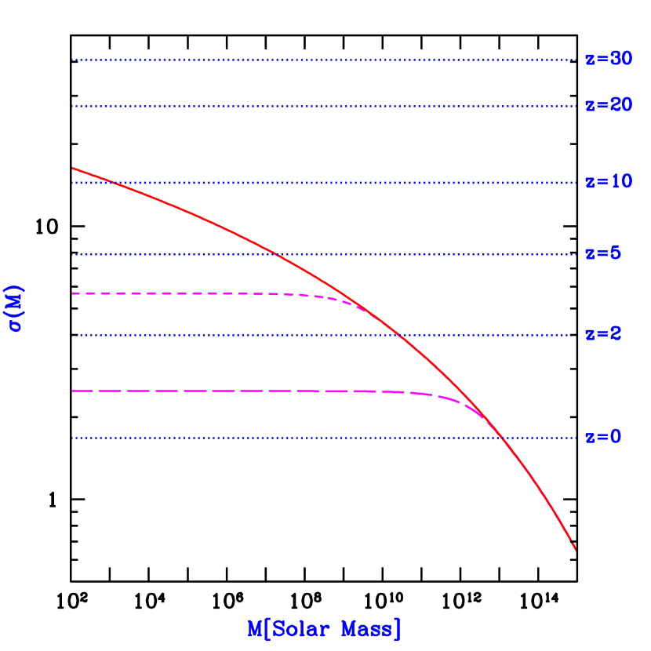
*Root-mean-square density fluctuation amplitude $\sigma(M)$ on mass scale $M$ and collapse threshold $\delta_c(z) = 1.686/D(z)$.*

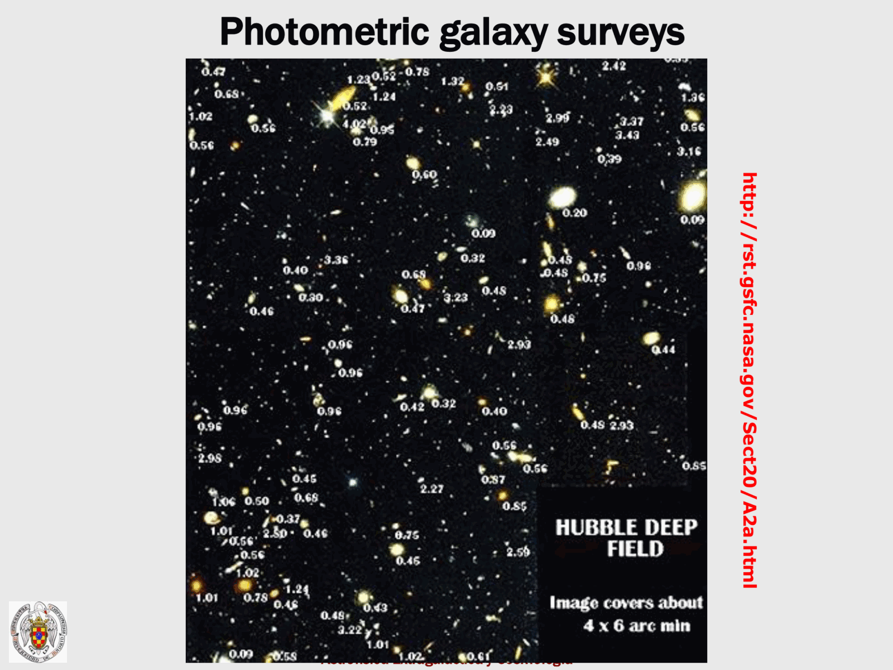
*High-z galaxies: Lyman-break dropout technique (U, B, V, z dropouts) and photometric redshift selection.*

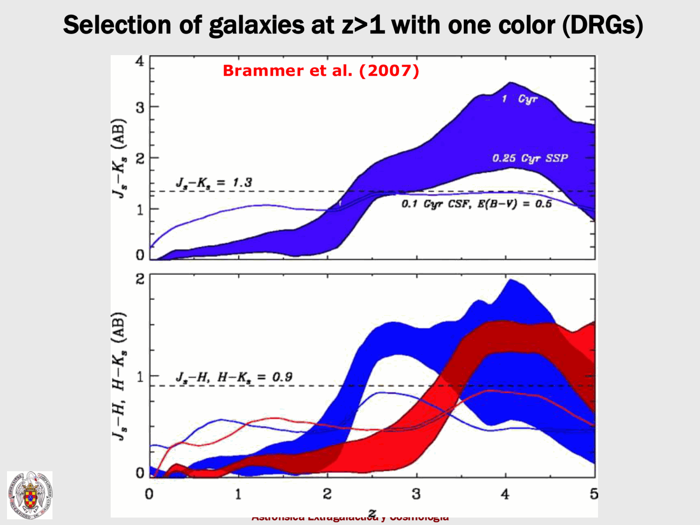
*UV luminosity function evolution at $z \sim 4-10$: steepening of faint-end slope $\alpha \approx -2$.*

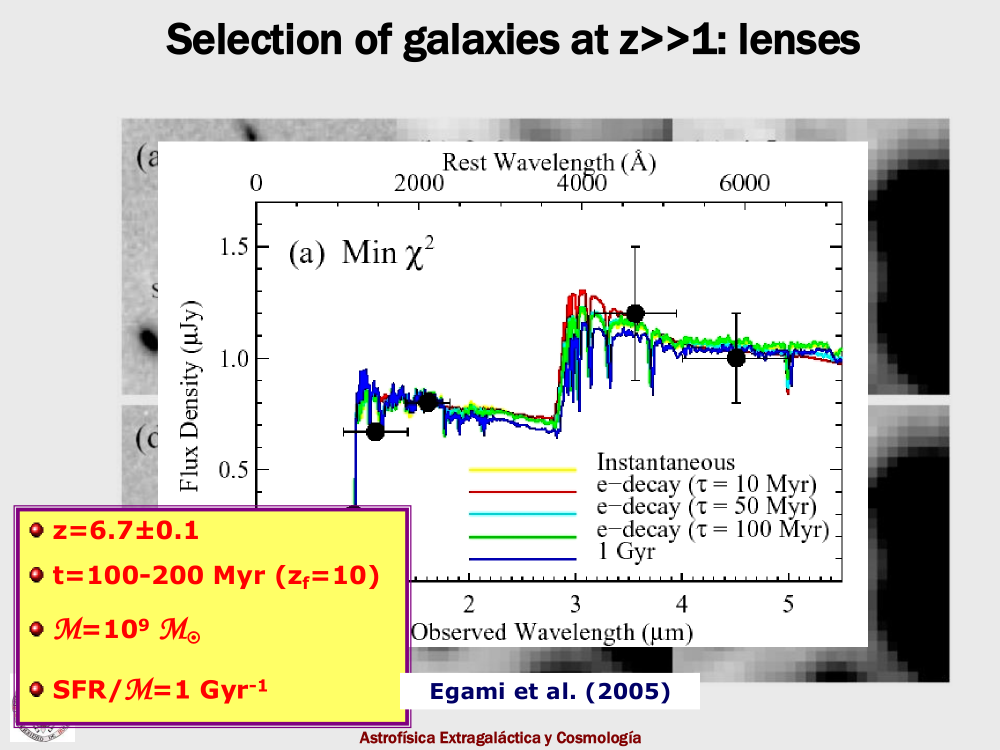
*JWST NIRCam deep fields (JADES, CEERS): overabundance of luminous galaxies at $z > 10$.*

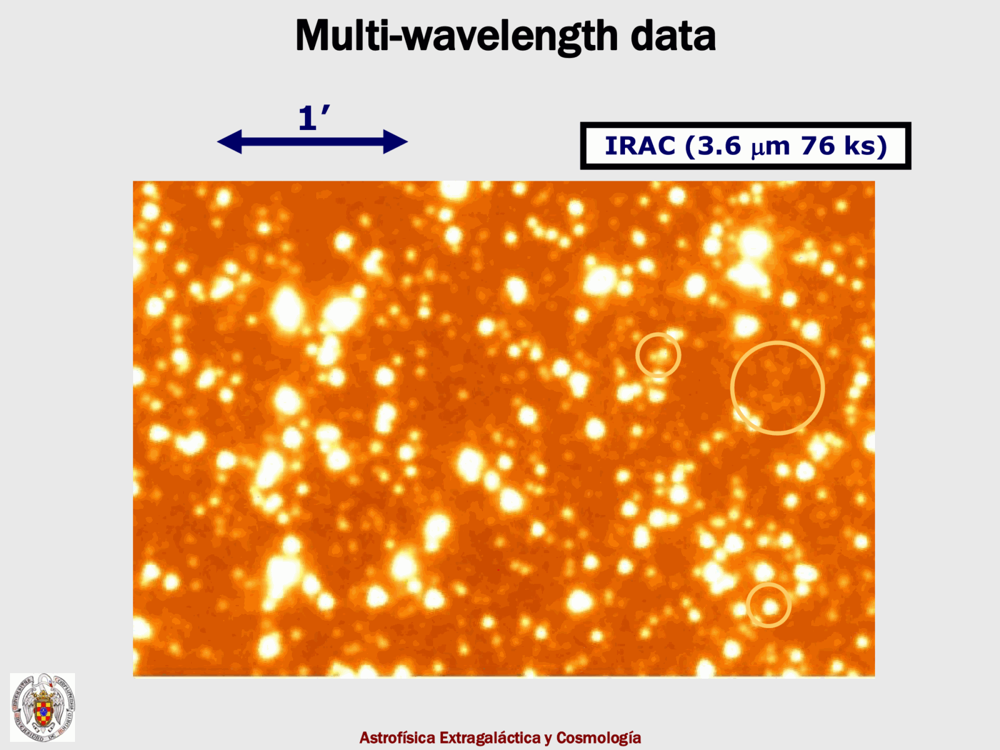
*Cosmic star formation rate density (Madau-Dickinson plot) out to $z \sim 12$.*

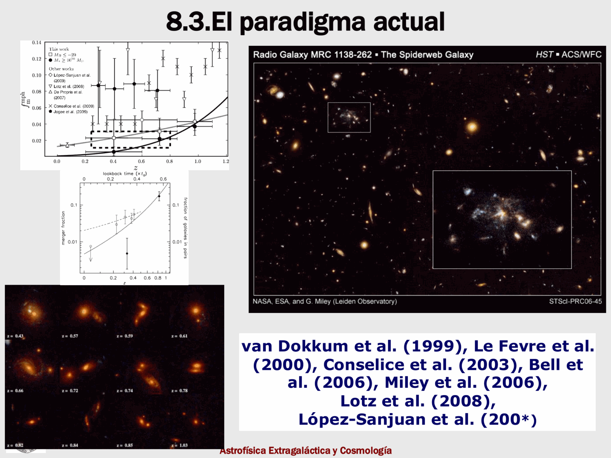
*Ionizing photon budget: escape fraction $f_{\rm esc}$ and clumping factor $C$ constraints for reionization.*

## JWST Deep Field Imaging and High-z Observational Results

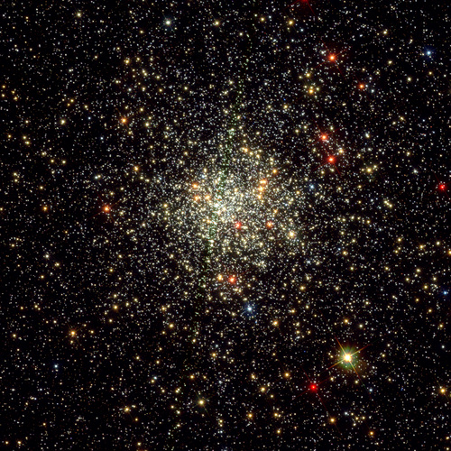
*Figure JWST-01: JWST NIRCam deep field observations identifying luminous Lyman-break candidate galaxies at $z > 10$.*

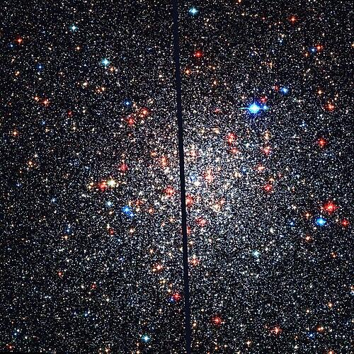
*Figure JWST-02: Lyman-break dropout selection technique utilizing NIRCam filter combinations to isolate high-redshift cosmic dawn candidates.*

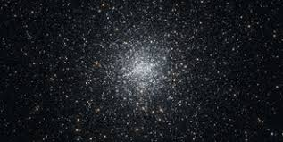
*Figure JWST-03: Compact rest-frame UV morphologies and Sérsic profile fitting for ultra-early galaxy candidates.*

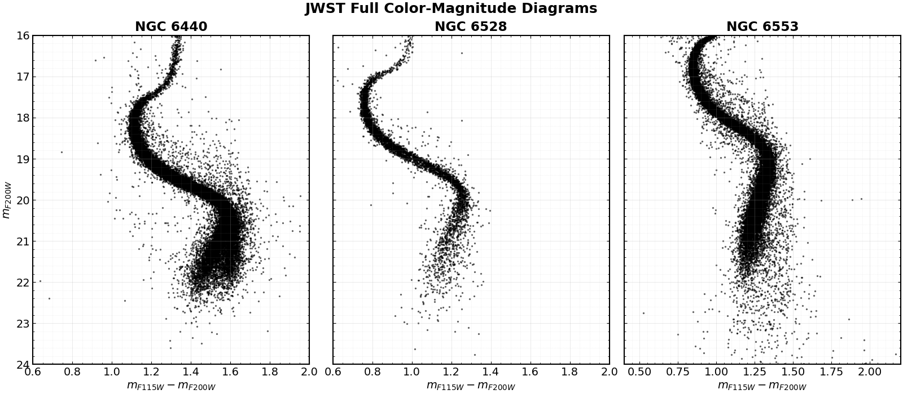
*Figure JWST-04: NIRSpec micro-shutter array spectroscopic confirmation revealing the sharp Ly$\alpha$ damping wing and rest-frame optical emission lines.*

  <h4 class="backlinks-title">Linked References (2)</h4>
  <ul class="backlinks-list">
    <li class="backlink-item-wrap"><a href="High-redshift%20galaxy%20selection%20and%20Lyman%20break%20technique.html" class="backlink-item">High-redshift galaxy selection and Lyman break technique</a></li>
    <li class="backlink-item-wrap"><a href="../../04_Atlas/Observational_Cosmology_MOC.html" class="backlink-item">Observational_Cosmology_MOC</a></li>
  </ul>

