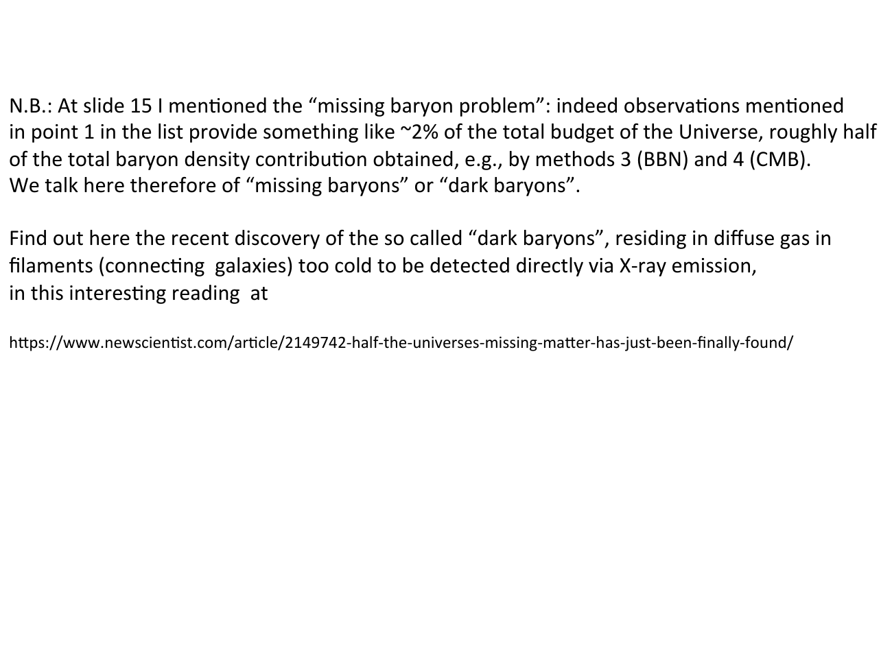

how do we *weigh* the baryons in the universe? four independent methods, with varying degrees of dependence on the matter-radiation interaction.

---

## the four methods

1. **observe baryons in stars and galaxies** via optical and X-ray emission. counts the photons; depends on understanding stellar populations, dust, ICM gas, etc.
2. **quasar absorption spectra**: light from distant quasars is absorbed by intervening hydrogen along the line of sight. the column density of neutral hydrogen depends on the baryon density.
3. **primordial nucleosynthesis**: the abundances of light nuclei depend strongly on the baryon-to-photon ratio $\eta$ (see [BBN_overview](BBN_overview.html)).
4. **CMB anisotropies**: the height of the acoustic peaks depends on $\Omega_b h^2$ (see [Cosmic_inventory_photons](Cosmic_inventory_photons.html)).

methods 3 and 4 are in **excellent agreement** with each other. method 1 historically gave a smaller number, leading to the **missing baryon problem** — about half the baryons were unaccounted for. recent work has located most of them in the **WHIM** (warm-hot intergalactic medium) in filaments connecting galaxies, too cold to emit X-rays brightly.

---

## the answer

from Planck 2018:
$$\boxed{\,\Omega_b h^2 = 0.0224 \pm 0.0001\,}$$

with $h \approx 0.674$, this gives $\Omega_b \approx 0.049$ — about 5% of the critical density.

baryon-to-photon ratio: $\eta = n_N/n_\gamma = 2.68 \times 10^{-8}\, (\Omega_b h^2) \approx 6 \times 10^{-10}$. roughly **one nucleon per billion photons**.

---

## why baryons leave fingerprints on the CMB acoustic peaks

before recombination, baryons and photons were tightly coupled in a single fluid with sound speed $c_s \sim c/\sqrt 3$. small perturbations propagated as acoustic waves with this characteristic speed. when photons free-streamed away at recombination, the baryons were left in standing patterns — the acoustic oscillations imprinted on the CMB sky.

the height of the first acoustic peak is set by the **baryon loading**:
- more baryons → heavier "fluid" → lower sound speed
- the compression peaks (the first, third, fifth) are *enhanced* by baryon loading
- the rarefaction peaks (the second, fourth) are *suppressed*

so reading the relative heights of the peaks gives $\Omega_b h^2$.

a low $\Omega_b h^2 \approx 0.02$ gives a moderate first peak; higher values pump up the first peak relative to the second. fitting the actual measured curve gives $\Omega_b h^2 = 0.0224$.

---

## missing baryon problem (sidebar)

direct observations (method 1: counting baryons in stars, galaxies, hot gas) historically yielded only $\sim 2\%$ of the total budget — about half of what BBN (method 3) and the CMB (method 4) demand. these were the **missing baryons** or **dark baryons**.

recent observations have located most of them in **diffuse gas in filaments** connecting galaxies, too cold to emit detectable X-rays directly. read the New Scientist article: [Half the universe's missing matter has just been finally found](https://www.newscientist.com/article/2149742-half-the-universes-missing-matter-has-just-been-finally-found/).
 

---

## see also

- [Fundamentals_Astrophysics_Cosmology_MOC](../../04_Atlas/Fundamentals_Astrophysics_Cosmology_MOC.html)
- [Cosmic_inventory_overview](Cosmic_inventory_overview.html)
- [BBN_overview](BBN_overview.html)
- [Cosmic_inventory_photons](Cosmic_inventory_photons.html)
- [Cosmic_inventory_dark_matter](Cosmic_inventory_dark_matter.html)

  <h4 class="backlinks-title">Linked References (13)</h4>
  <ul class="backlinks-list">
    <li class="backlink-item-wrap"><a href="BBN_baryon_to_photon_ratio.html" class="backlink-item">BBN_baryon_to_photon_ratio</a></li>
    <li class="backlink-item-wrap"><a href="BBN_concordance_with_CMB.html" class="backlink-item">BBN_concordance_with_CMB</a></li>
    <li class="backlink-item-wrap"><a href="BBN_observations.html" class="backlink-item">BBN_observations</a></li>
    <li class="backlink-item-wrap"><a href="BBN_overview.html" class="backlink-item">BBN_overview</a></li>
    <li class="backlink-item-wrap"><a href="Baryogenesis.html" class="backlink-item">Baryogenesis</a></li>
    <li class="backlink-item-wrap"><a href="CMB%20Spectral%20Distortions%20-%20What%20They%20Are%20and%20Where%20They%20Come%20From.html" class="backlink-item">CMB Spectral Distortions - What They Are and Where They Come From</a></li>
    <li class="backlink-item-wrap"><a href="Cosmic_inventory_dark_matter.html" class="backlink-item">Cosmic_inventory_dark_matter</a></li>
    <li class="backlink-item-wrap"><a href="Cosmic_inventory_overview.html" class="backlink-item">Cosmic_inventory_overview</a></li>
    <li class="backlink-item-wrap"><a href="Intergalactic%20medium.html" class="backlink-item">Intergalactic medium</a></li>
    <li class="backlink-item-wrap"><a href="Lyman-alpha%20forest.html" class="backlink-item">Lyman-alpha forest</a></li>
    <li class="backlink-item-wrap"><a href="Missing%20baryons.html" class="backlink-item">Missing baryons</a></li>
    <li class="backlink-item-wrap"><a href="Reionization.html" class="backlink-item">Reionization</a></li>
    <li class="backlink-item-wrap"><a href="../../04_Atlas/Fundamentals_Astrophysics_Cosmology_MOC.html" class="backlink-item">Fundamentals_Astrophysics_Cosmology_MOC</a></li>
  </ul>

