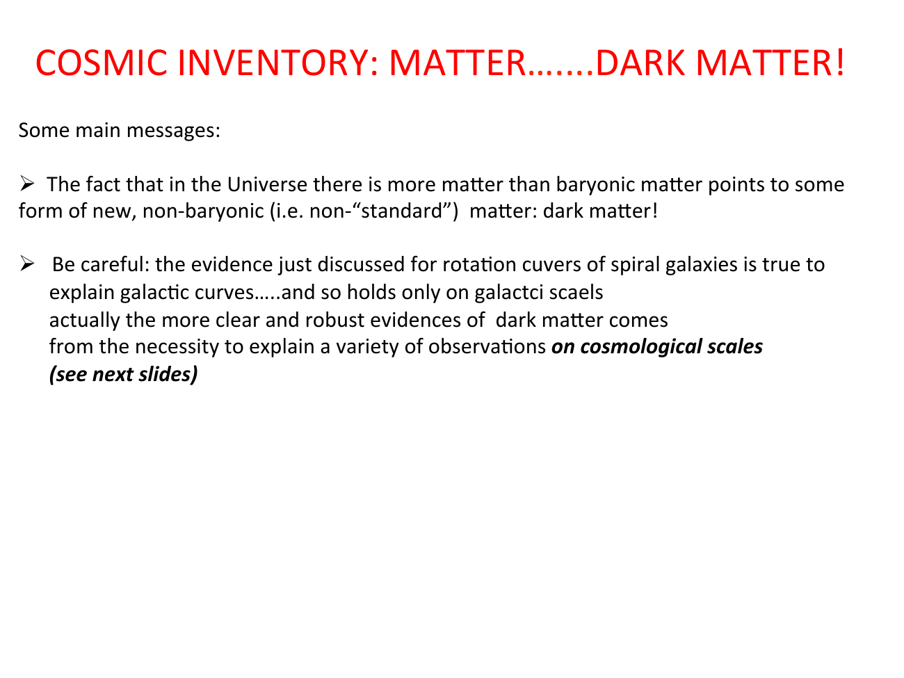

"matter" in cosmology means non-relativistic, pressureless stuff. the four baryon methods (see [Cosmic_inventory_baryons](Cosmic_inventory_baryons.html)) depend on photon-matter interaction; there are *other* methods that bypass photons entirely and exploit gravity:

> *typically one exploits the gravitational effects that matter determines, e.g. the gravitational field produced by a given system from which one infers the mass of the system.*

these methods consistently give a total matter density several times the baryon density. the difference is **dark matter**: non-relativistic, effectively pressureless, gravitationally interacting, but invisible to photons.

---

## the answer

from Planck 2018:
$$\boxed{\,\Omega_m = 0.315 \pm 0.007, \quad \Omega_{dm} h^2 = 0.120 \pm 0.001\,}$$

so the matter density is about **five times the baryon density**. *most of the matter in the universe is not baryons.* dark matter is some new particle species (or species).

---

## evidence on galactic scales — rotation curves

textbook argument. for a circular orbit at radius $r$ inside a spherical mass distribution $M(r)$:
$$V^2(r) = \frac{GM(r)}{r}$$

if all the mass is luminous and concentrated in a stellar disk, then beyond the disk edge $r_*$ the enclosed mass is constant and the velocity drops:
$$V(r) \propto \frac{1}{r^{1/2}} \qquad \text{(Keplerian fall-off)}$$

what we *observe* is completely different. neutral hydrogen (21-cm) observations probe rotation way past the optical disk, and the curves stay **flat**. flat $V(r)$ means $M(r) \propto r$, so there is mass distributed at large radii that does not emit light.

### measuring rotation curves

a galaxy is parametrized by its center, systemic velocity $V_{sys}$, circular velocity $V(R)$, inclination $i$, azimuth $\theta$:
$$V_{obs}(\xi, \eta) = V_{sys} + V(R)\cos\theta\sin i$$

velocities are measured from Doppler shifts of emission lines (one side blueshifted, one redshifted).

### historical surveys

Rubin & Ford (1970), Roberts & Whitehurst (1975), the entire Rubin sample of 21 Sc galaxies (1980) — all show: **no rotation curve follows the stellar disk velocity profile**.

### decomposing the rotation curve

modern analysis fits the observed $V(r)$ as the sum of three components: stellar disk + gas + dark matter halo.

the stellar disk peaks and falls off; the gas rises slowly; the dark matter halo dominates at large radius. without a halo the high-$r$ flat curve cannot be explained. (Corbelli & Salucci 2000 for M33.)

---

## evidence on cosmological scales

galactic rotation curves only give a *galaxy-scale* measurement. the more compelling evidence comes from cosmological scales:

1. **distribution of galaxies on large scales** — strongly dependent on $\Omega_m h$
2. **cosmic velocity fields** — peculiar motions trace the underlying gravitational potential
3. **measurements that depend on $\Omega_b/\Omega_m$**, like:
   - X-ray and Sunyaev-Zel'dovich measurements of cluster gas
   - **baryon acoustic oscillations** in the matter power spectrum (see [Matter power spectrum and BAO](Matter%20power%20spectrum%20and%20BAO.html))
4. **CMB temperature anisotropies and polarization** — the peak heights fix $\Omega_m h^2$

### CMB anisotropies fix the total matter

the relative heights of the second, third, fourth peaks fix $\Omega_m h^2$:

### mass-to-light ratio across scales

a direct check. $M/L_B$ vs scale: luminous matter tracks $L$, total mass tracks $M$. if $M/L$ stayed constant with scale, all matter would be luminous. it does not.

at galactic scales (spirals, ellipticals): $M/L \sim 10$ in solar units. at cluster scales (rich clusters, superclusters): $M/L \sim 200\text{–}300$, consistent with $\Omega_m \approx 0.3$. the rise tells you the dark matter fraction increases on larger scales.

### the BAO smoking gun

a universe of pure baryons would have huge oscillations in $P_m(k)$. our universe has small wiggles on top of a smooth dark-matter power-law. the data agree with the dark-matter-dominated prediction.

---

## the matter power spectrum

zoom out on $P_m(k)$:

the **turnover** at $k \sim 0.02\,h\,\text{Mpc}^{-1}$ corresponds to the **horizon size at matter-radiation equality** — directly sensitive to $\Omega_m h^2$. modes that entered the horizon during radiation domination did not grow (Meszaros effect); modes that entered later did. so the position of the turnover fixes the matter density.

→ see [Matter power spectrum and BAO](Matter%20power%20spectrum%20and%20BAO.html) for the full physics.

---

## what is dark matter made of?

unknown. candidates include:
- **WIMPs** (weakly interacting massive particles) at the electroweak scale, $m_{\rm DM} \sim 100$ GeV. attractive because thermal freeze-out of a weak-cross-section particle naturally gives $\Omega_{dm} h^2 \sim 0.1$ — the **WIMP miracle**, see Dark matter relics — WIMP miracle
- **axions** at very low mass ($\mu$eV), produced by misalignment in the early universe
- **sterile neutrinos** at keV scale
- **primordial black holes**

distinguishing **hot vs cold dark matter** by structure formation: see [Hot vs cold dark matter](Hot%20vs%20cold%20dark%20matter.html). observations strongly favor cold dark matter (CDM), the C in ΛCDM.

---

---

## see also

- [Fundamentals_Astrophysics_Cosmology_MOC](../../04_Atlas/Fundamentals_Astrophysics_Cosmology_MOC.html)
- [Cosmic_inventory_overview](Cosmic_inventory_overview.html)
- [Cosmic_inventory_baryons](Cosmic_inventory_baryons.html)
- [Matter power spectrum and BAO](Matter%20power%20spectrum%20and%20BAO.html)
- Dark matter relics — WIMP miracle
- [Hot vs cold dark matter](Hot%20vs%20cold%20dark%20matter.html)

  <h4 class="backlinks-title">Linked References (14)</h4>
  <ul class="backlinks-list">
    <li class="backlink-item-wrap"><a href="Cosmic_inventory_baryons.html" class="backlink-item">Cosmic_inventory_baryons</a></li>
    <li class="backlink-item-wrap"><a href="Cosmic_inventory_overview.html" class="backlink-item">Cosmic_inventory_overview</a></li>
    <li class="backlink-item-wrap"><a href="Dark%20matter%20on%20galactic%20scales.html" class="backlink-item">Dark matter on galactic scales</a></li>
    <li class="backlink-item-wrap"><a href="Dark%20matter%20relics%20-%20WIMP%20miracle.html" class="backlink-item">Dark matter relics - WIMP miracle</a></li>
    <li class="backlink-item-wrap"><a href="Gravitational%20lensing%20-%20intro.html" class="backlink-item">Gravitational lensing - intro</a></li>
    <li class="backlink-item-wrap"><a href="Hot%20vs%20cold%20dark%20matter.html" class="backlink-item">Hot vs cold dark matter</a></li>
    <li class="backlink-item-wrap"><a href="Lambda%20CDM%20current%20parameters.html" class="backlink-item">Lambda CDM current parameters</a></li>
    <li class="backlink-item-wrap"><a href="Lensing%20as%20a%20cosmological%20probe.html" class="backlink-item">Lensing as a cosmological probe</a></li>
    <li class="backlink-item-wrap"><a href="MOND.html" class="backlink-item">MOND</a></li>
    <li class="backlink-item-wrap"><a href="N-body%20simulations.html" class="backlink-item">N-body simulations</a></li>
    <li class="backlink-item-wrap"><a href="Peculiar%20velocities%20of%20galaxies%20and%20structures.html" class="backlink-item">Peculiar velocities of galaxies and structures</a></li>
    <li class="backlink-item-wrap"><a href="Press-Schechter%20halo%20mass%20function.html" class="backlink-item">Press-Schechter halo mass function</a></li>
    <li class="backlink-item-wrap"><a href="Strong%20vs%20weak%20lensing.html" class="backlink-item">Strong vs weak lensing</a></li>
    <li class="backlink-item-wrap"><a href="../../04_Atlas/Fundamentals_Astrophysics_Cosmology_MOC.html" class="backlink-item">Fundamentals_Astrophysics_Cosmology_MOC</a></li>
  </ul>

