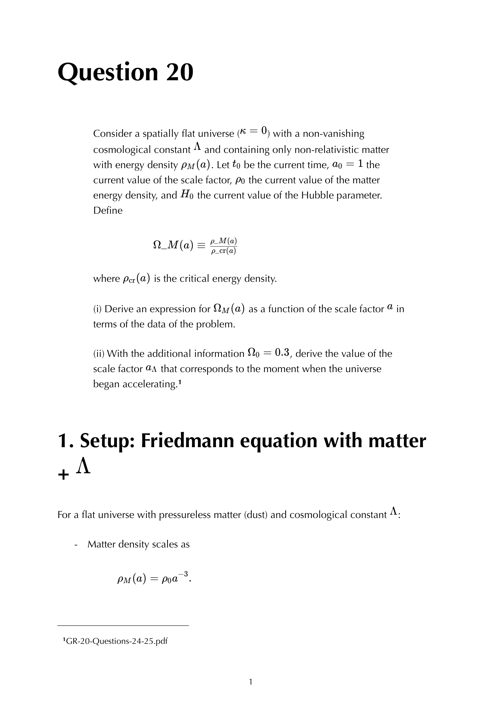

the **cosmological constant** $\Lambda$ is the only other tensor combination consistent with Einstein's equation, by the same logic that fixed Einstein's equation in the first place. originally introduced by Einstein for static cosmologies, then "the biggest blunder," then resurrected by 1998 supernova observations.

## the equation with $\Lambda$

$$G_{\mu\nu} + \Lambda g_{\mu\nu} = 8\pi G T_{\mu\nu}$$

equivalently, moving $\Lambda$ to the right side as a stress-energy contribution:
$$G_{\mu\nu} = 8\pi G(T_{\mu\nu} + T^\Lambda_{\mu\nu})$$

with:
$$T^\Lambda_{\mu\nu} = -\frac{\Lambda}{8\pi G}g_{\mu\nu}$$

## as vacuum energy

interpret $\Lambda$ as a fluid:
$$\rho_\Lambda = \frac{\Lambda}{8\pi G}, \qquad p_\Lambda = -\rho_\Lambda$$

properties:
- **constant density**: $\rho_\Lambda$ doesn't dilute with expansion. unlike matter ($a^{-3}$) or radiation ($a^{-4}$).
- **negative pressure**: $w = -1$. the equation of state of vacuum energy.
- **drives accelerated expansion**: from the acceleration equation $\ddot a/a = -(4\pi G/3)(\rho + 3p)$, $\Lambda$ contributes $-(4\pi G/3)(\rho_\Lambda - 3\rho_\Lambda) = +(8\pi G/3)\rho_\Lambda$, positive (accelerating).

## why $\Lambda$ is "natural"

the cosmological constant is the only **conserved tensor** built from $g_{\mu\nu}$ (without derivatives) that can sit on the LHS of Einstein's equation. it has $\nabla^\mu(\Lambda g_{\mu\nu}) = \Lambda\nabla^\mu g_{\mu\nu} = 0$ trivially.

so any consistent generalisation of Einstein's equation has at most:
$$\alpha R_{\mu\nu} + \beta g_{\mu\nu} R + \gamma g_{\mu\nu} = \kappa T_{\mu\nu}$$

with the constraint that the LHS be conserved. Bianchi forces $\alpha = -2\beta$, leaving one combination ($G_{\mu\nu}$) plus the $\Lambda$ piece. **two free parameters**: $G$ and $\Lambda$.

## historical arc

- **1917**: Einstein adds $\Lambda$ to allow a static cosmological model. the universe is supposed to be eternal.
- **1922-1929**: Friedmann + Lemaître + Hubble show the universe is expanding. Einstein retracts: "biggest blunder."
- **1980s-1990s**: $\Lambda$ enters again as **dark energy** in cosmological perturbation theory, but with no observational support.
- **1998**: Perlmutter, Riess, Schmidt's **SN Ia Hubble diagram** shows accelerated expansion. requires $\Omega_\Lambda \approx 0.7$.
- **2003 onward**: WMAP and Planck CMB confirm $\Omega_\Lambda \approx 0.685$ to $\sim 1\%$ precision. $\Lambda$CDM standard.

## the value

$$\Omega_\Lambda \approx 0.685, \qquad \rho_\Lambda \approx 6 \times 10^{-30}\,\text{g/cm}^3$$
$$\Lambda \approx 1.1 \times 10^{-52}\,\text{m}^{-2}$$

a **tiny** number compared to natural Planck-scale quantities. the **cosmological constant problem** is to explain why $\Lambda$ is $\sim 10^{120}$ times smaller than naive QFT estimates (Planck-energy quantum vacuum energy).

## the consequence: dark energy

$\Lambda$ contributes $\sim 68\%$ of the total energy budget of the universe today. drives accelerated expansion ($\ddot a > 0$). makes the universe ever-expanding; eventually, structures other than gravitationally bound systems (Local Group, etc.) are pushed beyond the cosmological horizon.

implications for the future:
- **expansion accelerates** indefinitely.
- **cosmological horizon** approaches a finite size $\sim 1/\sqrt{\Lambda} \sim 10$ Gpc.
- **cosmological observers** become ever more isolated.

## quintessence and dynamical dark energy

alternative: $\Lambda$ is **not** a constant but a slowly-varying scalar field $\phi$ with $w_\phi(z)$ depending on time. observational tests via SN Ia + BAO + CMB constrain $w_0, w_a$. current data: consistent with $w = -1$ (constant $\Lambda$) but with $\sim 10\%$ uncertainty on $w_0$ and $\sim 30\%$ on $w_a$.

DESI 2024-2025 BAO + SN combinations hint at $w \ne -1$, possibly evolving. an active area of research.

## see also

- [Einstein equations](Einstein%20equations.html)
- [Einstein tensor and Bianchi](Einstein%20tensor%20and%20Bianchi.html)
- [Stress-energy tensor](Stress-energy%20tensor.html)
- [Friedmann equations](Friedmann%20equations.html)
- [Cosmic_inventory_dark_energy](Cosmic_inventory_dark_energy.html)
- [Cosmic_inventory_overview](Cosmic_inventory_overview.html)
- [Type Ia supernovae as standard candles](Type%20Ia%20supernovae%20as%20standard%20candles.html)
- [Equation of state and density scaling](Equation%20of%20state%20and%20density%20scaling.html)
- [General_Relativity_MOC](../../04_Atlas/General_Relativity_MOC.html)
- [Ch 7 - Cosmology](../../02_Literature/Book/Baumann%20GR/Ch%207%20-%20Cosmology.html)

---

### General Relativity Mathematical & Oral Defense Panel

*Question 20 Oral Exam Model Solution: Exact analytic integration of the flat $\Lambda$CDM Friedmann equation with non-relativistic matter and cosmological constant, scale factor evolution $a(t) = \left(\frac{\Omega_m}{\Omega_\Lambda}\right)^{1/3} \sinh^{2/3}\left(\frac{3}{2}\sqrt{\Omega_\Lambda} H_0 t\right)$, and age of the universe $t_0 = \frac{2}{3H_0\sqrt{\Omega_\Lambda}}\operatorname{arcsinh}\left(\sqrt{\frac{\Omega_\Lambda}{\Omega_m}}\right)$.*

  <h4 class="backlinks-title">Linked References (15)</h4>
  <ul class="backlinks-list">
    <li class="backlink-item-wrap"><a href="Continuity%20equation.html" class="backlink-item">Continuity equation</a></li>
    <li class="backlink-item-wrap"><a href="Cosmic%20eras.html" class="backlink-item">Cosmic eras</a></li>
    <li class="backlink-item-wrap"><a href="Curvature-dynamics%20relation.html" class="backlink-item">Curvature-dynamics relation</a></li>
    <li class="backlink-item-wrap"><a href="Deceleration%20parameter.html" class="backlink-item">Deceleration parameter</a></li>
    <li class="backlink-item-wrap"><a href="Density%20parameters.html" class="backlink-item">Density parameters</a></li>
    <li class="backlink-item-wrap"><a href="Einstein%20equations.html" class="backlink-item">Einstein equations</a></li>
    <li class="backlink-item-wrap"><a href="Equation%20of%20state%20and%20density%20scaling.html" class="backlink-item">Equation of state and density scaling</a></li>
    <li class="backlink-item-wrap"><a href="Friedmann%20equations.html" class="backlink-item">Friedmann equations</a></li>
    <li class="backlink-item-wrap"><a href="Friedmann%20solutions.html" class="backlink-item">Friedmann solutions</a></li>
    <li class="backlink-item-wrap"><a href="GR%20Friedmann%20with%20Lambda.html" class="backlink-item">GR Friedmann with Lambda</a></li>
    <li class="backlink-item-wrap"><a href="Lambda%20CDM%20current%20parameters.html" class="backlink-item">Lambda CDM current parameters</a></li>
    <li class="backlink-item-wrap"><a href="Sectional%20and%20Gaussian%20curvature.html" class="backlink-item">Sectional and Gaussian curvature</a></li>
    <li class="backlink-item-wrap"><a href="Stress-energy%20tensor.html" class="backlink-item">Stress-energy tensor</a></li>
    <li class="backlink-item-wrap"><a href="Various%20models%20of%20the%20universe.html" class="backlink-item">Various models of the universe</a></li>
    <li class="backlink-item-wrap"><a href="../../04_Atlas/General_Relativity_MOC.html" class="backlink-item">General_Relativity_MOC</a></li>
  </ul>

