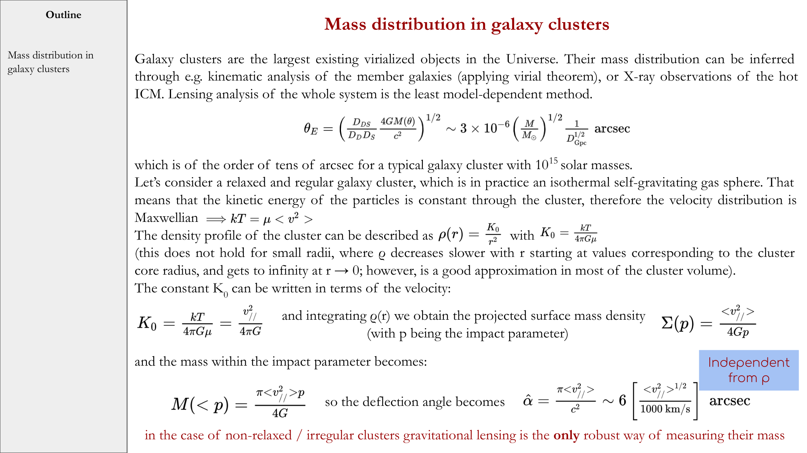
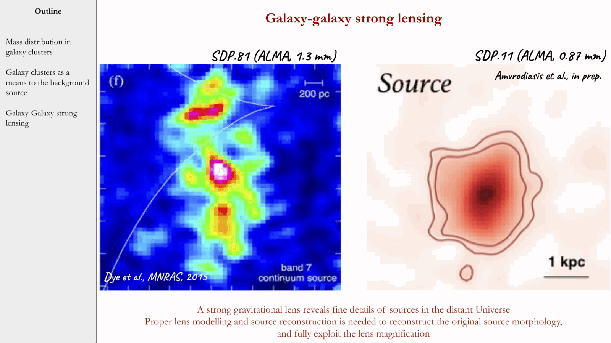
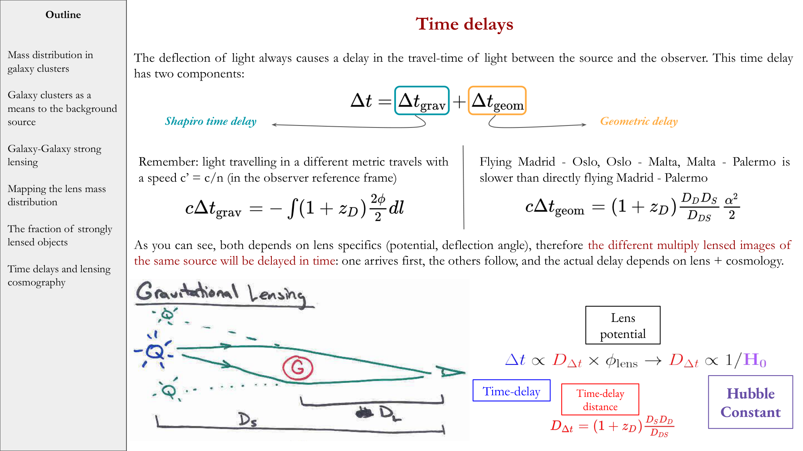
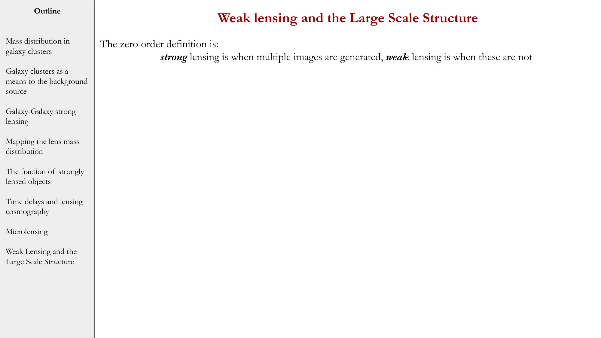


in the early universe, small density perturbations evolved according to **gravitational instability** in an expanding background. their **linear growth** is the core of cosmological perturbation theory + the basis for predicting CMB anisotropies + LSS today.

## the perturbed fluid

write the cosmic density as $\rho(\vec x, t) = \bar\rho(t)[1 + \delta(\vec x, t)]$ with $\delta$ the **density contrast**. in the linear regime $|\delta| \ll 1$, evolution follows linear ODEs.

multiple fluids (photons, baryons, dark matter, neutrinos) couple via gravity + radiation pressure (for charged species).

## the linear evolution

key linear equations:
- **continuity**: $\dot\delta = -\theta + 3\dot\Phi$ ($\theta$ = velocity divergence, $\Phi$ = gravitational potential).
- **Euler**: $\dot\theta = -H\theta + \nabla^2 \Phi/a^2 - \nabla^2 P/(\rho a^2)$ (with $P$ pressure).
- **Poisson** (in expanding background): $\nabla^2\Phi/a^2 = 4\pi G\bar\rho\,\delta$.

closure: equation of state $P = w\rho$ + entropy generation specifies the fluid.

## the species

different cosmic species evolve differently:

### dark matter
collisionless, pressureless ($w = 0$). evolves only by gravity. perturbations grow as:
- **radiation era**: $\delta_{\rm DM} \propto \log a$ (Meszaros effect).
- **matter era**: $\delta_{\rm DM} \propto a$.

### baryons
coupled to photons via Compton scattering until decoupling ($z \sim 1100$). before decoupling: oscillate as photon-baryon fluid (acoustic oscillations).

after decoupling: baryons fall into pre-existing dark-matter potentials. baryon perturbations rapidly catch up with DM.

### photons
$w = 1/3$, pressure-supported. perturbations propagate as **sound waves** in the photon-baryon fluid before decoupling. after decoupling: free-stream.

### neutrinos
free-streaming after $z \sim 10^{10}$. damp small-scale perturbations.

## the regimes

### super-horizon ($\lambda > c/H$)
gravity-dominated, no pressure response (causality). perturbations grow following gauge-invariant equations.

### sub-horizon, radiation era
pressure dominates, growth suppressed. dark-matter perturbations grow logarithmically.

### sub-horizon, matter era
gravity dominates, growth as $\delta \propto a$. structures form.

## the Meszaros effect

before matter-radiation equality, radiation pressure prevents matter perturbations from growing efficiently. result: scales that entered the horizon during the radiation era are **suppressed** relative to scales that entered after.

this gives a **break in the matter power spectrum** at the equality scale $k_{\rm eq}$. observable in galaxy surveys.

## the transfer function

start with primordial inflationary spectrum $P_{\rm prim}(k) \propto k^{n_s - 1}$ (slightly tilted $n_s = 0.965$). multiply by a **transfer function** $T^2(k)$ encoding evolution:
$$P(k, z) = P_{\rm prim}(k)\,T^2(k)\,D^2(z)$$

with $D(z)$ the linear growth factor. $T(k)$:
- $T \approx 1$ for $k < k_{\rm eq}$ (matter-era growth, undamped).
- $T \propto k^{-2}$ for $k > k_{\rm eq}$ (radiation-era suppression).

$P(k)$ peaks at $k_{\rm eq} \sim 0.01\,h\,$Mpc$^{-1}$. observed in SDSS, BOSS, eBOSS, DESI.

## the BAO + acoustic peaks

before recombination, the photon-baryon fluid oscillates. the sound horizon at recombination $r_s \sim 150$ Mpc imprints:
- the **CMB acoustic peaks**.
- a **bump** in the matter correlation function at $r_s$, the **BAO**.

both observed, both consistent with $\Lambda$CDM.

## the non-linear regime

once $\delta \gtrsim 1$, the linear theory breaks down. perturbations collapse into halos via **spherical collapse** (when $\delta_c = 1.686$ at the linear level) + go non-linear. structure formation continues hierarchically.

see [Spherical collapse](./Spherical%20collapse.html) + [Press-Schechter halo mass function](./Press-Schechter%20halo%20mass%20function.html) + [N-body simulations](./N-body%20simulations.html).

## see also

- [Linear evolution of perturbations in expanding universe](./Linear%20evolution%20of%20perturbations%20in%20expanding%20universe.html)
- [Linear vs nonlinear regime](./Linear%20vs%20nonlinear%20regime.html)
- [Jeans analysis in expanding universe](./Jeans%20analysis%20in%20expanding%20universe.html)
- [Growth factor D(z)](./Growth%20factor%20D%28z%29.html)
- [Spherical collapse](./Spherical%20collapse.html)
- [Press-Schechter halo mass function](./Press-Schechter%20halo%20mass%20function.html)
- [Matter power spectrum and BAO](./Matter%20power%20spectrum%20and%20BAO.html)
- [CMB power spectrum](./CMB%20power%20spectrum.html)
- [Matter radiation equality](./Matter%20radiation%20equality.html)
- [Inflation overview](./Inflation%20overview.html)
- [N-body simulations](./N-body%20simulations.html)
- [Observational_Cosmology_MOC](../../04_Atlas/Observational_Cosmology_MOC.html)

---

### Observational Cosmology Data Panels & Visual Evidence

*Relativistic perturbation gauge choices: Synchronous gauge vs Conformal Newtonian (longitudinal) gauge.*

*Bardeen gauge-invariant potentials $\Phi$ and $\Psi$, and Einstein field equations for scalar perturbations.*

*Transfer function $T(k)$: suppression of small-scale power $k > k_{\rm eq}$ by $(k/k_{\rm eq})^{-2}$.*

*Non-linear collapse: spherical top-hat model, turnaround at $\delta_{\rm lin} = 1.06$, virialization at $\Delta_{\rm vir} \approx 178$.*


  <h4 class="backlinks-title">Linked References (3)</h4>
  <ul class="backlinks-list">
    <li class="backlink-item-wrap"><a href="./Linear%20vs%20nonlinear%20regime.html" class="backlink-item">Linear vs nonlinear regime</a></li>
    <li class="backlink-item-wrap"><a href="../../04_Atlas/Observational_Cosmology_MOC.html" class="backlink-item">Observational_Cosmology_MOC</a></li>
    <li class="backlink-item-wrap"><a href="./Perturbations%20in%20an%20expanding%20universe.html" class="backlink-item">Perturbations in an expanding universe</a></li>
  </ul>

