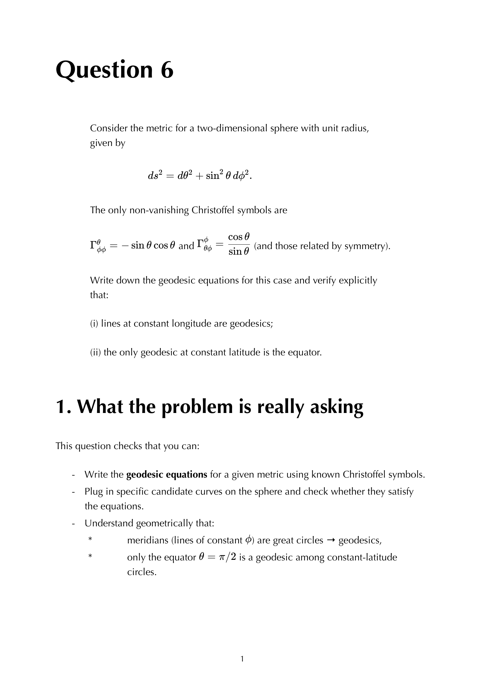
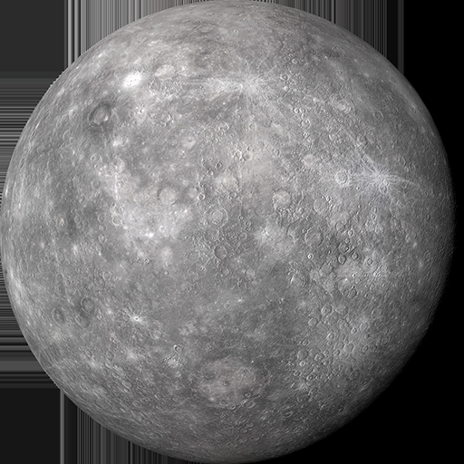


in $n$ dimensions, the Riemann tensor has independent components:
$$\boxed{\, \frac{n^2(n^2 - 1)}{12} \,}$$

a quick reference for the cases that matter:

| dimension $n$ | components |
|---|---|
| 1 | 0 (no curvature in 1D) |
| 2 | 1 |
| 3 | 6 |
| 4 | 20 |
| 5 | 50 |

## the derivation

Riemann $R_{\rho\sigma\mu\nu}$ has 4 indices, so naively $n^4$ components. apply the symmetries:

1. **antisym in $(\rho, \sigma)$**: $\binom{n}{2} = n(n-1)/2$ independent values for the first pair.
2. **antisym in $(\mu, \nu)$**: same, for the second pair.
3. **pair exchange symmetry $R_{\rho\sigma\mu\nu} = R_{\mu\nu\rho\sigma}$**: combines the two pairs into a symmetric pair, giving $\binom{n(n-1)/2 + 1}{2}$ components.
4. **first Bianchi**: subtract the $\binom{n}{4}$ cyclic constraints.

doing the algebra:
$$\frac{1}{2}\binom{n(n-1)/2}{2}\!\left[\binom{n(n-1)/2}{2} + 1\right] - \binom{n}{4} = \frac{n^2(n^2 - 1)}{12}$$

## physical interpretation per dimension

### $n = 1$: no curvature
a 1D manifold is just a curve; you can always parameterise it by arc length. no intrinsic curvature.

### $n = 2$: one component
just **one independent component**: the **Gaussian curvature** $K$. for the 2-sphere, $K = 1/R^2$. for the plane, $K = 0$. for a hyperbolic surface, $K < 0$.

so 2D geometry is characterised by a single function $K(x, y)$ on the manifold.

### $n = 3$: six components
the **three-dimensional Riemann tensor is fully determined by the Ricci tensor**. in 3D, Riemann = Ricci's content. the Weyl tensor (the trace-free part) **vanishes identically in 3D**.

physical consequence: in 3D vacuum ($T_{\mu\nu} = 0$), Einstein's equation $R_{\mu\nu} = 0$ forces Riemann = 0, so spacetime is flat. **3D gravity has no degrees of freedom in vacuum**: no gravitons, no waves. only nontrivial in the presence of matter.

### $n = 4$: twenty components
the dimension of physical spacetime. here Ricci has 10 components (symmetric $4\times 4$), and Weyl tensor has the remaining $10 = 20 - 10$.

vacuum ($T = 0$) Einstein's equation $R_{\mu\nu} = 0$ kills 10 components but leaves Weyl free. so vacuum gravitational fields exist: **gravitational waves are the Weyl tensor propagating**. 4D gravity has 2 propagating polarisations (in the TT gauge), reflecting Weyl's structure.

### $n \ge 5$
Ricci has $\binom{n}{2} + n = n(n+1)/2$ components, Weyl has the rest. higher-dimensional gravity (like in string theory) has more polarisations.

## the Ricci/Weyl decomposition

in 4D:
$$R_{\rho\sigma\mu\nu} = \underbrace{C_{\rho\sigma\mu\nu}}_{\text{Weyl, 10}} + \underbrace{(\text{Ricci traces})}_{\text{Ricci, 10}}$$

with Weyl trace-free: $C^\mu{}_{\sigma\mu\nu} = 0$. Weyl carries the "vacuum" gravitational degrees of freedom (the GW); Ricci carries the matter-coupled part.

## see also

- [Riemann tensor](./Riemann%20tensor.html)
- [Riemann tensor symmetries](./Riemann%20tensor%20symmetries.html)
- [Ricci tensor and scalar](./Ricci%20tensor%20and%20scalar.html)
- [Sectional and Gaussian curvature](./Sectional%20and%20Gaussian%20curvature.html)
- [General_Relativity_MOC](../../04_Atlas/General_Relativity_MOC.html)
- [Ch 4 - Spacetime Curvature](../../02_Literature/Book/Baumann%20GR/Ch%204%20-%20Spacetime%20Curvature.html)

---

### General Relativity Mathematical & Oral Defense Panel

*Question 6 Oral Exam Model Solution: 2-sphere metric $ds^2 = d\theta^2 + \sin^2\theta d\phi^2$, non-vanishing Christoffel symbols, Ricci tensor $R_{\theta\theta}=1, R_{\phi\phi}=\sin^2\theta$, and constant Ricci scalar $R=2/a^2$.*

*Cambridge Lecture Diagram: Parallel transport along a closed loop on a 2-sphere and the geometric deficit angle measuring integrated Gaussian curvature.*


  <h4 class="backlinks-title">Linked References (6)</h4>
  <ul class="backlinks-list">
    <li class="backlink-item-wrap"><a href="../../02_Literature/Book/Baumann%20GR/Ch%204%20-%20Spacetime%20Curvature.html" class="backlink-item">Ch 4 - Spacetime Curvature</a></li>
    <li class="backlink-item-wrap"><a href="../../04_Atlas/General_Relativity_MOC.html" class="backlink-item">General_Relativity_MOC</a></li>
    <li class="backlink-item-wrap"><a href="./Ricci%20tensor%20and%20scalar.html" class="backlink-item">Ricci tensor and scalar</a></li>
    <li class="backlink-item-wrap"><a href="./Riemann%20tensor.html" class="backlink-item">Riemann tensor</a></li>
    <li class="backlink-item-wrap"><a href="./Riemann%20tensor%20symmetries.html" class="backlink-item">Riemann tensor symmetries</a></li>
    <li class="backlink-item-wrap"><a href="./Sectional%20and%20Gaussian%20curvature.html" class="backlink-item">Sectional and Gaussian curvature</a></li>
  </ul>

