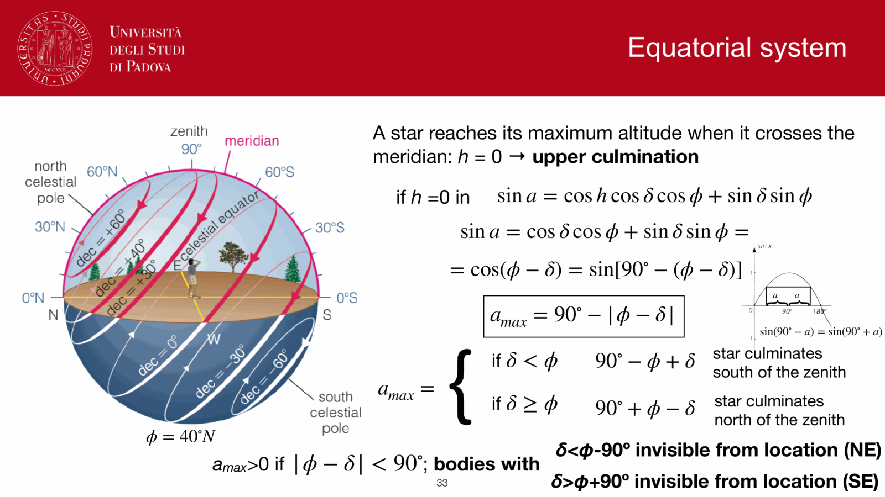
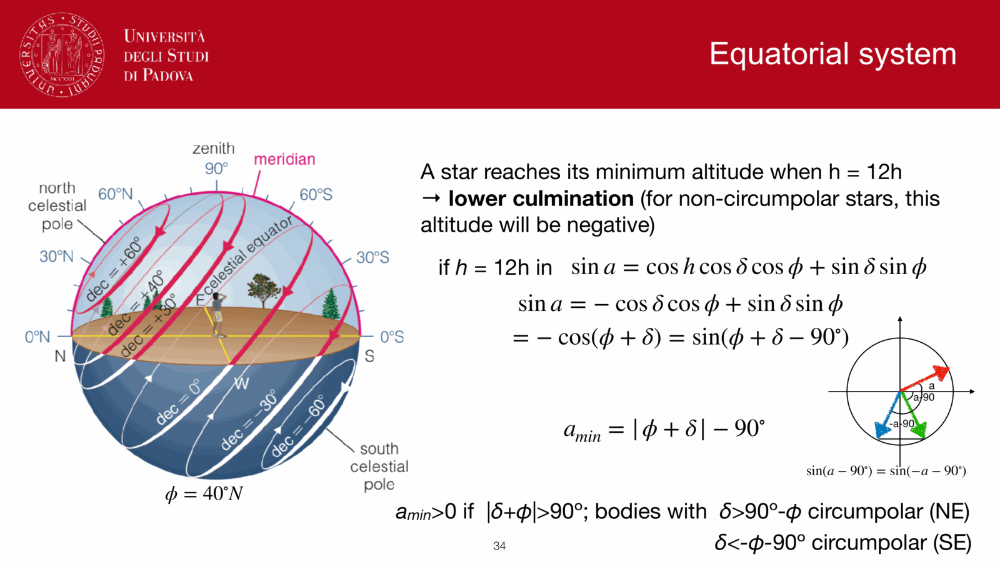
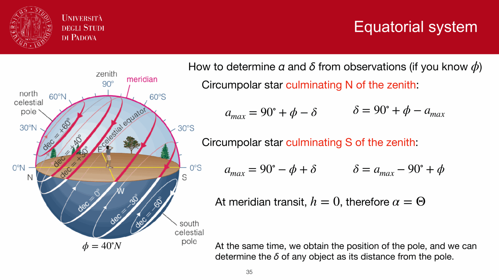
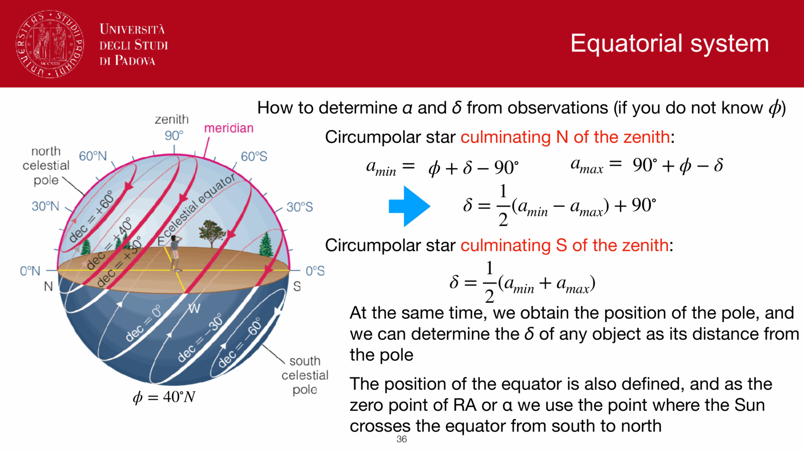
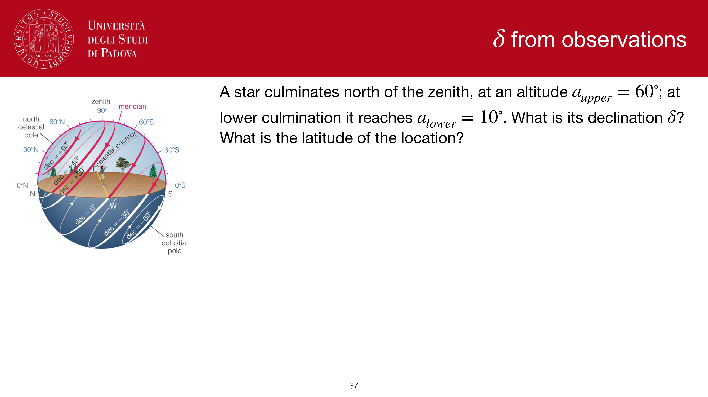
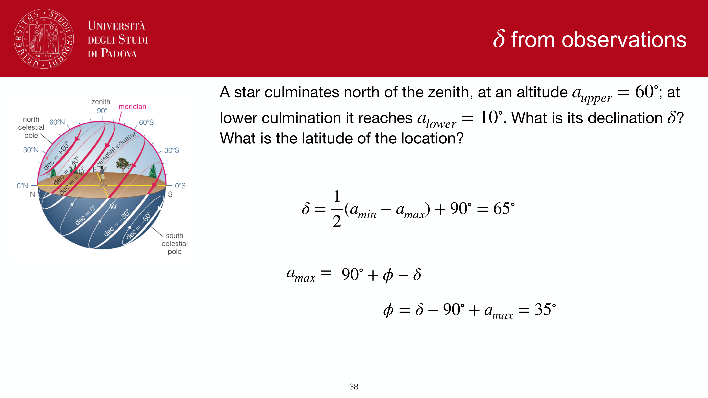
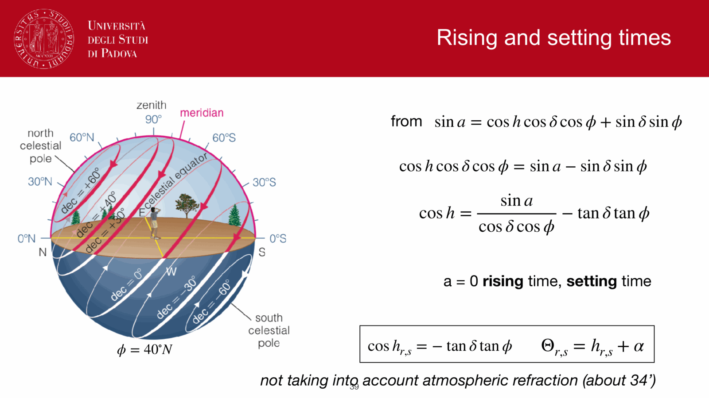
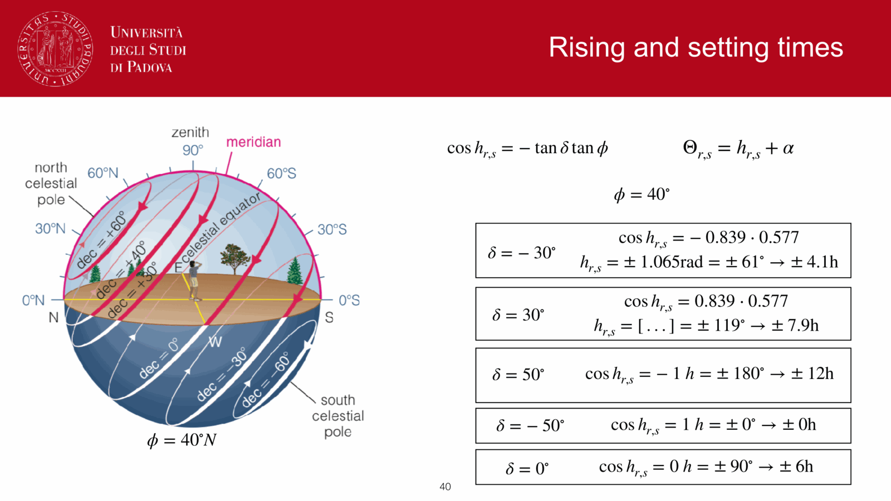

two extreme moments in a star's daily path:
- **upper culmination**: the highest point, when the star crosses the meridian moving south-to-north (or just due south, depending on hemisphere). $h = 0$.
- **lower culmination** (anti-culmination): the lowest point, $h = 12$ h. for non-circumpolar stars this is below the horizon.

and the boundary moments:
- **rise** and **set**: when the star crosses the horizon, $a = 0$.

all three follow from the third equation of equatorial → alt-az:
$$\sin a = \cos h\cos\delta\cos\phi + \sin\delta\sin\phi$$

---

## upper culmination ($h = 0$)

setting $h = 0$:
$$\sin a = \cos\delta\cos\phi + \sin\delta\sin\phi = \cos(\phi - \delta) = \sin(90° - \phi + \delta)$$

equivalently $= \cos(\delta - \phi) = \sin(90° - \delta + \phi)$.

so:
$$a_{\max} = \begin{cases} 90° - \phi + \delta & \text{star culminates south of zenith} \\ 90° + \phi - \delta & \text{star culminates north of zenith} \end{cases}$$

condition for the star to be visible at all: $a_{\max} > 0$, i.e.
$$\delta > \phi - 90°$$

stars with $\delta < \phi - 90°$ are **never visible** from latitude $\phi$.

---

## lower culmination ($h = 12$ h, $\cos h = -1$)

substituting $\cos h = -1$:
$$\sin a = -\cos\delta\cos\phi + \sin\delta\sin\phi = -\cos(\phi + \delta) = \sin(\phi + \delta - 90°)$$

equivalently $= -\cos(-\phi - \delta) = \sin(-\phi - \delta - 90°)$.

so:
$$a_{\min} = \begin{cases} \phi + \delta - 90° & \text{anti-culmination north of zenith} \\ -\phi - \delta - 90° & \text{anti-culmination south of zenith} \end{cases}$$

condition for the star to be **circumpolar** (i.e. anti-culmination still above the horizon): $a_{\min} > 0$, which gives
$$\delta + \phi > 90°$$

---

## determining $\alpha$ and $\delta$ from observations

for a circumpolar star culminating *north* of the zenith:
$$a_{\min} = \phi + \delta - 90°, \qquad a_{\max} = 90° + \phi - \delta$$

solving:
$$\delta = \tfrac12 (a_{\min} - a_{\max}) + 90°, \qquad \phi = \tfrac12 (a_{\min} + a_{\max})$$

for a circumpolar star culminating *south* of the zenith:
$$\delta = \tfrac12 (a_{\min} + a_{\max})$$

once you have the latitude and the position of the celestial pole pinned down this way, the celestial equator is fixed, and you can take **the point where the Sun crosses the equator from south to north** as the zero of right ascension. this is where the $\gamma$ point comes from operationally.

---

## rise and set ($a = 0$)

setting $a = 0$ in the third equation:
$$0 = \cos h_{s,t}\cos\delta\cos\phi + \sin\delta\sin\phi$$
$$\Rightarrow \boxed{\,\cos h_{s,t} = -\tan\delta\tan\phi\,}$$

the local sidereal time at rise/set follows from $\Theta_{s,t} = h_{s,t} + \alpha$. the star is above the horizon for $2 \lvert h_{s,t}\rvert$ hours.

note: this calculation **does not include atmospheric refraction**, which lifts apparent positions of objects near the horizon by about $34'$. this means the Sun rises a few minutes earlier and sets a few minutes later than the geometric formula predicts. for precise sunrise/sunset times you need to subtract that.

---

## worked examples (Padova, $\phi = 40°$ N)

a quick set of cases to feel out the formula:

- $\delta = -30°$:
$$\cos h = -(-0.577)(0.839) = 0.484$$
wait — let me recompute. $\tan(-30°) = -0.577$, $\tan(40°) = 0.839$. $\cos h = -(-0.577)(0.839) = +0.484$. $h = \pm 61° = \pm 4.07$ h. star above horizon $\sim 8.13$ h.

- $\delta = +30°$:
$\cos h = -(0.577)(0.839) = -0.484$. $h = \pm 119° = \pm 7.93$ h. star above horizon $\sim 15.87$ h.

- $\delta = +50°$:
$\cos h = -(1.192)(0.839) = -1.00$. $h = 180° = 12$ h — the star is **on the boundary of circumpolarity** ($\delta + \phi = 90°$).

- $\delta = -50°$:
$\cos h = -(-1.192)(0.839) = +1.00$. $h = 0$ h — the star is **never visible** ($\delta < \phi - 90°$).

- $\delta = 0°$:
$\cos h = 0$, $h = \pm 90° = \pm 6$ h. star above horizon for exactly 12 h, rises exactly E, sets exactly W.

---

## see also

- [Fundamentals_Astrophysics_Cosmology_MOC](../../04_Atlas/Fundamentals_Astrophysics_Cosmology_MOC.html)
- [Spherical_astronomy_complete](Spherical_astronomy_complete.html)
- [Equatorial system](Equatorial%20system.html)
- [Alt-azimuth ↔ equatorial transformations](Alt-azimuth%20%E2%86%94%20equatorial%20transformations.html)

---

## observational astrophysics course slides (Prof. Paolo Cassata)

*Upper culmination / transit across local meridian.*

*Culmination altitude formula: $a = 90^\circ - \lvert\phi - \delta\rvert$.*

*Lower culmination below the celestial pole.*

*Circumpolar star condition: $\delta > 90^\circ - \phi$.*

*Never-rising star condition: delta < phi - 90 deg.*

*Rise and set conditions: altitude a = 0.*

*Hour angle at rise/set: cos h_rs = - tan delta tan phi.*

*Duration of visibility above the mathematical horizon.*

  <h4 class="backlinks-title">Linked References (2)</h4>
  <ul class="backlinks-list">
    <li class="backlink-item-wrap"><a href="../../04_Atlas/Fundamentals_Astrophysics_Cosmology_MOC.html" class="backlink-item">Fundamentals_Astrophysics_Cosmology_MOC</a></li>
    <li class="backlink-item-wrap"><a href="../../04_Atlas/Observational_Astrophysics_MOC.html" class="backlink-item">Observational_Astrophysics_MOC</a></li>
  </ul>

