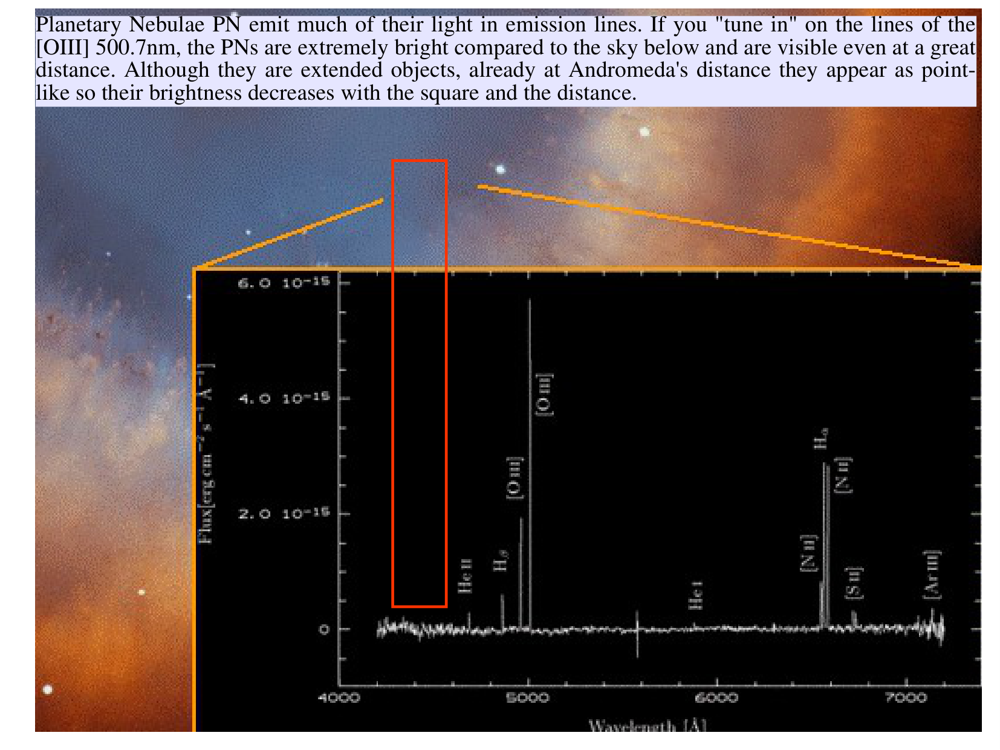
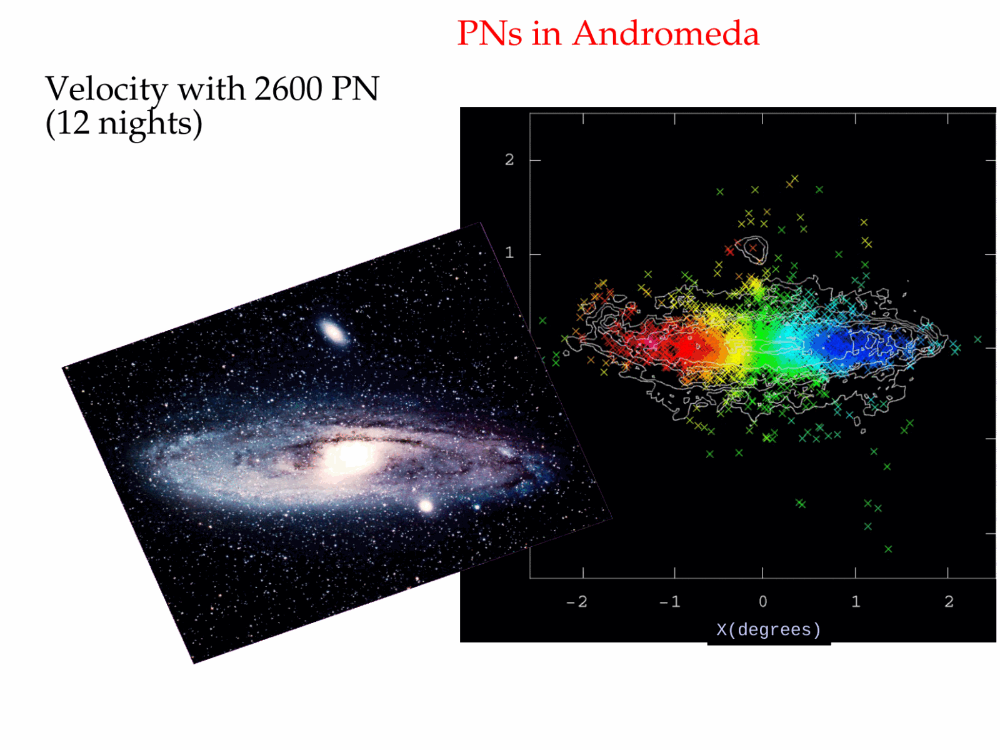
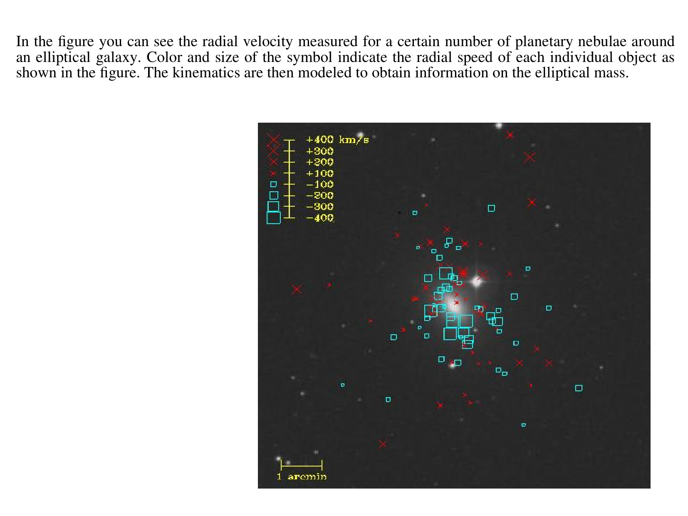
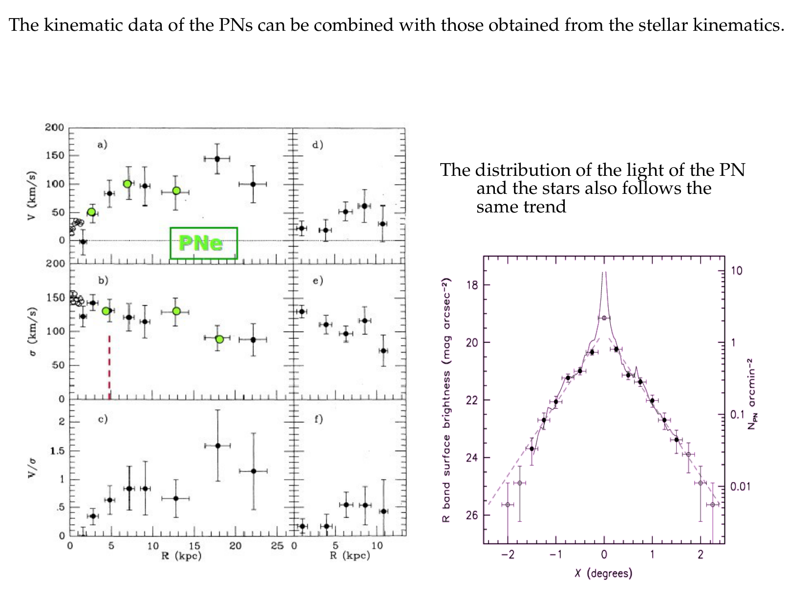
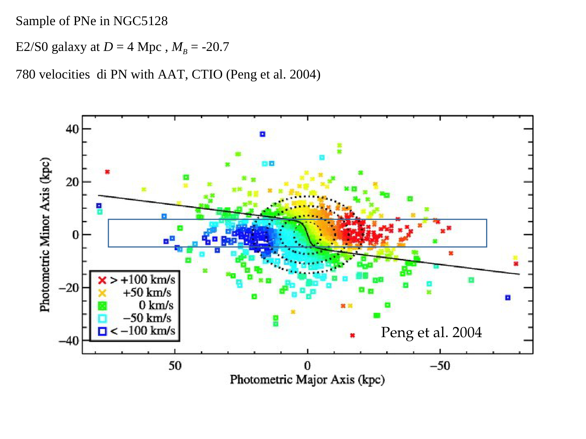
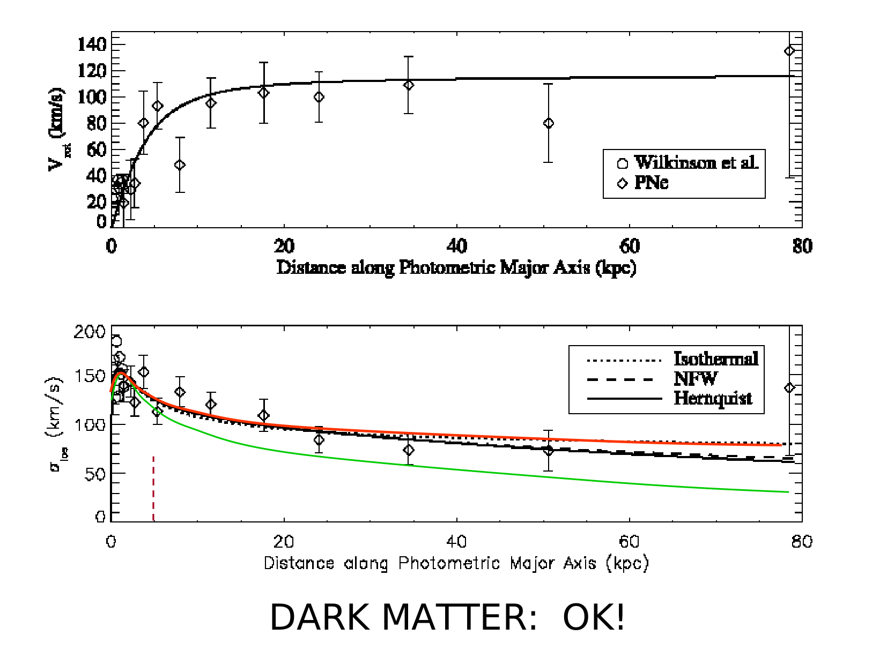
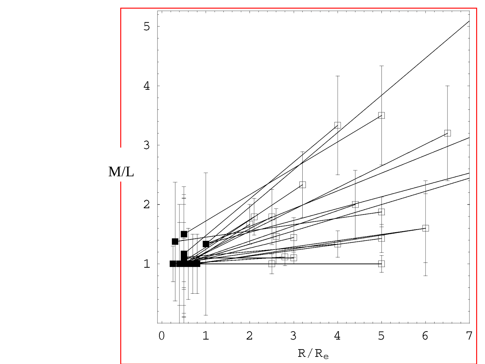
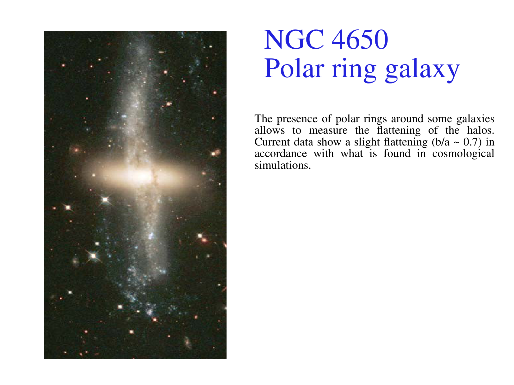

# Dark Matter in Dwarf Galaxies

Parent [Astrophysics_of_Galaxies_MOC](../../04_Atlas/Astrophysics_of_Galaxies_MOC.html) · [Dark matter rotation curves](Dark%20matter%20rotation%20curves.html) · [Local Group galaxies](Local%20Group%20galaxies.html)

## 1. Astrophysical Overview and Physical Significance

Dwarf galaxies are the most dark matter dominated stellar systems identified in the cosmos. Because their baryonic content (stars and gas) contributes a negligible fraction to their total gravitational potential, they provide pristine astrophysical laboratories for probing the nature of dark matter on sub-kiloparsec scales.

### Morphological Classification of Dwarf Galaxies

1. Dwarf Irregulars (dIrr)
   - Gas-rich, active star formation, rotationally supported or mixed support.
   - Neutral hydrogen (H I) extends well beyond the stellar disk, providing extended rotation curves.
   - Mass-to-light ratio - Total $M/L_V \sim 10 - 50 \, M_\odot / L_\odot$.
   - Representative examples - Small Magellanic Cloud, NGC 6822, IC 1613.

2. Classical Dwarf Spheroidals (dSph)
   - Gas-poor, devoid of recent star formation, pressure-supported by random stellar velocities ($\sigma_v \sim 6 - 12 \text{ km s}^{-1}$).
   - Low central surface brightness ($\mu_V \gtrsim 22 - 26 \text{ mag arcsec}^{-2}$).
   - Mass-to-light ratio - Total $M/L_V \sim 10 - 100 \, M_\odot / L_\odot$.
   - Representative examples - Fornax, Sculptor, Draco, Ursa Minor, Carina, Sextans.

3. Ultra-Faint Dwarf Galaxies (UFD)
   - Discovered in modern digital sky surveys (SDSS, DES, Pan-STARRS, Vera Rubin LSST).
   - Extremely faint ($M_V \gtrsim -7$, down to $M_V \approx -1.5$, corresponding to luminosities of barely $\sim 10^3 \, L_\odot$, fainter than a single red supergiant star).
   - Dispersion-supported ($\sigma_v \sim 2 - 5 \text{ km s}^{-1}$, half-light radii $R_e \sim 20 - 100 \text{ pc}$).
   - Mass-to-light ratio - Enormous values reaching $M/L_V \sim 1000 - 10000 \, M_\odot / L_\odot$.
   - Representative examples - Segue 1, Bootes I, Willman 1, Reticulum II.

## 2. Mathematical Derivation of the Wolf Mass Estimator

In dwarf spheroidal and ultra-faint galaxies, dark matter mass cannot be measured from circular rotation because they lack cold gas disks. Instead, kinematics are obtained by measuring the line-of-sight radial velocities of individual resolved stars using multi-object spectrographs (such as VLT/FLAMES and Keck/DEIMOS).

### The Spherical Jeans Equation and the Anisotropy Dilemma

Under spherical symmetry and steady-state equilibrium, the radial Jeans equation governs the stellar tracer population $\nu(r)$ embedded in the gravitational potential of the dark matter halo $M(r)$
$$\frac{d}{dr}\left(\nu \sigma_r^2\right) + \frac{2\beta(r)}{r} \nu \sigma_r^2 = -\frac{G \nu(r) M(r)}{r^2}$$
where $\beta(r) = 1 - \sigma_t^2 / \sigma_r^2$ is the velocity anisotropy.

In principle, the mass profile $M(r)$ is degenerate with the unknown anisotropy profile $\beta(r)$. However, Walker et al. (2009) and Wolf et al. (2010) proved mathematically that at a specific characteristic radius, the mass enclosed is virtually independent of orbital anisotropy.

### Proof of the Anisotropy-Independent Radius

Let us express the projected line-of-sight velocity dispersion $\sigma_{\text{LOS}}(R)$ integrated over the whole galaxy. The luminosity-weighted global velocity dispersion $\langle \sigma_{\text{LOS}}^2 \rangle$ is defined as
$$\langle \sigma_{\text{LOS}}^2 \rangle = \frac{\int_0^\infty 2\pi R \, I(R) \, \sigma_{\text{LOS}}^2(R) \, dR}{\int_0^\infty 2\pi R \, I(R) \, dR}$$

Substituting the line-of-sight projection integral into the numerator and transforming coordinates from projected radius $R$ to 3D spherical radius $r = \sqrt{R^2 + z^2}$ gives
$$\int_0^\infty 2\pi R \, I(R) \sigma_{\text{LOS}}^2(R) dR = \frac{4\pi}{3} \int_0^\infty \nu(r) \left[ \sigma_r^2(r) + 2\sigma_t^2(r) \right] r^2 dr$$

Recalling that $2\sigma_t^2 = 2(1 - \beta)\sigma_r^2$, the term in brackets becomes $(3 - 2\beta)\sigma_r^2$.

Now, let us multiply the radial Jeans equation by $r^3$ and integrate over all radii from $r = 0$ to $\infty$
$$\int_0^\infty r^3 \frac{d}{dr}\left(\nu \sigma_r^2\right) dr + \int_0^\infty 2\beta(r) r^2 \nu \sigma_r^2 dr = - \int_0^\infty G \nu(r) M(r) r dr$$

Integrating the first term by parts
$$\int_0^\infty r^3 \frac{d}{dr}\left(\nu \sigma_r^2\right) dr = \left[ r^3 \nu \sigma_r^2 \right]_0^\infty - 3 \int_0^\infty r^2 \nu \sigma_r^2 dr$$

Since $r^3 \nu \sigma_r^2 \to 0$ as $r \to 0$ and $r \to \infty$, the boundary term vanishes. Substituting this back into the integrated equation yields
$$- 3 \int_0^\infty r^2 \nu \sigma_r^2 dr + \int_0^\infty 2\beta(r) r^2 \nu \sigma_r^2 dr = - \int_0^\infty G \nu(r) M(r) r dr$$
$$\int_0^\infty \left[ 3 - 2\beta(r) \right] r^2 \nu \sigma_r^2 dr = \int_0^\infty G \nu(r) M(r) r dr$$

Notice that the left-hand side is identical to the global velocity dispersion integral $\frac{3}{4\pi} L_{\text{tot}} \langle \sigma_{\text{LOS}}^2 \rangle$!

Therefore, we obtain the exact virial identity
$$L_{\text{tot}} \langle \sigma_{\text{LOS}}^2 \rangle = \frac{4\pi}{3} \int_0^\infty G \nu(r) M(r) r dr$$

Wolf et al. (2010) performed a Taylor series expansion of $M(r)$ about the 3D deprojected half-light radius $r_{1/2}$ (the sphere enclosing exactly half of the total stellar light).

At $r = r_{1/2}$, the logarithmic derivative of the tracer profile $d\ln \nu / d\ln r \approx -3$. Wolf et al. demonstrated that the variation of the enclosed mass with respect to anisotropy vanishes identically at this radius
$$\left. \frac{\partial M(r)}{\partial \beta} \right|_{r = r_{1/2}} = 0$$

Evaluating the integral yields the celebrated Wolf mass estimator
$$M_{1/2} \equiv M(< r_{1/2}) = \frac{3 \, \langle \sigma_{\text{LOS}}^2 \rangle \, r_{1/2}}{G}$$

For standard stellar light profiles (King, Plummer, Sersic), the 3D half-light radius relates to the 2D projected circularized half-light radius $R_e$ by the accurate geometric factor $r_{1/2} \approx \frac{4}{3} R_e$.

Substituting $r_{1/2} \approx \frac{4}{3} R_e$ into the Wolf formula gives
$$M_{1/2} \approx \frac{4 \, \langle \sigma_{\text{LOS}}^2 \rangle \, R_e}{G} \approx 9.3 \times 10^5 M_\odot \left(\frac{\langle \sigma_{\text{LOS}} \rangle}{10 \text{ km s}^{-1}}\right)^2 \left(\frac{R_e}{100 \text{ pc}}\right)$$

This elegant formula allows astronomers to determine the true dynamical mass enclosed within $R_e$ to an accuracy better than $10\%$, completely independent of whether stellar orbits are radial, circular, or isotropic.

### Application to Ultra-Faint Dwarfs

For Segue 1
- Observed velocity dispersion - $\sigma_v \approx 3.7 \text{ km s}^{-1}$.
- Projected half-light radius - $R_e \approx 29 \text{ pc}$.
- Total luminosity - $L_V \approx 340 \, L_\odot$.
- Dynamical mass within $R_e$
$$M_{1/2} \approx \frac{4 (3.7 \times 10^3 \text{ m/s})^2 (29 \times 3.086 \times 10^{16} \text{ m})}{6.674 \times 10^{-11} \text{ m}^3 \text{ kg}^{-1} \text{ s}^{-2}} \approx 7.3 \times 10^5 \, M_\odot$$
- Dynamical mass-to-light ratio within $R_e$
$$(M/L_V)_{1/2} = \frac{M_{1/2}}{0.5 \, L_V} = \frac{7.3 \times 10^5}{170} \approx 4300 \, M_\odot / L_\odot$$

This conclusive result demonstrates that ordinary baryonic matter constitutes less than $0.05\%$ of the total mass in Segue 1.

## 3. Small-Scale Challenges to the Standard $\Lambda$CDM Paradigm

Because dwarf galaxies possess such low baryonic densities, they serve as the battleground for testing cosmological predictions of collisionless Cold Dark Matter (CDM).

### 1. The Cusp-Core Problem

Cosmological N-body simulations of collisionless cold dark matter (Navarro, Frenk and White 1996, 1997) predict that dark matter halos develop universal "cuspy" inner density profiles
$$\rho_{\text{NFW}}(r) = \frac{\rho_0}{\left(\frac{r}{r_s}\right)\left(1 + \frac{r}{r_s}\right)^2} \propto r^{-1} \quad (r \ll r_s)$$

Correspondingly, the circular velocity rises as $v_c(r) = \sqrt{G M(r)/r} \propto r^{1/2}$.

In contrast, high-resolution H I rotation curves of gas-rich dwarf irregulars (THINGS, Little THINGS) and stellar kinematic modeling of dwarf spheroidals (Fornax, Sculptor) favor flat density "cores"
$$\rho_{\text{core}}(r) \approx \frac{\rho_0}{1 + (r/r_c)^2} \propto r^0 \quad (r \ll r_c)$$
where $v_c(r) \propto r$ (solid-body rotation).

Proposed solutions
- Baryonic feedback - Repeated cycles of supernova-driven gas blowouts fluctuate the central gravitational potential, transferring energy to collisionless dark matter particles and puffing cusps into cores (Navarro, Eke and Frenk 1996, Pontzen and Governato 2012).
- Self-Interacting Dark Matter (SIDM) - If dark matter particles scatter with cross section per unit mass $\sigma / m \sim 1 \text{ cm}^2 / \text{g}$, elastic collisions thermalize the dense central halo and establish a constant-density isothermal core naturally.

### 2. The Missing Satellites Problem

Pure dark matter simulations of Milky Way-mass halos ($M_{\text{halo}} \sim 1 - 2 \times 10^{12} M_\odot$) predict the survival of thousands of self-bound subhalos down to the resolution limit ($M_{\text{sub}} \sim 10^7 - 10^8 M_\odot$).

Observationally, however, fewer than $\sim 60$ satellite dwarf galaxies are identified around the Milky Way.

Physical resolution
- Photoevaporation during Cosmic Reionization - At $z \sim 6 - 10$, the cosmic ionizing UV background heated the intergalactic medium to $T \sim 10^4 \text{ K}$, setting a Jeans mass $M_J \sim 10^9 M_\odot$. Halos with circular velocity $v_{\text{circ}} \lesssim 20 - 30 \text{ km s}^{-1}$ were unable to accrete or retain ionizing gas, remaining completely dark (unilluminated subhalos).
- Supernova feedback - Outflows efficiently eject remaining gas from low-mass potential wells.
- Discovery of Ultra-Faint Dwarfs - Modern sky surveys are discovering fainter satellites, closing the gap between theory and observation.

### 3. The Too-Big-to-Fail Problem

Boylan-Kolchin et al. (2011) pointed out that the most massive predicted subhalos ($v_{\text{circ}} > 30 \text{ km s}^{-1}$) are too deep to have their star formation suppressed by reionization. They should inevitably have formed stars and shine brightly as classical dwarfs.

However, their predicted central densities are significantly higher than observed in any Milky Way dwarf spheroidal.

Proposed resolutions include a lower total Milky Way halo mass ($M_{\text{MW}} \lesssim 1.0 \times 10^{12} M_\odot$), tidal stripping by the baryonic disk of the Milky Way, or SIDM core formation.

## 4. Blackboard Observational Graphs and Sketches

### Graph 1. The Wolf Radius $r_{1/2}$ and the Mass-Anisotropy Convergence

```
  Enclosed Mass M(r)
     ^
     |                                    / / / Radially anisotropic (beta = 0.5)
     |                                  / / /
     |                                / / /
     |                              / / /
M_1/2|........................... x ................. Tangentially biased (beta = -1)
     |                          / | \
     |                        /   |   \
     |                      /     |     \
     |                    /       |       \
 0.0 +====================+=======+========+==================================>
     0                   r_1/2    r_1/2   r_1/2                       Radius r
                        (Isotropic)
```

Blackboard presentation notes
- Notice how all curves for different velocity anisotropies $\beta$ intersect at the single deprojected half-light radius $r_{1/2}$.
- Explaining this intersection proves to the examiner why $M_{1/2} = 3 \langle \sigma_{\text{LOS}}^2 \rangle r_{1/2} / G$ is an extraordinarily robust observational anchor for measuring dark matter in dwarf galaxies.

### Graph 2. The Cusp-Core Discrepancy in Dwarf Density Profiles

```
  log10 rho (Dark Matter Density)
     ^
 8.0 |  \
     |    \  NFW Cusp - rho propto r^(-1) (Simulation prediction)
 7.0 |      \
     |        \
 6.0 |          *======================\ Cored Profile - rho propto r^0 (Observed)
     |          |                       \
 5.0 |          |   Core Radius r_c      \
     +==========+=============================================================>
       -1.0    0.0                     +1.0                     +2.0
              (0.1 kpc)                (1.0 kpc)                (10 kpc)
                                  log10 Radius (kpc)
```

Key takeaways for the oral exam
- Cusp slope - $d\ln\rho / d\ln r = -1$ as $r \to 0$ in CDM-only simulations.
- Core slope - $d\ln\rho / d\ln r = 0$ observed in high-resolution dwarf kinematics.
- Transition - Baryonic feedback or dark matter self-interactions flatten the cusp below $r_c \sim 0.5 - 1.0 \text{ kpc}$.

## 5. Exact Course Citations and Literature Provenance

- Wolf, Joe, et al. (2010), Accurate masses for dispersion-supported galaxies, Monthly Notices of the Royal Astronomical Society, volume 406, pages 1220 to 1237 - Detailed mathematical derivation of $M_{1/2} = 3 \langle \sigma_{\text{LOS}}^2 \rangle r_{1/2} / G$ and proof of anisotropy invariance.
- Walker, Matthew G., et al. (2009), The Astrophysical Journal, volume 704, pages 1274 to 1287 - Mass-to-light ratio scaling across classical dSphs and UFDs.
- Navarro, J. F., C. S. Frenk, and S. D. M. White (1997), The Astrophysical Journal, volume 490, pages 493 to 508 - The universal NFW cuspy halo profile.
- Boylan-Kolchin, M., J. S. Bullock, and M. Kaplinghat (2011), Monthly Notices of the Royal Astronomical Society, volume 415, pages L40 to L44 - The Too-Big-to-Fail problem.
- Binney, James, and Scott Tremaine (2008), Galactic Dynamics, Second Edition, Princeton University Press
  - Chapter 4 Equilibria of Collisionless Systems, Section 4.8 Mass Modeling of Spheroids, pages 385 to 395 - Spherical Jeans equations applied to pressure-supported stellar systems.
- Mo, Houjun, Frank van den Bosch, and Simon White (2010), Galaxy Formation and Evolution, Cambridge University Press
  - Chapter 14 Supermassive Black Holes and Dwarf Spheroidals, pages 645 to 660.
  - Chapter 16 The Small-Scale Problems of Lambda-CDM, pages 675 to 685 - Detailed discussion of the cusp-core, missing satellites, and too-big-to-fail problems.
- Course lecture notes and slides (Prof. Alessandro Pizzella)
  - Dispensa dispense_DM_2_eng.pdf
    - Section on Dwarf Galaxies and Small-Scale Dark Matter, pages 28 to 34 - H I rotation curves of dIrrs, dispersion profiles of dSphs, and dark matter fraction estimates.
  - Slide file Astrophysic_gal_12_dm.pdf
    - Slides 33 to 40 - Dwarf galaxy rotation curves, solid body rotation cores, and the missing satellites problem.

---

## Connections

- Dynamics - [Dark matter rotation curves](Dark%20matter%20rotation%20curves.html), [Dark matter in elliptical galaxies](Dark%20matter%20in%20elliptical%20galaxies.html)
- Scaling relations - [Tully-Fisher relation](Tully-Fisher%20relation.html), [MOND](MOND.html)
- Local universe - [Local Group galaxies](Local%20Group%20galaxies.html), [Low surface brightness galaxies](Low%20surface%20brightness%20galaxies.html)

---

## Lecture Slides and Reference Figures (Prof. Alessandro Pizzella)

















<div class="backlinks-section">
  <h4 class="backlinks-title">Linked References (7)</h4>
  <ul class="backlinks-list">
    <li class="backlink-item-wrap"><a href="Bullet%20Cluster%20and%20dark%20matter%20mapping.html" class="backlink-item">Bullet Cluster and dark matter mapping</a></li>
    <li class="backlink-item-wrap"><a href="Dark%20matter%20in%20elliptical%20galaxies.html" class="backlink-item">Dark matter in elliptical galaxies</a></li>
    <li class="backlink-item-wrap"><a href="Dark%20matter%20rotation%20curves.html" class="backlink-item">Dark matter rotation curves</a></li>
    <li class="backlink-item-wrap"><a href="Local%20Group%20galaxies.html" class="backlink-item">Local Group galaxies</a></li>
    <li class="backlink-item-wrap"><a href="Low%20surface%20brightness%20galaxies.html" class="backlink-item">Low surface brightness galaxies</a></li>
    <li class="backlink-item-wrap"><a href="MOND.html" class="backlink-item">MOND</a></li>
    <li class="backlink-item-wrap"><a href="../../04_Atlas/Astrophysics_of_Galaxies_MOC.html" class="backlink-item">Astrophysics_of_Galaxies_MOC</a></li>
  </ul>
</div>

