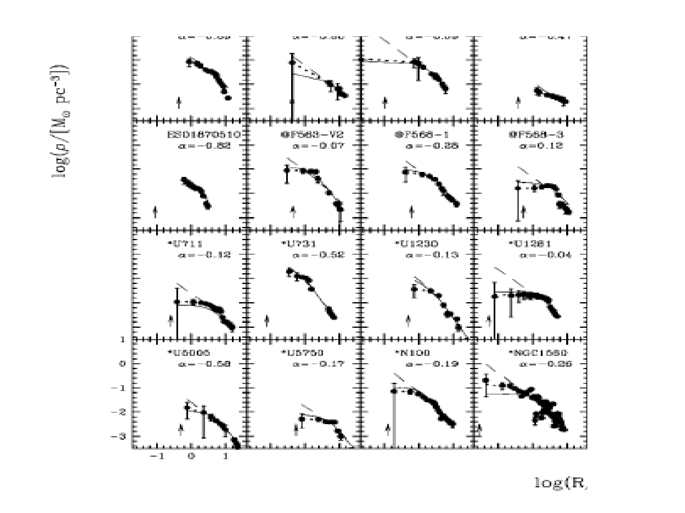
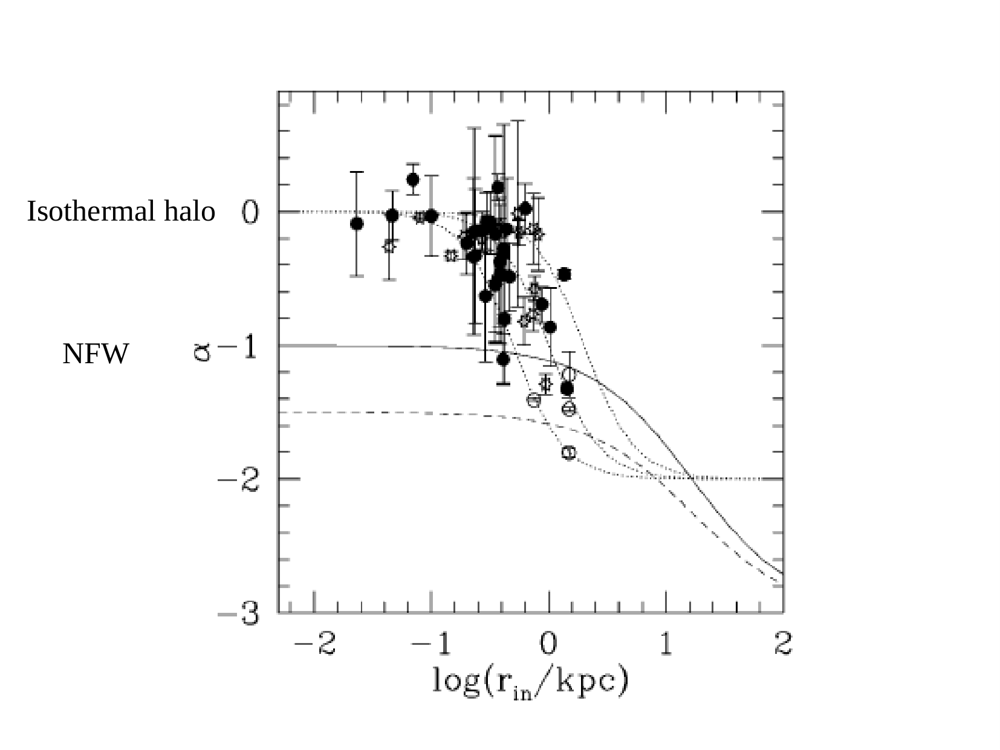
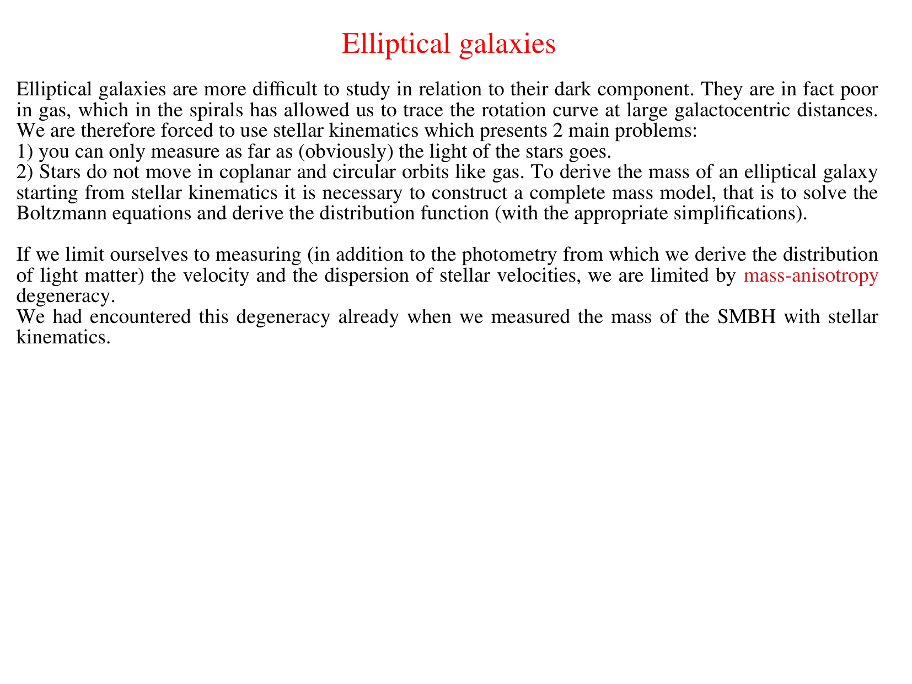
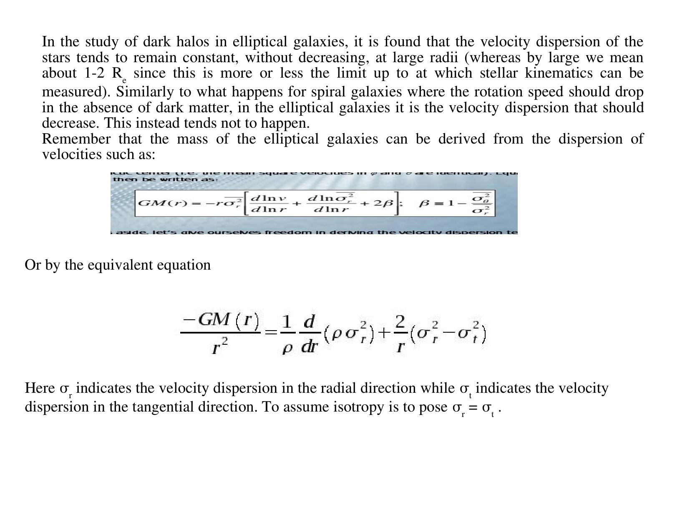
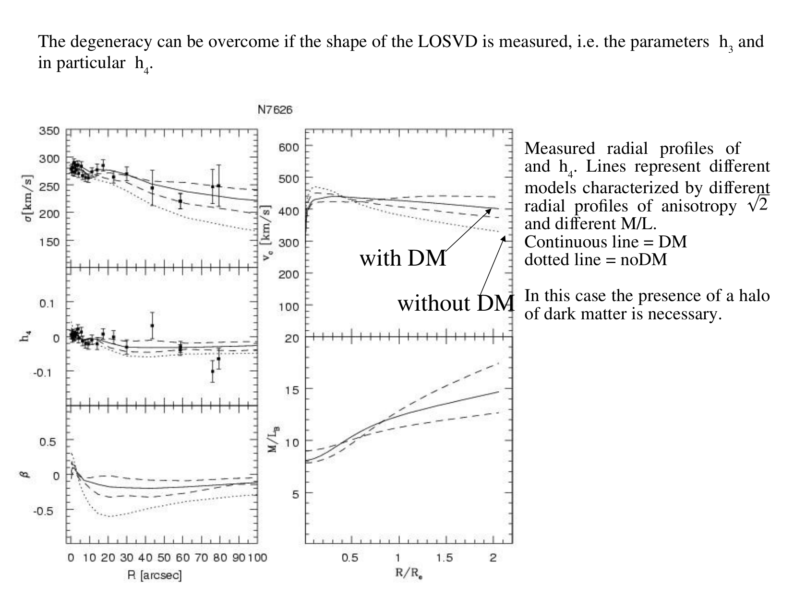
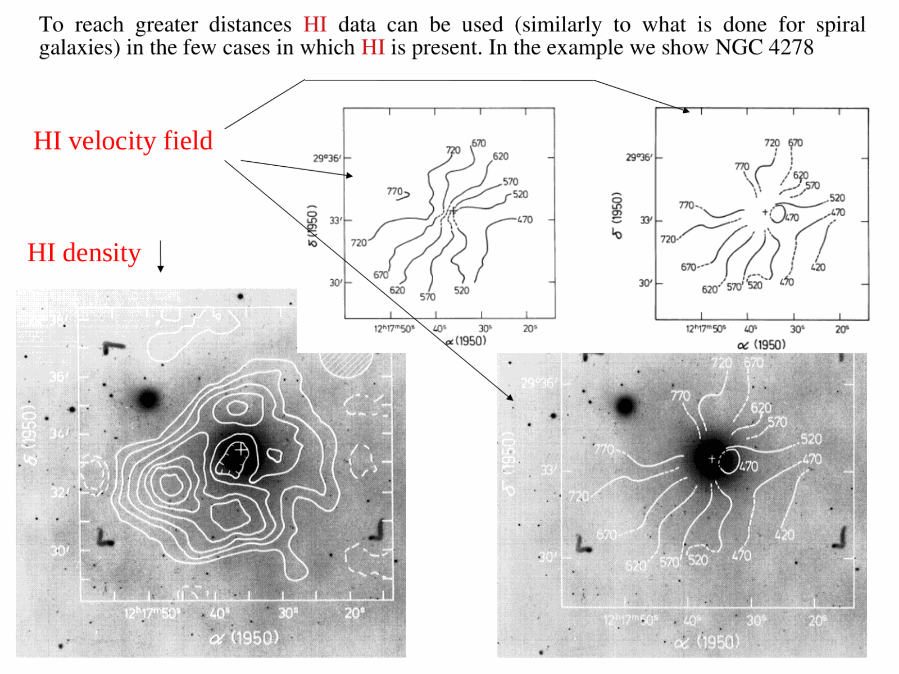
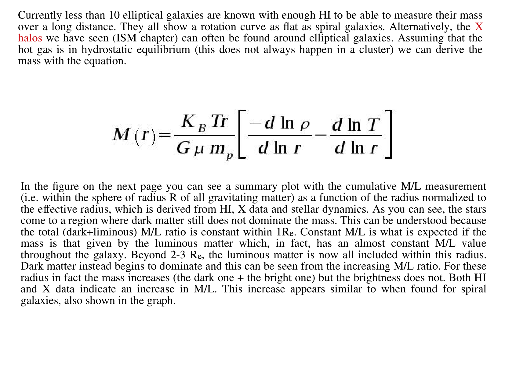
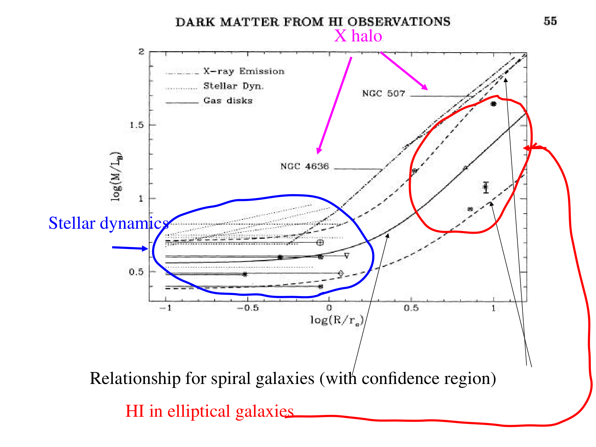
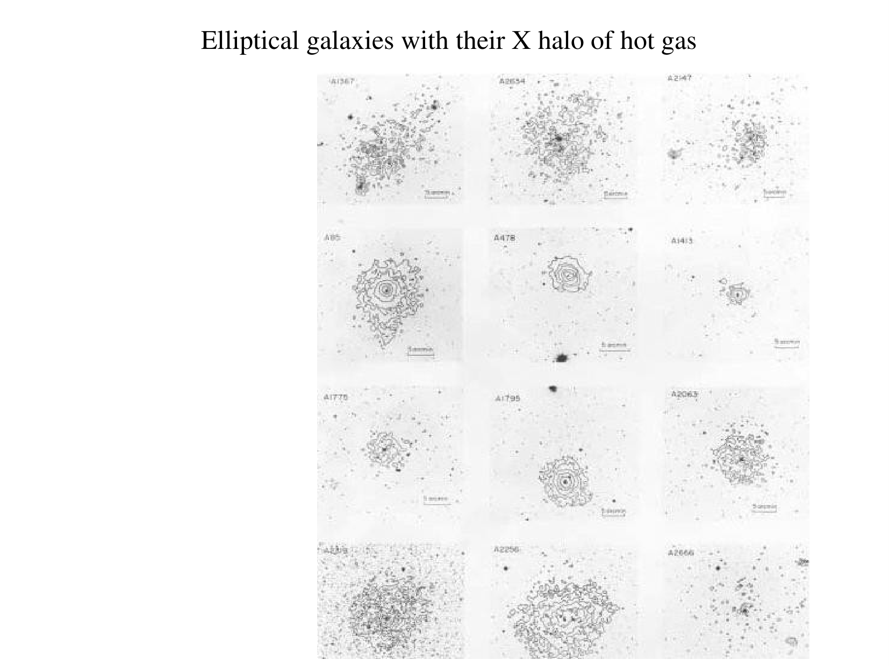
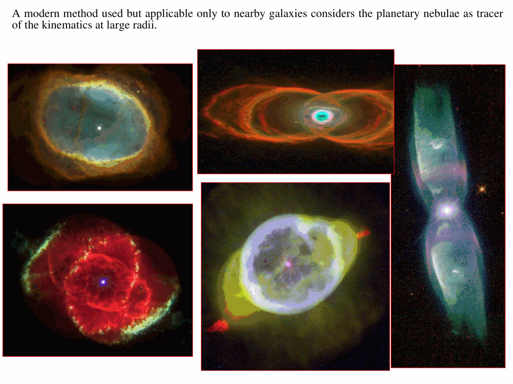

# Dark Matter in Elliptical Galaxies

## 1. The Observational Challenge

In spiral galaxies, extended 21 cm neutral hydrogen (HI) line rotation curves provide direct proof of dark matter halos.
In early-type galaxies (ellipticals and lenticulars S0), measuring dark matter is challenging.
1. **Dispersion Domination** - Ellipticals are pressure-supported systems whose stellar kinematics are dominated by random velocity dispersion ($\sigma$) rather than ordered rotation ($V/\sigma \ll 1$).
2. **Absence of Cold Gas Disks** - Ellipticals generally lack extended HI gas disks and luminous HII regions.
3. **Cosmological Surface Brightness Dimming** - Beyond $1 - 2$ effective radii ($R_e$), integrated stellar photospheric absorption lines fade into the night sky background.

To trace the gravitational potential at large radii ($r \sim 2 - 10 R_e$), astronomers deploy three complementary techniques.
- Hydrostatic equilibrium of hot X-ray emitting gas
- Dynamical modeling of discrete kinematic tracers (Planetary Nebulae and Globular Clusters)
- Strong and weak gravitational lensing

---

## 2. Unbroken Mathematical Derivation - Hydrostatic Equilibrium of Hot X-ray Gas

Luminous elliptical galaxies and cluster cD galaxies host extensive atmospheres of shock-heated interstellar plasma ($T \sim 0.5 - 2.0\,\mathrm{keV} \approx 6 \times 10^6 - 2.3 \times 10^7\,\mathrm{K}$) that radiate thermal bremsstrahlung and collisionally excited metal emission lines in the X-ray regime (observed with Chandra and XMM-Newton).

### Step 1 - The Hydrostatic Equilibrium Equation
Assuming spherical symmetry and stationary equilibrium, the outward thermal gas pressure gradient balances the inward gravitational attraction of the total mass.

$$\frac{dP_g}{dr} = -\rho_g(r) \frac{G M(r)}{r^2}$$

where -
- $\rho_g(r)$ is the gas mass density
- $P_g(r)$ is the thermal gas pressure
- $M(r)$ is the total enclosed gravitational mass within radius $r$ (stars plus dark matter plus gas)

### Step 2 - The Ideal Gas Equation of State
The hot interstellar medium is an ideal, fully ionized plasma.

$$P_g(r) = \frac{\rho_g(r) k_B T(r)}{\mu m_p}$$

where -
- $k_B$ is the Boltzmann constant
- $T(r)$ is the radially dependent gas temperature
- $\mu \approx 0.60$ is the mean molecular weight for fully ionized solar-metallicity gas
- $m_p$ is the proton mass

### Step 3 - Differentiating the Pressure Profile
Differentiate the equation of state with respect to $r$.

$$\frac{dP_g}{dr} = \frac{k_B}{\mu m_p} \frac{d}{dr} \left[ \rho_g(r) T(r) \right] = \frac{k_B}{\mu m_p} \left[ T \frac{d\rho_g}{dr} + \rho_g \frac{dT}{dr} \right]$$

Multiply and divide the bracketed term by $\rho_g T$.

$$\frac{dP_g}{dr} = \frac{\rho_g k_B T}{\mu m_p} \left[ \frac{1}{\rho_g} \frac{d\rho_g}{dr} + \frac{1}{T} \frac{dT}{dr} \right]$$

Expressing the spatial derivatives in logarithmic form ($d\ln x / dr = \frac{1}{x} dx/dr$).

$$\frac{dP_g}{dr} = \frac{\rho_g k_B T}{\mu m_p \, r} \left[ \frac{d\ln \rho_g}{d\ln r} + \frac{d\ln T}{d\ln r} \right]$$

### Step 4 - Derivation of the Total Enclosed Mass
Equate this pressure gradient to the hydrostatic gravitational force.

$$\frac{\rho_g k_B T}{\mu m_p \, r} \left[ \frac{d\ln \rho_g}{d\ln r} + \frac{d\ln T}{d\ln r} \right] = -\rho_g \frac{G M(r)}{r^2}$$

Notice that the gas mass density $\rho_g(r)$ cancels out from both sides.
Multiply both sides by $-\frac{r^2}{G}$.

$$\boxed{M(r) = -\frac{k_B T(r) \, r}{G \mu m_p} \left[ \frac{d\ln \rho_g}{d\ln r} + \frac{d\ln T}{d\ln r} \right]}$$

This is the exact hydrostatic mass equation for elliptical galaxies and clusters.

### Step 5 - Evaluation for the $\beta$-Model (Cavaliere & Fusco-Femiano 1976)
In X-ray surface brightness fitting, the gas density is parameterized by the empirical $\beta$-model.

$$\rho_g(r) = \rho_0 \left[ 1 + \left(\frac{r}{r_c}\right)^2 \right]^{-\frac{3}{2}\beta_{\rm fit}}$$

where $r_c$ is the gas core radius and $\beta_{\rm fit} \approx 0.6 - 0.8$.
Assuming an isothermal gas atmosphere ($T(r) = T_0 = \text{const} \implies \frac{d\ln T}{d\ln r} = 0$).

$$\ln \rho_g = \ln \rho_0 - \frac{3}{2}\beta_{\rm fit} \ln\left[ 1 + \left(\frac{r}{r_c}\right)^2 \right]$$

Differentiating logarithmically.

$$\frac{d\ln \rho_g}{d\ln r} = r \frac{d\ln \rho_g}{dr} = r \left[ -\frac{3}{2}\beta_{\rm fit} \frac{2r / r_c^2}{1 + (r/r_c)^2} \right] = -3\beta_{\rm fit} \frac{r^2}{r_c^2 + r^2}$$

Substitute this into the mass equation.

$$M(r) = -\frac{k_B T_0 r}{G \mu m_p} \left[ -3\beta_{\rm fit} \frac{r^2}{r_c^2 + r^2} \right]$$

$$\boxed{M(r) = \left( \frac{3 \beta_{\rm fit} k_B T_0}{G \mu m_p} \right) \frac{r^3}{r_c^2 + r^2}}$$

### Asymptotic Behavior at Large Radii ($r \gg r_c$)
When $r \gg r_c$, the factor $r^3 / (r_c^2 + r^2) \to r$. Therefore.

$$M(r) \propto r \implies \rho_{\rm tot}(r) = \frac{1}{4\pi r^2} \frac{dM}{dr} \propto r^{-2}$$

This proves that the total gravitational potential of elliptical galaxies is dominated at large radii by a mass distribution with $\rho \propto r^{-2}$, identical to the isothermal dark matter halos found in spiral galaxies.
Observed mass-to-light ratios rise from $(M/L)_B \approx 6 - 8$ inside $R_e$ to $(M/L)_B \approx 50 - 100$ at $5 R_e$, confirming massive dark halos.

---

## 3. Discrete Kinematic Tracers - Jeans Modeling and the Anisotropy Dilemma

### Tracing the Outer Velocity Field
At radii $r > 2 R_e$ where diffuse stellar absorption lines are too faint, two classes of discrete stellar tracers are observed spectroscopically.
1. **Planetary Nebulae (PNe)** - Detected via their ultra-narrow $[O\,III]\,\lambda 5007$ forbidden emission line using dedicated slitless instruments (e.g. the Planetary Nebula Spectrograph, PN.S).
2. **Globular Clusters (GCs)** - Blue (metal-poor, halo) and red (metal-rich, bulge) globular clusters tracked out to $5 - 8 R_e$.

### The Spherical Jeans Equation
Under stationary spherical symmetry, the collisionless Boltzmann equation reduces to the radial Jeans equation for tracer number density $n(r)$ and radial velocity dispersion $\sigma_r$.

$$\frac{d}{dr}\left( n \sigma_r^2 \right) + \frac{2\beta(r)}{r} n \sigma_r^2 = -n \frac{G M(r)}{r^2}$$

where $\beta(r)$ is the **velocity anisotropy parameter**.

$$\beta(r) \equiv 1 - \frac{\sigma_\theta^2 + \sigma_\phi^2}{2\sigma_r^2} = 1 - \frac{\sigma_t^2}{\sigma_r^2}$$

Solving for the enclosed mass.

$$\boxed{M(r) = -\frac{r \sigma_r^2}{G} \left[ \frac{d\ln n}{d\ln r} + \frac{d\ln \sigma_r^2}{d\ln r} + 2\beta(r) \right]}$$

### The Mass-Anisotropy Degeneracy and the Romanowsky Dilemma
Observations only measure the **line-of-sight** velocity dispersion $\sigma_{\rm LOS}(R)$, which is an Abel projection of both $\sigma_r(r)$ and $\sigma_t(r)$.

$$\sigma_{\rm LOS}^2(R) = \frac{2}{\Sigma(R)} \int_R^\infty \left[ 1 - \beta(r)\frac{R^2}{r^2} \right] \frac{n(r) \sigma_r^2(r) \, r}{\sqrt{r^2 - R^2}} \, dr$$

Romanowsky et al. (2003, Science) discovered that in several ordinary intermediate-luminosity elliptical galaxies (e.g. NGC 3379, NGC 821), PNe exhibit a declining velocity dispersion profile ($\sigma_{\rm LOS} \propto R^{-1/2}$).
This was initially interpreted as evidence that intermediate ellipticals lacked dark matter halos.
However, rigorous orbit modeling revealed the **mass-anisotropy degeneracy**.
- A galaxy with a massive dark matter halo ($M \propto r$) populated by stars on predominantly **radial orbits** ($\beta \to 1$) produces a steeply falling line-of-sight dispersion profile, because tangential velocities along the line of sight are small.
- When higher-order Gauss-Hermite moments ($h_4 > 0$) and extended globular cluster kinematics are modeled simultaneously, the presence of a massive dark matter halo is confirmed.

---

## 4. Gravitational Lensing Verification (SLACS)

Strong gravitational lensing provides an absolute mass measurement that is independent of dynamical equilibrium and velocity anisotropy.
In early-type lens galaxies from the SLACS survey (Bolton et al. 2008; Treu et al. 2006).
1. The Einstein radius $\theta_{\rm Einst}$ directly yields the total projected 2D mass inside the cylinder of radius $R_{\rm Einst} \sim 1 - 2 R_e$.
   $$M_{\rm Einst} = \frac{c^2 \theta_{\rm Einst}^2}{4 G} \frac{D_S D_L}{D_{LS}}$$
2. Combining strong lensing with stellar kinematics breaks the IMF-dark matter degeneracy.
3. Results confirm that the dark matter fraction inside the effective radius is $f_{\rm DM}(<R_e) \approx 20\% - 40\%$, rising monotonically to exceed $80\%$ at $5 R_e$.

---

## 5. Blackboard Observational Blueprint

When sketching dark matter in elliptical galaxies on the blackboard.

```text
  Enclosed Mass M(r)
       ^
  10^12|                                       ========= Total Mass M_tot(r) ~ r
       |                                     . . . . . . (Dark Matter Dominates)
  10^11|                         * * * * * .
       |                 * * * *          .
       |        * * * *                    .  - - - - -  Stellar Mass M_*(r)
  10^10|   * * *                                         Saturates at ~ 2 R_e
       +===+===============+===============+===============+======> Radius r
       0  1 R_e           2 R_e           3 R_e           4 R_e

  Line-of-Sight Velocity Dispersion sigma_LOS(R)
       ^
   250 | *
       |   * * - - - - - - - - - - - - - - - - - Isotropic orbits (beta = 0) - FLAT
   200 |       *
       |         *
   150 |           *                           . . . . . Radially biased (beta > 0) -
       |             * * * . . . . . . . . . .           FALLING profile mimics no DM!
       +===+===============+===============+===============+======> Radius R
       0  1 R_e           2 R_e           3 R_e           4 R_e
```

### Key Blackboard Features
- **Top Panel (Enclosed Mass)** - Show stellar mass $M_*(r)$ rising from zero and flattening at $r \ge 2 R_e$. Show total mass $M_{\rm tot}(r)$ continuing to rise linearly with slope $d\ln M/d\ln r \approx 1$, proving the presence of an extended dark matter halo.
- **Bottom Panel (Velocity Dispersion and Anisotropy)** - Draw the isotropic case ($\beta = 0$) where $\sigma_{\rm LOS}$ remains flat. Draw the radially biased case ($\beta > 0$) showing the apparent decline that tripped up Romanowsky et al.
- **Write the X-ray Equation** - Write $M(r) = -\frac{k_B T r}{G \mu m_p} [ \frac{d\ln\rho_g}{d\ln r} + \frac{d\ln T}{d\ln r} ]$ prominently on the board.

---

## 6. Textbook and Course Citations

- **Prof. Alessandro Pizzella Course Dispensa**
  - File - `dispense_DM_2_eng.pdf`
  - Chapter 3 "Dark Matter in Elliptical Galaxies", pages 31-37 (hot X-ray gas hydrostatic equilibrium derivation, beta-model, Jeans equation, Planetary Nebulae, and the mass-anisotropy degeneracy).
- **Mo, van den Bosch & White (2010), *Galaxy Formation and Evolution***
  - File - `Houjun Mo, Frank van den Bosch, Simon White - Galaxy Formation and Evolution (2010, Cambridge University Press) - libgen.li.pdf`
  - Chapter 13, Section 13.4 "Dark Matter Halos", pages 628-634.
- **Binney & Tremaine (2008), *Galactic Dynamics***
  - File - `Binney, Tremaine - Galactic Dynamics 2ed.pdf`
  - Chapter 4, Section 4.5 "Stellar Kinematics", pages 340-355 (spherical Jeans modeling and velocity anisotropy parameter $\beta$).
- **Primary Literature References**
  - Cavaliere, A., & Fusco-Femiano, R. 1976, A&A, 49, 137.
  - Romanowsky, A. J., et al. 2003, Science, 301, 1696.
  - Bolton, A. S., et al. 2008, ApJ, 682, 964 (SLACS lensing).

---

## 7. See Also

- [[Dark matter rotation curves]]
- [[Dark matter in dwarf galaxies]]
- [[LOSVD]]
- [[Fundamental plane of ellipticals]]
- [[Faber-Jackson relation]]
- [[Astrophysics_of_Galaxies_MOC]]

---

## 8. Astrophysics of Galaxies Figures and Slides (Prof. Alessandro Pizzella)


*Lecture 7 - Dark Matter in Elliptical Galaxies (Prof. Alessandro Pizzella).*


*Hydrostatic equilibrium of hot X-ray emitting interstellar gas.*


*Planetary Nebulae and Globular Clusters as kinematic tracers at large radii.*


*The mass-anisotropy degeneracy in spherical Jeans modeling.*

---

## 9. Lecture Slides and Reference Figures (Prof. Alessandro Pizzella)














## Linked References

- [[Coma cluster]]
- [[Dark matter in dwarf galaxies]]
- [[Dark matter rotation curves]]
- [[Astrophysics_of_Galaxies_MOC]]


