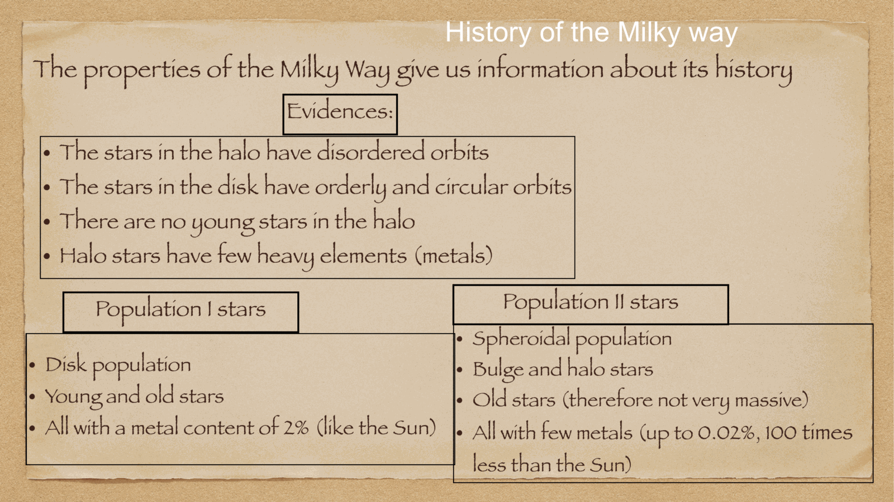
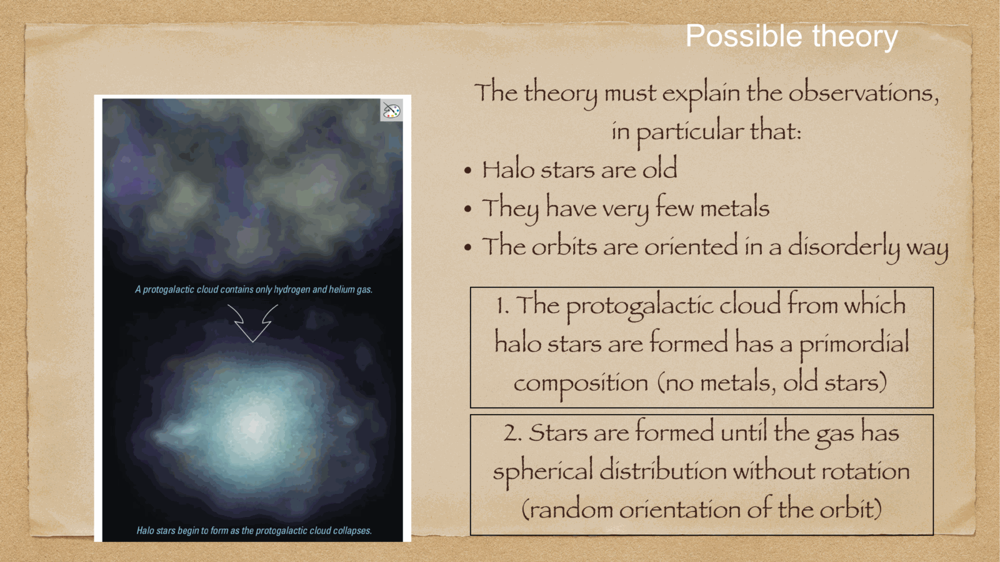
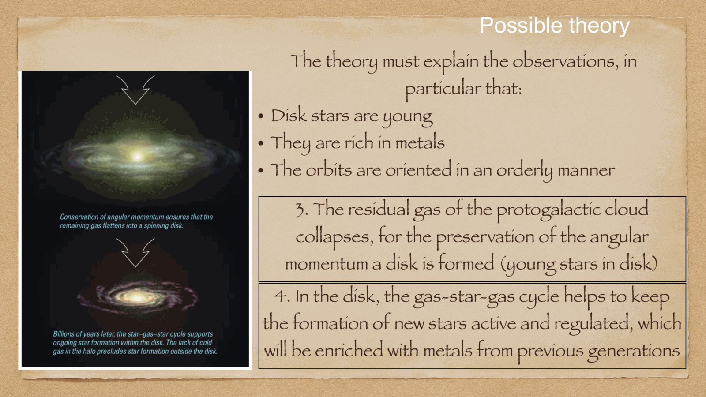
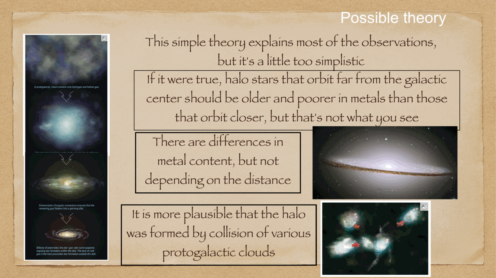

one of the most consequential discoveries of 20th-century astrophysics is that the luminous matter (stars, gas, and dust) in galaxies is only a minor trace component of their total mass. the dynamics of spiral galaxies are overwhelmingly dominated by an invisible, non-baryonic component: **dark matter**.

---

## the Keplerian expectation vs observation

in Newtonian gravity, the circular orbital speed $V(R)$ at radius $R$ is determined by the enclosed mass $M(R)$:
$$\frac{V^2(R)}{R} = \frac{G M(R)}{R^2} \implies V(R) = \sqrt{\frac{G M(R)}{R}}$$

in the Milky Way, surface brightness drops exponentially with radius:
$$I(R) = I_0 \, e^{-R/h_R}$$
with scale length $h_R \approx 3$ kpc. by $R \approx 10-15$ kpc, essentially all the visible stars and gas have been enclosed ($M(R) \to M_{\text{vis}} = \text{constant}$).

consequence: outside the optical disk, Newtonian gravity predicts that the rotation velocity must decline with the characteristic **Keplerian fall-off**:
$$\boxed{\, V(R) \propto R^{-1/2} \quad (\text{Keplerian expectation}) \,}$$

---

## the observed flat rotation curves

in the 1970s, **Vera Rubin** and Kent Ford (using optical emission-line spectroscopy of HII regions in spiral galaxies) and radio astronomers (using 21 cm HI line mapping extending far beyond the visible disks) discovered that **rotation curves do not fall off**:
$$\boxed{\, V(R) \approx \text{constant} \approx 220 \text{ km/s} \quad \text{out to } R > 30-50 \text{ kpc} \,}$$

in the Milky Way, HI and satellite dwarf galaxy kinematics confirm that $V(R) \approx 220$ km/s remains completely flat out to tens of kiloparsecs!

---

## calculating the enclosed mass and the Dark Matter Halo

substituting a flat rotation curve $V(R) = V_0 = \text{constant}$ into the enclosed mass formula:
$$M(R) = \frac{V_0^2 R}{G}$$

$$\boxed{\, M(R) \propto R \,}$$
the enclosed mass increases **linearly with radius**, without any sign of a turnover!

differentiating to find the density profile:
$$M(R) = \int_0^R 4\pi r^2 \rho(r) \, dr = \frac{V_0^2 R}{G} \implies 4\pi R^2 \rho(R) = \frac{V_0^2}{G} \implies \boxed{\, \rho(R) = \frac{V_0^2}{4\pi G R^2} \propto R^{-2} \,}$$

this $R^{-2}$ density distribution corresponds to an **isothermal dark matter sphere** (or Navarro-Frenk-White NFW profile $\rho \propto r^{-1}(1 + r/r_s)^{-2}$ in modern $\Lambda$CDM simulations).

### mass breakdown of the Milky Way:
- total visible baryonic mass (stars + gas + dust): $M_{\text{vis}} \approx 6 \times 10^{10} M_\odot$.
- total virial mass enclosed within the dark matter halo ($R \sim 200$ kpc):
  $$M_{\text{total}} \approx (1.0 - 1.5) \times 10^{12} M_\odot$$
- **dark matter fraction**:
  $$\frac{M_{\text{DM}}}{M_{\text{total}}} \approx 90 - 95\%$$
the Milky Way's visible disk is merely a tiny baryonic nugget sitting at the gravitational center of a colossal, spherical dark matter halo!

---

## see also

- [[Fundamentals_Astrophysics_Cosmology_MOC]]
- [[Spiral arm kinematics]]
- [[Milky Way structure]]
- [[Cosmic_inventory_dark_matter]]
- [[Galaxy morphology vs physical properties]]
- [[Cosmic_inventory_overview]]

## Linked References

- [[Galactic coordinate system]]
- [[Milky Way structure]]
- [[Spiral arm kinematics]]
- [[Fundamentals_Astrophysics_Cosmology_MOC]]

