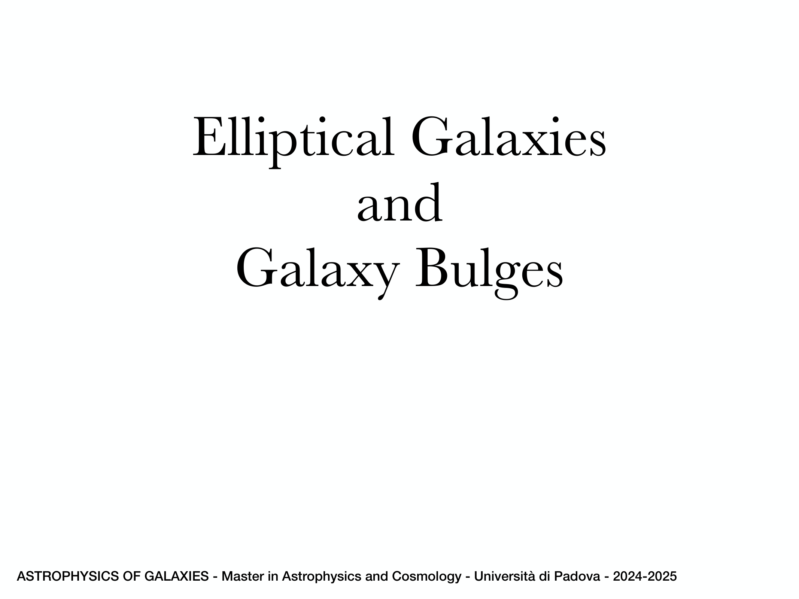
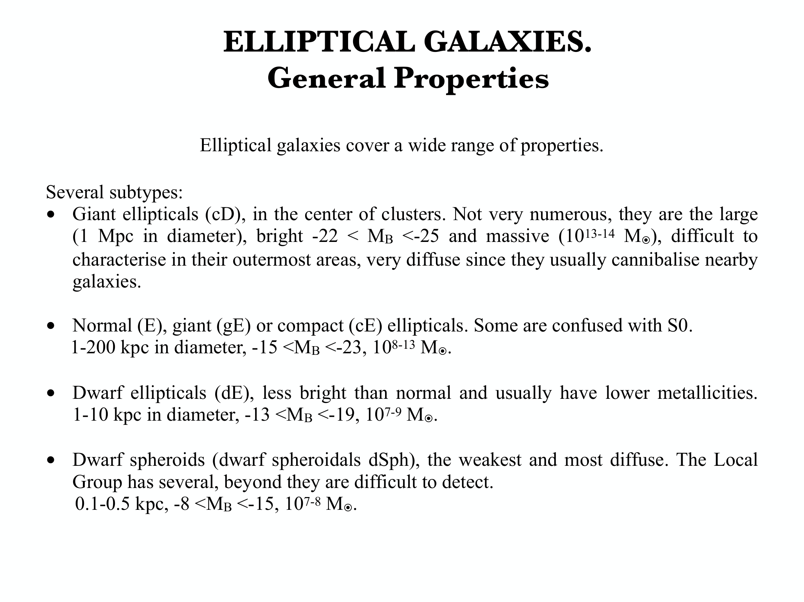
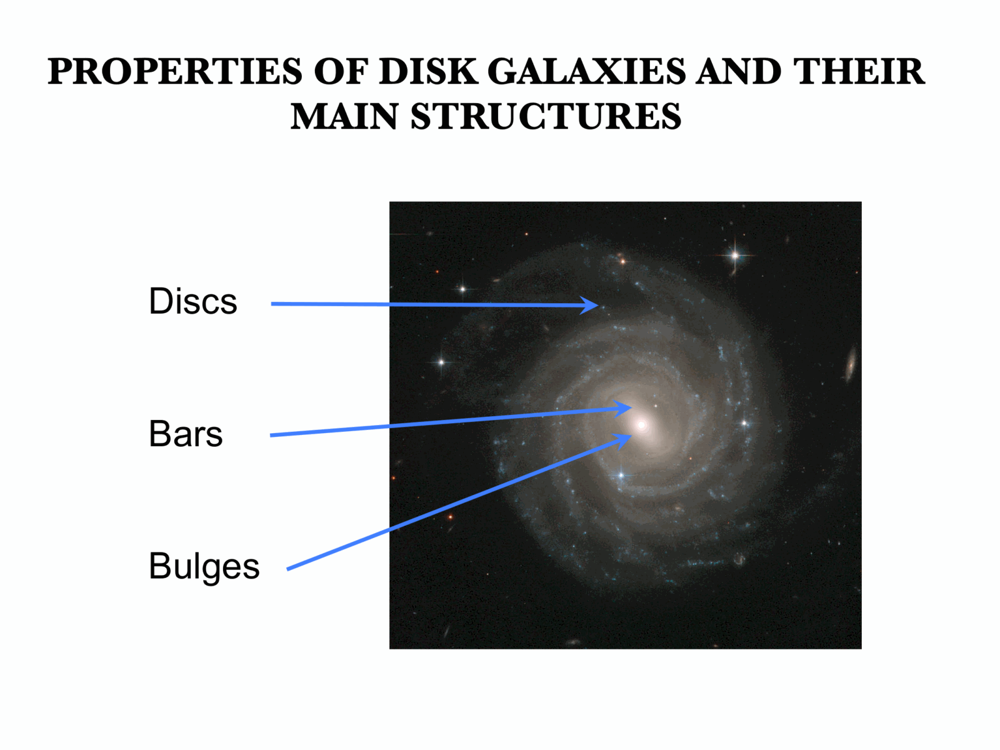
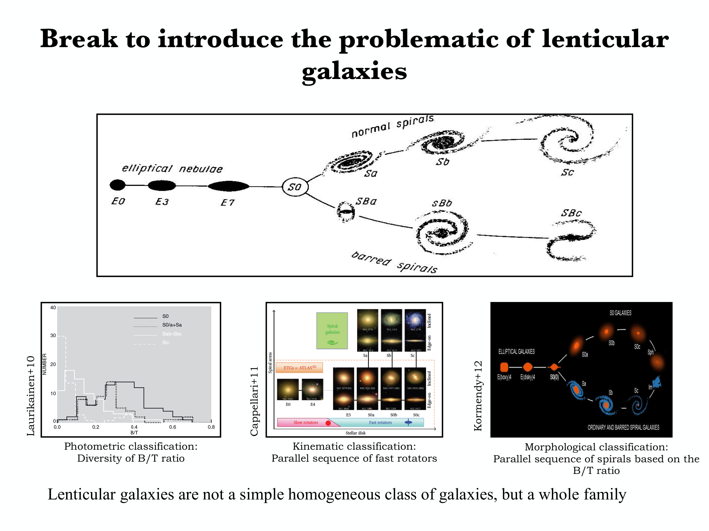
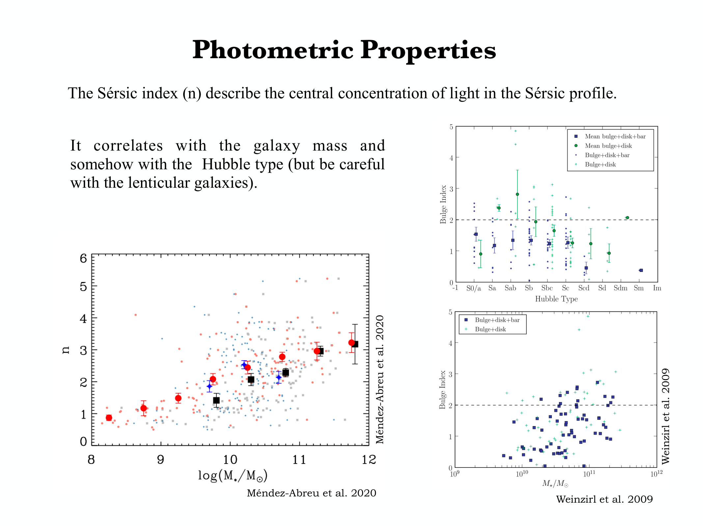
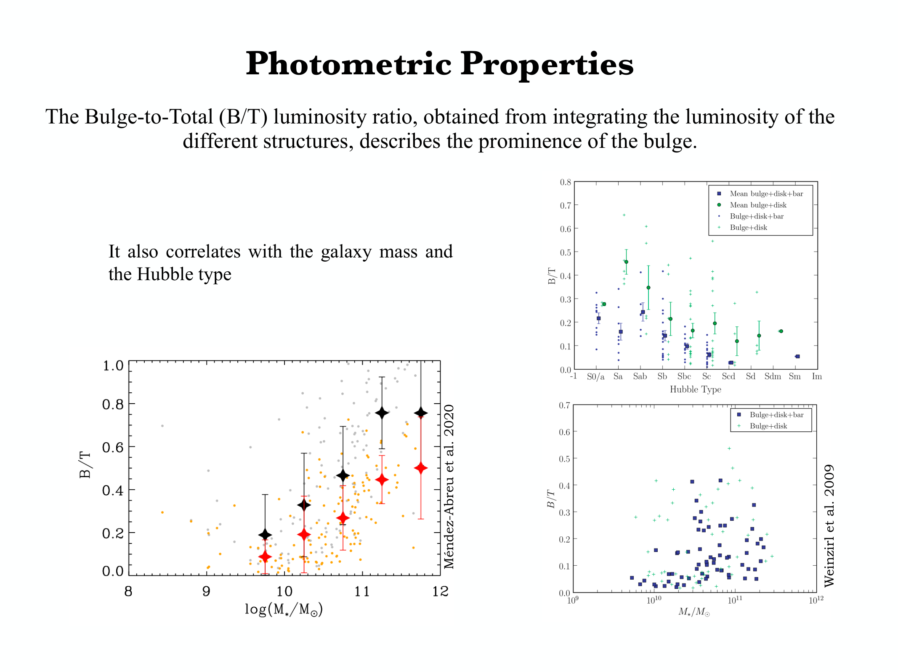
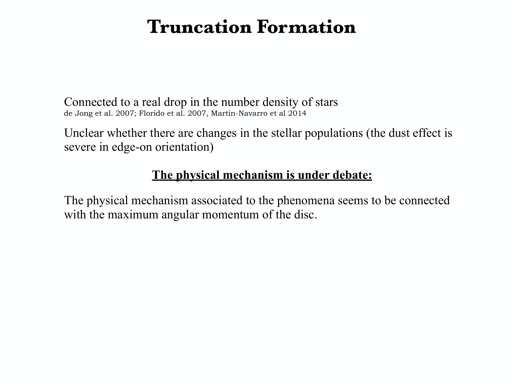
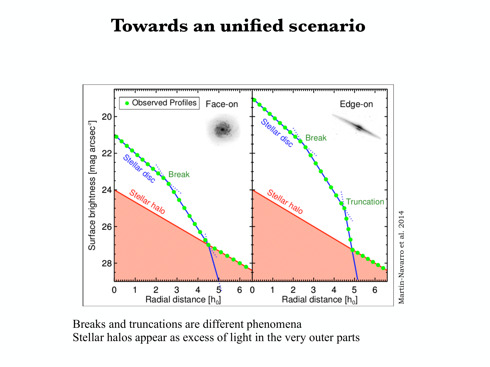

# De Vaucouleurs and Exponential Surface Brightness Profiles

## 1. Physical Significance in Galaxy Morphology

The optical surface brightness distributions of normal galaxies are overwhelmingly dominated by two canonical physical components.
1. **The Spheroidal Component (Bulges and Ellipticals)** - Governed by the **de Vaucouleurs $R^{1/4}$ profile** (de Vaucouleurs 1948), physically generated by collisionless violent relaxation during major mergers and high-redshift collapses (Lynden-Bell 1967).
2. **The Disk Component (Spirals and Lenticulars)** - Governed by the **exponential disk profile** (Freeman 1970), physically generated by dissipative gas collapse that conserves specific angular momentum in a dark matter halo potential.

Both profiles represent exact realizations of the generalized Sersic (1968) law ($n = 4$ for de Vaucouleurs, $n = 1$ for exponential disks).

---

## 2. Unbroken Mathematical Derivation - The de Vaucouleurs $R^{1/4}$ Profile

The de Vaucouleurs radial surface brightness profile is expressed as.

$$I(R) = I_e \exp\left\{ -b_4 \left[ \left(\frac{R}{R_e}\right)^{1/4} - 1 \right] \right\}$$

where.
- $R_e$ is the effective radius (half-light radius) enclosing half of the total galaxy light
- $I_e \equiv I(R_e)$ is the local surface brightness at the effective radius
- $b_4$ is a dimensionless scaling constant defined by the half-light condition, numerically $b_4 \approx 7.66925$

Rewriting in separated form.

$$I(R) = I_e e^{b_4} \exp\left[ -b_4 \left(\frac{R}{R_e}\right)^{1/4} \right]$$

In astronomical surface brightness magnitudes ($\mu(R) = -2.5 \log_{10} I(R) + C$).

$$\mu(R) = \mu_e + 3.327 \, \left[ \left(\frac{R}{R_e}\right)^{1/4} - 1 \right]$$

where $3.327 \approx 2.5 \times b_4 \log_{10}(e) \approx 2.5 \times 7.66925 \times 0.43429 \approx 8.327$ (or historically written as $\mu(R) = \mu_e + 8.327 [(R/R_e)^{1/4} - 1]$).

### Step 1 - The Total Luminosity Integral
Assuming circular isophotes, integrate the surface brightness over all concentric rings.

$$L_{\rm tot} = 2\pi \int_0^\infty I(R) \, R \, dR = 2\pi I_e e^{b_4} \int_0^\infty \exp\left[ -b_4 \left(\frac{R}{R_e}\right)^{1/4} \right] R \, dR$$

### Step 2 - Change of Variables
Define the dimensionless integration variable.

$$x \equiv b_4 \left(\frac{R}{R_e}\right)^{1/4}$$

Inverting this transformation for the radial coordinate $R$.

$$\left(\frac{R}{R_e}\right)^{1/4} = \frac{x}{b_4} \implies \frac{R}{R_e} = \left(\frac{x}{b_4}\right)^4 \implies R = R_e \frac{x^4}{b_4^4}$$

Differentiating with respect to $x$.

$$dR = R_e \frac{4 x^3}{b_4^4} \, dx$$

Construct the differential area element product $R \, dR$.

$$R \, dR = \left( R_e \frac{x^4}{b_4^4} \right) \left( R_e \frac{4 x^3}{b_4^4} \, dx \right) = \frac{4 R_e^2}{b_4^8} \, x^7 \, dx$$

Examine the integration limits.
- When $R = 0$, $x = b_4(0)^{1/4} = 0$
- When $R \to \infty$, $x \to \infty$

### Step 3 - Evaluation via the Euler Gamma Function
Substitute $x$ and $R \, dR$ into the luminosity integral.

$$L_{\rm tot} = 2\pi I_e e^{b_4} \int_0^\infty e^{-x} \left( \frac{4 R_e^2}{b_4^8} \, x^7 \right) dx = \frac{8\pi R_e^2 I_e e^{b_4}}{b_4^8} \int_0^\infty x^7 e^{-x} \, dx$$

The remaining integral is the standard Euler Gamma function definition.

$$\Gamma(z) \equiv \int_0^\infty t^{z-1} e^{-t} \, dt \implies \int_0^\infty x^7 e^{-x} \, dx = \Gamma(8) = 7! = 5040$$

Substitute $\Gamma(8) = 5040$ into the expression.

$$L_{\rm tot} = \frac{8\pi R_e^2 I_e e^{b_4}}{b_4^8} \cdot 5040 = \frac{40320 \, \pi R_e^2 I_e e^{b_4}}{b_4^8}$$

### Step 4 - Numerical Prefactor
Substitute the precise value $b_4 = 7.66925$.

$$e^{b_4} = e^{7.66925} \approx 2141.46$$

$$b_4^8 = (7.66925)^8 \approx 1.1965 \times 10^7$$

Compute the dimensionless factor.

$$\frac{40320 \, e^{b_4}}{b_4^8} \approx \frac{40320 \times 2141.46}{1.1965 \times 10^7} \approx \frac{8.6344 \times 10^7}{1.1965 \times 10^7} \approx 7.215$$

Therefore, the exact total luminosity of a de Vaucouleurs profile is.

$$\boxed{L_{\rm tot} = 7.215 \, \pi R_e^2 I_e}$$

### Mean Interior Surface Brightness
The mean surface brightness inside the effective radius $R_e$ is.

$$\langle I \rangle_{<R_e} \equiv \frac{L_{\rm tot} / 2}{\pi R_e^2} = \frac{7.215 \, \pi R_e^2 I_e / 2}{\pi R_e^2} = 3.6075 \, I_e$$

Converting to astronomical magnitudes ($\langle \mu \rangle_e = -2.5 \log_{10} \langle I \rangle_{<R_e}$).

$$\boxed{\langle \mu \rangle_e = \mu_e - 2.5 \log_{10}(3.6075) = \mu_e - 1.393 \, \mathrm{mag}}$$

---

## 3. Unbroken Mathematical Derivation - The Exponential Disk Profile

The radial surface brightness profile of an idealized razor-thin galactic disk is.

$$I(R) = I_0 e^{-R / h}$$

where.
- $I_0 \equiv I(0)$ is the central surface brightness
- $h$ is the radial disk scale length

In magnitude units.

$$\mu(R) = \mu_0 + 1.0857 \, \left(\frac{R}{h}\right)$$

where $1.0857 \approx 2.5 \log_{10}(e)$. In an exponential disk, surface brightness in magnitudes falls **linearly** with radius.

### Step 1 - Total Luminosity Integration
Integrate over all concentric radii.

$$L_{\rm tot} = 2\pi \int_0^\infty I(R) \, R \, dR = 2\pi I_0 \int_0^\infty R e^{-R/h} \, dR$$

Let $u \equiv R/h \implies R = h u$ and $dR = h du$.

$$L_{\rm tot} = 2\pi I_0 h^2 \int_0^\infty u e^{-u} \, du = 2\pi I_0 h^2 \, \Gamma(2)$$

Since $\Gamma(2) = 1! = 1$.

$$\boxed{L_{\rm tot} = 2\pi I_0 h^2}$$

### Step 2 - Cumulative Flux and the Half-Light Radius $R_e$
The cumulative luminosity enclosed within radius $R$ is.

$$L(<R) = 2\pi I_0 \int_0^R R' e^{-R'/h} \, dR'$$

Integrating by parts ($u = R'$, $dv = e^{-R'/h} dR'$).

$$L(<R) = 2\pi I_0 \left( \left[ -h R' e^{-R'/h} \right]_0^R + h \int_0^R e^{-R'/h} \, dR' \right) = 2\pi I_0 h^2 \left[ 1 - \left(1 + \frac{R}{h}\right) e^{-R/h} \right]$$

Setting $L(<R_e) = 0.5 L_{\rm tot} = \pi I_0 h^2$.

$$2\pi I_0 h^2 \left[ 1 - \left(1 + \frac{R_e}{h}\right) e^{-R_e/h} \right] = \pi I_0 h^2$$

Divide both sides by $2\pi I_0 h^2$.

$$1 - \left(1 + \frac{R_e}{h}\right) e^{-R_e/h} = 0.5 \implies \left(1 + \frac{R_e}{h}\right) e^{-R_e/h} = 0.5$$

Solving this transcendental equation numerically.

$$\boxed{\frac{R_e}{h} \approx 1.67835 \implies R_e \approx 1.678 \, h \qquad \text{or} \qquad h \approx 0.596 \, R_e}$$

### Step 3 - Central Versus Effective Surface Brightness
Evaluating the surface brightness at the effective radius.

$$I_e = I(R_e) = I_0 e^{-1.67835} \approx 0.1867 \, I_0 \implies \boxed{I_0 \approx 5.357 \, I_e}$$

In magnitudes.

$$\mu_e = \mu_0 + 1.0857(1.67835) = \mu_0 + 1.822 \, \mathrm{mag}$$

The mean surface brightness enclosed within $R_e$ is.

$$\langle I \rangle_{<R_e} = \frac{L_{\rm tot} / 2}{\pi R_e^2} = \frac{\pi I_0 h^2}{\pi (1.67835 h)^2} = \frac{I_0}{(1.67835)^2} \approx 0.3550 \, I_0 \approx 1.902 \, I_e$$

In magnitudes.

$$\boxed{\langle \mu \rangle_e = \mu_e - 2.5 \log_{10}(1.902) = \mu_e - 0.699 \, \mathrm{mag}}$$

---

## 4. Freeman's Law and Disney's Selection Effect

Freeman (1970) measured 36 spiral galaxies and discovered that their extrapolated central disk surface brightness clustered around a nearly universal constant.

$$\mu_0(B) = 21.65 \pm 0.30 \, \mathrm{mag \, arcsec^{-2}}$$

### Disney's Observational Selection Gate
Disney (1976) demonstrated that Freeman's constant is heavily influenced by observational selection effects.
1. Disks with much higher surface brightness ($\mu_0 \ll 21.65$) have very small angular scale lengths for a given total luminosity and appear stellar on photographic plates (compact galaxies).
2. Disks with lower surface brightness ($\mu_0 \gg 21.65$) fade into the night sky background ($\mu_{\rm sky} \sim 22\,\mathrm{mag\,arcsec^{-2}}$) and are missed in magnitude-limited surveys.
Modern CCD surveys (such as the Malin 1 discovery by Bothun et al. 1987) confirmed the existence of a large population of Low Surface Brightness (LSB) galaxies with $\mu_0(B) > 23 - 25\,\mathrm{mag\,arcsec^{-2}}$, proving that Freeman's law represents the upper envelope of disk surface densities rather than a strict physical limit.

---

## 5. Bulge-Disk Decomposition (1D and 2D)

Real spiral galaxies contain both a centrally concentrated spheroidal bulge and an extended disk. The total observed surface brightness is modeled as a composite.

$$I(R) = I_{\rm bulge}(R) + I_{\rm disk}(R) = I_e \exp\left\{ -b_n \left[ \left(\frac{R}{R_e}\right)^{1/n} - 1 \right] \right\} + I_0 e^{-R/h}$$

### The Bulge-to-Total Luminosity Ratio ($B/T$)
The structural parameter $B/T$ quantifies morphological position along the Hubble sequence.

$$B/T \equiv \frac{L_{\rm bulge}}{L_{\rm tot}} = \frac{L_{\rm bulge}}{L_{\rm bulge} + L_{\rm disk}}$$

- $B/T \ge 0.6$ - Early-type lenticulars (S0) and early spirals (Sa)
- $B/T \approx 0.2 - 0.4$ - Intermediate spirals (Sb)
- $B/T \le 0.1$ - Late-type spirals (Sc and Sd)
- $B/T = 0$ - Pure disk galaxies and dwarf irregulars (Sm and Irr)

### 2D Decomposition (GALFIT)
In modern analysis, 1D decomposition is replaced by 2D image fitting (GALFIT; Peng et al. 2002).
1. Analytical 2D models for bulge (ellipticity $\epsilon_b$, position angle $\mathrm{PA}_b$) and disk ($\epsilon_d, \mathrm{PA}_d$) are generated.
2. The composite 2D model is convolved with the observed telescope Point Spread Function (PSF) to account for atmospheric seeing.
3. $\chi^2$ minimization fits the parameters simultaneously, eliminating seeing-induced core flattening.

---

## 6. Blackboard Observational Blueprint

When sketching de Vaucouleurs and exponential profiles on the blackboard.

```text
  Surface Brightness mu(R) [mag/arcsec^2]
       ^
    18 |  * (Core Peak)
       |   \
    20 |    \      de Vaucouleurs R^(1/4).
       |     \     Steep center, broad shallow wings
    22 |      \
       |       \            Exponential Disk.
    24 |        \ _ _ _ _ _ Straight line on linear R
       |                   \
    26 |                    \
       +======-+======-+=====+======-+========> Radius R
       0      R_e     2 R_e 3 R_e   4 R_e

  On R^(1/4) Coordinate Axis.
  mu(R)
       ^
    18 | *
       |  \
    22 |   \   de Vaucouleurs - PERFECT STRAIGHT LINE on R^(1/4)
       |    \
    26 |     \
       +======+======+======+======+=========> R^(1/4)
       0     0.5    1.0    1.5    2.0
```

### Key Blackboard Features
- **Linear Radius Axis (Top)** - Plot $\mu(R)$ vs $R$. Show the exponential disk as a straight line with constant downward slope ($1.0857/h$). Show the de Vaucouleurs profile curving above the disk in the center (steep core) and flattening below the disk at large radii (extended halo wings).
- **$R^{1/4}$ Axis (Bottom)** - Plot $\mu(R)$ vs $R^{1/4}$. The de Vaucouleurs profile becomes a perfect straight line with slope $8.327 / R_e^{1/4}$. The exponential disk curves strongly upward.
- **Annotate Mathematical Enclosed Luminosities** - Write $L_{\rm disk} = 2\pi I_0 h^2$ and $L_{\rm deVauc} = 7.215 \pi R_e^2 I_e$ on the board.

---

## 7. Textbook and Course Citations

- **Prof. Alessandro Pizzella Course Dispensa**
  - File - `dispense_LF1_1_eng-1.pdf`
  - Chapter 1, Section 1.3 "Surface Photometry of Galaxies", pages 1-8 (analytical equations, de Vaucouleurs profile, exponential disks, and bulge-disk decomposition).
- **Mo, van den Bosch & White (2010), *Galaxy Formation and Evolution***
  - File - `Houjun Mo, Frank van den Bosch, Simon White - Galaxy Formation and Evolution (2010, Cambridge University Press) - libgen.li.pdf`
  - Chapter 2, Section 2.3 "Surface Photometry", pages 64-70; Chapter 11, Section 11.1 "The Surface Brightness Profiles of Disk Galaxies", pages 517-525.
- **Binney & Merrifield (1998), *Galactic Astronomy***
  - File - `Binney J., Merrifield M. - Galactic Astronomy (1998, Princeton).pdf`
  - Chapter 4, Section 4.3 "Elliptical Galaxies", pages 194-204; Section 4.4 "Disk Galaxies", pages 210-232.
- **Primary Literature References**
  - de Vaucouleurs, G. 1948, Ann. d'Astrophys., 11, 247.
  - Freeman, K. C. 1970, ApJ, 160, 811.
  - Peng, C. Y., et al. 2002, AJ, 124, 266 (GALFIT).

---

## 8. See Also

- [[Sersic profile]]
- [[Petrosian radius]]
- [[Hubble morphological sequence]]
- [[Fundamental plane of ellipticals]]
- [[Tully-Fisher relation]]
- [[Astrophysics_of_Galaxies_MOC]]

---

## 9. Astrophysics of Galaxies Figures and Slides (Prof. Alessandro Pizzella)


*Lecture 2 - Surface Photometry of Elliptical Galaxies (Prof. Alessandro Pizzella).*


*De Vaucouleurs R^(1/4) profile definition and characteristic effective parameters.*


*Lecture 3 - Surface Photometry of Disk Galaxies (Prof. Alessandro Pizzella).*


*Exponential disk radial profile and scale length definition.*

---

## 10. Lecture Slides and Reference Figures (Prof. Alessandro Pizzella)













## Linked References

- [[CAS galaxy classification]]
- [[Color gradients in ellipticals]]
- [[Hubble morphological sequence]]
- [[Kormendy relation]]
- [[Low surface brightness galaxies]]
- [[Petrosian radius]]
- [[Sersic profile]]
- [[Astrophysics_of_Galaxies_MOC]]


