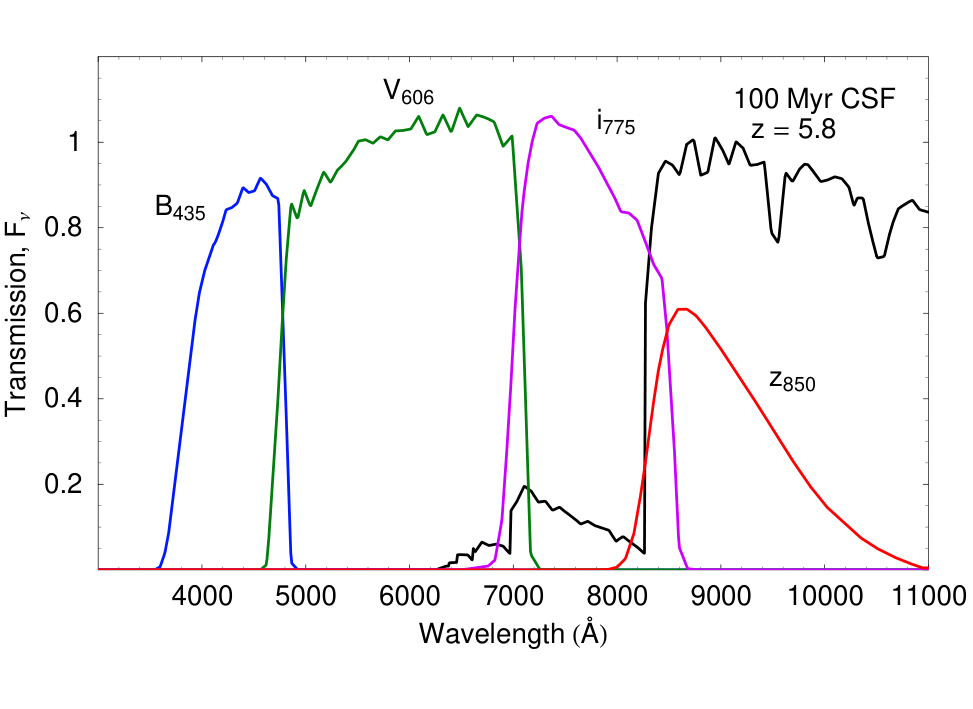
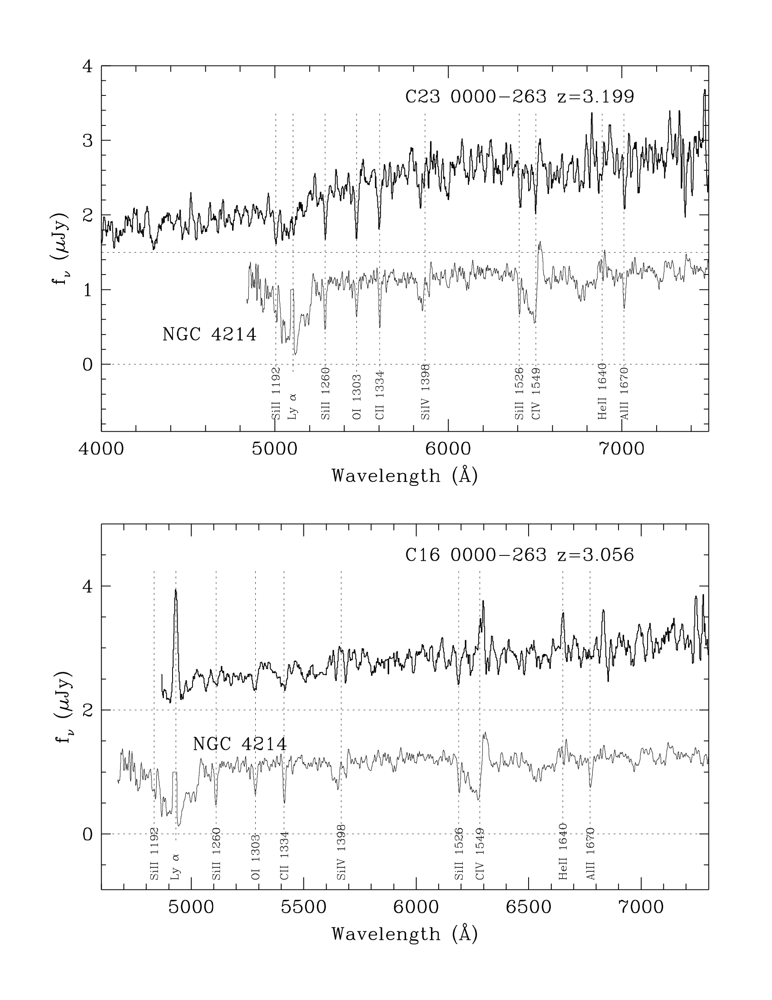
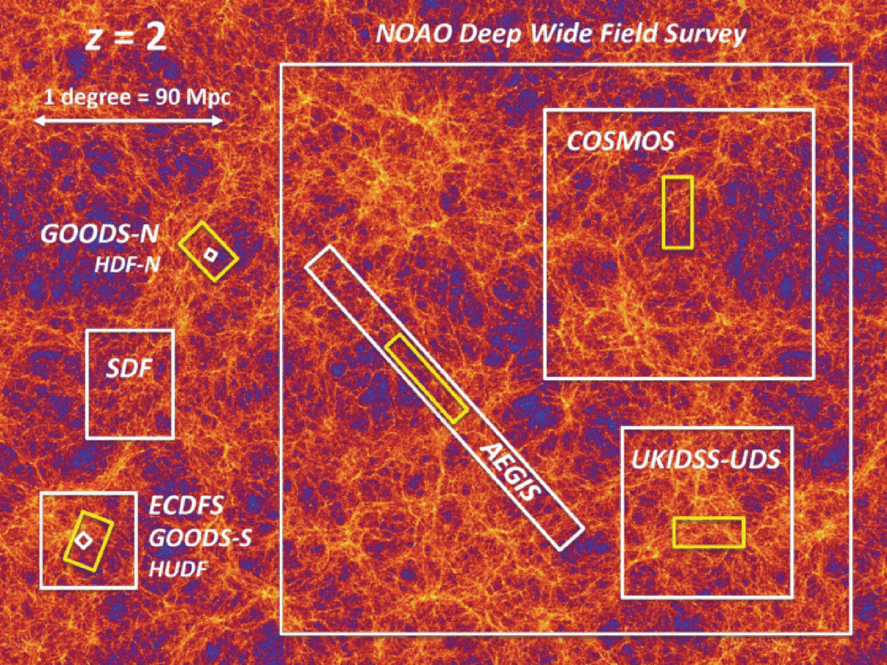

# Deep-field surveys

Deep-field extragalactic surveys represent the premier observational technique for charting the formation and morphological assembly of galaxies across cosmological lookback times spanning more than $13$ billion years ($z = 0$ to $z > 10$). By targeting small, unconfused, high-galactic-latitude fields free of bright foreground Milky Way stars and interstellar dust cirrus, space-borne and ground-based facilities accumulate ultra-long exposure times ($100 - 1000$ hours per pointing). Landmark campaigns include the Hubble Deep Field (HDF, 1995), Hubble Ultra Deep Field (HUDF, 2004), GOODS, COSMOS, CANDELS, and the James Webb Space Telescope Advanced Deep Extragalactic Survey (JWST JADES). These surveys revolutionized extragalactic astrophysics through two complementary methodologies - the color-selection Lyman-Break Galaxy (LBG) dropout technique, which isolates high-redshift starbursts via the photoelectric absorption edge of neutral hydrogen at $\lambda_{\rm rest} = 912$ \AA, and multi-band photometric redshift (photo-$z$) SED fitting.

---

## 1. Landmark Deep-Field Programs and Survey Strategy

```
+========================================================================================+
| Survey Name   | Primary Facility | Area Covered | Exposure Time | Limiting Mag (AB)    |
+========================================================================================+
| HDF-North     | HST (WFPC2)      | 5.3 arcmin^2 | ~ 140 hours   | m_AB ~ 29.0 (optical)|
| HUDF          | HST (ACS / WFC3) | 11 arcmin^2  | ~ 1000 hours  | m_AB ~ 29.8 (optical)|
| GOODS         | HST / Spitzer    | 320 arcmin^2 | Multi-tier    | m_AB ~ 27.5 (N & S)  |
| COSMOS        | HST / Subaru/VLA | 2.0 deg^2    | Wide-field    | m_AB ~ 26.0 (opt/NIR)|
| CANDELS       | HST (WFC3 / ACS) | 800 arcmin^2 | Multi-cycle   | m_AB ~ 27.7 (opt/NIR)|
| JADES         | JWST (NIRCam)    | ~ 65 arcmin^2| ~ 200 hours   | m_AB ~ 30.5 (NIR)    |
+========================================================================================+
```

### Survey Design Principles
1. Pencil-Beam versus Wide-Area Surveys - Observational cosmology employs a nested wedding-cake strategy
   - Ultra-deep pencil-beam surveys (e.g. HUDF, JADES) maximize limiting depth ($m_{\rm AB} > 30$), discovering the faintest dwarf galaxies and the highest-redshift objects ($z > 10$), but cover tiny solid angles ($\Omega \sim 10 \text{ arcmin}^2$).
   - Moderately deep wide-area surveys (e.g. COSMOS, CANDELS) cover larger solid angles ($\Omega \sim 0.2 - 2.0 \text{ deg}^2$) to survey rare, luminous galaxies and constrain cosmic variance.
2. Minimizing Foreground Contamination - Target fields are chosen in low-extinction regions with Galactic color excess $E(B-V) < 0.01$ mag, low H I column densities ($N_{\rm HI} < 10^{20} \text{ cm}^{-2}$), and void of stars brighter than $V \sim 18$ mag.

---

## 2. The Lyman-Break Technique - Complete Mathematical Physics

The Lyman-break selection technique (Steidel et al. 1996, 1999) isolates star-forming galaxies at precise redshift intervals by exploiting two severe atomic absorption breaks in their rest-frame ultraviolet spectra.

### Microscopic Radiative Transfer of the Breaks
1. The Lyman Limit Break ($\lambda_{\rm rest} = 912$ \AA)
   Hydrogen atoms in stellar atmospheres and surrounding interstellar gas absorb all continuum photons with energy exceeding the ground-state ionization potential ($h\nu \ge 13.6$ eV, corresponding to $\lambda \le 912$ \AA).
   Because the optical depth of neutral gas in galaxies at the Lyman limit is massive ($\tau_{\rm LL} \gg 1$), the emergent flux drops essentially to zero
   $$F_\nu(\lambda \le 912 \text{ \AA}) \approx 0$$
2. The Lyman-$\alpha$ Forest Attenuation ($\lambda_{\rm rest} = 912 - 1216$ \AA)
   Photons emitted between $912$ \AA\ and $1216$ \AA\ redshift into the resonance absorption cross section of intervening neutral hydrogen clouds in the intergalactic medium (the Lyman-$\alpha$ forest). The effective continuum attenuation is described by the Gunn-Peterson optical depth $\tau_{\rm eff}(z)$, which increases steeply with redshift ($\tau_{\rm eff} \propto (1+z)^{4.5}$)
   $$F_{\rm obs}(\lambda) = F_{\rm em}(\lambda) e^{-\tau_{\rm eff}(z)}$$
   At $z > 3$, the flux between $912$ \AA\ and $1216$ \AA\ is depressed by $30\%$ to $70\%$.
3. Flat Far-UV Continuum ($\lambda_{\rm rest} > 1216$ \AA)
   Above $1216$ \AA, star-forming galaxies exhibit an un-attenuated, nearly flat continuum in flux density $F_\nu \propto \nu^\beta$ (with UV spectral slope $\beta \approx -2.0$).

### Mathematical Selection Criteria ($U_n, G, {\cal R}$ Filters at $z \sim 3$)
Steidel et al. designed specialized filter sets where the Lyman limit at $z \approx 3$ ($912 \text{ \AA} \times (1+3) = 3648$ \AA) falls directly into the blue $U_n$ filter, while the un-attenuated continuum falls into the green $G$ ($\lambda_{\rm eff} \approx 4700$ \AA) and red ${\cal R}$ ($\lambda_{\rm eff} \approx 6800$ \AA) filters.
The formal mathematical selection criteria in the two-color plane $(U_n - G)$ versus $(G - {\cal R})$ are
$$(U_n - G) \ge 1.0 + (G - {\cal R})$$
$$(U_n - G) \ge 1.5$$
$$-0.1 \le (G - {\cal R}) \le 1.2$$
These inequalities define an exclusive polygonal locus in color space. Foreground stars, lower-redshift elliptical galaxies, and normal disk galaxies are cleanly separated from high-redshift Lyman-Break Galaxies (LBGs).

### The Redshift Dropout Ladder
By shifting the filter combinations progressively red-ward into the near-infrared, the dropout technique isolates galaxies across cosmic epochs
- $u$-dropouts - $z \sim 3$ (Lyman break in $u$-band, detected in $g, r, i$).
- $g$-dropouts - $z \sim 4$ (Lyman break in $g$-band, detected in $r, i, z$).
- $r$-dropouts - $z \sim 5$ (Lyman break in $r$-band, detected in $i, z, Y$).
- $i$-dropouts - $z \sim 6$ (Lyman break in $i$-band, detected in $z, Y, J$).
- $z$-dropouts - $z \sim 7 - 8$ (Lyman break in $z$-band, detected in $Y, J, H$).
- $Y$-dropouts - $z \sim 9 - 10$ (detected in JWST NIRCam $F150W, F200W$).

---

## 3. Photometric Redshift (Photo-$z$) Methodology

While the dropout technique isolates specific redshift slices, multi-band photometric redshift algorithms estimate the probability distribution function $P(z)$ for all galaxies simultaneously using broadband fluxes spanning ultraviolet to mid-infrared passbands.

### Bayesian SED Template Fitting Mathematics
Let $F_{\mathrm{obs}, i}$ be the observed flux of a galaxy in filter $i \in \{1, \dots, N_{\rm bands}\}$ with photometric uncertainty $\sigma_i$.
Synthetic spectral energy distributions $T(\lambda)$ are generated from stellar population synthesis libraries (Bruzual & Charlot 2003) for various star formation histories, ages, metallicities, and dust extinction $A_V$.
The model flux in filter transmission profile $R_i(\lambda)$ at redshift $z$ is
$$F_{\mathrm{model}, i}(z, T, A_V) = \int_0^\infty T\left(\frac{\lambda}{1+z}\right) e^{-\tau_{\rm IGM}(\lambda, z)} 10^{-0.4 A_V k(\lambda / (1+z))} R_i(\lambda) \frac{d\lambda}{hc}$$
The best-fit redshift and template are obtained by minimizing the chi-squared statistic
$$\chi^2(z, T, A_V, s) = \sum_{i=1}^{N_{\rm bands}} \frac{\left[ F_{\mathrm{obs}, i} - s F_{\mathrm{model}, i}(z, T, A_V) \right]^2}{\sigma_i^2}$$
where $s$ is the analytical flux normalization factor determined by setting $\frac{\partial \chi^2}{\partial s} = 0$
$$s = \frac{\sum_{i=1}^{N_{\rm bands}} \frac{F_{\mathrm{obs}, i} F_{\mathrm{model}, i}}{\sigma_i^2}}{\sum_{i=1}^{N_{\rm bands}} \frac{F_{\mathrm{model}, i}^2}{\sigma_i^2}}$$
The posterior probability density function of redshift is
$$P(z | F_{\rm obs}) \propto \exp\left[ -\frac{1}{2} \chi_{\rm min}^2(z) \right] p(z | m_r)$$
where $p(z | m_r)$ is a Bayesian prior on the apparent magnitude distribution preventing unphysical high-redshift solutions for bright galaxies.
Accuracy achieved in modern deep surveys is $\sigma_{\Delta z / (1+z)} \approx 0.02 - 0.04$ with catastrophic outlier fractions $< 3\%$.

---

## 4. Cosmic Variance in Deep Surveys

Because galaxies are gravitationally clustered along the cosmic web rather than randomly distributed according to Poisson statistics, pencil-beam deep surveys are vulnerable to cosmic variance (sample variance).

### Mathematical Formulation of Survey Variance
The total variance in the counted number of galaxies $N$ within a survey volume $V$ is the sum of Poisson shot noise and cosmic variance
$$\sigma_{\rm tot}^2 = \sigma_{\rm Poisson}^2 + \sigma_{\rm cosmic}^2 = \bar{N} + \bar{N}^2 \sigma_v^2$$
The fractional cosmic variance $\sigma_v^2$ is related to the two-point spatial galaxy correlation function $\xi(r)$ integrated over the survey geometry
$$\sigma_v^2 = \frac{1}{V^2} \int_V \int_V \xi(|\mathbf{r}_1 - \mathbf{r}_2|) d^3r_1 d^3r_2 = b^2 \sigma_{\rm DM}^2(V)$$
where $b$ is the galaxy bias factor and $\sigma_{\rm DM}^2(V)$ is the root-mean-square fluctuation of the underlying dark matter density field in volume $V$.
For high-redshift galaxies ($z > 4$) in a narrow pencil-beam pointing like the HUDF ($\Omega \approx 11 \text{ arcmin}^2$), the galaxy bias is high ($b \sim 3 - 5$), causing the cosmic variance to reach $\sigma_v \approx 30\% - 40\%$.
Conclusion - To derive robust cosmological luminosity functions and volume densities, multiple widely separated lines of sight (e.g. GOODS-North and GOODS-South, COSMOS, and UDS) must be observed and averaged.

---

## 5. Blackboard Blueprint and Observational Graph Literacy

```
             LYMAN-BREAK TWO-COLOR SELECTION PLANE (STEIDEL ET AL.)
   (U_n - G) (mag)
     +4.0 +                         .-------------------------.
          |                        /  HIGH-z STARBURST LOCUS  |
     +3.0 +                       /   (z ~ 3 LBGs)           |
          |                      /    (U-dropouts)            |
     +2.0 +                     /                             |
          |       Selection    /                              |
     +1.5 +------- Boundary --*-------------------------------'
          |                  /
     +1.0 +                 /
          |                /    FOREGROUND STARS
     +0.5 +               /     AND LOW-z GALAXIES
          |              /      (z < 2)
      0.0 +=============+=====================================+
             -0.2      0.0     +0.2    +0.4    +0.6    +0.8  +1.0
                                (G - R) (mag)

             SPECTRAL ENERGY DISTRIBUTION AND FILTER DROPOUT
   Flux F_lambda
       ^                [U_n Filter]     [G Filter]     [R Filter]
       |                (DROPOUT)        (TRANSMISSION) (TRANSMISSION)
       |                 .-----.          .--------.     .--------.
       |                (  0%   )        (   100%   )   (   100%   )
       |                 '-----'          '--------'     '--------'
       |                     |                 \             /
       |   Lyman Break       |                  \           /
       |   (912 A rest)      |        Lyman-alpha\         /  Rest-frame UV
       |   Lambda_obs ~ 3650 |        (1216 A)    \       /   Continuum
       |         |           |            |        \     /
       |   0.00  |           |            |         '---'
       +=========+===========+============+===========================>
               3600 A                   4800 A          6500 A    Wavelength
```

### Blackboard Presentation Script for the Oral Examination
1. Draw the two-color selection diagram $(U_n - G)$ on the vertical axis versus $(G - {\cal R})$ on the horizontal axis.
2. Sketch the diagonal selection boundary line $(U_n - G) = 1.0 + (G - {\cal R})$ and horizontal floor at $(U_n - G) = 1.5$.
3. Mark the upper-left quadrant as the exclusive domain of $z \sim 3$ Lyman-break galaxies (U-dropouts). Explain that foreground stars and low-$z$ galaxies lie in the lower-right area.
4. Draw the spectral energy distribution showing the physical mechanism of the dropout - 
   - Rest-frame continuum above $1216$ \AA\ is bright and flat ($F_\nu \propto \nu^{-2}$).
   - Lyman-$\alpha$ forest suppresses flux between $912$ \AA\ and $1216$ \AA.
   - Lyman limit at $912$ \AA\ produces total photoelectric extinction, so zero flux enters the $U_n$ filter.
5. Write down the Bayesian template fitting equation $\chi^2(z) = \sum \frac{(F_{\rm obs} - s F_{\rm model})^2}{\sigma^2}$ and explain how photo-$z$ algorithms recover $P(z)$ across all filters.
6. Mention cosmic variance $\sigma_v^2 = b^2 \sigma_{\rm DM}^2(V)$, explaining to Prof. Pizzella why pencil-beam fields like HUDF require multi-field surveys (like GOODS and COSMOS) to eliminate large-scale structure clustering bias.

---

## 6. Exact Textbook and Literature Provenance

- Course Synthesis LaTeX Document
  - `Astrophysics_of_Galaxies.tex` (Part II - Ground and Space Surveys, pages 17-19; Part III - High-z Classification, page 34) - Deep-field surveys, HUDF parameters, and Lyman-break technique.
- Course Dispensa `dispense_LF1_1_eng-1.pdf` (Prof. Alessandro Pizzella)
  - Section 4 - High-Redshift Galaxies (pages 20-24) - Deep surveys and UV luminosity functions.
- Houjun Mo, Frank van den Bosch, Simon White, *Galaxy Formation and Evolution* (2010)
  - Chapter 2 - Observational Facts (pages 94-103) - Deep field observations, Lyman-break galaxies, and cosmic variance.
  - Chapter 10 - Stellar Populations and High-z Surveys (pages 500-516).
- Peter Schneider, *Extragalactic Astronomy and Cosmology* (2015, Springer)
  - Chapter 4 - Distant Galaxies (pages 185-210) - Deep field observations and photometric redshifts.
- Primary Literature
  - Steidel et al. (1996, ApJL 462, L17) - *Spectroscopic Confirmation of a Population of Normal Star-forming Galaxies at Redshifts z > 3*.
  - Steidel et al. (1999, ApJ 519, 1) - *Lyman-Break Galaxies at z > 4 - Spectroscopic Properties and Evolution*.
  - Beckwith et al. (2006, AJ 132, 1729) - *The Hubble Ultra Deep Field*.
  - Scoville et al. (2007, ApJS 172, 1) - *The Cosmic Evolution Survey (COSMOS) - Overview*.
  - Robertson et al. (2023, Nat. Astron. 7, 611) - *Discovery and properties of the earliest galaxies with JWST JADES*.

---

## 7. Cross-References and Related Notes

- [UV luminosity function](UV%20luminosity%20function.html) - Redshift evolution of UV Schechter parameters and reionization
- [Madau plot](Madau%20plot.html) - Cosmic star formation rate density accumulation
- [CAS galaxy classification](CAS%20galaxy%20classification.html) - Quantitative morphology in deep fields
- [SDSS overview](SDSS%20overview.html) - Wide-field ground-based spectroscopic survey
- [Astrophysics_of_Galaxies_MOC](../../04_Atlas/Astrophysics_of_Galaxies_MOC.html) - Master Map of Content for course

---

## 8. Course Slides and Figures


*Figure 1 - Composite near-infrared and optical image of the Hubble Ultra Deep Field (Beckwith et al. 2006).*


*Figure 2 - Rest-frame UV composite spectra of Lyman-Break Galaxies showing the sharp drop at 912 A.*


*Figure 3 - Comparison of cosmic volumes and areas probed by pencil-beam vs wide-angle deep surveys.*

<div class="backlinks-section">
  <h4 class="backlinks-title">Linked References (3)</h4>
  <ul class="backlinks-list">
    <li class="backlink-item-wrap"><a href="Protocluster%20detection%20techniques.html" class="backlink-item">Protocluster detection techniques</a></li>
    <li class="backlink-item-wrap"><a href="UV%20luminosity%20function.html" class="backlink-item">UV luminosity function</a></li>
    <li class="backlink-item-wrap"><a href="../../04_Atlas/Astrophysics_of_Galaxies_MOC.html" class="backlink-item">Astrophysics_of_Galaxies_MOC</a></li>
  </ul>
</div>

