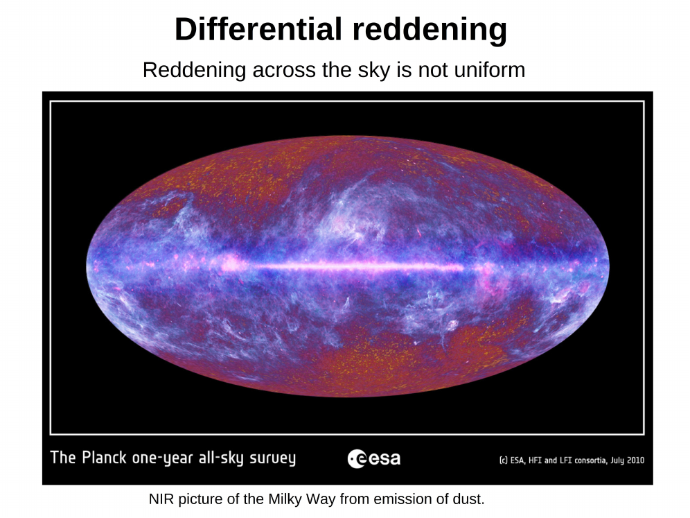
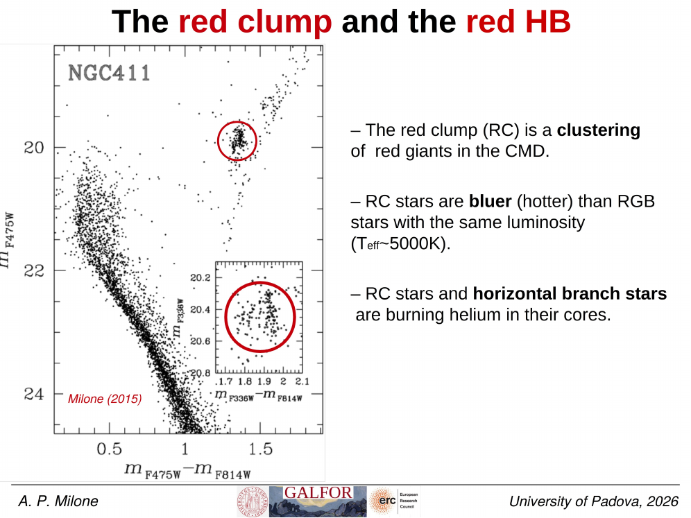
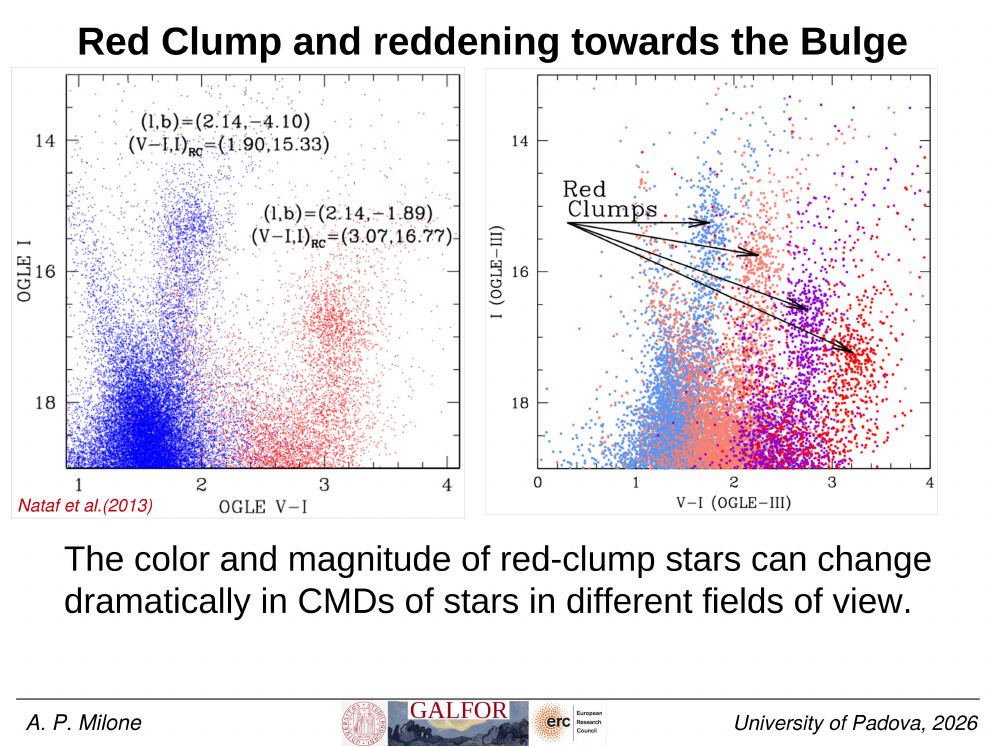
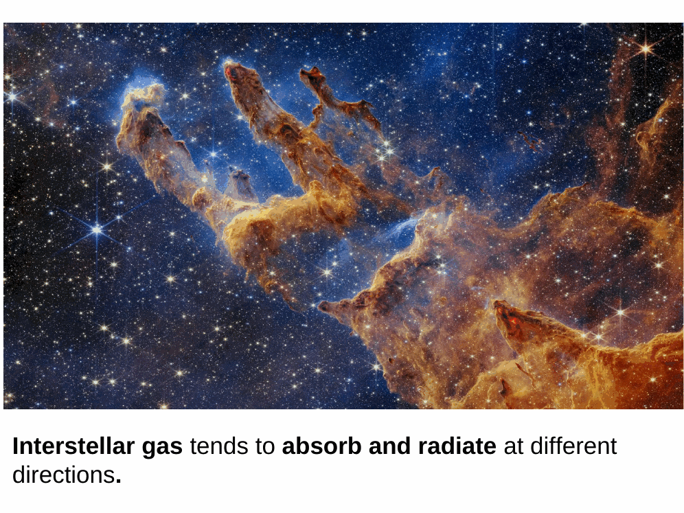


**differential reddening (DR)** is the spatial variation in interstellar reddening $E(B-V)$ across a star cluster field, caused by patchy dust distribution along the line of sight. it artificially broadens cluster sequences (MS, RGB, HB) on the CMD and can mimic [multiple populations](./Multiple%20populations%20in%20GCs%20discovery.html) or metallicity spreads. a high-resolution DR map allows correction.

## the Milone et al. 2012 method

the standard DR-mapping technique was developed by **Milone et al. 2012, A&A 540, A16** and is now used routinely in cluster CMD analysis. it works as follows:

### step 1: define a fiducial CMD ridge

select a clean cluster region (e.g., the MS in a single small subfield) + identify cluster members via PM or membership probability. fit a smooth fiducial line (median ridge) through the MS or RGB locus on the CMD.

### step 2: compute per-star CMD offsets

for each cluster member star at position $(x, y)$, measure its perpendicular displacement from the fiducial line in the direction of the **reddening vector**. the displacement is interpreted as a local extra reddening:

$$\Delta E(B-V)(x, y) = \frac{\Delta_{\rm offset}}{R_V}$$

(see [Interstellar reddening and the reddening vector](./Interstellar%20reddening%20and%20the%20reddening%20vector.html) for the geometry).

### step 3: interpolate spatial map

bin the cluster field into a $30 \times 30$ to $100 \times 100$ pixel grid, take the median $\Delta E(B-V)$ in each bin, smooth with a Gaussian kernel of $\sim 1$"-$10$" depending on dust structure scale.

### step 4: correct the photometry

for every star in the field (cluster member + non-member), apply $A_\lambda(\Delta E(B-V))$ to its photometry.

## applications

the technique has been applied to:

- **NGC 6791, NGC 6528, NGC 6553, M22, M2, $\omega$ Cen** — many MW GCs with substantial DR.
- **Baade Window** (Lagioia et al. 2014, ApJ 782, 50) — bulge field with NGC 6528 as DR tracer; high-resolution map across $\sim 4'$ HST/ACS field.
- **young LMC clusters** with eMSTOs to disentangle DR from rotation effects.
- **inner halo / disc fields** through dust lanes.

## results: typical DR amplitudes

typical $\sigma_{E(B-V)}$ across a single GC field:

| cluster | $\langle E(B-V) \rangle$ | $\sigma_{E(B-V)}$ |
|---|---|---|
| NGC 6791 (open) | 0.15 | 0.02 |
| NGC 6528 (bulge GC) | 0.55 | 0.06 |
| Baade Window | 0.5 | 0.1 |
| Liller 1 (bulge inner) | 3 | 0.3 |
| dust-free outer halo (e.g., NGC 5466) | 0.01 | $< 0.01$ |

the worst DR fields are inner-Galactic (bulge + bulge GCs), reaching $\sigma \sim 0.3$ across $\sim 1$' fields. without correction, this broadens the MS by $\sim 0.5$ mag, completely obscuring chromosome map signals.

## why this matters for multiple populations

in a typical inner-bulge GC, raw photometry shows an MS broadened by DR + intrinsic MP signal both at $\sim 0.05$-$0.15$ mag level. only after DR correction does the MP signature become visible. critically:

- without DR map, an apparent MS split could be a dust artifact;
- with DR map, the residual split is physical (He variations, light-element variations).

this is why Milone's DR mapping is a **prerequisite** for chromosome map construction in inner-Galactic clusters.

## limitations + caveats

- **resolution limit**: DR maps cannot probe scales smaller than the cluster member spacing in projection ($\sim$ a few arcsec for typical GCs);
- **isotropic assumption**: assumes $A_\lambda$ ratios are constant across the field; breaks down in dense regions where $R_V$ varies;
- **cluster ridge depends on age + metallicity**: poor cluster ridges (sparse, contaminated, eMSTO) give noisy DR maps;
- **non-cluster background field stars**: their CMD positions also depend on DR but their physical CMD locus is unknown.

modern variants use Gaia-based field stars + RC stars + multiple stars per pixel for finer resolution.

## reference papers

- **Milone et al. 2012, A&A 540, A16** — original technique using CMD offsets.
- **Lagioia et al. 2014, ApJ 782, 50** — high-resolution Baade Window map via NGC 6528.
- **Schlegel, Finkbeiner, Davis 1998 (SFD)** — full-sky DR map at $\sim 6'$ resolution.
- **Schlafly & Finkbeiner 2011** — recalibrated SFD.
- **Cardelli, Clayton, Mathis 1989** — extinction law underlying the corrections.
- **Bonatto et al. 2012** — alternative DR mapping via RC stars.

## see also

- [Effects of differential reddening on CMD analysis](./Effects%20of%20differential%20reddening%20on%20CMD%20analysis.html)
- [Interstellar reddening and the reddening vector](./Interstellar%20reddening%20and%20the%20reddening%20vector.html)
- [Extinction law and Rv](./Extinction%20law%20and%20Rv.html)
- [Bulge CMD complications](./Bulge%20CMD%20complications.html)
- [Photometric chromosome maps](./Photometric%20chromosome%20maps.html)
- [Multiple populations in GCs discovery](./Multiple%20populations%20in%20GCs%20discovery.html)
- [Stellar_Astrophysics_MOC](../../04_Atlas/Stellar_Astrophysics_MOC.html)

---

## Complete Lecture Slide Panels & Observational Evidence (Lecture 10 — Differential Reddening Correction Techniques)

> **Context**: *Spatial dust variations across cluster fields, Milone et al. (2012) fiducial ridge mapping, local reference star de-reddening vectors, and sequence sharpening.*

The following slides from Prof. Antonino Milone's lecture series provide the direct observational, photometric, and theoretical foundations for this topic:

*Figure P10-01: LAntonino_p10_01.png — Observational data, CMD morphology, and diagnostics from Lecture 10 — Differential Reddening Correction Techniques.*

*Figure P10-02: LAntonino_p10_02.png — Observational data, CMD morphology, and diagnostics from Lecture 10 — Differential Reddening Correction Techniques.*

*Figure P10-03: LAntonino_p10_03.png — Observational data, CMD morphology, and diagnostics from Lecture 10 — Differential Reddening Correction Techniques.*

*Figure P10-04: LAntonino_p10_04.png — Observational data, CMD morphology, and diagnostics from Lecture 10 — Differential Reddening Correction Techniques.*

*Figure P10-05: LAntonino_p10_05.png — Observational data, CMD morphology, and diagnostics from Lecture 10 — Differential Reddening Correction Techniques.*

*Figure P10-06: LAntonino_p10_06.png — Observational data, CMD morphology, and diagnostics from Lecture 10 — Differential Reddening Correction Techniques.*

*Figure P10-07: LAntonino_p10_07.png — Observational data, CMD morphology, and diagnostics from Lecture 10 — Differential Reddening Correction Techniques.*

*Figure P10-08: LAntonino_p10_08.png — Observational data, CMD morphology, and diagnostics from Lecture 10 — Differential Reddening Correction Techniques.*

*Figure P10-09: LAntonino_p10_09.png — Observational data, CMD morphology, and diagnostics from Lecture 10 — Differential Reddening Correction Techniques.*

*Figure P10-10: LAntonino_p10_10.png — Observational data, CMD morphology, and diagnostics from Lecture 10 — Differential Reddening Correction Techniques.*

*Figure P10-11: LAntonino_p10_11.png — Observational data, CMD morphology, and diagnostics from Lecture 10 — Differential Reddening Correction Techniques.*

*Figure P10-12: LAntonino_p10_12.png — Observational data, CMD morphology, and diagnostics from Lecture 10 — Differential Reddening Correction Techniques.*

*Figure P10-13: LAntonino_p10_13.png — Observational data, CMD morphology, and diagnostics from Lecture 10 — Differential Reddening Correction Techniques.*

*Figure P10-14: LAntonino_p10_14.png — Observational data, CMD morphology, and diagnostics from Lecture 10 — Differential Reddening Correction Techniques.*

*Figure P10-15: LAntonino_p10_15.png — Observational data, CMD morphology, and diagnostics from Lecture 10 — Differential Reddening Correction Techniques.*

*Figure P10-16: LAntonino_p10_16.png — Observational data, CMD morphology, and diagnostics from Lecture 10 — Differential Reddening Correction Techniques.*

*Figure P10-17: LAntonino_p10_17.png — Observational data, CMD morphology, and diagnostics from Lecture 10 — Differential Reddening Correction Techniques.*

*Figure P10-18: LAntonino_p10_18.png — Observational data, CMD morphology, and diagnostics from Lecture 10 — Differential Reddening Correction Techniques.*

*Figure P10-19: LAntonino_p10_19.png — Observational data, CMD morphology, and diagnostics from Lecture 10 — Differential Reddening Correction Techniques.*

*Figure P10-20: LAntonino_p10_20.png — Observational data, CMD morphology, and diagnostics from Lecture 10 — Differential Reddening Correction Techniques.*

*Figure P10-21: LAntonino_p10_21.png — Observational data, CMD morphology, and diagnostics from Lecture 10 — Differential Reddening Correction Techniques.*

*Figure P10-22: LAntonino_p10_22.png — Observational data, CMD morphology, and diagnostics from Lecture 10 — Differential Reddening Correction Techniques.*

*Figure P10-23: LAntonino_p10_23.png — Observational data, CMD morphology, and diagnostics from Lecture 10 — Differential Reddening Correction Techniques.*

*Figure P10-24: LAntonino_p10_24.png — Observational data, CMD morphology, and diagnostics from Lecture 10 — Differential Reddening Correction Techniques.*

*Figure P10-25: LAntonino_p10_25.png — Observational data, CMD morphology, and diagnostics from Lecture 10 — Differential Reddening Correction Techniques.*

*Figure P10-26: Lecture10_p15-15.png — Observational data, CMD morphology, and diagnostics from Lecture 10 — Differential Reddening Correction Techniques.*

*Figure P10-27: Lecture10_p25-25.png — Observational data, CMD morphology, and diagnostics from Lecture 10 — Differential Reddening Correction Techniques.*

*Figure P10-28: Lecture10_p35-35.png — Observational data, CMD morphology, and diagnostics from Lecture 10 — Differential Reddening Correction Techniques.*

*Figure P10-29: Lecture10_p5-05.png — Observational data, CMD morphology, and diagnostics from Lecture 10 — Differential Reddening Correction Techniques.*


  <h4 class="backlinks-title">Linked References (3)</h4>
  <ul class="backlinks-list">
    <li class="backlink-item-wrap"><a href="./Bulge%20CMD%20complications.html" class="backlink-item">Bulge CMD complications</a></li>
    <li class="backlink-item-wrap"><a href="./Effects%20of%20differential%20reddening%20on%20CMD%20analysis.html" class="backlink-item">Effects of differential reddening on CMD analysis</a></li>
    <li class="backlink-item-wrap"><a href="../../04_Atlas/Stellar_Astrophysics_MOC.html" class="backlink-item">Stellar_Astrophysics_MOC</a></li>
  </ul>

