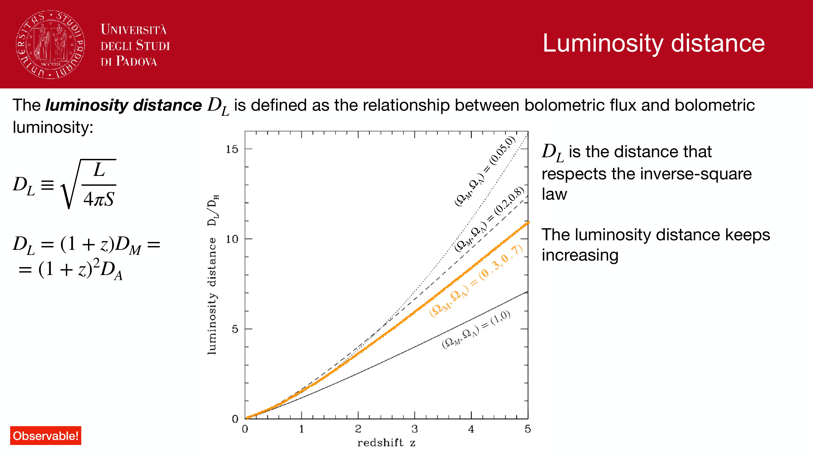
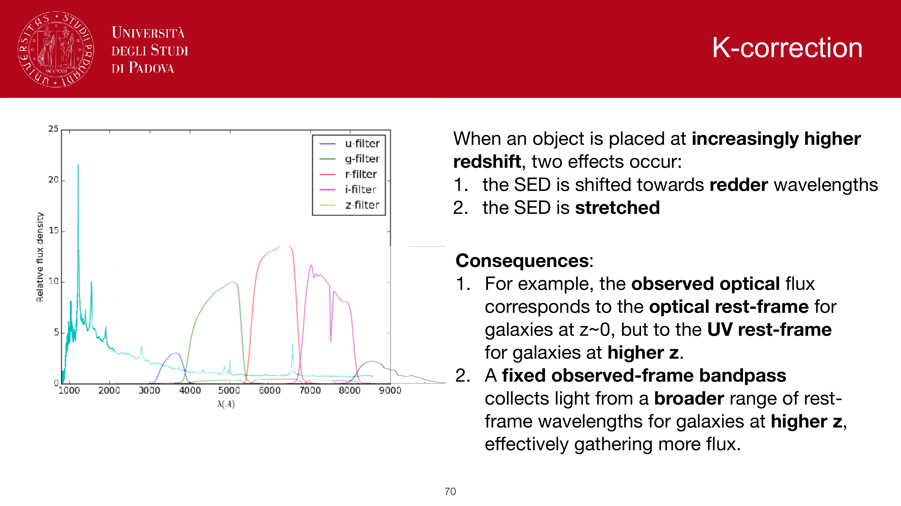
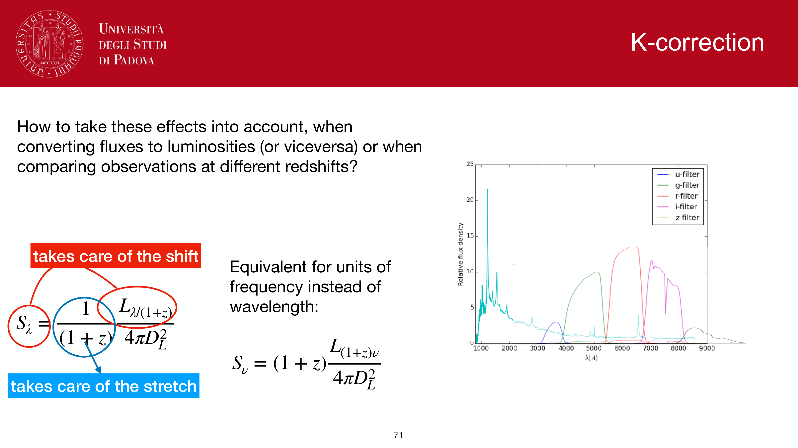
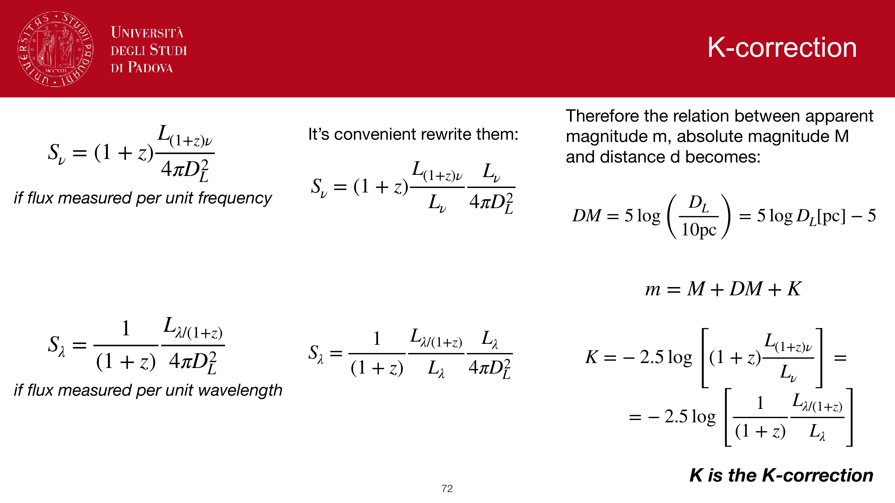
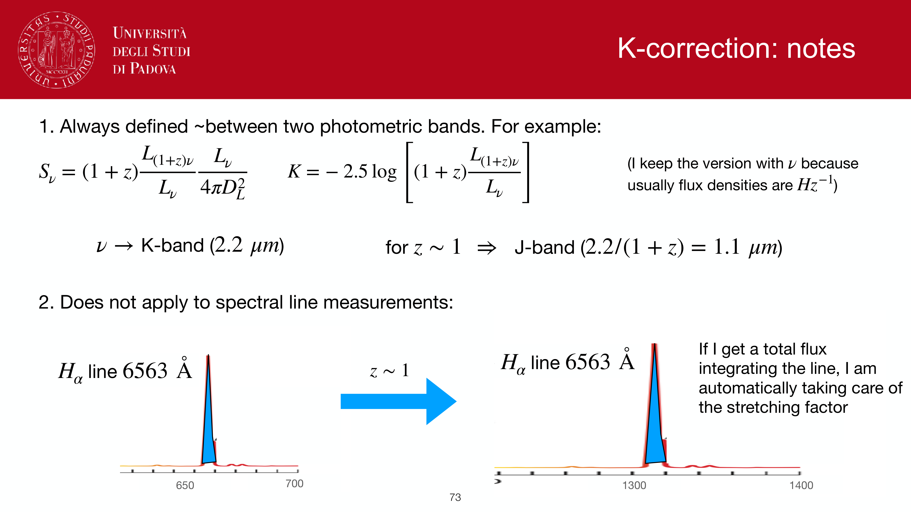
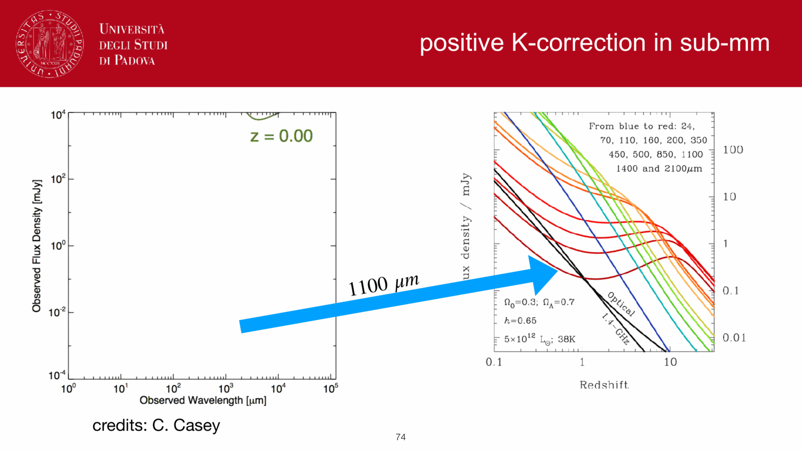
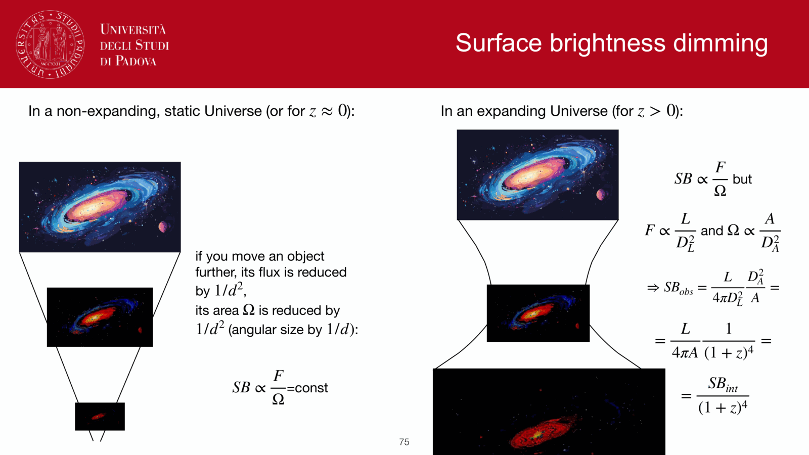
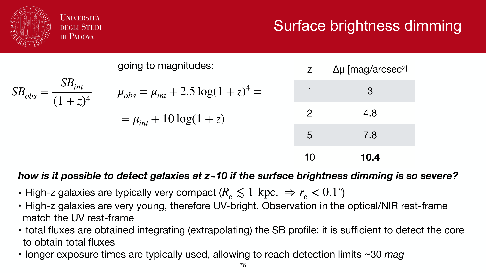


a comprehensive companion to [Observational_Astrophysics_MOC](../../04_Atlas/Observational_Astrophysics_MOC.html) Block 5. the goal is to derive every rung of the distance ladder, from the AU outward to the Hubble flow, with the geometry shown explicitly each time. this is the master "where does this distance come from" note.

source: Lecture 5 ("Distance ladder") of the Obs Astrophysics course at U Padua, plus the user's exam-answer drafts `obs1.pdf` (AU + parallax) and `obs2.pdf` (distance modulus + dust + Hubble). companion to [Cosmic_inventory_photons_derivation](./Cosmic_inventory_photons_derivation.html) in style.

---

## why a ladder

every distance method has a limited range. nothing reaches from $1$ AU to $10^{10}$ pc in one step. so we **calibrate** each method against the next-shorter one, building a chain. each rung introduces one observational technique and inherits all the systematic errors of the rungs below. this is why $H_0$ measurements are still controversial; the chain has $\sim 5$ links, each with its own $\sim 1\%$ systematic.

the rungs in order:
1. **AU** from Earth-Venus distance + Kepler.
2. **parallax** for stars within a few hundred pc, defining the parsec.
3. **spectroscopic parallax** and **main-sequence fitting** for clusters.
4. **variable stars** (RR Lyrae, Cepheids) and the **TRGB** for nearby galaxies.
5. **Tully-Fisher**, **fundamental plane**, **SBF**, **SN Ia** for the Hubble flow.
6. **Hubble's law** from $cz/H_0$ for everything beyond $\sim 100$ Mpc.

at each rung I will write: the geometry, the formula, the calibration source, and the practical limits.

---

## rung 1, the AU from Earth-Venus distance

### the historical version (transits)

a **transit** of Venus across the Sun is observed simultaneously from two locations on Earth separated by a baseline $B$ (typically $\sim$ several thousand km, roughly Earth's diameter projected onto the line of sight). the two observers see Venus tracking slightly different chords across the solar disk. the angular shift $\theta$ of the apparent Venus position is related to the Earth-Venus distance $d_{EV}$ by simple parallax geometry:
$$\theta = \frac{B}{d_{EV}}\,\left(1 - \frac{a_V}{a_E}\right)^{-1}$$
the factor $(1 - a_V/a_E)$ accounts for the fact that the Sun behind Venus is also a finite distance away, so the parallax baseline is effectively shortened. with the Venus-Earth orbital ratio known from periods (next step), this is solvable.

historical Venus transits used for this: $1761$, $1769$ (Captain Cook's voyage to Tahiti), $1874$, $1882$. Mercury transits work too, with smaller signal.

### the modern version (radar)

since the 1960s, a radar pulse is sent from Earth, reflected off Venus, and the round-trip time $t$ measured. the speed of light is known to $9$ digits, so:
$$d_{EV} = \frac{c\, t}{2}$$
this is direct, geometric, and now defines the AU at $\sim 1$ part in $10^{11}$.

a side note: the received radar power scales as $1/d^4$ because the pulse spreads on the way out *and* on the way back. for the Earth-Venus distance ($\sim 0.3$ AU) this is feasible with a few-MW transmitter; pushing radar much further runs into the inverse-fourth-power wall.

### Kepler converts $d_{EV}$ to AU

Kepler's third law for circular orbits in the solar system: $P^2 \propto a^3$ with $G(M_\odot + m) \approx GM_\odot$ for any planet. taking the ratio for Earth and Venus,
$$\left(\frac{P_V}{P_E}\right)^2 = \left(\frac{a_V}{a_E}\right)^3$$
so the orbital ratio $a_V/a_E$ comes from periods alone, observable to high precision over centuries.

at **inferior conjunction** (Venus between Earth and Sun, so collinear), the geometry is the simplest: $d_{EV} = a_E - a_V$. solving:
$$a_E = \frac{d_{EV}}{1 - a_V/a_E}$$
and $a_V/a_E$ is known. plug in $d_{EV}$ in km from radar, get $a_E = 1$ AU $\simeq 1.496 \times 10^8$ km.

modern value, defined by IAU 2012: $1$ AU $\equiv 149\,597\,870\,700$ m exactly.

---

## rung 2, annual stellar parallax

once the AU is known, Earth's orbit is itself a $2$ AU baseline. observe a nearby star from two opposite points in Earth's orbit (six months apart). the star appears to shift against the much-more-distant background stars by the **parallax angle** $p$.

geometry (small-angle approximation):
$$\tan p \approx p = \frac{1\,\text{AU}}{d}$$

definition of the **parsec**: the distance at which $1$ AU subtends $1$ arcsecond.
$$1\,\text{pc} \equiv \frac{1\,\text{AU}}{1\,\text{arcsec}} \times \frac{180 \cdot 3600}{\pi} = 3.086 \times 10^{16}\,\text{m} = 3.262\,\text{light-years}$$

the practical formula:
$$\boxed{\, d(\text{pc}) = \frac{1}{p(\text{arcsec})} \,}$$

**range and precision**:
- naked eye + photographic plates (Bessel 1838 for 61 Cyg): $\sim 10$ pc.
- Hipparcos (1989-1993): $\sim 100$ pc with $\sim 1$ mas precision.
- Gaia DR3 (2022): $\sim 1$ to $10$ kpc with $10\,\mu$as for bright stars; first global geometric distance scale across the Galaxy.

parallax is **the only fully geometric method** in the entire ladder. every rung above it depends on parallax-calibrated standard candles. when Gaia released DR3 with parallaxes for tens of millions of stars, every rung above tightened simultaneously.

---

## rung 3, distance modulus and standard candles

### the magnitude scale

flux scales as $F \propto 1/d^2$ for isotropic emission (the inverse-square law). magnitudes are logarithmic flux ratios (Pogson):
$$m_1 - m_2 = -2.5 \log_{10}\!\left(\frac{F_1}{F_2}\right)$$

so for a single source seen at distances $d_1$ and $d_2$:
$$m_1 - m_2 = +2.5 \log_{10}\!\left(\frac{d_1^2}{d_2^2}\right) = 5 \log_{10}\!\left(\frac{d_1}{d_2}\right)$$

### the distance modulus

define **absolute magnitude** $M$ as the magnitude the source would have at $d = 10$ pc. setting $d_2 = 10$ pc, $m_2 = M$, $d_1 = d$, $m_1 = m$:
$$\boxed{\, m - M = 5 \log_{10}\!\left(\frac{d}{10\,\text{pc}}\right) = 5\log_{10}(d_{\rm pc}) - 5\,}$$

this is the **distance modulus** $\mu \equiv m - M$. a star at $10$ pc has $\mu = 0$. at $1$ kpc, $\mu = 10$. at $10$ Mpc, $\mu = 30$. at $1$ Gpc, $\mu = 40$. very compact way to talk about distances.

quick check: $m_V = 10$, $M_V = 5$, then $\mu = 5$, $\log_{10}(d_{\rm pc}) = 2$, $d = 100$ pc. matches `obs2.pdf`.

### dust correction

extinction $A_\lambda$ dims the source by $A_\lambda$ magnitudes in band $\lambda$. so the observed magnitude is brighter by $A_\lambda$ than what the inverse-square law alone predicts:
$$m_{\rm obs} = m_0 + A_\lambda$$
where $m_0$ is the magnitude that would be observed if no dust intervened. the correct distance modulus is therefore
$$\mu = m_{\rm obs} - M - A_\lambda$$
correcting for dust *reduces* $\mu$, so the inferred distance is *smaller* than the naive estimate. this is the punchline of `obs2.pdf` part 2.

reddening: extinction is wavelength-dependent, stronger in the blue, so colors get redder. quantified by $E(B-V) = A_B - A_V$ and $R_V \equiv A_V/E(B-V) \approx 3.1$ for diffuse Galactic ISM. determining $E(B-V)$ from a measured color excess (e.g. by comparing observed colors to intrinsic colors expected for the spectral type, or from the **Balmer decrement** $F(H\alpha)/F(H\beta)$ vs the case-B intrinsic ratio of $2.86$) gives me $A_V$ and hence the dust-corrected distance.

### standard candles

if I know $M$ from physics, then measuring $m$ (and correcting for dust) gives me $d$. the candles, in increasing range:

- **main-sequence stars** of known spectral type: $M_V$ tabulated. spectroscopic parallax. range: cluster distances within the Galaxy.
- **RR Lyrae**: horizontal-branch pulsators, $M_V \approx +0.5$ with mild metallicity dependence. range: globular clusters, halo, Magellanic Clouds.
- **classical Cepheids** (Pop I): pulsation **period-luminosity relation** (Henrietta Leavitt 1908):
$$M_V \approx -2.78 \log_{10} P(\text{days}) - 1.35$$
(Madore & Freedman calibration). Cepheids are bright ($M_V$ down to $-7$), live in the disks of star-forming galaxies, observable to $\sim 30$ Mpc with HST.
- **TRGB**: at the helium flash, the tip of the red giant branch sits at a fixed $M_I \approx -4.0$, almost insensitive to age and metallicity. detectable as a sharp edge in the I-band luminosity function. competitive with Cepheids for nearby galaxies, less prone to dust.
- **SN Ia**: thermonuclear explosions of $\sim 1.4\,M_\odot$ white dwarfs; intrinsic $M_V \approx -19.3$ with $\sim 0.4$ mag spread, narrowed to $\sim 0.15$ mag using the **Phillips relation** between peak brightness and decline rate $\Delta m_{15}$:
$$M_V^{\rm peak} = M_V^0 - \alpha (\Delta m_{15} - 1.1)$$
range: $z \sim 1$, the workhorse for cosmology.

each candle is calibrated against the rung below. parallax to Galactic Cepheids; Cepheids in galaxies hosting SN Ia; SN Ia out to cosmological distances. break a single rung and the whole ladder shifts.

---

## rung 4, the Hubble flow

at $z \gtrsim 0.01$, peculiar velocities ($\sim 300$ km/s) are small compared to the cosmic recession ($v = H_0 d \gtrsim 700$ km/s at $\sim 10$ Mpc, much bigger at higher $z$), and the Hubble flow takes over.

### redshift from spectra

the observed wavelength of a known emission/absorption line is shifted relative to its rest wavelength:
$$\boxed{\, z = \frac{\lambda_{\rm obs} - \lambda_{\rm rest}}{\lambda_{\rm rest}} \,}$$

at small $z$, recession velocity $v \approx cz$ (special-relativistic Doppler, low-velocity limit). for `obs2.pdf`'s example, $H\alpha$ rest at $656.3$ nm observed at $721.9$ nm gives $z = 0.10$, $v \approx 30\,000$ km/s, $d = cz/H_0 \approx 430$ Mpc for $H_0 = 70$ km/s/Mpc.

### Hubble's law

at low redshift,
$$v = H_0 d \quad\Rightarrow\quad d \approx \frac{cz}{H_0}$$

the **Hubble diagram** plots $cz$ (or $v$) vs $d$, and the slope is $H_0$. Hubble's original 1929 plot only reached $\sim 2$ Mpc; modern Hubble diagrams using SN Ia reach $z \sim 1$.

### caveats

three things break the simple $cz/H_0$ formula:
1. **peculiar velocities**: at $z \lesssim 0.01$, peculiar motion of the host galaxy can be a $\sim 30\%$ correction. that is why low-$z$ Hubble-law distances are unreliable; you need either many galaxies (averaging out) or independent distance estimators (Tully-Fisher, SN Ia at $z \sim 0.01$ to $0.1$).
2. **cosmological dependence**: at $z \gtrsim 0.1$, the simple $v = cz$ Doppler approximation breaks. the proper distance depends on the full FLRW solution:
$$d_L(z) = (1+z) \frac{c}{H_0}\int_0^z \frac{dz'}{\sqrt{\Omega_m(1+z')^3 + \Omega_\Lambda}}$$
(flat $\Lambda$CDM). this is what makes high-$z$ SN Ia so useful: their Hubble diagram constrains $\Omega_m$ and $\Omega_\Lambda$. see [Luminosity distance](./Luminosity%20distance.html).
3. **K-correction**: at high $z$ a fixed-band magnitude samples a different rest-frame wavelength than at $z = 0$. the K-correction translates between them. see [K-correction](./K-correction.html) and [K-correction in optical vs sub-mm](./K-correction%20in%20optical%20vs%20sub-mm.html).

### the modern $H_0$ tension

the local distance ladder (parallax → Cepheids → SN Ia, the Riess SH0ES program) gives $H_0 = 73.04 \pm 1.04$ km/s/Mpc.

the CMB-anchored value (Planck $\Lambda$CDM extrapolation) gives $H_0 = 67.4 \pm 0.5$ km/s/Mpc.

these disagree at $\sim 5\sigma$. resolving the tension is one of the live problems of cosmology in 2026. it is either a systematic in the local ladder (TRGB cross-checks, Carnegie-Chicago Hubble Program) or new physics in the early universe (early dark energy, $N_{\rm eff}$, etc.).

---

## the conceptual picture

```
   AU (radar + Kepler)
         |
         v 1.496e8 km
   parallax  d(pc) = 1/p(arcsec)
         |
         v parsec defined
   spectroscopic parallax + MS fitting
         |
         v Galactic clusters
   variable stars (RR Lyrae, Cepheids), TRGB
         |
         v Local Group + Virgo
   SN Ia (Phillips relation), Tully-Fisher, FP, SBF
         |
         v ~ 100 Mpc to ~ 1 Gpc
   Hubble flow  d ~ cz / H_0
         |
         v cosmology
   d_L(z) from FLRW integral
```

each downward step inherits the calibration of the step above it. systematic errors compound. so far the cross-checks (TRGB vs Cepheids, multiple SN Ia hosts) are concordant at the few-percent level, except for the $H_0$ tension itself.

---

## what this block buys me on the exam

structure for any oral question on distances:
1. **define the parsec** from $1$ AU at $1$ arcsec.
2. **distinguish geometric (parallax) from candle-based methods**.
3. **state the distance modulus** $m - M = 5\log_{10}(d_{\rm pc}) - 5$ and apply with dust as $\mu = m - M - A_\lambda$.
4. **walk the ladder**: AU → parallax → MS fitting / Cepheids / TRGB → SN Ia / Tully-Fisher → Hubble flow.
5. **state Hubble's law** and the redshift definition.
6. **mention caveats**: peculiar velocities at low $z$, cosmology-dependence at high $z$, K-correction, $H_0$ tension.

if asked to derive on the board, the two derivations to have ready cold are:
- distance modulus from inverse-square law + Pogson (`obs2.pdf` part 1).
- AU from Kepler + Earth-Venus distance (`obs1.pdf`).

---

## TL;DR

start at $1$ AU calibrated by radar to nine digits, propagate to nearby stars by parallax (defining the parsec), to clusters by spectroscopic parallax, to galaxies by Cepheids and TRGB, to cosmological distances by SN Ia, and out to the Hubble flow by $d \approx cz/H_0$ with FLRW corrections at $z \gtrsim 0.1$. every distance in astronomy ultimately rests on the radar bounce off Venus.

---

## see also

- [Observational_Astrophysics_MOC](../../04_Atlas/Observational_Astrophysics_MOC.html) — Block 5 lives here
- [Observational_Cosmology_MOC](../../04_Atlas/Observational_Cosmology_MOC.html) — Block 1 (Distances in cosmology) extends this to high $z$
- [Luminosity distance](./Luminosity%20distance.html) / [Angular diameter distance](./Angular%20diameter%20distance.html) / [Radial comoving distance](./Radial%20comoving%20distance.html)
- [Distance modulus](./Distance%20modulus.html)
- [Hubble law](./Hubble%20law.html)
- [Cosmological redshift](./Cosmological%20redshift.html)
- [K-correction](./K-correction.html)
- [K-correction in optical vs sub-mm](./K-correction%20in%20optical%20vs%20sub-mm.html)
- [Supernova Hubble diagram](./Supernova%20Hubble%20diagram.html)
- [Cepheid period-luminosity relation](./Cepheid%20period-luminosity%20relation.html)
- [TRGB tip of the red giant branch](./TRGB%20tip%20of%20the%20red%20giant%20branch.html)
- [Type Ia supernovae as standard candles](./Type%20Ia%20supernovae%20as%20standard%20candles.html)
- [Earth atmosphere for observations](./Earth%20atmosphere%20for%20observations.html) — what limits the parallax precision
- [CCD detectors and SNR](./CCD%20detectors%20and%20SNR.html) — what enables the photometry that anchors every candle
- [Cosmic_inventory_overview](./Cosmic_inventory_overview.html) — where the cosmic distance scale connects to the budget
- [Fundamentals_Astrophysics_Cosmology_MOC](../../04_Atlas/Fundamentals_Astrophysics_Cosmology_MOC.html)

---

## observational astrophysics course slides (Prof. Paolo Cassata)


*Complete synthesis of the cosmic distance ladder from AU to Hubble flow.*


*Error propagation along distance ladder rungs: delta d / d = sqrt(sum (sigma_i^2)).*


*Systematic vs statistical error budgets in modern distance scale determinations.*


*Gaia DR3 parallax recalibration of Cepheid and TRGB zero points.*


*JWST observations testing Cepheid crowding and metallicity corrections.*


*Gravitational wave standard sirens: independent cosmological distance determination.*


*Baryon Acoustic Oscillations (BAO) as standard cosmological ruler.*


*Summary table of all distance ladder techniques and valid distance ranges.*


<div class="backlinks-section">
  <h4 class="backlinks-title">Linked References (22)</h4>
  <ul class="backlinks-list">
    <li class="backlink-item-wrap"><a href="./AU%20calibration%20parallax%20and%20parsec.html" class="backlink-item">AU calibration parallax and parsec</a></li>
    <li class="backlink-item-wrap"><a href="./Annual%20stellar%20parallax.html" class="backlink-item">Annual stellar parallax</a></li>
    <li class="backlink-item-wrap"><a href="./CCD%20detectors%20and%20SNR.html" class="backlink-item">CCD detectors and SNR</a></li>
    <li class="backlink-item-wrap"><a href="./Cepheid%20period-luminosity%20relation.html" class="backlink-item">Cepheid period-luminosity relation</a></li>
    <li class="backlink-item-wrap"><a href="./Cepheids%20and%20supernovae.html" class="backlink-item">Cepheids and supernovae</a></li>
    <li class="backlink-item-wrap"><a href="./Distance%20modulus.html" class="backlink-item">Distance modulus</a></li>
    <li class="backlink-item-wrap"><a href="./Hubble%20flow%20distances.html" class="backlink-item">Hubble flow distances</a></li>
    <li class="backlink-item-wrap"><a href="./Hubble%20law.html" class="backlink-item">Hubble law</a></li>
    <li class="backlink-item-wrap"><a href="./K-correction.html" class="backlink-item">K-correction</a></li>
    <li class="backlink-item-wrap"><a href="./LambdaCDM%20current%20parameters.html" class="backlink-item">LambdaCDM current parameters</a></li>
    <li class="backlink-item-wrap"><a href="./Moving%20cluster%20method.html" class="backlink-item">Moving cluster method</a></li>
    <li class="backlink-item-wrap"><a href="./Obs_astro_course_intro.html" class="backlink-item">Obs_astro_course_intro</a></li>
    <li class="backlink-item-wrap"><a href="../../04_Atlas/Observational_Astrophysics_MOC.html" class="backlink-item">Observational_Astrophysics_MOC</a></li>
    <li class="backlink-item-wrap"><a href="./Precession%20nutation%20aberration%20parallax.html" class="backlink-item">Precession nutation aberration parallax</a></li>
    <li class="backlink-item-wrap"><a href="./Spectroscopic%20parallax%20and%20main-sequence%20fitting.html" class="backlink-item">Spectroscopic parallax and main-sequence fitting</a></li>
    <li class="backlink-item-wrap"><a href="./Spectroscopic%20redshift%20from%20line%20shifts.html" class="backlink-item">Spectroscopic redshift from line shifts</a></li>
    <li class="backlink-item-wrap"><a href="./Supernova%20Hubble%20diagram.html" class="backlink-item">Supernova Hubble diagram</a></li>
    <li class="backlink-item-wrap"><a href="./Surface%20brightness%20fluctuations.html" class="backlink-item">Surface brightness fluctuations</a></li>
    <li class="backlink-item-wrap"><a href="./TRGB%20tip%20of%20the%20red%20giant%20branch.html" class="backlink-item">TRGB tip of the red giant branch</a></li>
    <li class="backlink-item-wrap"><a href="./Useful%20constants%20and%20conversions.html" class="backlink-item">Useful constants and conversions</a></li>
    <li class="backlink-item-wrap"><a href="./Variable%20stars%20as%20standard%20candles.html" class="backlink-item">Variable stars as standard candles</a></li>
    <li class="backlink-item-wrap"><a href="./%CE%9BCDM%20current%20parameters.html" class="backlink-item">ΛCDM current parameters</a></li>
  </ul>
</div>
