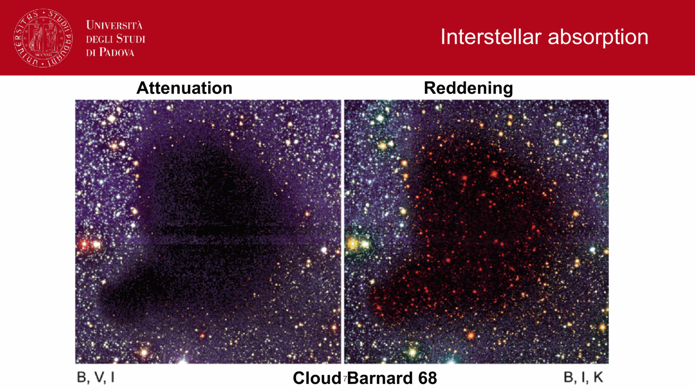
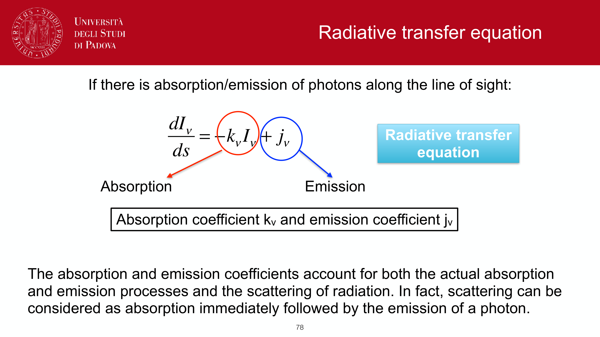
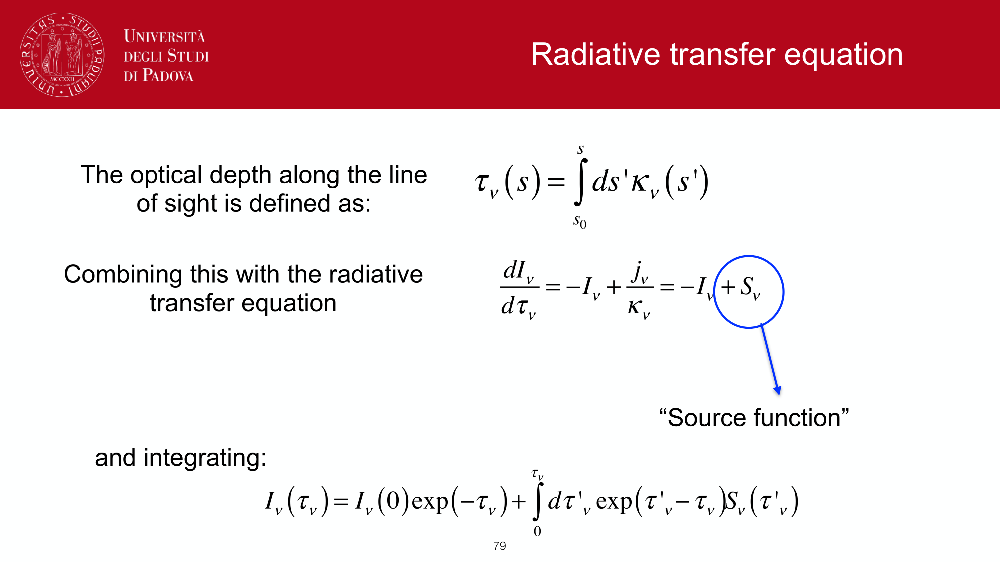
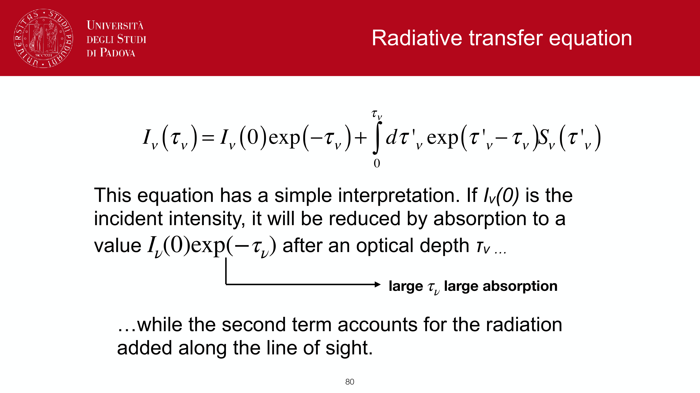


the distance modulus is a logarithmic measure of distance, expressed as a magnitude difference. answer to `obs2.pdf` part 1.

## the derivation

inverse-square law: $F \propto 1/d^2$. take two observers of the same source at distances $d_1$ and $d_2$:
$$\frac{F_1}{F_2} = \left(\frac{d_2}{d_1}\right)^2$$

apply Pogson:
$$m_1 - m_2 = -2.5 \log_{10}(F_1/F_2) = +2.5 \log_{10}(d_1^2/d_2^2) = 5 \log_{10}(d_1/d_2)$$

now define **absolute magnitude** $M$: the magnitude the source would have if placed at $d_{\rm ref} = 10$ pc. setting $d_2 = 10$ pc, $m_2 = M$, $d_1 = d$, $m_1 = m$:

$$\boxed{\, \mu \equiv m - M = 5\log_{10}(d/10\,\text{pc}) = 5\log_{10}(d_{\rm pc}) - 5 \,}$$

equivalently:
$$d = 10^{(\mu + 5)/5}\,\text{pc} = 10^{1 + \mu/5}\,\text{pc}$$

## benchmark values

| object | $d$ | $\mu$ |
|---|---|---|
| Sun | 1 AU | $-31.57$ |
| Alpha Centauri | $1.3$ pc | $-4.4$ |
| Hyades cluster | $46$ pc | $3.3$ |
| Pleiades | $135$ pc | $5.6$ |
| Galactic centre | $8.2$ kpc | $14.6$ |
| LMC | $50$ kpc | $18.5$ |
| M31 | $760$ kpc | $24.4$ |
| Virgo cluster | $16.5$ Mpc | $31.1$ |
| $z = 1$ (in $\Lambda$CDM) | $\sim 6.6$ Gpc ($d_L$) | $\sim 44$ |

a useful rule of thumb: each $\Delta\mu = 5$ corresponds to factor 10 in distance, $\Delta\mu = 1$ to factor $10^{0.2} \approx 1.585$.

## with extinction

dust dims by $A_\lambda$ magnitudes in band $\lambda$. observed magnitude is brighter by $A_\lambda$ than what the inverse-square law alone predicts:
$$m_{\rm obs} = m_0 + A_\lambda$$

so the **dust-corrected** distance modulus is:
$$\mu = m_{\rm obs} - M - A_\lambda$$

this is **smaller** than $m_{\rm obs} - M$, hence the inferred distance is **smaller** than the dust-naive estimate. forgetting to correct for $A_\lambda$ overestimates distance.

quick numerical example: $m_V = 15$, $M_V = 5$, $A_V = 1$.
- naive: $\mu = m - M = 10$, $d = 10^{15/5} = 1000$ pc.
- with dust: $\mu = m - M - A_V = 9$, $d = 10^{14/5} \approx 631$ pc.

## the cosmological generalisation

at cosmological distances, photons are redshifted (energy loss) and the arrival rate is dilated, so the simple $\mu = 5\log d - 5$ becomes
$$\mu = 5 \log_{10}(d_L/10\,\text{pc})$$
with $d_L$ the **luminosity distance**. for flat $\Lambda$CDM:
$$d_L(z) = (1+z)\,\frac{c}{H_0}\int_0^z \frac{dz'}{\sqrt{\Omega_m(1+z')^3 + \Omega_\Lambda}}$$

at low $z$, $d_L \approx cz/H_0$, recovering the Hubble flow. see [Luminosity distance](./Luminosity%20distance.html) and [Distance ladder derivations](./Distance%20ladder%20derivations.html).

at high $z$, an additional **K-correction** is needed because the observed band samples a different rest-frame wavelength than the calibrated $M$. see [K-correction](./K-correction.html).

## see also

- [Pogson magnitudes and flux relation](./Pogson%20magnitudes%20and%20flux%20relation.html)
- [Magnitudes and photometric systems](./Magnitudes%20and%20photometric%20systems.html)
- [Distance ladder derivations](./Distance%20ladder%20derivations.html)
- [Luminosity distance](./Luminosity%20distance.html)
- [Atmospheric extinction](interf/Atmospheric%20extinction.html)
- [Interstellar absorption](./Interstellar%20absorption.html)
- [K-correction](./K-correction.html)
- [Hubble law](./Hubble%20law.html)

---

## observational astrophysics course slides (Prof. Paolo Cassata)

*Distance modulus formula: mu = m - M = 5 log10(d / pc) - 5.*

*Distance modulus in terms of 10 pc: mu = 5 log10(d / 10 pc).*

*Extinction-corrected distance modulus: m - M = 5 log10(d / pc) - 5 + A_lambda.*

*Obs2 exam question: How distance modulus connects apparent brightness to physical distance.*


  <h4 class="backlinks-title">Linked References (15)</h4>
  <ul class="backlinks-list">
    <li class="backlink-item-wrap"><a href="./AU%20calibration%20parallax%20and%20parsec.html" class="backlink-item">AU calibration parallax and parsec</a></li>
    <li class="backlink-item-wrap"><a href="./Atmospheric%20extinction.html" class="backlink-item">Atmospheric extinction</a></li>
    <li class="backlink-item-wrap"><a href="interf/Atmospheric%20extinction.html" class="backlink-item">Atmospheric extinction</a></li>
    <li class="backlink-item-wrap"><a href="./Color-magnitude%20diagrams%20of%20clusters.html" class="backlink-item">Color-magnitude diagrams of clusters</a></li>
    <li class="backlink-item-wrap"><a href="./Distance%20ladder%20derivations.html" class="backlink-item">Distance ladder derivations</a></li>
    <li class="backlink-item-wrap"><a href="./Interstellar%20reddening%20and%20the%20reddening%20vector.html" class="backlink-item">Interstellar reddening and the reddening vector</a></li>
    <li class="backlink-item-wrap"><a href="./K-correction.html" class="backlink-item">K-correction</a></li>
    <li class="backlink-item-wrap"><a href="./Luminosity%20distance.html" class="backlink-item">Luminosity distance</a></li>
    <li class="backlink-item-wrap"><a href="./Moving%20cluster%20method.html" class="backlink-item">Moving cluster method</a></li>
    <li class="backlink-item-wrap"><a href="../../04_Atlas/Observational_Astrophysics_MOC.html" class="backlink-item">Observational_Astrophysics_MOC</a></li>
    <li class="backlink-item-wrap"><a href="./Pogson%20magnitudes%20and%20flux%20relation.html" class="backlink-item">Pogson magnitudes and flux relation</a></li>
    <li class="backlink-item-wrap"><a href="./Specific%20intensity%20flux%20luminosity.html" class="backlink-item">Specific intensity flux luminosity</a></li>
    <li class="backlink-item-wrap"><a href="./Spectroscopic%20parallax%20and%20main-sequence%20fitting.html" class="backlink-item">Spectroscopic parallax and main-sequence fitting</a></li>
    <li class="backlink-item-wrap"><a href="./Supernova%20Hubble%20diagram.html" class="backlink-item">Supernova Hubble diagram</a></li>
    <li class="backlink-item-wrap"><a href="./Useful%20constants%20and%20conversions.html" class="backlink-item">Useful constants and conversions</a></li>
  </ul>

