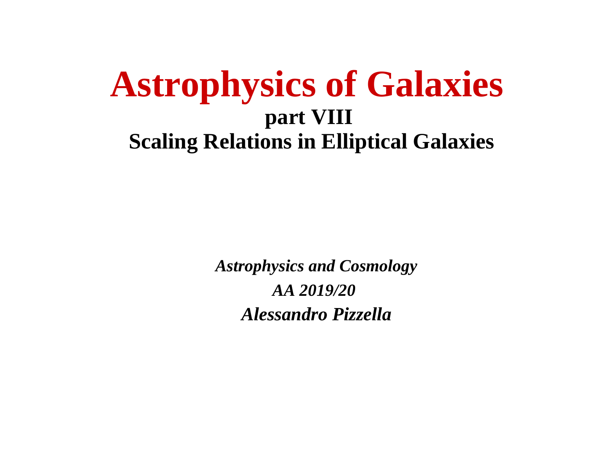
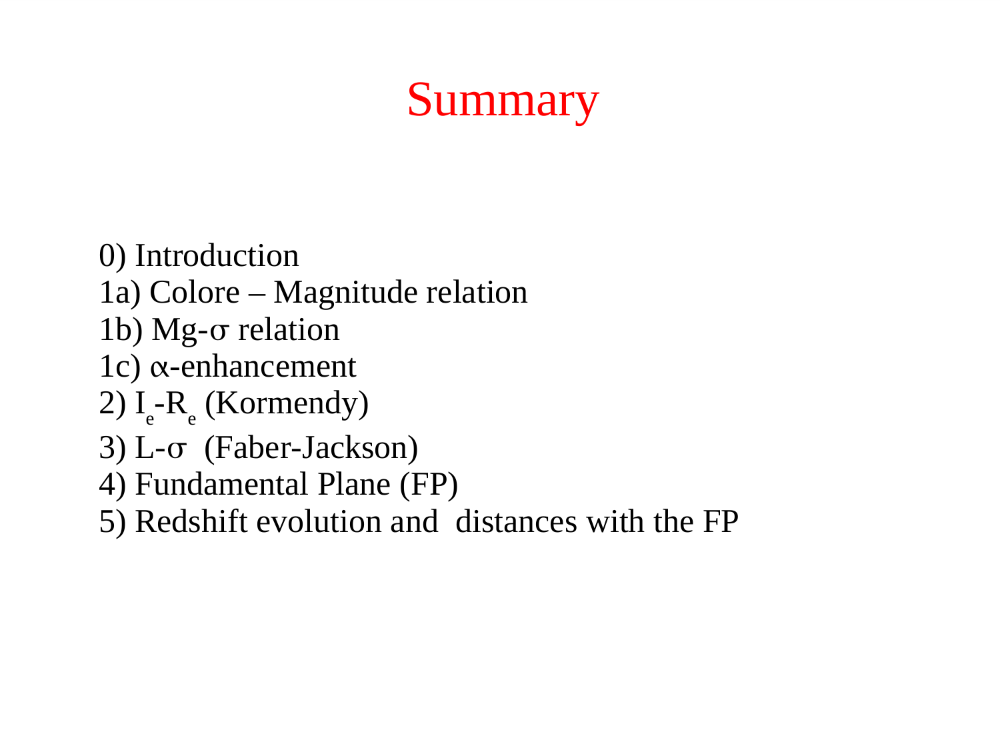
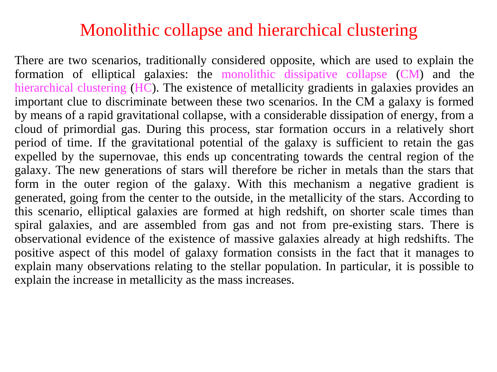

# Early-type galaxy stellar populations

Early-type galaxies (ETGs, comprising giant ellipticals E and lenticulars S0) contain more than $60\%$ of the total stellar mass in the local universe. Classically viewed as homogeneous, passively evolving systems of old, metal-rich stars formed in an early monolithic collapse ("red and dead"), modern spectrophotometric and integral field spectroscopic (IFU) surveys have revealed a significantly more nuanced, dynamic evolutionary picture. The stellar populations of ETGs obey strict downsizing relations - more massive galaxies formed their stars earlier (at redshifts $z \ge 2 - 5$), over substantially shorter star formation timescales ($\Delta t_{\rm SF} < 0.5 - 1.0$ Gyr), achieving higher metallicities ($[Z/H] > +0.2$) and pronounced $\alpha$-element overabundances ($[\alpha/\text{Fe}] \approx +0.3$). Disentangling stellar age from metallicity requires specialized absorption-line indices (the Lick/IDS system, combining $H\beta$ and the composite $[MgFe]'$ index) to break the classical Worthey age-metallicity degeneracy ($\Delta\log\text{Age} \approx -1.5 \Delta\log Z$). Furthermore, resolved 2D kinematics and spectral gradients demonstrate a two-phase assembly paradigm, wherein compact high-density cores formed in-situ via gas-rich dissipative starbursts, while their extended outer stellar envelopes were assembled via late, dissipationless dry minor mergers.

---

## 1. Formation Paradigms - Monolithic Collapse versus Two-Phase Assembly

### Classical Monolithic Collapse (ELS 1962)
In the classical monolithic collapse model (Eggen, Lynden-Bell & Sandage 1962; Larson 1974), early-type galaxies formed via a single, rapid gravitational collapse of a giant, primordial, gas-rich cloud at high redshift ($z > 3$). Star formation occurred on a free-fall timescale ($t_{\rm ff} \sim 10^8$ yr), rapidly converting all available gas into stars before violent relaxation established the smooth de Vaucouleurs ($R^{1/4}$) surface brightness profile. Because star formation ceased abruptly when supernova-driven galactic winds expelled the remaining gas, the stellar populations were predicted to be strictly coeval, uniformly old, and passively evolving.

### The Modern Two-Phase Assembly Paradigm (Oser et al. 2010)
High-redshift observations with HST and JWST, coupled with high-resolution cosmological hydrodynamical simulations (IllustrisTNG, EAGLE), reveal that massive ellipticals formed via two distinct physical phases
1. Phase 1 - Early In-Situ Starburst ($z \ge 2 - 5$) - A compact, massive progenitor ("red nugget", with stellar mass $M_* \sim 10^{11} M_\odot$ and effective radius $R_e \sim 1$ kpc) formed through rapid, dissipative gas accretion and intense starburst activity. Star formation was abruptly terminated by quasar-mode AGN feedback, creating a dense, old, highly $\alpha$-enhanced stellar core.
2. Phase 2 - Late Minor Merger Accretion ($z < 2$) - The galaxy grew predominantly in physical size (with $R_e \propto M_*^2$) by accreting stars from satellite dwarf galaxies via collisionless, dissipationless (dry) minor mergers. These accreted stars are deposited primarily into the outer stellar halo ($r > 1 - 2 R_e$), establishing the observed negative metallicity gradients and extended envelopes without triggering new star formation.

---

## 2. Breaking the Age-Metallicity Degeneracy

### The Classical Worthey Degeneracy
A central challenge in the optical spectroscopy of unresolved stellar populations is that changes in mean stellar age and mean metallicity produce nearly identical color shifts in broad-band photometry.
Worthey (1994) quantified this optical degeneracy through the empirical scaling
$$\Delta\log_{10}(\text{Age}) \approx -1.5 \Delta\log_{10}(Z)$$
A stellar population that is $30\%$ younger appears identical in broad-band optical colors (such as $B-V$ or $u-r$) to an older population with $20\%$ higher metallicity. This degeneracy arises because both increasing age and increasing metal abundance lower the effective temperature of the main-sequence turnoff and shift the red giant branch to cooler, redder temperatures.

### The Lick/IDS Absorption Index Formulation
To break this degeneracy, Burstein, Faber, and Worthey developed the Lick/IDS index system. Absorption line strengths in medium-resolution spectra ($FWHM \approx 8 - 9$ \AA) are measured as equivalent widths in Angstroms (for atomic lines) or magnitudes (for molecular bands) relative to an interpolated local pseudocontinuum
$$W_\lambda = \int_{\lambda_1}^{\lambda_2} \left(1 - \frac{F_\lambda}{F_C(\lambda)}\right) d\lambda$$
where $F_C(\lambda)$ is defined by fitting a straight line between the mean fluxes in two flanking continuum passbands on either side of the feature.

#### Disentangling Parameters
1. The Balmer Age Indicator ($H\beta\ \lambda 4861$)
   Balmer absorption lines originate primarily in the atmospheres of warm stars near the main-sequence turnoff. In populations older than $\sim 2$ Gyr, the turnoff temperature depends almost entirely on age, while the red giant branch contributes negligibly to Balmer absorption. The equivalent width $W(H\beta)$ scales as
   $$W(H\beta) \propto \text{Age}^{-0.30}$$
   Crucially, $W(H\beta)$ is virtually independent of metallicity and chemical abundance ratios, making it an exceptional cosmic clock.
2. The Magnesium-Iron Composite Metallicity Indicator ($[MgFe]'$)
   Individual metallic lines depend strongly on both total metallicity and individual element abundance ratios (e.g. $[Mg/Fe]$). Thomas, Maraston & Bender (2003) constructed the composite index $[MgFe]'$ to be entirely insensitive to $\alpha$-element abundance variations
   $$[MgFe]' \equiv \sqrt{Mgb \times (0.72 \times Fe5270 + 0.28 \times Fe5335)}$$
   where $Mgb$ measures the magnesium triplet ($\lambda\lambda 5167, 5173, 5184$), while $Fe5270$ and $Fe5335$ measure neutral iron absorption.
   Plotting $H\beta$ against $[MgFe]'$ yields a clean, non-orthogonal diagnostic grid where age and total metallicity $[Z/H]$ separate cleanly into independent coordinates.

---

## 3. Downsizing Scaling Relations in Early-Type Galaxies

When single stellar population (SSP) equivalent parameters are extracted across large spectroscopic samples (e.g. SDSS, ATLAS3D), early-type galaxies exhibit strict scaling relations with their central stellar velocity dispersion $\sigma$ (a proxy for dynamical mass).

```
+========================================================================================+
| Parameter                   | Scaling Relation with Velocity Dispersion | Physical Meaning |
+========================================================================================+
| Mean Stellar Age            | log10(Age/Gyr) = 0.24 log10(sigma/200) + 0.95 | Massive = Older  |
| Total Metallicity [Z/H]     | [Z/H] = 0.40 log10(sigma/200) + 0.20          | Massive = Metals |
| Alpha Enhancement [alpha/Fe]| [alpha/Fe] = 0.32 log10(sigma/200) + 0.25     | Massive = Fast SF|
+========================================================================================+
```

### Physical Drivers of Downsizing
1. The Downsizing Inversion - In naive hierarchical clustering without feedback, small halos collapse first, and massive galaxies should finish star formation last. Observations demonstrate the exact reverse - massive ellipticals ($\sigma > 250$ km/s) host ancient stars ($\sim 11 - 13$ Gyr) that completed star formation at $z > 2$, whereas low-mass spheroids ($\sigma \sim 100$ km/s) display younger mean ages ($\sim 5 - 8$ Gyr) with extended star formation histories.
2. The Chemical Clock $[\alpha/\text{Fe}]$ - Core-collapse supernovae (Type II SNe) from massive stars ($M > 8 M_\odot$) synthesize $\alpha$-elements (O, Mg, Si, S, Ca, Ti) on short timescales ($\tau \sim 10^7$ yr). Thermonuclear supernovae (Type Ia SNe) from accreting white dwarfs produce the bulk of iron-peak elements on delayed timescales ($\tau_{\rm delay} \sim 1$ Gyr).
The abundance ratio $[\alpha/\text{Fe}]$ directly measures the star formation duration $\Delta t_{\rm SF}$
- For massive ellipticals - $[\alpha/\text{Fe}] \approx +0.25 \text{ to } +0.35$, proving that star formation was quenched within $\Delta t_{\rm SF} < 0.5$ Gyr before Type Ia supernovae could enrich the gas.
- For low-mass spheroids - $[\alpha/\text{Fe}] \approx 0.0$ (solar ratio), indicating prolonged star formation lasting $\Delta t_{\rm SF} > 2 - 4$ Gyr.

The star formation timescale scales inversely with velocity dispersion
$$\Delta t_{\rm SF} \propto \sigma^{-1}$$
Quenching in massive galaxies was driven by violent quasar-mode radio/kinetic AGN feedback that permanently heated and expelled halo gas reservoirs.

---

## 4. Radial Stellar Population Gradients

Spatially resolved longslit and IFU spectroscopy (SAURON, ATLAS3D, MaNGA) reveals systemic radial gradients in age, metallicity, and abundance ratios across the bodies of early-type galaxies.

### Metallicity Gradients
Early-type galaxies systematically exhibit negative radial metallicity gradients
$$\frac{\Delta[Z/H]}{\Delta\log_{10} r} \approx -0.20 \text{ to } -0.40 \text{ dex decade}^{-1}$$
- Central cores ($r < 0.1 R_e$) are highly enriched, reaching super-solar values $[Z/H] \approx +0.3$ ($Z \approx 2 Z_\odot$).
- Outer halos ($r > 2 R_e$) fall to sub-solar metallicities $[Z/H] \approx -0.2 \text{ to } -0.5$.

### Age and $[\alpha/\text{Fe}]$ Gradients
In sharp contrast to metallicity, the radial gradients in age and $[\alpha/\text{Fe}]$ are virtually flat
$$\frac{\Delta\log_{10}(\text{Age})}{\Delta\log_{10} r} \approx 0.00 \pm 0.05 \text{ dex decade}^{-1}$$
$$\frac{\Delta[\alpha/\text{Fe}]}{\Delta\log_{10} r} \approx 0.00 \pm 0.04 \text{ dex decade}^{-1}$$

### Astrophysical Interpretation
These flat age and $\alpha$-enhancement profiles demonstrate that stars at all radii formed in the same early cosmological epoch and on similarly brief timescales.
The steep negative metallicity gradient cannot be produced by late gas-rich starbursts. Instead, it reflects
1. In the inner region - Deep gravitational potential wells prevented galactic winds from escaping, allowing repeated cycles of self-enrichment during Phase 1.
2. In the outer region - The accretion of metal-poor, low-mass satellite galaxies via dry minor mergers during Phase 2 deposited stars with lower metallicity into the outskirts, diluting the halo metallicity while preserving the ancient mean age.

---

## 5. The Bottom-Heavy Initial Mass Function (IMF) in Massive Ellipticals

For decades, the stellar initial mass function was assumed to be universal, matching the Milky Way's Kroupa or Chabrier IMF. Recent dynamical and spectroscopic studies have overturned this assumption in massive early-type galaxies.

### Dynamical Evidence (ATLAS3D)
By combining 2D stellar kinematics from SAURON/ATLAS3D with Jeans Anisotropic Multi-Gaussian Expansion (JAM) models, Cappellari et al. (2012, 2013) measured the dynamical mass-to-light ratio $(M/L)_{\rm dyn}$ in the central regions ($r \le R_e$).
Subtracting the contribution of dark matter halos (constrained via weak lensing and X-ray gas), the resulting stellar mass-to-light ratio $(M/L)_*$ systematically exceeds the prediction of a standard Kroupa IMF for galaxies with $\sigma > 200$ km/s, matching or exceeding a Salpeter IMF ($(M/L)_* / (M/L)_{\rm Kroupa} \approx 1.5 - 2.0$).

### Spectroscopic Confirmation via Dwarf-Sensitive Spectral Features
High-signal-to-noise optical and near-infrared spectroscopy (Conroy & van Dokkum 2012) confirmed that this excess mass is driven by a genuine excess of low-mass red dwarf stars ($M < 0.3 M_\odot$)
- Wing-Ford band ($FeH\ \lambda 9916$) - Strong in dwarf stars ($M \sim 0.1 - 0.3 M_\odot$), absent in giant stars.
- Sodium doublet ($Na\text{ I}\ \lambda 8190$) - Strongly surface-gravity dependent, probing dwarf star fractions.
- Calcium triplet ($Ca\text{ II}\ \lambda\lambda 8498, 8542, 8662$) - Strong in red giants, weak in dwarfs.

The spectral fits demand a bottom-heavy (or dwarf-rich) IMF with a power-law slope $\alpha_{\rm IMF} \approx 2.8 - 3.0$ (compared to Salpeter $\alpha = 2.35$) in the centers of the most massive ellipticals.
Consequence - In massive ellipticals, stellar masses derived using a universal Milky Way IMF are underestimated by up to a factor of 2, significantly impacting cosmological baryonic mass budgets.

---

## 6. Blackboard Blueprint and Observational Graph Literacy

```
             THE LICK INDEX DIAGNOSTIC GRID - H-beta VS [MgFe]'
   H-beta EW (Angstroms)
     +4.0 +   [1.5 Gyr]
          |       *==============*==============*==============*  [Z/H] = -0.33
     +3.0 +        \\              \\              \\              \\
          |         \\   [3 Gyr]    \\              \\              \\
     +2.0 +          *==============*==============*==============*  [Z/H] = 0.00
          |           \\              \\              \\              \\
          |            \\   [8 Gyr]    \\              \\              \\
     +1.0 +             *==============*==============*==============*  [Z/H] = +0.35
          |              \\   [14 Gyr]  \\              \\              \\
          |               *==============*==============*==============*  [Z/H] = +0.67
      0.0 +
          +===+===========+==============+==============+==============+
             1.0         2.0            3.0            4.0            5.0
                                [MgFe]' EW (Angstroms)

             RADIAL STELLAR POPULATION GRADIENTS IN ELLIPTICALS
   Abundance / EW (arb)
     +1.0 +
          |   [Age ~ 11-12 Gyr] (FLAT AGE PROFILE)
     +0.5 +-----------------------------------------------------------
          |   [alpha/Fe ~ +0.3] (FLAT ALPHA ENHANCEMENT)
      0.0 +===========================================================
          |   \\
     -0.5 +    \\
          |     \\  [Z/H] METALLICITY GRADIENT (d[Z/H]/dlog r ~ -0.3)
     -1.0 +      \\...................................................
          +===+===========+==============+==============+==============+
             0.01        0.1            1.0            5.0            10.0
                                  Radius r / R_e
```

### Blackboard Presentation Script for the Oral Examination
1. Draw the Lick diagnostic plane with $[MgFe]'$ equivalent width on the horizontal axis ($1.0$ to $5.0$ \AA) and $H\beta$ equivalent width on the vertical axis ($0$ to $4$ \AA).
2. Draw the grid lines of constant age (horizontal-like lines descending as age increases from $1.5$ Gyr down to $14$ Gyr) and constant metallicity $[Z/H]$ (curving nearly vertically to the right from $-0.33$ to $+0.67$).
3. Emphasize why $[MgFe]'$ is used instead of pure $Mgb$ or $Fe5270$ - it is mathematically invariant to $[\alpha/\text{Fe}]$ non-solar abundance variations.
4. Draw the radial gradient plot showing the flat age and flat $[\alpha/\text{Fe}]$ profiles alongside the steep negative metallicity gradient ($\Delta[Z/H]/\Delta\log r \approx -0.3$).
5. Present the two-phase assembly model to explain this phenomenology - the core formed in an early in-situ starburst ($\sim 12$ Gyr ago) that quenched rapidly ($\Delta t < 0.5$ Gyr), retaining metals in its deep potential well; the outer halo was accreted through late dry minor mergers of lower-mass, metal-poor satellites.
6. Mention the bottom-heavy IMF in massive ellipticals ($\sigma > 250$ km/s) verified by both ATLAS3D dynamics and Wing-Ford band / $Na\text{ I}$ spectroscopy.

---

## 7. Exact Textbook and Literature Provenance

- Course Lecture Slides
  - `gal_sre-01..20` - Lecture 8 - Stellar Populations in Early-Type Galaxies (Prof. Alessandro Pizzella), downsizing, monolithic vs hierarchical paradigms, and Lick index grids.
- Course Synthesis LaTeX Document
  - `Astrophysics_of_Galaxies.tex` (Part V - Nearby Universe and Clusters, pages 42-45) - Stellar populations, $[\alpha/\text{Fe}]$ chemical clocks, and downsizing.
- Houjun Mo, Frank van den Bosch, Simon White, *Galaxy Formation and Evolution* (2010)
  - Chapter 10 - Stellar Populations and Chemical Evolution (pages 508-514) - Lick indices, age-metallicity degeneracy, and $[\alpha/\text{Fe}]$ enhancement.
  - Chapter 13 - Elliptical Galaxies (pages 628-635) - Scaling relations, downsizing, and formation models.
- James Binney & Michael Merrifield, *Galactic Astronomy* (1998)
  - Chapter 4 - The Morphology of Galaxies (pages 193-194) - Stellar populations and color gradients in ellipticals.
  - Chapter 5 - Stellar Populations (pages 250-324).
- Primary Literature
  - Worthey (1994, ApJS 95, 107) - *Comprehensive Stellar Population Models and the Age-Metallicity Degeneracy*.
  - Thomas, Maraston & Bender (2003, MNRAS 339, 897) - *Stellar population models of Lick indices with alpha/Fe enhancement*.
  - Thomas et al. (2005, ApJ 621, 673) - *The Epochs of Early-Type Galaxy Formation as a Function of Environment*.
  - Cappellari et al. (2012, Nature 484, 485) - *Systematic variation of the stellar initial mass function in early-type galaxies*.
  - Conroy & van Dokkum (2012, ApJ 760, 71) - *The Stellar Initial Mass Function in Early-type Galaxies*.
  - Oser et al. (2010, ApJ 725, 2312) - *The Two Phases of Galaxy Formation*.

---

## 8. Cross-References and Related Notes

- [Alpha-Fe enhancement](Alpha-Fe%20enhancement.html) - Chemical clock derivation and Type Ia vs Type II supernova yields
- [Color gradients in ellipticals](Color%20gradients%20in%20ellipticals.html) - Detailed photometry and metallicity gradient analysis
- [Fundamental plane of ellipticals](Fundamental%20plane%20of%20ellipticals.html) - Virial scaling and M/L tilt
- [Faber-Jackson relation](Faber-Jackson%20relation.html) - Luminosity-velocity dispersion scaling
- [Color bimodality of galaxies](Color%20bimodality%20of%20galaxies.html) - Red sequence and blue cloud separation
- [Astrophysics_of_Galaxies_MOC](../../04_Atlas/Astrophysics_of_Galaxies_MOC.html) - Master Map of Content for course

---

## 9. Course Slides and Figures


*Figure 1 - Lecture 8 - Stellar Populations in Early-Type Galaxies (Prof. Alessandro Pizzella).*


*Figure 2 - Monolithic collapse (ELS 1962) versus two-phase assembly paradigms.*


*Figure 3 - Downsizing - age, metallicity, and [alpha/Fe] enhancement as functions of velocity dispersion sigma.*

<div class="backlinks-section">
  <h4 class="backlinks-title">Linked References (2)</h4>
  <ul class="backlinks-list">
    <li class="backlink-item-wrap"><a href="Color%20gradients%20in%20ellipticals.html" class="backlink-item">Color gradients in ellipticals</a></li>
    <li class="backlink-item-wrap"><a href="../../04_Atlas/Astrophysics_of_Galaxies_MOC.html" class="backlink-item">Astrophysics_of_Galaxies_MOC</a></li>
  </ul>
</div>

