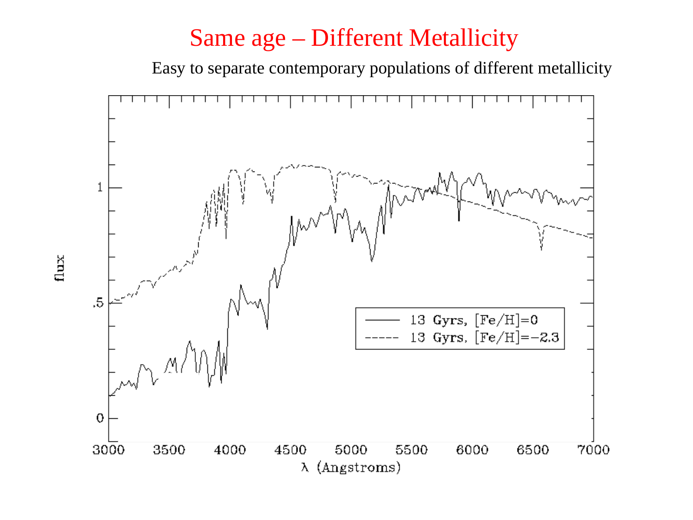
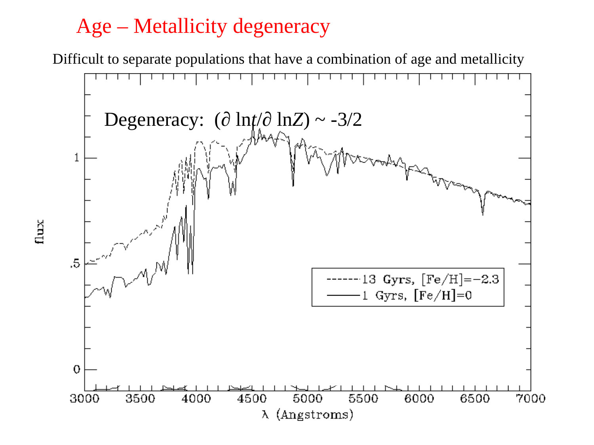
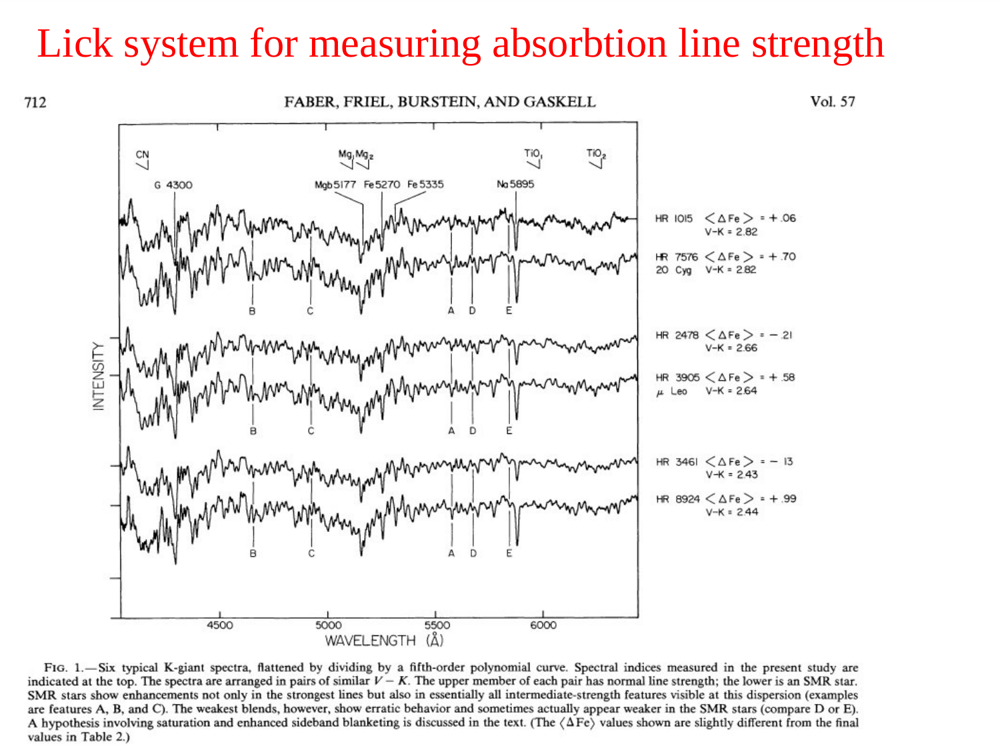
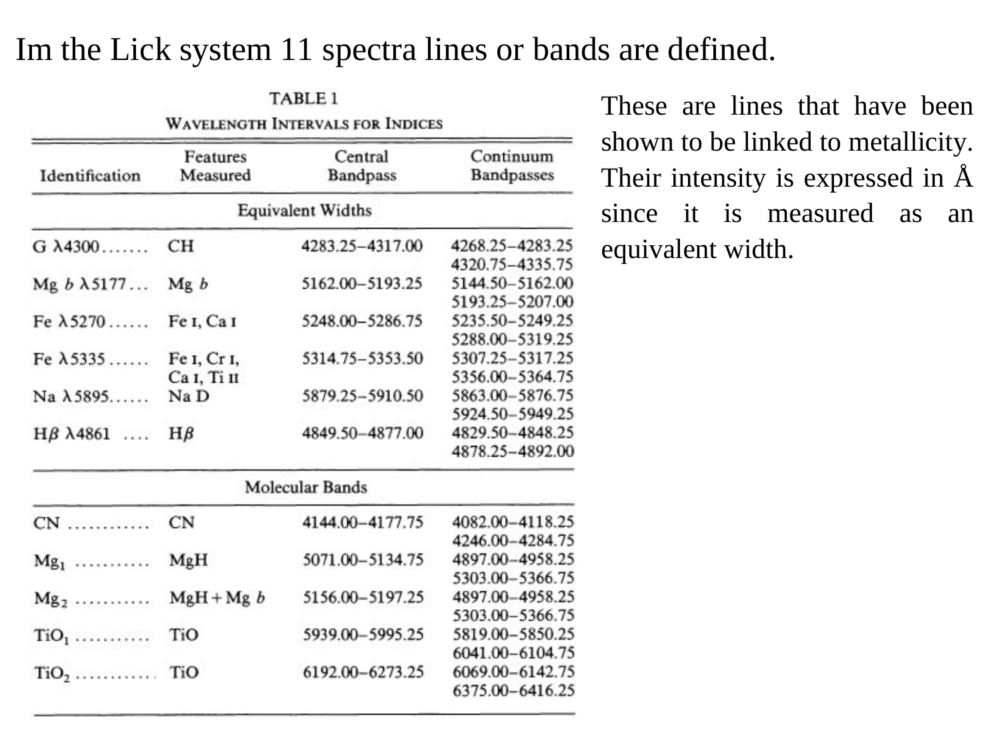
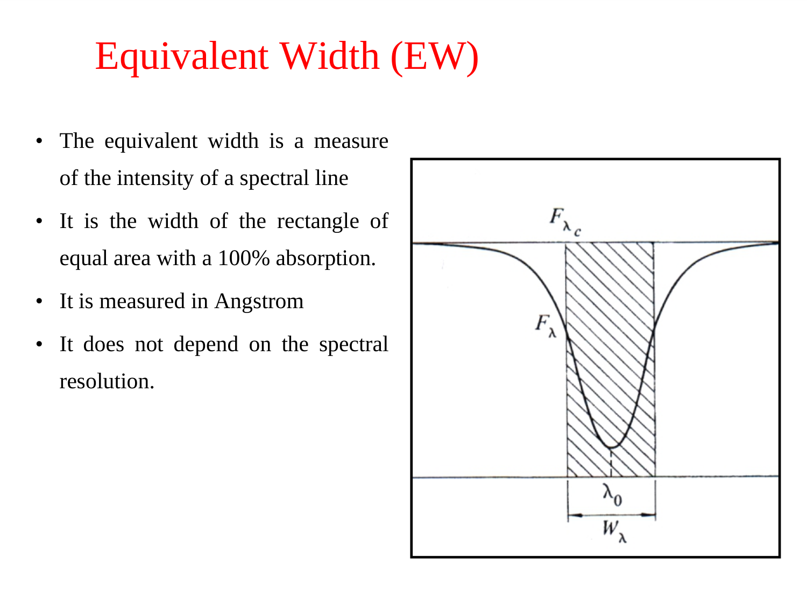
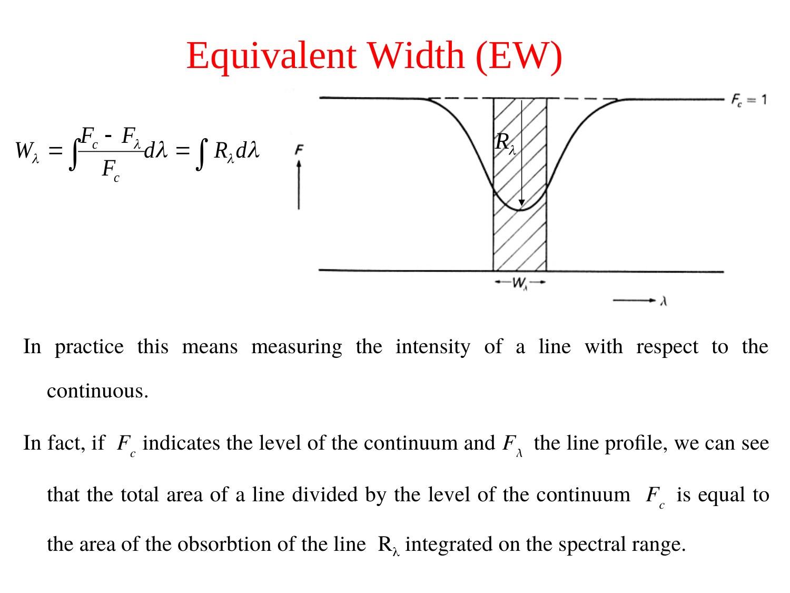
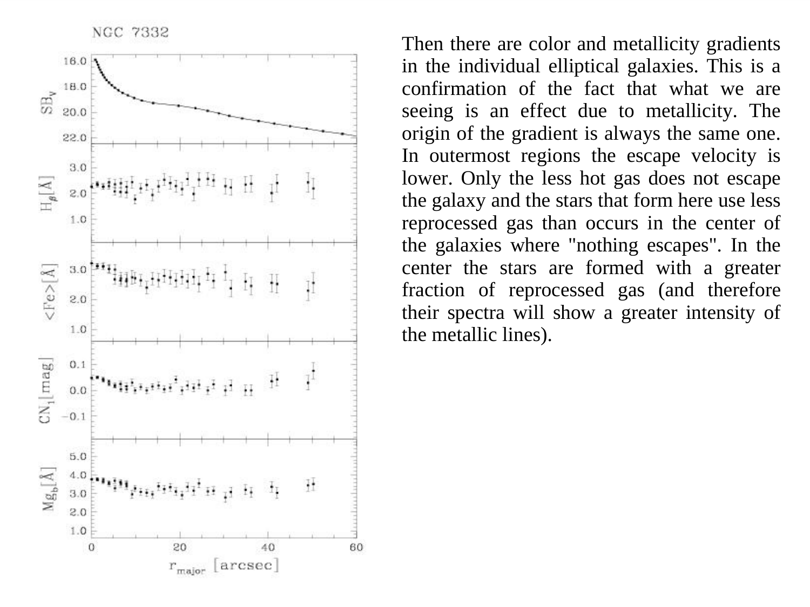
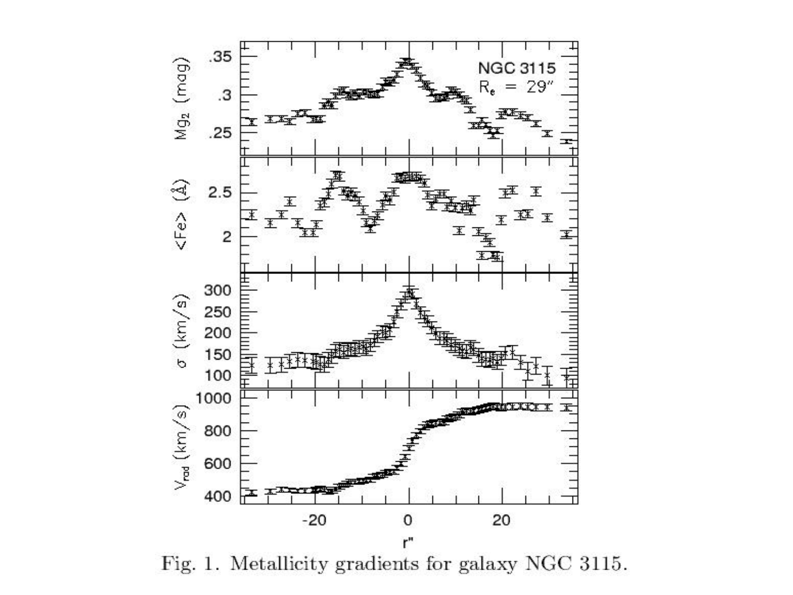
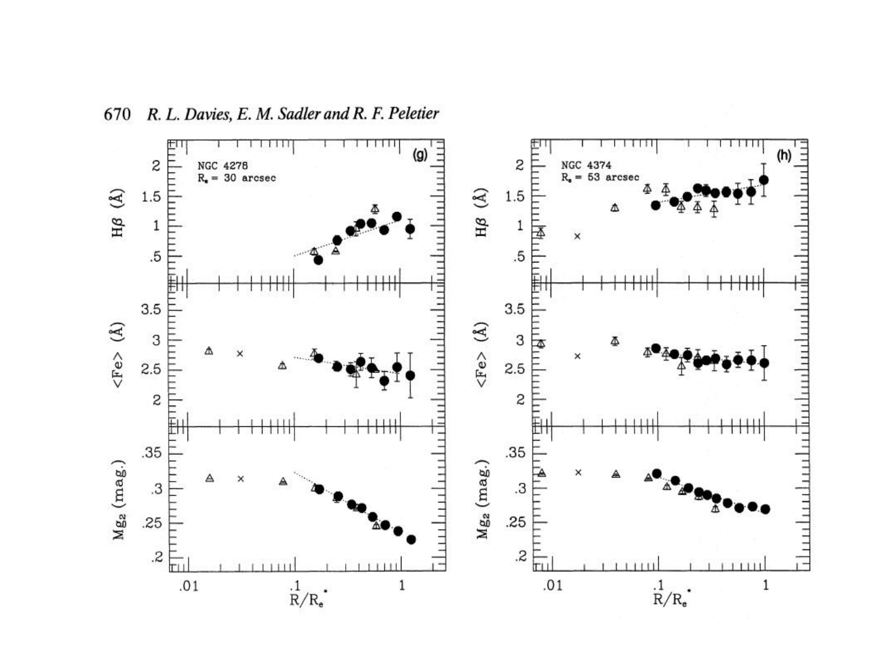
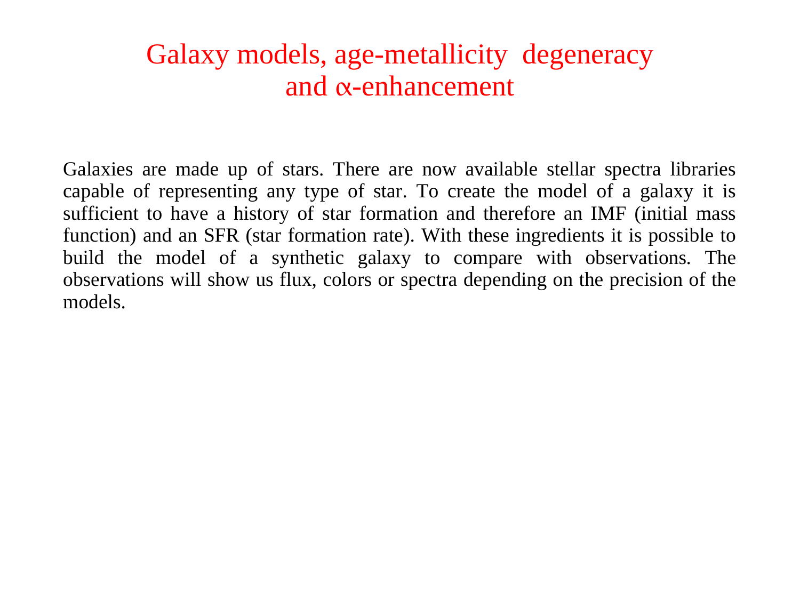


**early-type galaxies (ETGs)** = ellipticals + lenticulars (S0). their stellar populations are generally:
- **old** (mean ages $\sim 10$ Gyr).
- **metal-rich** ($[Fe/H] \sim 0$ to $+0.3$).
- **$\alpha$-enhanced** ($[\alpha/Fe] \sim 0.2$ to $0.4$).
- **passively evolving** (no recent star formation).

these properties tell us how + when ETGs formed.

## the classical picture

ETGs formed their stars **rapidly + early**:
- the bulk of stars formed at $z \sim 2$ to $5$.
- on **short timescales** ($\lesssim 1$ Gyr), so SN II enriched the gas with $\alpha$-elements but SN Ia didn't have time to add Fe.
- result: high $[\alpha/Fe]$.
- subsequently quenched: gas removed by AGN feedback + ram pressure + virial heating.
- since then: passively evolving, no new star formation.

so ETGs are "**dead red and dead**": red, evolved, no longer forming stars.

## the age-mass relation

more massive ETGs are typically **older + more $\alpha$-enhanced** than less massive ones.
- $\sigma > 250$ km/s ETGs: ages $\sim 12$ Gyr, $[\alpha/Fe] \sim 0.4$.
- $\sigma \sim 100$ km/s ETGs: ages $\sim 7$ Gyr, $[\alpha/Fe] \sim 0.2$.

this is **downsizing**: more massive galaxies finished forming stars first. opposite to the naive hierarchical-build-up prediction.

## the metal abundance gradient

ETGs have **negative metallicity gradients**: more metal-rich centres + less metal-rich outskirts. typical $\Delta[Z/H]/\Delta\log R \sim -0.2$ to $-0.4$ dex/dex.

interpretation: **inside-out formation**. central regions formed first, on shorter timescales, with more efficient enrichment. outskirts may be later-acquired material from minor mergers.

age gradient: usually flat or slightly negative (centre slightly older).

$\alpha$/Fe gradient: usually flat or slightly positive (outskirts more $\alpha$-enhanced). consistent with shorter SF timescale at large $R$.

## the measurement

stellar populations of ETGs measured via:
- **SED fitting** of multi-band photometry.
- **Lick indices** (Balmer + Mg + Fe absorption strength) at multiple radii.
- **full-spectrum fitting** with stellar templates (pPXF + MILES).
- **resolved stellar populations** in the Local Group (CMDs).

modern: **MaNGA + ATLAS3D** + similar IFU surveys give 2D maps of age + $[Fe/H]$ + $[\alpha/Fe]$ across galaxies.

## the implications

### two-phase formation

ETG formation in two phases:
1. **early in-situ formation** ($z = 2$ to $5$): rapid, intense SF in gas-rich progenitor → core stellar population.
2. **late minor mergers**: accretion of low-mass satellites contributing to the outer halo + gradients.

so the **outer regions of massive ellipticals are mostly accreted, not formed in situ**. modern simulations (IllustrisTNG) reproduce this.

### the fundamental relations

$M_{\rm bulge}-\sigma$, $M_{BH}-\sigma$, fundamental plane all reflect this **early formation** + **virial equilibrium**.

## the IMF question

evidence (ATLAS3D) suggests massive ETGs have **bottom-heavy IMFs**: more low-mass stars than Salpeter. consequence: dynamical $M/L > $ SED-derived $M/L$.

implications:
- inferred dark-matter fraction in ETGs may be lower.
- BBN-CMB-derived stellar mass density is consistent only if IMF varies.

major systematic; active research area.

## see also

- [Stellar populations I II III](./Stellar%20populations%20I%20II%20III.html)
- [Single stellar population SSP](./Single%20stellar%20population%20SSP.html)
- [Age-metallicity degeneracy](./Age-metallicity%20degeneracy.html)
- [Lick indices](./Lick%20indices.html)
- [Metallicity and chemical evolution](./Metallicity%20and%20chemical%20evolution.html)
- [Galaxy spectroscopy by type](./Galaxy%20spectroscopy%20by%20type.html)
- [Initial mass function](./Initial%20mass%20function.html)
- [Chemical evolution of galaxies](./Chemical%20evolution%20of%20galaxies.html)
- [Hubble morphological sequence](./Hubble%20morphological%20sequence.html)
- [Astrophysics_of_Galaxies_MOC](../../04_Atlas/Astrophysics_of_Galaxies_MOC.html)

---

## astrophysics of galaxies figures and slides (Prof. Alessandro Pizzella)

*Lecture 8: Stellar Populations in Early-Type Galaxies (Prof. Alessandro Pizzella).*

*Monolithic collapse (ELS 1962) vs hierarchical merging (White & Rees 1978).*

*Downsizing: most massive galaxies form their stars earliest and on the shortest timescales.*

---

## lecture slides and reference figures (Prof. Alessandro Pizzella)



  <h4 class="backlinks-title">Linked References (1)</h4>
  <ul class="backlinks-list">
    <li class="backlink-item-wrap"><a href="../../04_Atlas/Astrophysics_of_Galaxies_MOC.html" class="backlink-item">Astrophysics_of_Galaxies_MOC</a></li>
  </ul>

