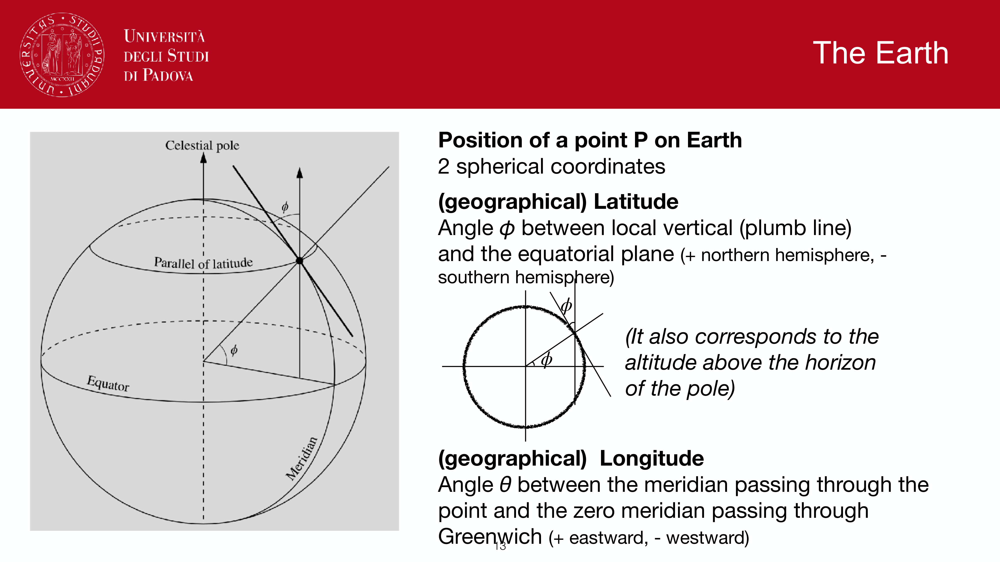
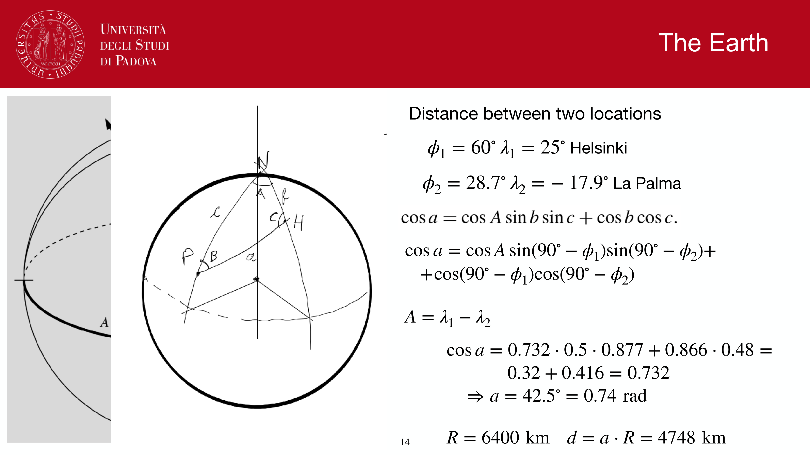
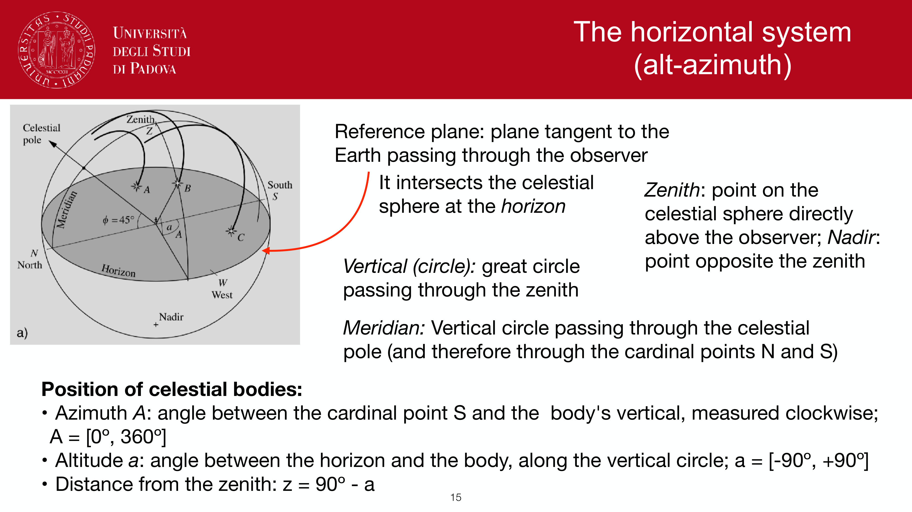
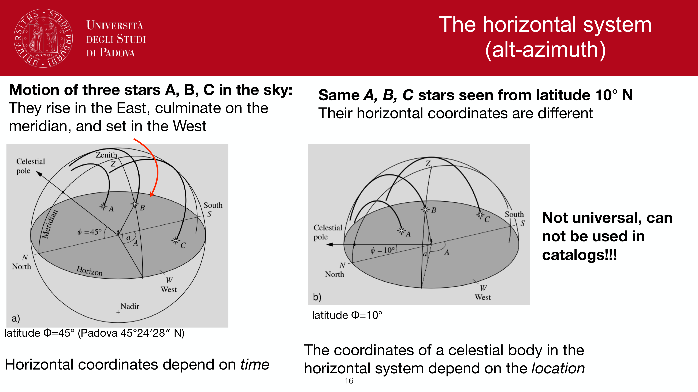

to specify a point on the Earth's surface (or, equivalently, on the celestial sphere if I treat Earth as a unit sphere), I need **two angles**.

the Earth's rotation axis defines two **poles**: north (P) and south (P'). perpendicular to the axis, through the center, is the **equatorial plane**; its intersection with the surface is the **equator**.

- a **parallel** of latitude is a small circle parallel to the equator
- a **meridian** is a half-great-circle joining the two poles

---

## the two coordinates

**geographical latitude** $\phi$: the angle between the local vertical and the equatorial plane.
- positive in the northern hemisphere, negative in the southern
- $\phi \in [-90°, +90°]$
- *also equals the altitude of the celestial pole on the local horizon* (this is what every navigation table exploits)

**geographical longitude** $\theta$ (sometimes written $\lambda$): the angle between the meridian through the point and the **Greenwich meridian** ($\theta = 0$).
- positive eastward, negative westward
- $\theta \in [-180°, +180°]$ or equivalently $[0°, 360°]$

---

## distance between two points on Earth

the great-circle distance between points $1$ and $2$ on the Earth's surface follows directly from the **spherical cosine rule** (see [Spherical trigonometry](Spherical%20trigonometry.html)):
$$\cos a = \cos A \sin b \sin c + \cos b \cos c$$

set up the spherical triangle with the north pole as one vertex, then:
- $b = 90° - \phi_1$ (co-latitude of point 1)
- $c = 90° - \phi_2$ (co-latitude of point 2)
- $A = \lambda_1 - \lambda_2$ (difference in longitude)

so:
$$\cos a = \cos(\lambda_1 - \lambda_2)\sin(90° - \phi_1)\sin(90° - \phi_2) + \cos(90° - \phi_1)\cos(90° - \phi_2)$$
$$\quad = \cos(\lambda_1 - \lambda_2)\cos\phi_1\cos\phi_2 + \sin\phi_1\sin\phi_2$$

then $a$ is in radians, and the surface distance is $d = a R_\oplus$ with $R_\oplus = 6400$ km.

### worked example: Helsinki to La Palma

with $\phi_1 = 60°, \lambda_1 = 25°$ (Helsinki) and $\phi_2 = 28.7°, \lambda_2 = -17.5°$ (La Palma):

$A = \lambda_1 - \lambda_2 = 42.5°$

substituting (numbers from the slides): $\cos a = 0.732 \cdot 0.5 \cdot 0.877 + 0.866 \cdot 0.48 = 0.32 + 0.416 = 0.72$

so $a = 42.5° = 0.74$ rad, and
$$d = a \cdot R_\oplus = 0.74 \cdot 6400 = 4748~\text{km}$$

---

## why the latitude $\phi$ also gives the altitude of the celestial pole

a quick geometric argument: the Earth's rotation axis is the line on which both the geographic poles and the celestial poles sit. at a point of latitude $\phi$, the local vertical makes an angle $\phi$ with the equatorial plane, so it makes an angle $90° - \phi$ with the rotation axis. this means the celestial pole appears in the local sky at altitude $\phi$ above the horizon.

so by measuring how high Polaris sits above the northern horizon, I directly read off my latitude. before GPS, this was navigation.

---

## see also

- [Fundamentals_Astrophysics_Cosmology_MOC](../../04_Atlas/Fundamentals_Astrophysics_Cosmology_MOC.html)
- [Spherical_astronomy_complete](Spherical_astronomy_complete.html)
- [Celestial sphere and great circles](Celestial%20sphere%20and%20great%20circles.html)
- [Spherical trigonometry](Spherical%20trigonometry.html)
- [Equatorial system](Equatorial%20system.html)

---

## observational astrophysics course slides (Prof. Paolo Cassata)

*Geographic coordinates: latitude phi, longitude lambda on Earth.*

*Parallels of latitude and meridians of longitude.*

*Spherical distance between two points on Earth surface.*

*Application of spherical cosine law to terrestrial navigation.*

  <h4 class="backlinks-title">Linked References (9)</h4>
  <ul class="backlinks-list">
    <li class="backlink-item-wrap"><a href="AU%20calibration%20parallax%20and%20parsec.html" class="backlink-item">AU calibration parallax and parsec</a></li>
    <li class="backlink-item-wrap"><a href="Atmospheric%20refraction.html" class="backlink-item">Atmospheric refraction</a></li>
    <li class="backlink-item-wrap"><a href="Celestial%20sphere%20and%20great%20circles.html" class="backlink-item">Celestial sphere and great circles</a></li>
    <li class="backlink-item-wrap"><a href="Equatorial%20system.html" class="backlink-item">Equatorial system</a></li>
    <li class="backlink-item-wrap"><a href="Spherical%20trigonometry.html" class="backlink-item">Spherical trigonometry</a></li>
    <li class="backlink-item-wrap"><a href="Spherical_astronomy_complete.html" class="backlink-item">Spherical_astronomy_complete</a></li>
    <li class="backlink-item-wrap"><a href="Time%20keeping%20in%20astronomy.html" class="backlink-item">Time keeping in astronomy</a></li>
    <li class="backlink-item-wrap"><a href="../../04_Atlas/Fundamentals_Astrophysics_Cosmology_MOC.html" class="backlink-item">Fundamentals_Astrophysics_Cosmology_MOC</a></li>
    <li class="backlink-item-wrap"><a href="../../04_Atlas/Observational_Astrophysics_MOC.html" class="backlink-item">Observational_Astrophysics_MOC</a></li>
  </ul>

