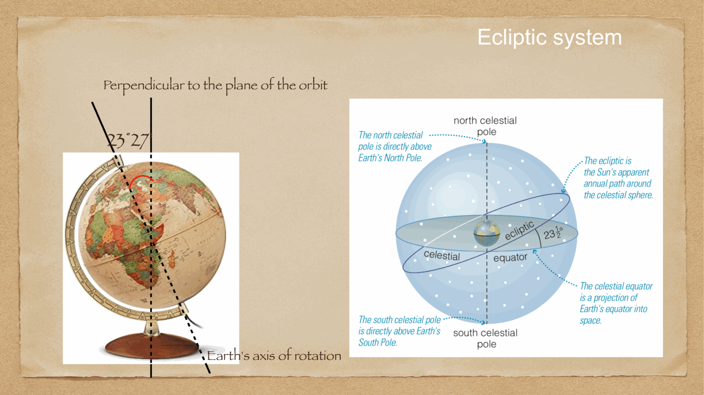
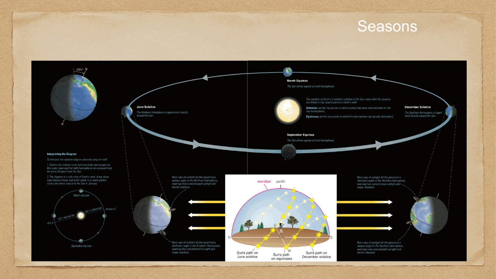
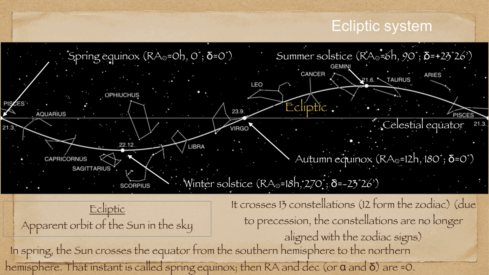
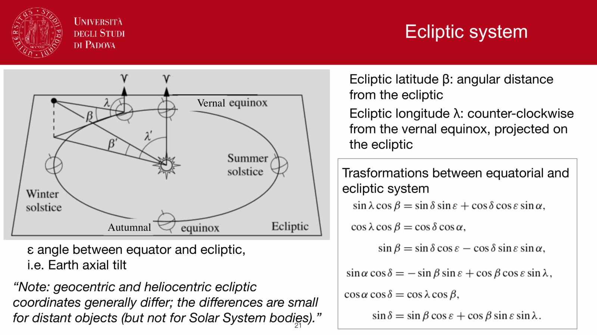
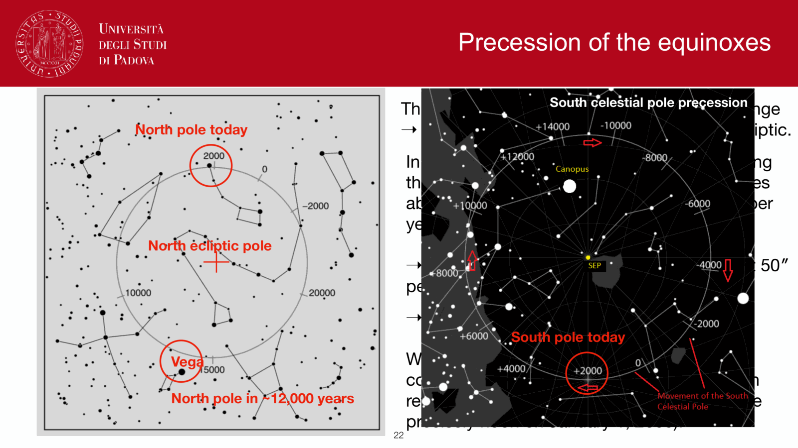

the **ecliptic system** uses the plane of Earth's orbit around the Sun as the primary reference great circle. it is the fundamental frame for solar-system dynamics, planetary ephemerides, and interplanetary dust (zodiacal light).

---

## the orbital geometry and obliquity

Earth's rotational axis is tilted with respect to the normal of its orbital plane by the **obliquity of the ecliptic**:
$$\varepsilon \approx 23^\circ 27' \approx 23.44^\circ$$
(varying slowly over time due to planetary perturbations and precession). 

as Earth orbits the Sun, the Sun appears from Earth to trace an annual path along a great circle on the celestial sphere called the **ecliptic**. the celestial equator and the ecliptic intersect at two points called the **equinoxes**:
1. the **vernal equinox** (first point of Aries, $\gamma$): where the Sun crosses the celestial equator from south to north (declination $\delta$ goes from negative to positive). this occurs around March 20-21 and defines the zero-point for both right ascension $\alpha$ and ecliptic longitude $\lambda$.
2. the **autumnal equinox** (first point of Libra, $\Omega$): where the Sun crosses from north to south around September 22-23.

the points of maximum northern and southern declination are the **solstices**:
- **summer solstice** (Cancer): Sun at $\lambda = 90^\circ, \delta = +\varepsilon = +23^\circ 27'$ (around June 21).
- **winter solstice** (Capricorn): Sun at $\lambda = 270^\circ, \delta = -\varepsilon = -23^\circ 27'$ (around December 21-22).

---

## coordinates: ecliptic longitude and latitude

any point on the celestial sphere is uniquely specified in this system by two spherical angles:
- **ecliptic longitude** $\lambda \in [0^\circ, 360^\circ)$: measured eastward along the ecliptic from the vernal equinox $\gamma$.
- **ecliptic latitude** $\beta \in [-90^\circ, +90^\circ]$: the angular distance north ($+$) or south ($-$) of the ecliptic plane, measured along a great circle passing through the **ecliptic poles** (NEP: North Ecliptic Pole, SEP: South Ecliptic Pole).

for the Sun, $\beta_\odot \equiv 0$ at all times by definition of the ecliptic, while its longitude advances at approximately $\approx 360^\circ / 365.25 \approx 0.9856^\circ / \text{day} \approx 1^\circ/\text{day}$.

---

## coordinate transformations: ecliptic ↔ equatorial

transforming between the equatorial system $(\alpha, \delta)$ and the ecliptic system $(\lambda, \beta)$ corresponds to a pure rotation by the obliquity $\varepsilon$ around the axis passing through the vernal equinox $\gamma$.

applying spherical trigonometry to the spherical triangle formed by the North Celestial Pole (NCP), the North Ecliptic Pole (NEP), and the celestial body $X$:

### ecliptic $(\lambda, \beta) \to$ equatorial $(\alpha, \delta)$:
$$\sin\delta = \sin\beta \cos\varepsilon + \cos\beta \sin\varepsilon \sin\lambda$$
$$\cos\delta \cos\alpha = \cos\beta \cos\lambda$$
$$\cos\delta \sin\alpha = -\sin\beta \sin\varepsilon + \cos\beta \cos\varepsilon \sin\lambda$$

### equatorial $(\alpha, \delta) \to$ ecliptic $(\lambda, \beta)$:
$$\sin\beta = \sin\delta \cos\varepsilon - \cos\delta \sin\varepsilon \sin\alpha$$
$$\cos\beta \cos\lambda = \cos\delta \cos\alpha$$
$$\cos\beta \sin\lambda = \sin\delta \sin\varepsilon + \cos\delta \cos\varepsilon \sin\alpha$$

---

## physical applications in astronomy

- **solar system bodies**: planets, asteroids, and Kuiper belt objects formed from the protoplanetary disk, so their orbital inclinations relative to the ecliptic are small ($i \lesssim \text{few degrees}$). their ecliptic latitudes stay close to zero.
- **zodiacal light & infrared sky**: interplanetary dust grains in the solar system scatter sunlight and emit thermal infrared radiation, concentrated strongly along the ecliptic plane. this is a major foreground component for space-based telescopes (e.g. JWST, Euclid).
- **Milankovitch cycles**: long-term variations in Earth's obliquity $\varepsilon$ (oscillating between $\sim 22.1^\circ$ and $24.5^\circ$ over a $41,000$-year period) drive planetary climate cycles and ice ages.

---

## see also

- [Fundamentals_Astrophysics_Cosmology_MOC](../../04_Atlas/Fundamentals_Astrophysics_Cosmology_MOC.html)
- [Equatorial system](Equatorial%20system.html)
- [Galactic coordinate system](Galactic%20coordinate%20system.html)
- [Spherical trigonometry](Spherical%20trigonometry.html)
- [Precession and nutation](Precession%20and%20nutation.html)
- [Celestial sphere and great circles](Celestial%20sphere%20and%20great%20circles.html)

---

## observational astrophysics course slides (Prof. Paolo Cassata)

*Ecliptic coordinate system: ecliptic longitude lambda, latitude beta.*

*Transformation between equatorial and ecliptic systems via obliquity epsilon = 23.44 deg.*

  <h4 class="backlinks-title">Linked References (6)</h4>
  <ul class="backlinks-list">
    <li class="backlink-item-wrap"><a href="Aberration%20of%20light.html" class="backlink-item">Aberration of light</a></li>
    <li class="backlink-item-wrap"><a href="Galactic%20coordinate%20system.html" class="backlink-item">Galactic coordinate system</a></li>
    <li class="backlink-item-wrap"><a href="Precession%20and%20nutation.html" class="backlink-item">Precession and nutation</a></li>
    <li class="backlink-item-wrap"><a href="Sky%20brightness.html" class="backlink-item">Sky brightness</a></li>
    <li class="backlink-item-wrap"><a href="../../04_Atlas/Fundamentals_Astrophysics_Cosmology_MOC.html" class="backlink-item">Fundamentals_Astrophysics_Cosmology_MOC</a></li>
    <li class="backlink-item-wrap"><a href="../../04_Atlas/Observational_Astrophysics_MOC.html" class="backlink-item">Observational_Astrophysics_MOC</a></li>
  </ul>

