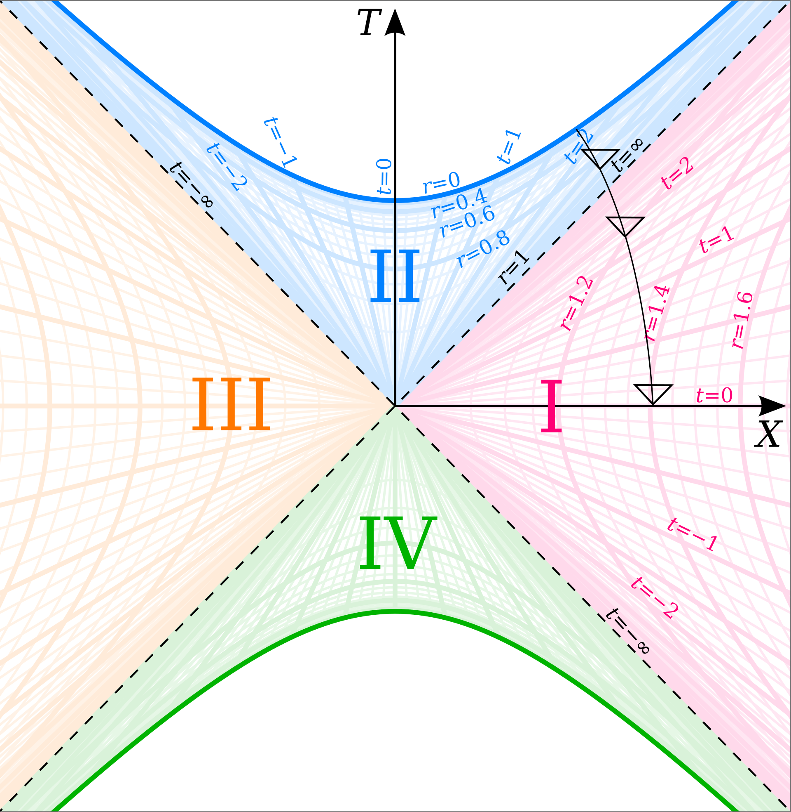
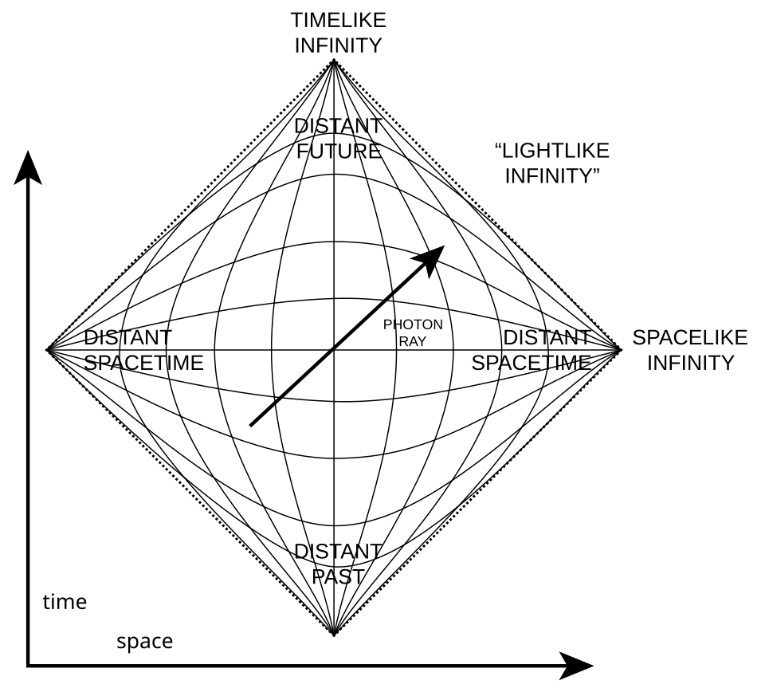
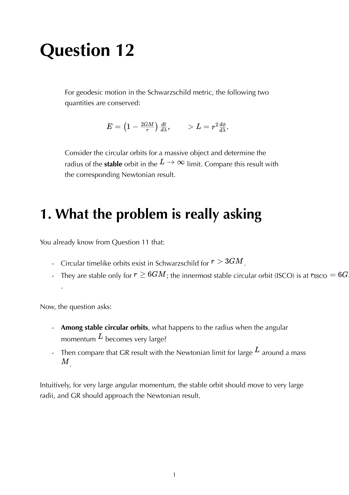


the Schwarzschild metric in standard $(t, r, \theta, \phi)$ coordinates has a coordinate singularity at $r = 2GM$. **Eddington-Finkelstein** and **Kruskal-Szekeres** coordinates remove this singularity and reveal the global structure of the Schwarzschild geometry.

## the problem

at $r = 2GM$:
- $g_{tt} \to 0$ and $g_{rr} \to \infty$.
- the metric becomes ill-defined.

but Riemann is finite there (Kretschmann scalar = $48G^2M^2/r^6$, finite at horizon). so the singularity is **coordinate-only**, removable by a smart coordinate change.

## Eddington-Finkelstein (EF)

introduce **ingoing** EF coordinate $v = t + r^*$ with the **tortoise coordinate**:
$$r^* = r + 2GM\ln|r/2GM - 1|$$

the metric becomes:
$$ds^2 = -\left(1 - \frac{2GM}{r}\right)dv^2 + 2\,dv\,dr + r^2 d\Omega^2$$

properties:
- **smooth at $r = 2GM$**: no divergence in $g_{vv}$ or $g_{vr}$.
- **no time-reversal symmetry**: this metric describes ingoing geodesics smoothly. for outgoing, use $u = t - r^*$ instead.
- $v$ is constant along radial null ingoing geodesics. an infalling photon has constant $v$.

so EF is the natural coordinate system for **infalling** matter and light. used heavily in BH formation studies (collapse, accretion).

## the future + past horizons

Schwarzschild has more than one horizon when extended through the coordinate singularity. EF in $v$ describes the **future horizon** (where the future light cones tilt inward). EF in $u = t - r^*$ describes the **past horizon** (white hole).

## Kruskal-Szekeres

the maximally-extended Schwarzschild spacetime, covered by Kruskal coordinates $(T, X, \theta, \phi)$:
$$T = \sqrt{r/2GM - 1}\,e^{r/4GM}\sinh(t/4GM)$$
$$X = \sqrt{r/2GM - 1}\,e^{r/4GM}\cosh(t/4GM)$$
(for $r > 2GM$; analytic continuation handles $r < 2GM$).

metric in Kruskal:
$$ds^2 = \frac{32 G^3 M^3}{r}e^{-r/2GM}(-dT^2 + dX^2) + r^2 d\Omega^2$$

properties:
- **smooth across horizon**: $r = 2GM$ is the line $T = \pm X$, no singularity.
- **light cones at 45°**: like Minkowski. easy to see causal structure.
- **maximally extended**: covers four regions:
  - **I**: outside, our universe.
  - **II**: inside the BH (future).
  - **III**: another asymptotically-flat universe ("parallel universe").
  - **IV**: white hole (past).

regions III and IV are **mathematical artefacts** of the maximal extension; they don't exist in physical BHs (which form from gravitational collapse and never have a past horizon).

## Penrose diagrams

a conformal compactification of Kruskal: maps the entire (infinite) Kruskal spacetime to a finite diagram. light cones still at 45°, but null infinity is finite. used to draw global causal structure.

for Schwarzschild, the Penrose diagram is a square divided into four triangles (regions I-IV). singularities $r = 0$ are spacelike lines (curves of constant time, not place).

## see also

- [Schwarzschild metric](./Schwarzschild%20metric.html)
- [Schwarzschild horizon](./Schwarzschild%20horizon.html)
- [Schwarzschild Christoffels](./Schwarzschild%20Christoffels.html)
- [Radial infall](./Radial%20infall.html)
- [Timelike vs null vs spacelike](./Timelike%20vs%20null%20vs%20spacelike.html)
- [General_Relativity_MOC](../../04_Atlas/General_Relativity_MOC.html)
- [Ch 6 - Black Holes](../../02_Literature/Book/Baumann%20GR/Ch%206%20-%20Black%20Holes.html)

---

### General Relativity Mathematical & Oral Defense Panel

*Question 12 Oral Exam Model Solution: Radial free fall of a massive test particle from rest at $r_0$, proper time to reach the horizon $\Delta\tau = \frac{4}{3}\sqrt{\frac{r_0^3}{2GM}}$, and coordinate time divergence $t \to \infty$ due to coordinate singularity.*


  <h4 class="backlinks-title">Linked References (4)</h4>
  <ul class="backlinks-list">
    <li class="backlink-item-wrap"><a href="../../02_Literature/Book/Baumann%20GR/Ch%206%20-%20Black%20Holes.html" class="backlink-item">Ch 6 - Black Holes</a></li>
    <li class="backlink-item-wrap"><a href="../../04_Atlas/General_Relativity_MOC.html" class="backlink-item">General_Relativity_MOC</a></li>
    <li class="backlink-item-wrap"><a href="./Schwarzschild%20horizon.html" class="backlink-item">Schwarzschild horizon</a></li>
    <li class="backlink-item-wrap"><a href="./Schwarzschild%20metric.html" class="backlink-item">Schwarzschild metric</a></li>
  </ul>

