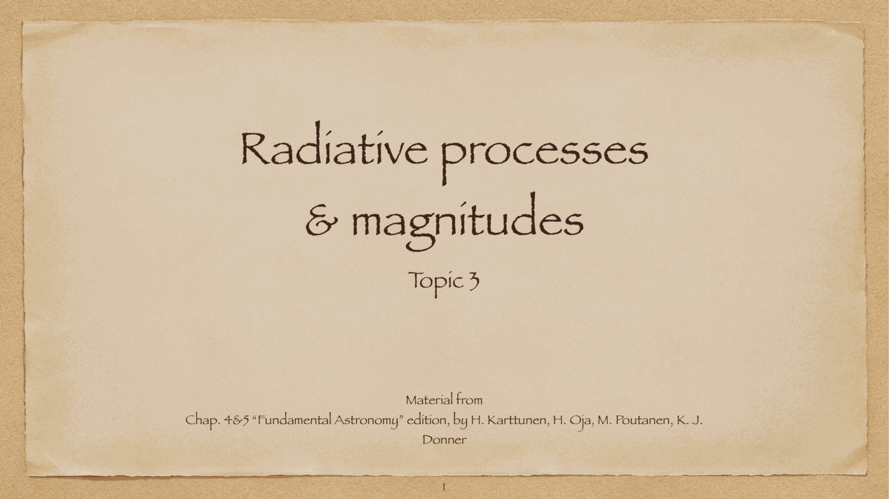
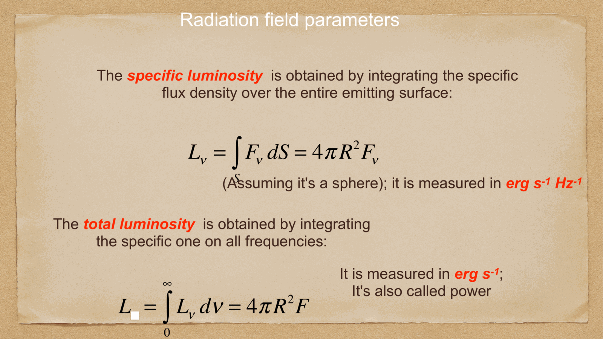


almost all astrophysical information gathered from the cosmos arrives carried by **electromagnetic radiation** (photons). in recent years, this has been augmented by **multi-messenger astrophysics** (gravitational waves detected by LIGO/Virgo/KAGRA, cosmic rays, and high-energy neutrinos detected by IceCube), but electromagnetic photons remain the primary diagnostic tool of astronomy.

---

## nature of electromagnetic radiation: waves and photons

electromagnetic radiation exhibits fundamental wave-particle duality:
1. **as a classical wave**: an oscillating electric field $\vec{E}$ and magnetic field $\vec{B}$ propagating perpendicularly to each other and to the direction of propagation with the speed of light in vacuum $c \approx 2.99792 \times 10^8$ m/s:
   $$c = \lambda \nu$$
   where $\lambda$ is the wavelength and $\nu$ is the frequency.
2. **as quantized particles (photons)**: discrete packets of energy $E$ and momentum $p$:
   $$\boxed{\, E = h\nu = \frac{hc}{\lambda}, \qquad p = \frac{E}{c} = \frac{h}{\lambda} \,}$$
   where $h \approx 6.626 \times 10^{-34}$ J s $\approx 4.136 \times 10^{-15}$ eV s is Planck's constant.

useful rule of thumb for photon energy:
$$E(\text{eV}) \approx \frac{1239.8}{\lambda(\text{nm})} \approx \frac{1.24}{\lambda(\mu\text{m})}$$

---

## the electromagnetic spectrum in astronomy

astrophysical processes produce photons spanning over 20 orders of magnitude in frequency, each regime corresponding to distinct emission mechanisms and requiring distinct detection technologies:

| spectral band | wavelength range $\lambda$ | photon energy $h\nu$ | typical astrophysical sources |
|---|---|---|---|
| **gamma rays** ($\gamma$) | $< 0.01$ nm ($< 0.1$ Å) | $> 100$ keV | gamma-ray bursts, pulsars, AGN jets, matter-antimatter annihilation ($511$ keV) |
| **X-rays** | $0.01 - 10$ nm | $100$ eV $- 100$ keV | accretion disks around black holes/neutron stars, supernova remnants, $10^7$ K cluster gas |
| **ultraviolet (UV)** | $10 - 400$ nm | $3.1 - 100$ eV | hot massive young stars (O and B stars), white dwarfs, planetary nebulae |
| **optical (visible)** | $400 - 750$ nm ($4000 - 7500$ Å) | $1.65 - 3.1$ eV | stellar photospheres (Sun $\sim 5800$ K), HII regions, ordinary galaxies |
| **near-infrared (NIR)** | $750$ nm $- 2.5\,\mu$m | $0.5 - 1.65$ eV | cool stars (K, M dwarfs/giants), dust-obscured stellar populations |
| **mid/far-infrared (MIR/FIR)** | $2.5 - 350\,\mu$m | $3.5\,\text{meV} - 0.5\,\text{eV}$ | warm and cold interstellar dust grains, protoplanetary disks, starburst galaxies |
| **sub-millimeter / mm** | $350\,\mu\text{m} - 1$ mm | $1.2 - 3.5$ meV | cold molecular cloud cores (CO lines), ALMA dust continuum, CMB peak |
| **radio** | $> 1$ mm (up to meters/km) | $< 1.2$ meV | synchrotron radiation (relativistic electrons in magnetic fields), 21 cm HI line, pulsars |

---

## atmospheric opacity and transmission windows

Earth's atmosphere is completely opaque to the vast majority of the electromagnetic spectrum due to molecular and electronic absorption by atmospheric gases ($O_2, O_3, H_2O, CO_2, N_2$) and ionospheric reflection:

1. **the optical window ($300 - 1000$ nm)**: extends from the atmospheric UV cutoff (caused by stratospheric ozone $O_3$ absorbing all photons with $\lambda < 300$ nm) to the near-infrared.
2. **the infrared windows**: terrestrial water vapor ($H_2O$) and carbon dioxide ($CO_2$) absorb broad bands in the infrared. observation is restricted to narrow transmission windows ($J, H, K, L, M, N, Q$ bands) from high-altitude, dry desert mountaintops (e.g. Atacama desert / ALMA, Mauna Kea).
3. **the radio window ($1$ mm to $\sim 15-20$ m)**: atmosphere is nearly transparent from millimeter wavelengths up to $\sim 20$ meters, where Earth's ionospheric free electrons reflect radio waves back into space (plasma frequency $\nu_p \approx 10-30$ MHz).

consequence: high-energy astrophysics (gamma-ray, X-ray, extreme UV) and mid/far-infrared astronomy can only be conducted from space telescopes (Hubble, Chandra, XMM-Newton, Spitzer, Herschel, JWST, Fermi).

---

## see also

- [Fundamentals_Astrophysics_Cosmology_MOC](../../04_Atlas/Fundamentals_Astrophysics_Cosmology_MOC.html)
- [Radiation quantities and inverse square law](./Radiation%20quantities%20and%20inverse%20square%20law.html)
- [Blackbody radiation and Stefan-Boltzmann](./Blackbody%20radiation%20and%20Stefan-Boltzmann.html)
- [Stellar spectra and spectral classification](./Stellar%20spectra%20and%20spectral%20classification.html)
- [Galaxies across wavelengths](./Galaxies%20across%20wavelengths.html)
- [Earth atmosphere for observations](./Earth%20atmosphere%20for%20observations.html)


  <h4 class="backlinks-title">Linked References (7)</h4>
  <ul class="backlinks-list">
    <li class="backlink-item-wrap"><a href="./Blackbody%20radiation%20and%20Stefan-Boltzmann.html" class="backlink-item">Blackbody radiation and Stefan-Boltzmann</a></li>
    <li class="backlink-item-wrap"><a href="../../04_Atlas/Fundamentals_Astrophysics_Cosmology_MOC.html" class="backlink-item">Fundamentals_Astrophysics_Cosmology_MOC</a></li>
    <li class="backlink-item-wrap"><a href="./Galaxies%20across%20wavelengths.html" class="backlink-item">Galaxies across wavelengths</a></li>
    <li class="backlink-item-wrap"><a href="./Interstellar%20absorption.html" class="backlink-item">Interstellar absorption</a></li>
    <li class="backlink-item-wrap"><a href="./Magnitudes%20and%20photometric%20systems.html" class="backlink-item">Magnitudes and photometric systems</a></li>
    <li class="backlink-item-wrap"><a href="./Radiation%20quantities%20and%20inverse%20square%20law.html" class="backlink-item">Radiation quantities and inverse square law</a></li>
    <li class="backlink-item-wrap"><a href="./Specific%20intensity%20flux%20luminosity.html" class="backlink-item">Specific intensity flux luminosity</a></li>
  </ul>

