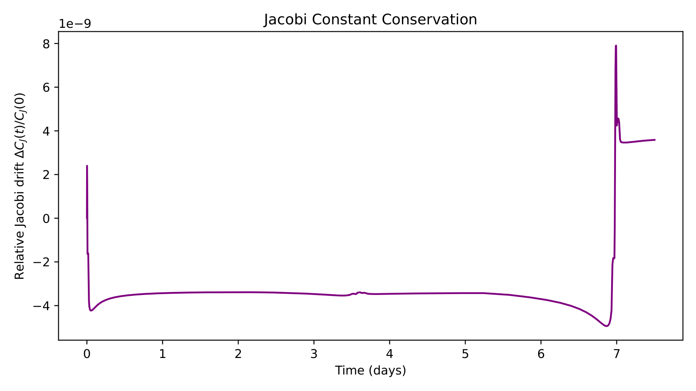


# Energy conservation as a diagnostic

for any Hamiltonian system (an N-body simulation, a Kepler orbit, an oscillator), the total energy $E$ is constant. an integrator that fails to conserve $E$ is producing non-physical solutions. so I track $E(t)$ as the canonical quality diagnostic for *every* dynamical simulation.

## what to plot

the **relative energy variation**:

$$\frac{\Delta E(t)}{E_0} = \frac{E(t) - E_0}{E_0}$$

where $E_0 = E(t=0)$. plot this against time on a linear or log scale. expected behavior depends on the integrator:

| integrator | $\Delta E/E$ vs $t$ |
|---|---|
| Euler | exponential growth (unstable for orbits) |
| RK4 | linear drift, slope $\sim h^4$ per step |
| midpoint | linear drift, slope $\sim h^2$ per step |
| **leapfrog** | **bounded oscillation, no drift** |
| Hermite | bounded oscillation, very small amplitude |

a bounded $\Delta E/E$ is the signature of a **symplectic** integrator. a drift is the signature of a non-symplectic one.

## the practical metric

after an integration of $N_{\rm orb}$ orbits:

- **good** ($\Delta E/E < 10^{-6}$): integrator is fine
- **acceptable** ($10^{-6} < \Delta E/E < 10^{-3}$): may need more care, smaller timestep, or check for close encounters
- **bad** ($\Delta E/E > 10^{-3}$): integration is corrupting the physics, do not trust the orbits

## the exam-template plot

`exam_template.pdf` exercise 4 explicitly asks:

> Calculate and plot the relative energy variation $[E(t+h) - E(t)]/E(t)$ of the system between two timesteps and plot it as a function of time.

note this is the *step-by-step* variation, not the cumulative $E(t)/E_0 - 1$. for a non-symplectic integrator, the step-by-step variation will look like noise oscillating around a small bias; the cumulative drift only becomes obvious when you sum many steps. **plot both** if there is room — they answer different questions.

## a pseudocode skeleton

```python
def total_energy(r, v, m, G=1.0, eps=0.0):
    KE = 0.5 * np.sum(m * np.sum(v**2, axis=1))
    PE = 0.0
    N = len(m)
    for i in range(N):
        for j in range(i+1, N):
            d = np.linalg.norm(r[i] - r[j])
            PE -= G * m[i] * m[j] / np.sqrt(d**2 + eps**2)
    return KE + PE

# at each timestep
energies = []
times = []
for step in range(n_steps):
    # ... integrator step ...
    times.append(t)
    energies.append(total_energy(r, v, m))

energies = np.array(energies)
delta_E = (energies - energies[0]) / energies[0]
plt.plot(times, np.abs(delta_E))
plt.yscale('log')
plt.xlabel('t'); plt.ylabel('|ΔE/E|')
```

## angular momentum: the second diagnostic

after energy, angular momentum $\mathbf{L} = \sum m_i \mathbf{r}_i \times \mathbf{v}_i$ is the next conserved quantity. for any spherically symmetric problem (a single planet around a fixed sun, an isolated cluster) it should be constant.

leapfrog conserves $\mathbf{L}$ to *machine precision* (a stronger property than energy), because angular momentum is a quadratic invariant of the symplectic structure. RK4 conserves it only to $O(h^4)$.

## what a bad integrator looks like, visually

three signatures of a bad-or-too-large-timestep integration:

1. **steady drift** in $\Delta E/E$ — non-symplectic integrator at moderate $h$ → use a smaller $h$ or switch to leapfrog
2. **explosive growth** in $\Delta E/E$ — unstable, e.g. Euler at any $h$ on a Kepler orbit → switch to a higher-order method
3. **sudden jumps** in $\Delta E/E$ at specific times — close encounter that the timestep cannot resolve → use adaptive timestepping (see [Adaptive step size control](./Adaptive%20step%20size%20control.html))

case 3 is the most common cause of mysterious-looking energy plots in N-body work. the fix is timestep refinement, not algorithm change.

## a cosmological aside

for a cosmological simulation in an expanding background, energy is *not* conserved (the universe is expanding, work is being done). the right invariant is a different combination involving the scale factor. but for an *isolated* gravitational system (everything in this exam), energy conservation is exact and is the right diagnostic.

## see also

- [Astrophysical N-body problem formulation](./Astrophysical%20N-body%20problem%20formulation.html)
- [Leapfrog integrator](./Leapfrog%20integrator.html)
- [Runge-Kutta 4 method](./Runge-Kutta%204%20method.html)
- [Adaptive step size control](./Adaptive%20step%20size%20control.html)
- [Mathematical_Numerical_Methods_MOC](../../04_Atlas/Mathematical_Numerical_Methods_MOC.html)

---

### Numerical Methods & Algorithmic Diagnostics


*Numerical Conservation of the Jacobi Integral $C_J$ in the Circular Restricted Three-Body Problem (CR3BP) along the Artemis Moon-Earth trajectory, demonstrating symplectic energy preservation within $\Delta C_J/C_J < 10^{-6}$.*


*Energy error growth $\Delta E/E$ vs integration time for non-symplectic Euler and RK4 vs symplectic Leapfrog.*


<div class="backlinks-section">
  <h4 class="backlinks-title">Linked References (11)</h4>
  <ul class="backlinks-list">
    <li class="backlink-item-wrap"><a href="./Astrophysical%20N-body%20problem%20formulation.html" class="backlink-item">Astrophysical N-body problem formulation</a></li>
    <li class="backlink-item-wrap"><a href="./Collisional%20vs%20collisionless%20N-body.html" class="backlink-item">Collisional vs collisionless N-body</a></li>
    <li class="backlink-item-wrap"><a href="./Euler%20method.html" class="backlink-item">Euler method</a></li>
    <li class="backlink-item-wrap"><a href="./Fourth-order%20Hermite%20predictor-corrector.html" class="backlink-item">Fourth-order Hermite predictor-corrector</a></li>
    <li class="backlink-item-wrap"><a href="./Hint%20-%20TODO%204.3%20Energy%20Conservation%20Diagnostic.html" class="backlink-item">Hint - TODO 4.3 Energy Conservation Diagnostic</a></li>
    <li class="backlink-item-wrap"><a href="./Leapfrog%20integrator.html" class="backlink-item">Leapfrog integrator</a></li>
    <li class="backlink-item-wrap"><a href="../../04_Atlas/Mathematical_Numerical_Methods_MOC.html" class="backlink-item">Mathematical_Numerical_Methods_MOC</a></li>
    <li class="backlink-item-wrap"><a href="./N-body%20with%20Euler%20vs%20midpoint%20vs%20leapfrog.html" class="backlink-item">N-body with Euler vs midpoint vs leapfrog</a></li>
    <li class="backlink-item-wrap"><a href="./Runge-Kutta%202%20midpoint%20method.html" class="backlink-item">Runge-Kutta 2 midpoint method</a></li>
    <li class="backlink-item-wrap"><a href="./Systems%20of%20ODEs%20and%20higher-order%20ODEs.html" class="backlink-item">Systems of ODEs and higher-order ODEs</a></li>
    <li class="backlink-item-wrap"><a href="./The%20Pythagorean%20three-body%20problem.html" class="backlink-item">The Pythagorean three-body problem</a></li>
  </ul>
</div>
