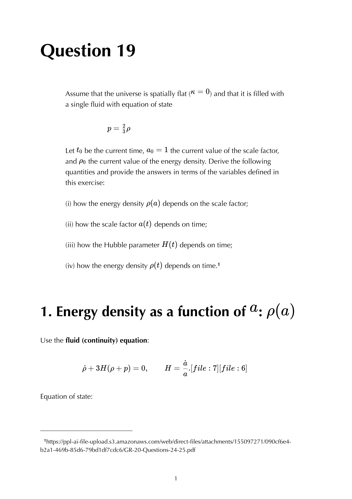

a cosmic fluid's **equation of state** $p = w\rho$ specifies the pressure relative to its energy density. combined with the continuity equation, it determines how density scales with expansion: $\rho \propto a^{-3(1+w)}$.

## the equation of state parameter

$$w \equiv p/\rho$$

different fluids have different $w$:

| fluid | $w$ | $\rho \propto$ | dominant in |
|---|---|---|---|
| dust (cold matter) | $0$ | $a^{-3}$ | matter era |
| radiation | $+1/3$ | $a^{-4}$ | radiation era |
| dark energy / $\Lambda$ | $-1$ | const | dark energy era |
| spatial curvature | $-1/3$ | $a^{-2}$ | (see below) |
| domain walls | $-2/3$ | $a^{-1}$ | (theoretical) |
| stiff fluid | $+1$ | $a^{-6}$ | early hot phase, possibly |
| quintessence | $-1 < w < -1/3$ | $a^{-3(1+w)}$ | dark energy alternatives |

## the derivation

continuity equation: $\dot\rho + 3H(\rho + p) = 0 \Rightarrow \dot\rho/\rho = -3(1+w) H$.

if $w$ is constant: $\rho \propto a^{-3(1+w)}$. the **scaling law**.

### dust ($w = 0$)
$\rho_m \propto a^{-3}$. just dilution by volume; particle number density $n \propto 1/a^3$, particle energy is constant.

### radiation ($w = 1/3$)
$\rho_r \propto a^{-4}$. volume dilution ($a^{-3}$) **times** redshift of individual photon energies ($a^{-1}$).

photons have $T \propto 1/a$, so $\rho_\gamma \propto T^4 \propto a^{-4}$. consistent.

### cosmological constant ($w = -1$)
$\rho_\Lambda = $ const. doesn't dilute. as the universe expands, more space is created with the same energy density. the "vacuum energy" picture.

### curvature ($w = -1/3$)
formally, treating spatial curvature as a "fluid": $\rho_k \propto a^{-2}$. doesn't actually behave like a real fluid, but the scaling lets you absorb the curvature term into the Hubble equation as an effective fluid with $w = -1/3$.

## the universe as a multi-fluid

at any time:
$$\rho_{\rm tot}(a) = \rho_{m,0}\,a^{-3} + \rho_{r,0}\,a^{-4} + \rho_\Lambda + \rho_{k,0}\,a^{-2}$$

different terms dominate at different times:
- $a \to 0$ (early universe): $a^{-4}$ dominates $\to$ **radiation era**.
- intermediate $a$: $a^{-3}$ dominates $\to$ **matter era**.
- $a \to \infty$ (future): const dominates $\to$ **dark energy era**.

transition at **matter-radiation equality** $a_{\rm eq} = \Omega_r/\Omega_m \approx 1/3400$, $z_{\rm eq} \approx 3400$. and at **matter-dark-energy equality** at $z \approx 0.5$.

## the Hubble parameter as a function of $z$

combining:
$$H(z)^2 = H_0^2\!\left[\Omega_r(1+z)^4 + \Omega_m(1+z)^3 + \Omega_\Lambda + \Omega_k(1+z)^2\right]$$

dominant term at each redshift:
- $z \gtrsim 3400$: radiation dominates.
- $0.5 \lesssim z \lesssim 3400$: matter dominates.
- $z \lesssim 0.5$: dark energy dominates.

## non-trivial equations of state

real fluids can have $w$ depending on time. examples:
- **mixtures** of multiple species: effective $w$ is a weighted average.
- **scalar fields**: $w$ depends on field gradient + potential.
- **modified gravity** scenarios: effective $w$ in field equations differs from constant.

modern dark-energy models try to constrain $w(z)$ observationally (e.g. via BAO, SN Ia, CMB). DESI 2024-2025 hints at $w \ne -1$, but inconclusive.

## see also

- [Continuity equation](Continuity%20equation.html)
- [Friedmann equations](Friedmann%20equations.html)
- [Cosmic eras](Cosmic%20eras.html)
- [Matter radiation equality](Matter%20radiation%20equality.html)
- [Cosmological constant](Cosmological%20constant.html)
- [Stress-energy tensor](Stress-energy%20tensor.html)
- [FLRW metric](FLRW%20metric.html)
- [Cosmic_inventory_overview](Cosmic_inventory_overview.html)
- [General_Relativity_MOC](../../04_Atlas/General_Relativity_MOC.html)
- [Ch 7 - Cosmology](../../02_Literature/Book/Baumann%20GR/Ch%207%20-%20Cosmology.html)

---

### General Relativity Mathematical & Oral Defense Panel

*Question 19 Oral Exam Model Solution: Spatially flat universe ($k=0$) with single fluid $p = w\rho$, scale factor expansion law $a(t) \propto t^{\frac{2}{3(1+w)}}$, matter-dominated ($a \propto t^{2/3}$), radiation-dominated ($a \propto t^{1/2}$), and de Sitter ($a \propto e^{Ht}$) regimes.*

  <h4 class="backlinks-title">Linked References (10)</h4>
  <ul class="backlinks-list">
    <li class="backlink-item-wrap"><a href="Continuity%20equation.html" class="backlink-item">Continuity equation</a></li>
    <li class="backlink-item-wrap"><a href="Cosmic%20eras.html" class="backlink-item">Cosmic eras</a></li>
    <li class="backlink-item-wrap"><a href="Cosmological%20constant.html" class="backlink-item">Cosmological constant</a></li>
    <li class="backlink-item-wrap"><a href="FLRW%20metric.html" class="backlink-item">FLRW metric</a></li>
    <li class="backlink-item-wrap"><a href="Friedmann%20equations.html" class="backlink-item">Friedmann equations</a></li>
    <li class="backlink-item-wrap"><a href="GR%20Friedmann%20with%20Lambda.html" class="backlink-item">GR Friedmann with Lambda</a></li>
    <li class="backlink-item-wrap"><a href="Matter%20radiation%20equality.html" class="backlink-item">Matter radiation equality</a></li>
    <li class="backlink-item-wrap"><a href="Matter%20vs%20radiation%20density%20scaling.html" class="backlink-item">Matter vs radiation density scaling</a></li>
    <li class="backlink-item-wrap"><a href="Stress-energy%20tensor.html" class="backlink-item">Stress-energy tensor</a></li>
    <li class="backlink-item-wrap"><a href="../../04_Atlas/General_Relativity_MOC.html" class="backlink-item">General_Relativity_MOC</a></li>
  </ul>

