
if I want a coordinate system that does *not* depend on the observer or the time, I must hook into something that is fixed relative to the stars. the Earth's rotation axis is (almost) constant, so the **celestial pole** and **celestial equator** are fixed.

reference plane: the **celestial equator** (the projection of the Earth's equator onto the celestial sphere).

key reference point: the $\gamma$ **point** (vernal equinox, "punto gamma") — the spring intersection of the celestial equator with the ecliptic. equivalently, the apparent position of the Sun on the celestial sphere on March 21, when it crosses the equator going from south to north.

---

## the two catalog coordinates

**right ascension** $\alpha$ or RA: the angular distance from the $\gamma$ point along the celestial equator, measured eastward.
- usually expressed in **hours**: $\alpha \in [0\text{h}, 24\text{h}]$, with $1$ h $\to 15°$
- analogue of geographic longitude on the celestial sphere

**declination** $\delta$: the angular height of the body above (positive) or below (negative) the celestial equator.
- $\delta \in [-90°, +90°]$
- analogue of geographic latitude

both $\alpha$ and $\delta$ are **independent of the Earth's rotation and of the observer's position**. so they can be tabulated in star catalogs (Hipparcos, Gaia, etc.).

---

## what stars do over a night

during the night the stars *appear* to rotate around the celestial pole. the height of the pole on the local horizon is the **observer's latitude** $\phi$.

four categories, depending on declination $\delta$ and latitude $\phi$:

| condition | what the star does |
|---|---|
| $\delta + \phi > 90°$ | **circumpolar**: always above the horizon, visible 24 h |
| $\phi - 90° < \delta$ and not circumpolar | rises and sets, visible some hours each night |
| $\delta = 0$ | rises exactly at E, sets exactly at W, visible exactly 12 h |
| $\delta < \phi - 90°$ | **never visible** from that latitude |

---

## three views from different latitudes

extreme cases give clean intuition:

- **at the north pole** ($\phi = 90°$): the celestial pole is at the zenith. only half the celestial sphere is visible. all visible stars are circumpolar and visible for 24 h. the celestial equator coincides with the horizon.
- **at $30°$ S**: a generic latitude. some circumpolar stars (around the south pole), some rise/set. the celestial equator is tilted relative to the horizon by $90° - \lvert \phi\rvert = 60°$.
- **at the equator** ($\phi = 0°$): you see the whole celestial sphere over a year. there are no circumpolar stars. all stars are visible exactly 12 h each day.

---

## hour angle: the local cousin of right ascension

declination $\delta$ tells me **which circle of declination** the body sits on. but the $\gamma$ point itself moves across the sky during the night because of Earth's rotation, so I cannot use $\alpha$ alone to find the body in real time. I need a *local* coordinate paired with $\alpha$.

definition: the **hour angle** $h$ is the angle measured along the celestial equator clockwise from the south meridian to the body's hour circle (the great circle through the celestial poles and the body).

so $h$ tells me how far past the meridian the star has gone. at the moment of upper culmination, $h = 0$. six hours after that, $h = 6$ h. when the star sets, $h = h_{s,t}$ given by Culmination and rise/set.

---

## sidereal time and the master relation

the **local sidereal time** (LST or $\Theta$) is the hour angle of the $\gamma$ point itself. once I know $\Theta$ at my location, I can find any star whose $\alpha$ and $\delta$ I have:
$$\boxed{\,\Theta = h + \alpha\,}$$

practical use: I point my telescope at a star with known $(\alpha, \delta)$, read $h$ off the hour wheel, and that gives me the LST.

equivalent statement: $\alpha = \Theta - h$. so a star is at the meridian (its highest point) when $h = 0$, i.e. when $\alpha = \Theta$.

---

## see also

- [Fundamentals_Astrophysics_Cosmology_MOC](../../04_Atlas/Fundamentals_Astrophysics_Cosmology_MOC.html)
- [Spherical_astronomy_complete](./Spherical_astronomy_complete.html)
- [Earth coordinates](./Earth%20coordinates.html)
- [Sidereal vs solar time](./Sidereal%20vs%20solar%20time.html)
- [Alt-azimuth ↔ equatorial transformations](./Alt-azimuth%20%E2%86%94%20equatorial%20transformations.html)
- Culmination and rise/set

---

## observational astrophysics course slides (Prof. Paolo Cassata)

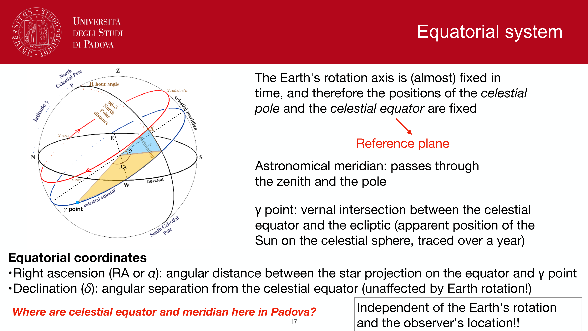
*Equatorial coordinate system: celestial equator, vernal equinox gamma.*

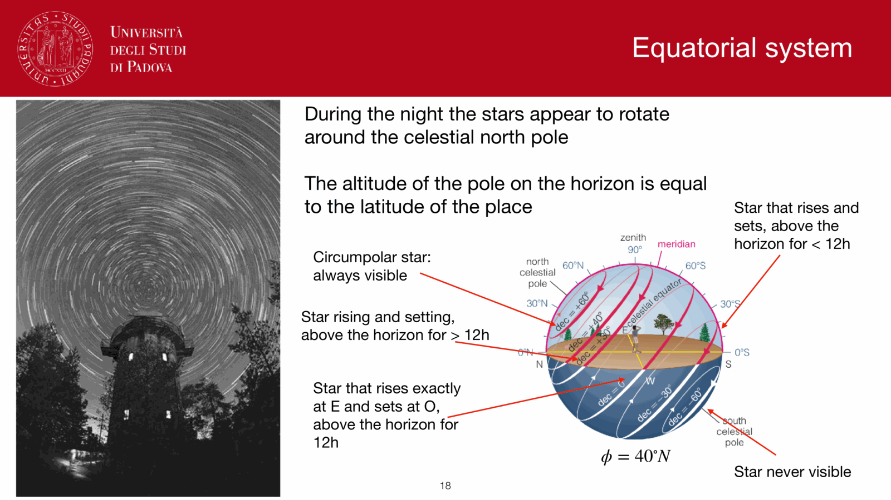
*Right ascension alpha and declination delta definitions.*

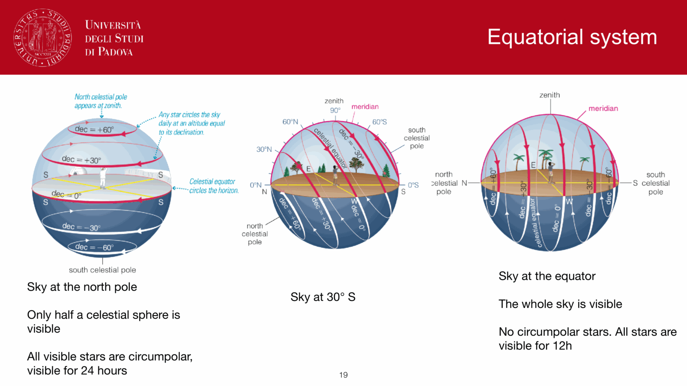
*Hour angle h and local celestial meridian.*

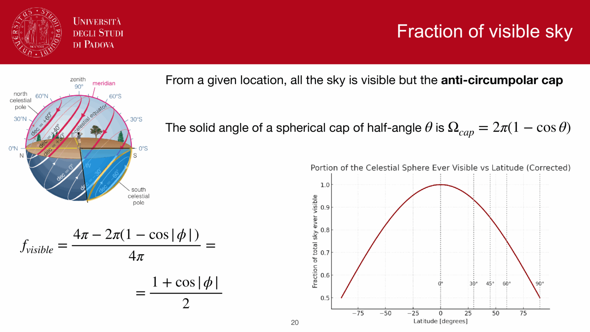
*Relation between Local Sidereal Time, hour angle, and right ascension: Theta = h + alpha.*

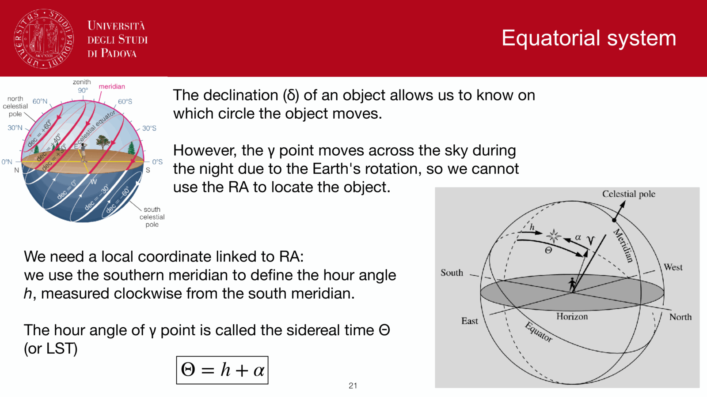
*Declination delta determines visibility from observer latitude phi.*

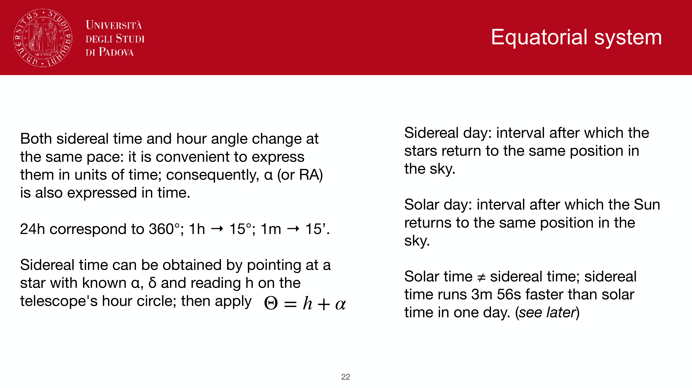
*Polar distance p = 90 deg - delta.*

*Equatorial coordinate grid on the celestial sphere.*

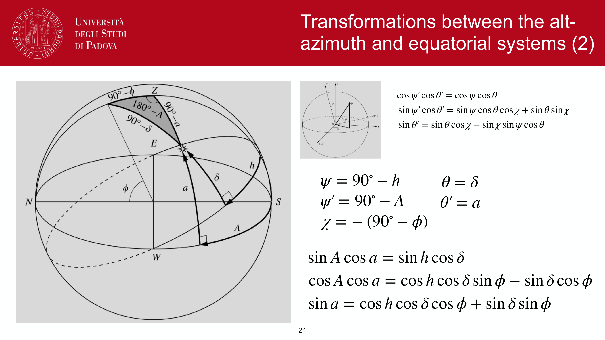
*Apparent daily motion of celestial objects along diurnal circles.*

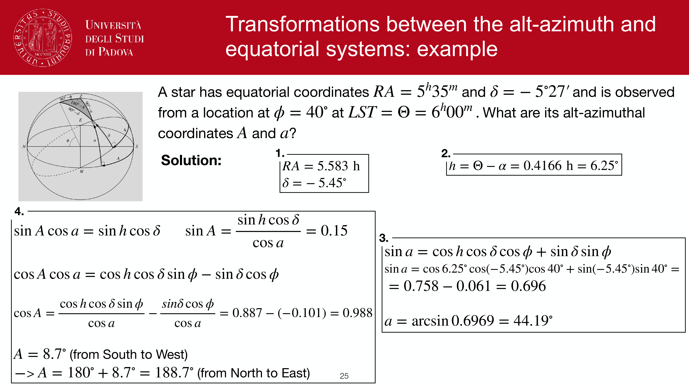
*Equatorial mount vs alt-azimuth mount tracking.*

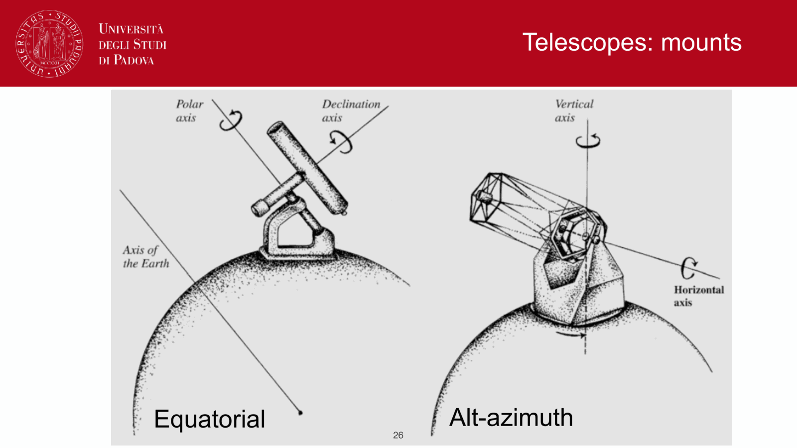
*German equatorial mount and fork mount configurations.*

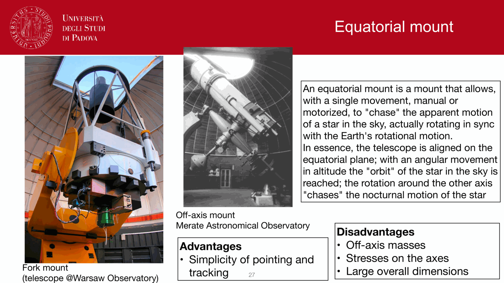
*Cataloging coordinates: why (alpha, delta) is observer-independent.*

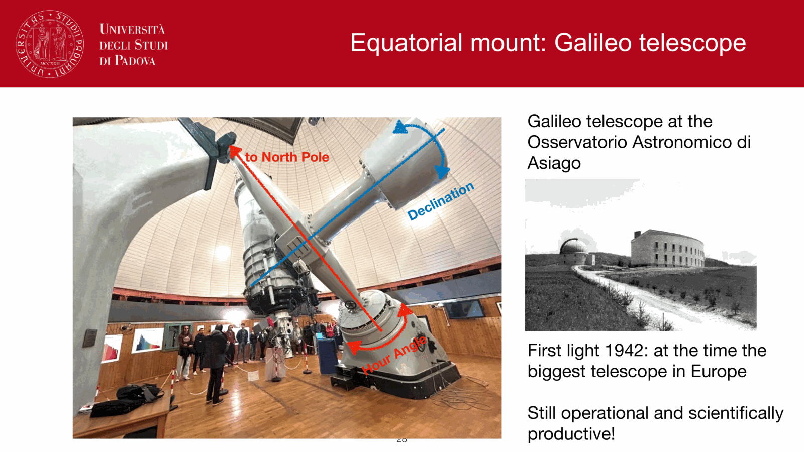
*Standard epochs (B1950, J2000.0) for equatorial catalogs.*


  <h4 class="backlinks-title">Linked References (16)</h4>
  <ul class="backlinks-list">
    <li class="backlink-item-wrap"><a href="./Aberration%20of%20light.html" class="backlink-item">Aberration of light</a></li>
    <li class="backlink-item-wrap"><a href="./Alt-azimuth%20equatorial%20transformations.html" class="backlink-item">Alt-azimuth equatorial transformations</a></li>
    <li class="backlink-item-wrap"><a href="./Alt-azimuth%20%E2%86%94%20equatorial%20transformations.html" class="backlink-item">Alt-azimuth ↔ equatorial transformations</a></li>
    <li class="backlink-item-wrap"><a href="interf/Atmospheric%20refraction.html" class="backlink-item">Atmospheric refraction</a></li>
    <li class="backlink-item-wrap"><a href="./Culmination%20and%20rise-set.html" class="backlink-item">Culmination and rise-set</a></li>
    <li class="backlink-item-wrap"><a href="./Earth%20coordinates.html" class="backlink-item">Earth coordinates</a></li>
    <li class="backlink-item-wrap"><a href="./Ecliptic%20system.html" class="backlink-item">Ecliptic system</a></li>
    <li class="backlink-item-wrap"><a href="../../04_Atlas/Fundamentals_Astrophysics_Cosmology_MOC.html" class="backlink-item">Fundamentals_Astrophysics_Cosmology_MOC</a></li>
    <li class="backlink-item-wrap"><a href="./Galactic%20coordinate%20system.html" class="backlink-item">Galactic coordinate system</a></li>
    <li class="backlink-item-wrap"><a href="./Horizontal%20alt-azimuth%20system.html" class="backlink-item">Horizontal alt-azimuth system</a></li>
    <li class="backlink-item-wrap"><a href="../../04_Atlas/Observational_Astrophysics_MOC.html" class="backlink-item">Observational_Astrophysics_MOC</a></li>
    <li class="backlink-item-wrap"><a href="./Precession%20and%20nutation.html" class="backlink-item">Precession and nutation</a></li>
    <li class="backlink-item-wrap"><a href="./Precession%20nutation%20aberration%20parallax.html" class="backlink-item">Precession nutation aberration parallax</a></li>
    <li class="backlink-item-wrap"><a href="./Sidereal%20vs%20solar%20time.html" class="backlink-item">Sidereal vs solar time</a></li>
    <li class="backlink-item-wrap"><a href="./Spherical_astronomy_complete.html" class="backlink-item">Spherical_astronomy_complete</a></li>
    <li class="backlink-item-wrap"><a href="./Time%20keeping%20in%20astronomy.html" class="backlink-item">Time keeping in astronomy</a></li>
  </ul>

