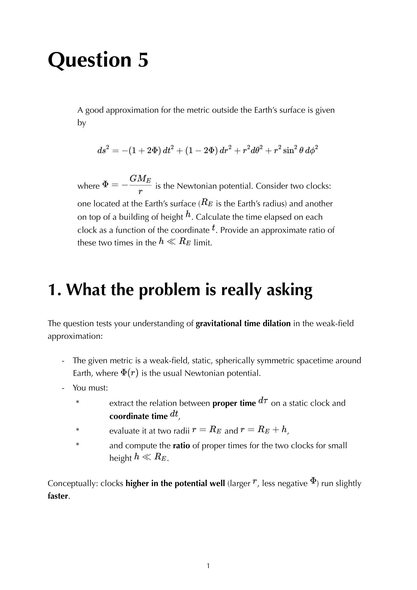
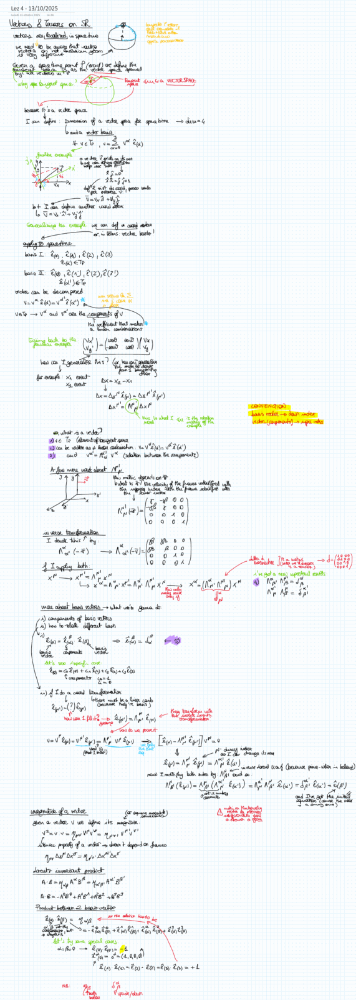


# Equivalence principle

---

### General Relativity Mathematical & Oral Defense Panel

*Question 5 Oral Exam Model Solution: Weak-field metric outside Earth $ds^2 = -(1+2\Phi)dt^2 + (1-2\Phi)dr^2 + r^2 d\Omega^2$, gravitational time dilation, clock tick rates, and the Pound-Rebka experimental verification.*

*Lecture 04 Blackboard Derivation: Einstein Equivalence Principle (EEP), local inertial frames, and the elevator thought experiment.*


  <h4 class="backlinks-title">Linked References (2)</h4>
  <ul class="backlinks-list">
    <li class="backlink-item-wrap"><a href="../../02_Literature/Book/Baumann%20GR/Ch%201%20-%20Gravity%20is%20Geometry.html" class="backlink-item">Ch 1 - Gravity is Geometry</a></li>
    <li class="backlink-item-wrap"><a href="../../04_Atlas/General_Relativity_MOC.html" class="backlink-item">General_Relativity_MOC</a></li>
  </ul>

