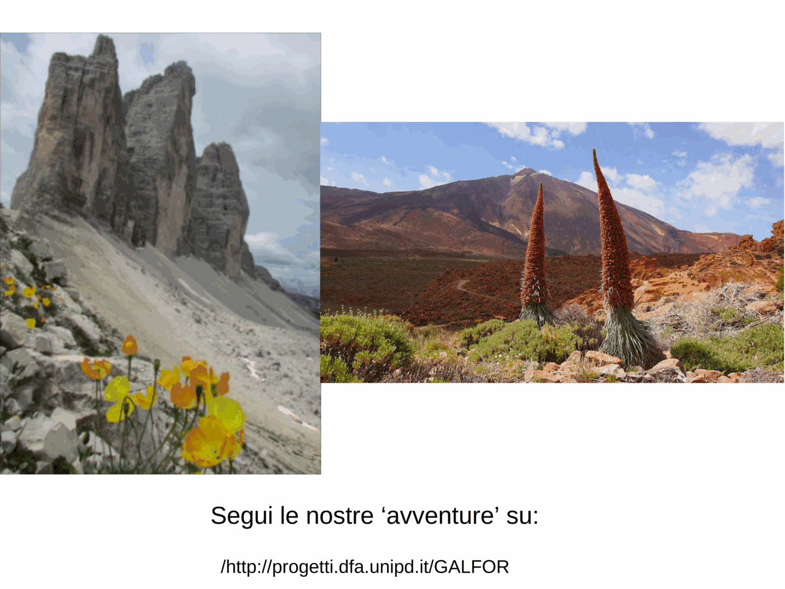
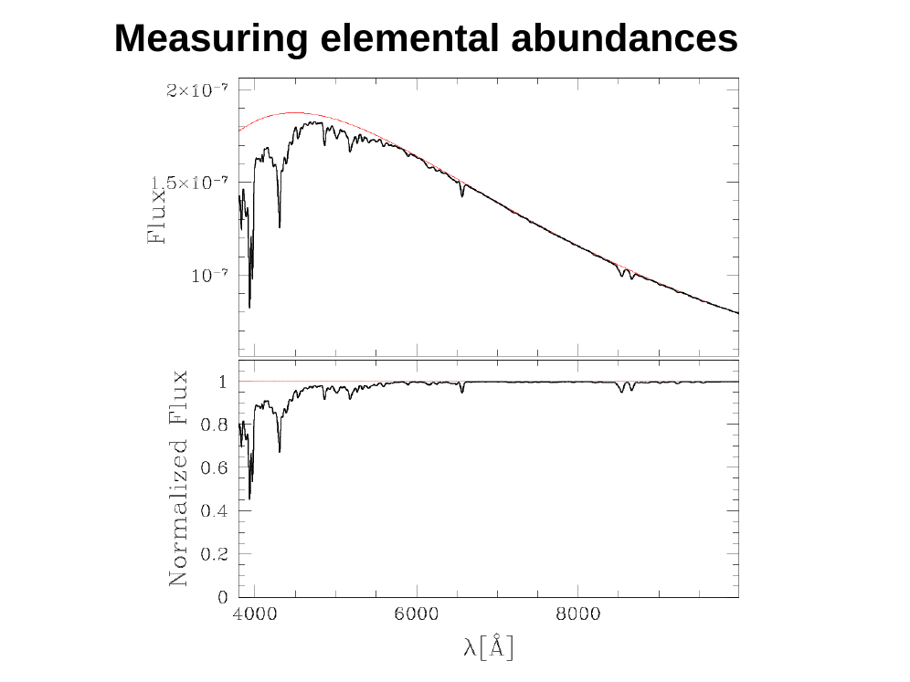
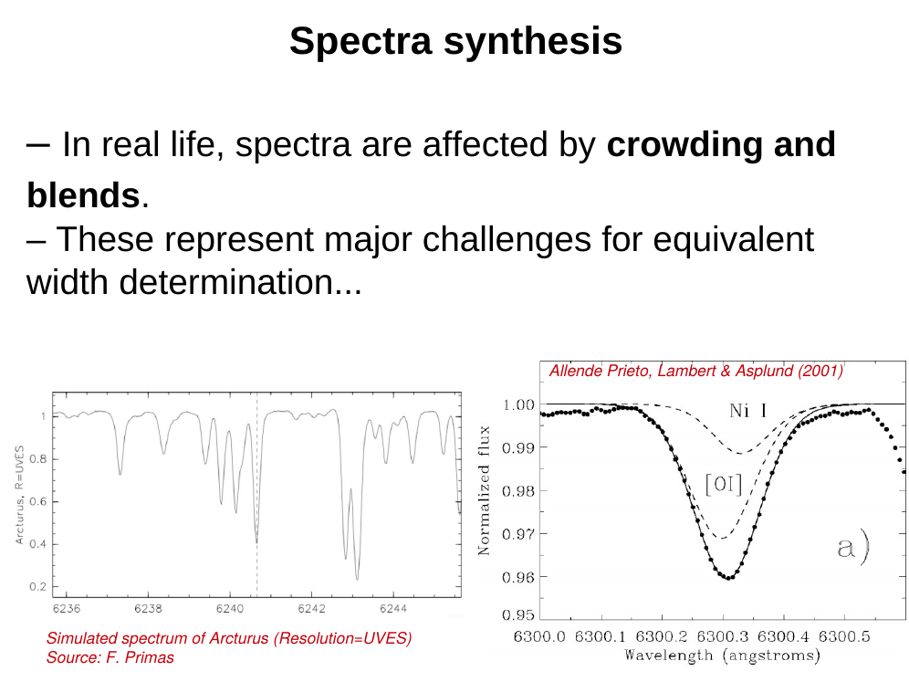
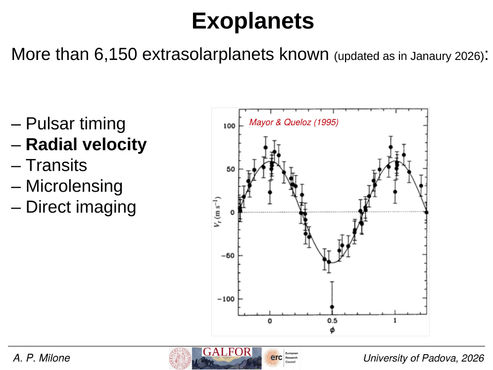
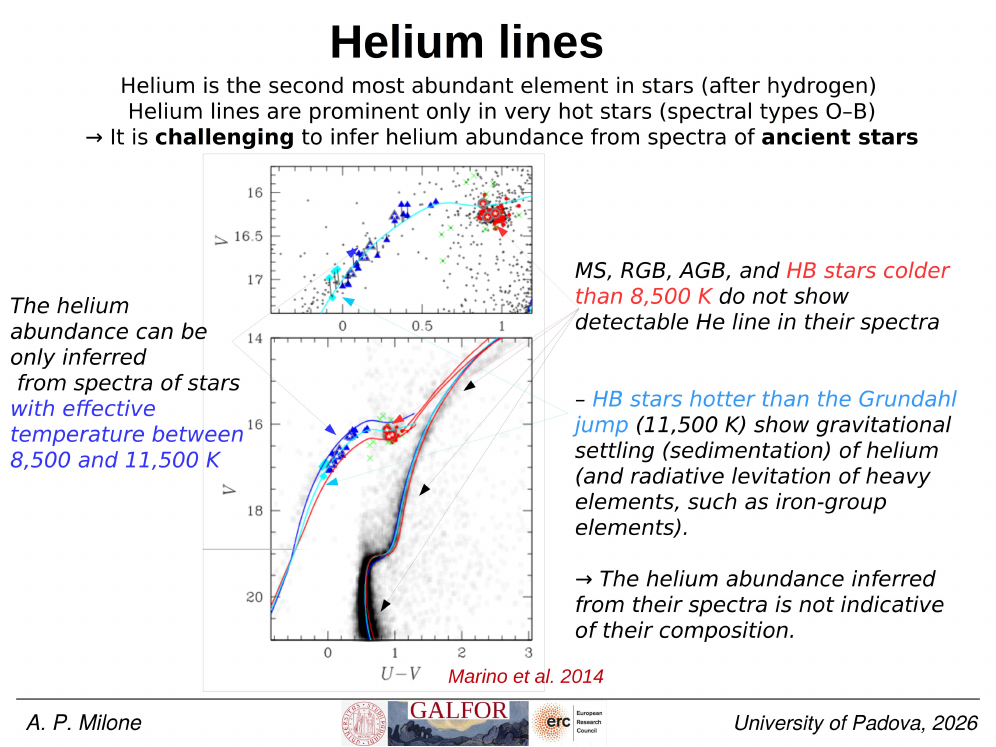
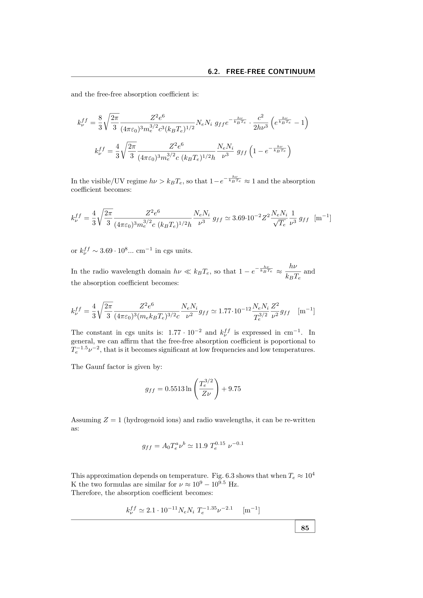

the **equivalent width** $W$ is a single-number summary of an absorption (or emission) line strength: the width of a rectangle with the same area as the line, measured against the local continuum.

## the definition

$$\boxed{\, W_\lambda = \int \left(1 - \frac{F_\lambda}{F_c}\right)\,d\lambda \,}$$

where $F_\lambda$ is the observed flux and $F_c$ is the local continuum. units: Å (or sometimes mÅ).

interpretation: if you took all the absorbed flux and concentrated it into a perfectly black, infinitely deep rectangular line, $W$ is the rectangle's width.

equivalent definition in frequency: $W_\nu = \int (1 - F_\nu/F_c) d\nu$, units of Hz.

## why it's useful

- **insensitive to spectral resolution**: a line resolved at $R = 1000$ vs $R = 100\,000$ has the same $W$, since the integrated absorbed flux is conserved.
- **cleanly compares lines**: line strengths from different instruments are directly comparable via $W$.
- **physical interpretation**: in the optically thin regime, $W \propto N \cdot f$ (column density × oscillator strength).

## the curve of growth

$W$ vs column density $N$ is the **curve of growth** (see [[Curve of growth]]). three regimes:

1. **linear** ($\tau_0 \ll 1$): $W \propto N$. line grows as you add absorbers; depth increases linearly. easy abundance work.
2. **saturation** ($\tau_0 \sim 1$): $W \propto \sqrt{\ln N}$. line core saturates near zero flux; further $N$ deepens the wings only slowly.
3. **damping** ($\tau_0 \gg 1$): $W \propto \sqrt{N}$. damping wings of the Lorentzian take over; line continues to grow but slowly.

practical: if $W$ is small ($< 50$ mÅ), the line is in linear regime, abundance from $W$ is reliable. if $W$ is large ($> 200$ mÅ), saturation, harder to extract $N$ without modelling.

## measuring $W$

practical issues:
- **continuum placement**: a $1\%$ error in continuum level becomes a $\sim 100$ mÅ error in $W$ for shallow lines. central source of error.
- **blends**: nearby lines contribute to the integral. fit and subtract neighbours.
- **rotational broadening**: distributes the absorbed flux, but doesn't change $W$.
- **macroturbulence**: same.
- **thermal broadening**: same.

since broadening only redistributes the absorbed flux without changing the integrated absorption, $W$ is **conserved** under broadening. a strict consequence of the integration.

## sample values

| line | star | $W$ (mÅ) |
|---|---|---|
| H$\alpha$ | F0 V | $\sim 1500$ |
| H$\alpha$ | G2 V (Sun) | $\sim 600$ |
| H$\alpha$ | M0 V | $\sim 400$ |
| Na D | M0 V | $\sim 6000$ |
| Mg I b | G2 V | $\sim 600$ |
| Ca II K | G2 V | $\sim 20\,000$ (very strong, wing-dominated) |

values vary by stellar type and metallicity. line lists like Moore 1972 or NIST tabulate solar $W$ values for thousands of lines.

## emission lines: negative $W$

for an emission line, $F_\lambda > F_c$, so the integrand is negative. by convention, $W$ for emission lines is reported as a positive number with a sign convention. typical: $W(H\alpha) \sim -50$ to $-1000$ Å for emission-line galaxies.

## see also

- [[Line profile function phi nu]]
- [[Absorption coefficient and oscillator strength]]
- [[Curve of growth]]
- [[Optical depth]]
- [[Voigt profile]]
- [[Damping wings]]
- [[Curve of growth abundance analysis]]

---

## Complete Lecture Slide Panels & Observational Evidence (Lecture 08 — Stellar Spectroscopy II: Curve of Growth & Line Broadening)

> **Context**: *Voigt line profiles, equivalent width W_lambda, curve of growth regimes (linear, saturated flat, damping square-root), and microturbulence velocity fields.*

The following slides from Prof. Antonino Milone's lecture series provide the direct observational, photometric, and theoretical foundations for this topic:

*Figure P08-01: LAntonino_p08_01.png — Observational data, CMD morphology, and diagnostics from Lecture 08 — Stellar Spectroscopy II: Curve of Growth & Line Broadening.*

*Figure P08-02: LAntonino_p08_02.png — Observational data, CMD morphology, and diagnostics from Lecture 08 — Stellar Spectroscopy II: Curve of Growth & Line Broadening.*

*Figure P08-03: LAntonino_p08_03.png — Observational data, CMD morphology, and diagnostics from Lecture 08 — Stellar Spectroscopy II: Curve of Growth & Line Broadening.*

*Figure P08-04: LAntonino_p08_04.png — Observational data, CMD morphology, and diagnostics from Lecture 08 — Stellar Spectroscopy II: Curve of Growth & Line Broadening.*

*Figure P08-05: LAntonino_p08_05.png — Observational data, CMD morphology, and diagnostics from Lecture 08 — Stellar Spectroscopy II: Curve of Growth & Line Broadening.*

*Figure P08-06: LAntonino_p08_06.png — Observational data, CMD morphology, and diagnostics from Lecture 08 — Stellar Spectroscopy II: Curve of Growth & Line Broadening.*

*Figure P08-07: LAntonino_p08_07.png — Observational data, CMD morphology, and diagnostics from Lecture 08 — Stellar Spectroscopy II: Curve of Growth & Line Broadening.*

*Figure P08-08: LAntonino_p08_08.png — Observational data, CMD morphology, and diagnostics from Lecture 08 — Stellar Spectroscopy II: Curve of Growth & Line Broadening.*

*Figure P08-09: LAntonino_p08_09.png — Observational data, CMD morphology, and diagnostics from Lecture 08 — Stellar Spectroscopy II: Curve of Growth & Line Broadening.*

*Figure P08-10: LAntonino_p08_10.png — Observational data, CMD morphology, and diagnostics from Lecture 08 — Stellar Spectroscopy II: Curve of Growth & Line Broadening.*

*Figure P08-11: LAntonino_p08_11.png — Observational data, CMD morphology, and diagnostics from Lecture 08 — Stellar Spectroscopy II: Curve of Growth & Line Broadening.*

*Figure P08-12: LAntonino_p08_12.png — Observational data, CMD morphology, and diagnostics from Lecture 08 — Stellar Spectroscopy II: Curve of Growth & Line Broadening.*

*Figure P08-13: LAntonino_p08_13.png — Observational data, CMD morphology, and diagnostics from Lecture 08 — Stellar Spectroscopy II: Curve of Growth & Line Broadening.*

*Figure P08-14: LAntonino_p08_14.png — Observational data, CMD morphology, and diagnostics from Lecture 08 — Stellar Spectroscopy II: Curve of Growth & Line Broadening.*

*Figure P08-15: LAntonino_p08_15.png — Observational data, CMD morphology, and diagnostics from Lecture 08 — Stellar Spectroscopy II: Curve of Growth & Line Broadening.*

*Figure P08-16: LAntonino_p08_16.png — Observational data, CMD morphology, and diagnostics from Lecture 08 — Stellar Spectroscopy II: Curve of Growth & Line Broadening.*

*Figure P08-17: LAntonino_p08_17.png — Observational data, CMD morphology, and diagnostics from Lecture 08 — Stellar Spectroscopy II: Curve of Growth & Line Broadening.*

*Figure P08-18: LAntonino_p08_18.png — Observational data, CMD morphology, and diagnostics from Lecture 08 — Stellar Spectroscopy II: Curve of Growth & Line Broadening.*

*Figure P08-19: LAntonino_p08_19.png — Observational data, CMD morphology, and diagnostics from Lecture 08 — Stellar Spectroscopy II: Curve of Growth & Line Broadening.*

*Figure P08-20: LAntonino_p08_20.png — Observational data, CMD morphology, and diagnostics from Lecture 08 — Stellar Spectroscopy II: Curve of Growth & Line Broadening.*

*Figure P08-21: LAntonino_p08_21.png — Observational data, CMD morphology, and diagnostics from Lecture 08 — Stellar Spectroscopy II: Curve of Growth & Line Broadening.*

*Figure P08-22: LAntonino_p08_22.png — Observational data, CMD morphology, and diagnostics from Lecture 08 — Stellar Spectroscopy II: Curve of Growth & Line Broadening.*

*Figure P08-23: LAntonino_p08_23.png — Observational data, CMD morphology, and diagnostics from Lecture 08 — Stellar Spectroscopy II: Curve of Growth & Line Broadening.*

*Figure P08-24: LAntonino_p08_24.png — Observational data, CMD morphology, and diagnostics from Lecture 08 — Stellar Spectroscopy II: Curve of Growth & Line Broadening.*

*Figure P08-25: LAntonino_p08_25.png — Observational data, CMD morphology, and diagnostics from Lecture 08 — Stellar Spectroscopy II: Curve of Growth & Line Broadening.*

*Figure P08-26: Lecture08_p15-15.png — Observational data, CMD morphology, and diagnostics from Lecture 08 — Stellar Spectroscopy II: Curve of Growth & Line Broadening.*

*Figure P08-27: Lecture08_p25-25.png — Observational data, CMD morphology, and diagnostics from Lecture 08 — Stellar Spectroscopy II: Curve of Growth & Line Broadening.*

*Figure P08-28: Lecture08_p35-35.png — Observational data, CMD morphology, and diagnostics from Lecture 08 — Stellar Spectroscopy II: Curve of Growth & Line Broadening.*

*Figure P08-29: Lecture08_p5-05.png — Observational data, CMD morphology, and diagnostics from Lecture 08 — Stellar Spectroscopy II: Curve of Growth & Line Broadening.*

---

### Astronomical Spectroscopy Diagnostic Panels

*The Curve of Growth: linear regime ($W_\lambda \propto N f$), flat saturated Doppler core regime ($W_\lambda \propto \sqrt{\ln(N f)}$), and square-root damping wings regime ($W_\lambda \propto \sqrt{N f \gamma}$).*

## Linked References

- [[Absorption coefficient and oscillator strength]]
- [[Curve of growth abundance analysis]]
- [[Curve of growth]]
- [[Damping wings]]
- [[Element abundance patterns]]
- [[Line profile function phi nu]]
- [[Macroturbulence]]
- [[Microturbulence]]
- [[Optical depth]]
- [[Spectroscopic determination of Teff]]
- [[Spectroscopic determination of log g]]
- [[Spectroscopic determination of metallicity]]
- [[Stellar rotation v sini]]
- [[Thermal Doppler broadening]]
- [[Voigt profile]]
- [[Astronomical_Spectroscopy_MOC]]

