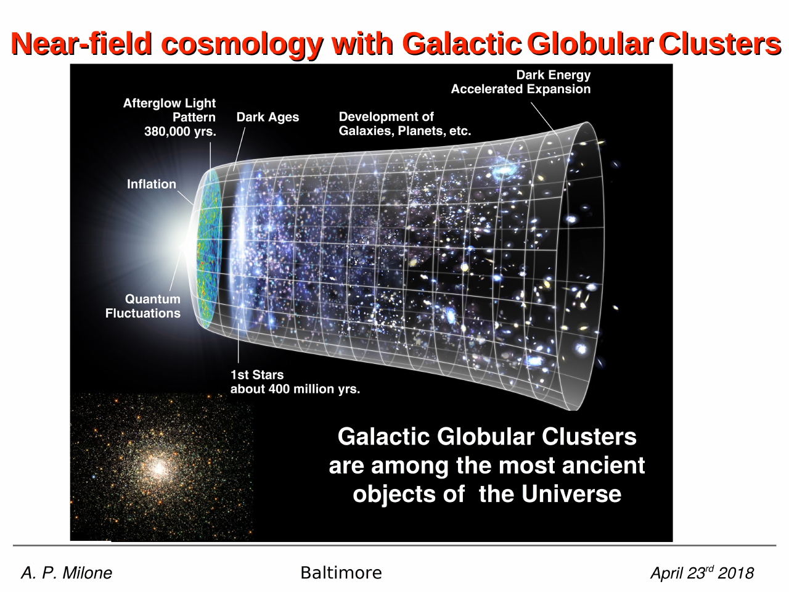
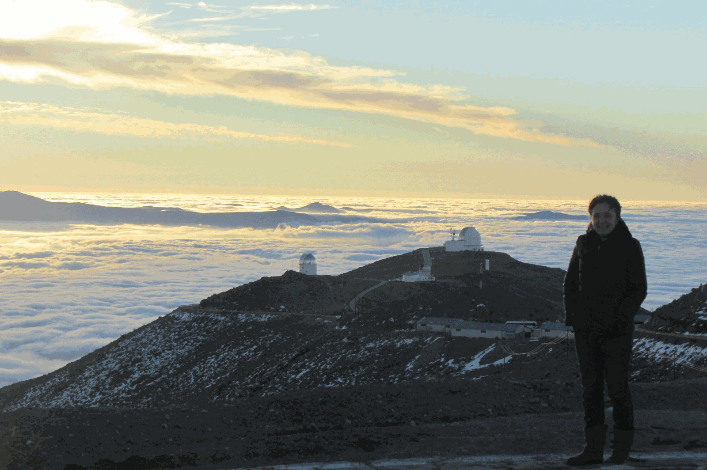
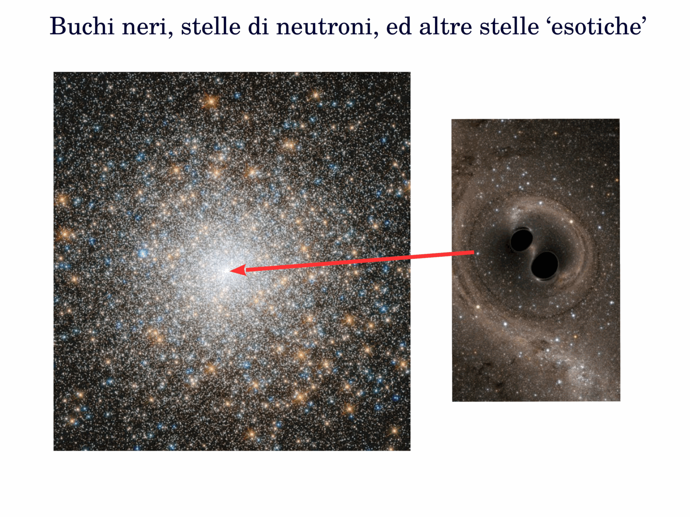
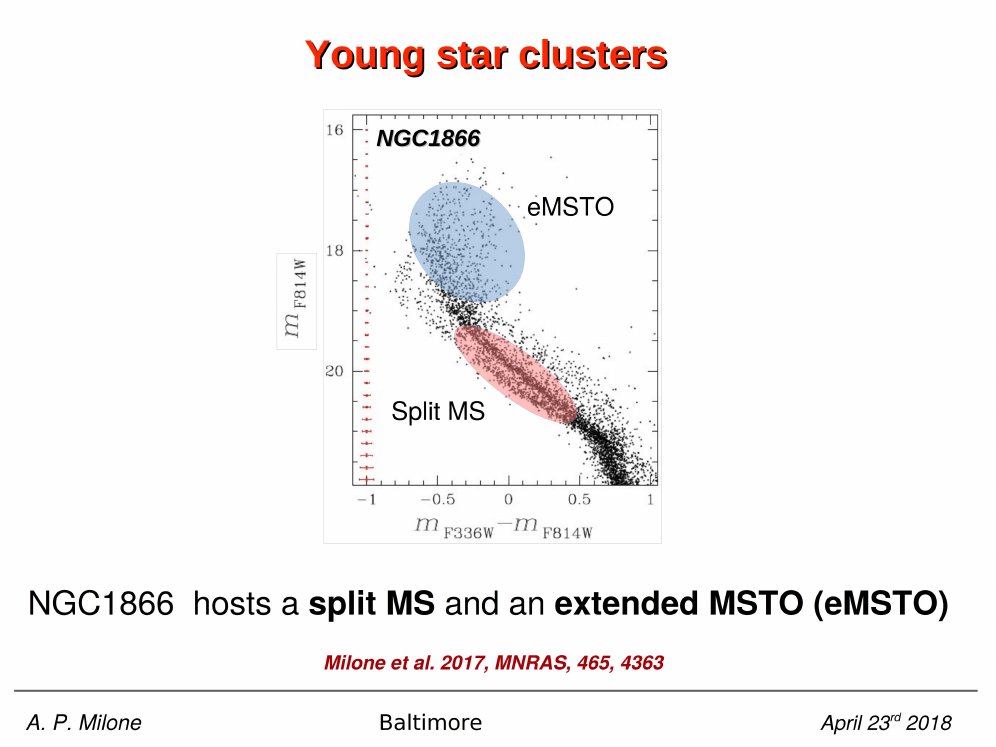
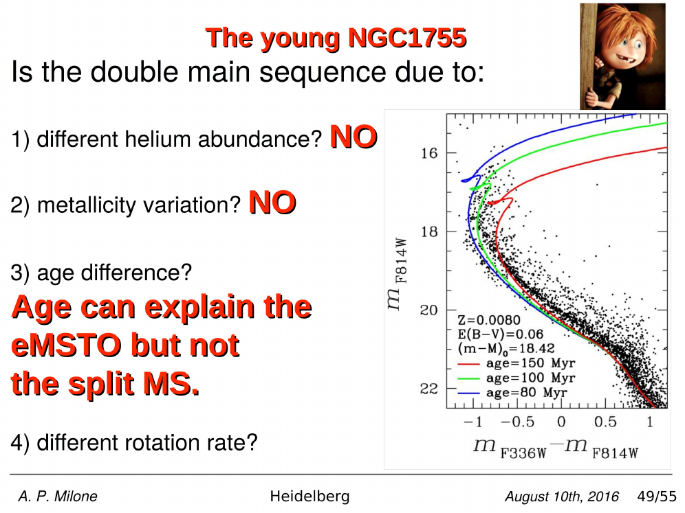
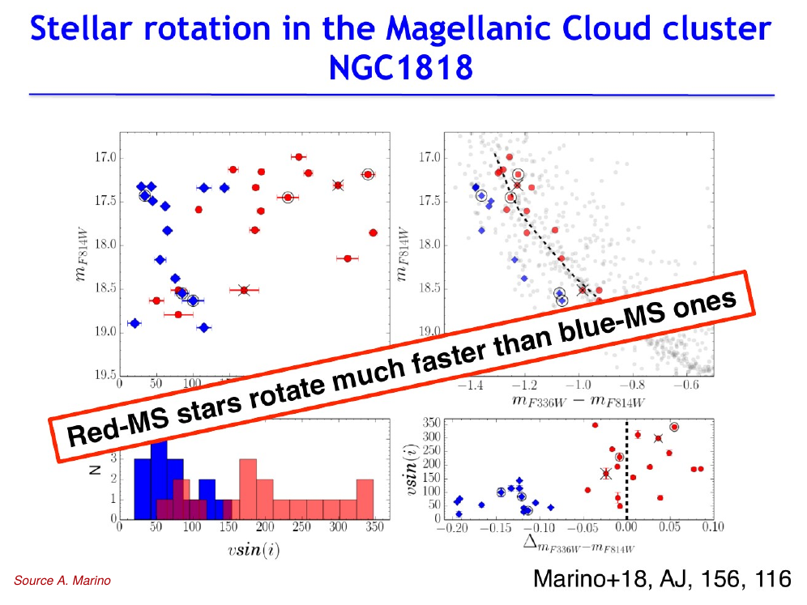

the **extended main sequence turn-off (eMSTO) phenomenon** is the discovery that intermediate-age ($\sim 1$-$2$ Gyr) star clusters in the LMC + SMC + MW show a broadened MS turn-off region, much wider than expected for a [simple stellar population](Single%20stellar%20population%20SSP.html) of the same age. the TO width $\Delta V \sim 0.1$-$0.3$ mag is well-resolved with HST + JWST.

## the discovery

**Mackey & Broby Nielsen 2007, MNRAS 379, 151** first reported the eMSTO in NGC 1846 (LMC, $\sim 1.5$ Gyr). they noted that the TO region was significantly wider than the photometric uncertainty + binary effects could explain.

**Milone et al. 2009, A&A 497, 755** extended the survey to seven LMC clusters ($\sim 1$-$2$ Gyr) and found eMSTOs in all of them. later studies confirmed the phenomenon is universal in clusters of this age range:
- LMC: NGC 1755, NGC 1783, NGC 1806, NGC 1846, NGC 1850, NGC 1856, NGC 2173, etc.
- SMC: NGC 411, NGC 419, NGC 1751.
- MW: NGC 6791 (debatable, very old + metal-rich).

eMSTOs are **not seen** in old GCs ($> 5$ Gyr) and **not seen** in very young clusters ($< 30$ Myr). the phenomenon is age-restricted to $\sim 100$ Myr - $2$ Gyr.

## the original interpretation: age spread

if the TO width is age-broadening, the implied **age spread** is $\sim 200$-$500$ Myr. this would mean intermediate-age clusters are NOT SSPs but extended-SF systems.

problem with this interpretation:
1. the MS below the TO (M $< M_{\rm TO}$) is **NOT** broadened by an equivalent age spread,
2. there is no observed gas in these clusters today, despite their young age,
3. $\sim 500$ Myr SF would be enormous compared to the cluster's free-fall time + relaxation time.

so age spread alone fails to explain the data.

## the current interpretation: stellar rotation

**Bastian & de Mink 2009, MNRAS 398, L11** proposed that **stellar rotation** broadens the TO via:

1. **gravity darkening** in fast rotators: the equator is cooler than the pole due to centrifugal flattening, lowering effective $T_{\rm eff}$ for stars seen equator-on,
2. **rotational mixing**: brings fresh hydrogen from the radiative envelope to the convective core, prolonging core-H burning + shifting the TO redward + brighter,
3. **inclination effect**: same star looks bluer pole-on or redder equator-on.

quantitative models (Brandt & Huang 2015, ApJ 807, 24) reproduce the observed TO width with rotation rates $v/v_{\rm crit} = 0$ to $0.9$ distributed across the population.

key observation supporting rotation: in NGC 1755, NGC 1850, the upper MS is **bifurcated** into a blue + red sequence (Milone et al. 2018, MNRAS 477, 2640). the blue sequence is identified with slow rotators or merger products, the red sequence with fast rotators ($v_{\rm rot} \sim 200$-$300$ km/s). spectroscopic confirmation: Marino et al. 2018, AJ 156, 116 directly measured $v\sin i$ for stars on the two sequences in NGC 1866.

## age constraint: why only 1-2 Gyr clusters?

at younger ages, all stars are too hot/massive for rotational mixing to differentiate the TO meaningfully. at older ages, most stars are below the rotation-mass threshold ($M < 1.4 M_\odot$ have convective envelopes that brake rotation magnetically). so the eMSTO appears in the narrow age window where MS stars retain significant rotation but are old enough that the broadening is observable.

## connection to multiple populations in old GCs

an active question: **are eMSTO clusters the present-day analogues of what old GCs looked like at $\sim 1$-$2$ Gyr after formation?**

- old GCs show [Na-O anti-correlation](Multiple%20populations%20in%20GCs%20discovery.html) + helium spread + chromosome maps;
- young eMSTO clusters do NOT show clear chemical anomalies (yet);
- but eMSTO + young split MS share the structural signature: **a single SSP cannot explain the CMD**.

possible reconciliation: rotation drives eMSTO at young ages, then magnetic braking reduces rotation, but residual chemical anomalies (He, Na, O) accumulated during early SF persist. this would imply the polluter mechanisms operating in old GCs (AGB, FRMS) ALSO operate in young clusters but produce chemical signatures only revealed at later times.

D'Antona et al. 2015 argued that fast rotators may be He-enriched second-generation stars: rotation $\to$ He variation $\to$ CMD broadening with both effects.

## why this matters

eMSTO is one of the **central open problems** of the course:
- it shows that the SSP framework is too simple even for clusters where it should work,
- it ties stellar rotation physics to observable CMD morphology,
- it potentially links young massive clusters to old GCs as a single evolutionary sequence,
- it is a major calibration concern for stellar population synthesis models in extragalactic studies.

## reference papers

- **Mackey & Broby Nielsen 2007, MNRAS 379, 151** — discovery in NGC 1846.
- **Milone et al. 2009, A&A 497, 755** — eMSTO in seven LMC clusters.
- **Bastian & de Mink 2009, MNRAS 398, L11** — rotation hypothesis.
- **Brandt & Huang 2015, ApJ 807, 24** — quantitative rotation models.
- **Niederhofer et al. 2015** — age-spread interpretation revisited.
- **D'Antona et al. 2015, MNRAS 453, 2637** — rotation + He variation.
- **Milone et al. 2018, MNRAS 477, 2640** — split upper MS in NGC 1755 + NGC 1850.
- **Marino et al. 2018, AJ 156, 116** — direct $v\sin i$ measurement in NGC 1866.

## see also

- [Origin of eMSTO age spread or rotation](Origin%20of%20eMSTO%20age%20spread%20or%20rotation.html)
- [Stellar rotation effects on CMD](Stellar%20rotation%20effects%20on%20CMD.html)
- [Splitting of the upper MS in young clusters](Splitting%20of%20the%20upper%20MS%20in%20young%20clusters.html)
- [eMSTO and multiple populations connection](eMSTO%20and%20multiple%20populations%20connection.html)
- [Multiple populations in GCs discovery](Multiple%20populations%20in%20GCs%20discovery.html)
- [Helium spread in GCs](Helium%20spread%20in%20GCs.html)
- [Single stellar population SSP](Single%20stellar%20population%20SSP.html)
- [Color-magnitude diagrams of clusters](Color-magnitude%20diagrams%20of%20clusters.html)
- [Stellar_Astrophysics_MOC](../../04_Atlas/Stellar_Astrophysics_MOC.html)

---

## Complete Lecture Slide Panels & Observational Evidence (Lecture 18 — The Extended Main Sequence Turnoff Phenomenon)

> **Context**: *Intermediate-age Magellanic Cloud clusters (NGC 1850, NGC 1755), split main sequences, age spread vs stellar rotation, von Zeipel gravity darkening, and equatorial cooling.*

The following slides from Prof. Antonino Milone's lecture series provide the direct observational, photometric, and theoretical foundations for this topic:

*Figure P18-01: LAntonino_p18_01.png — Observational data, CMD morphology, and diagnostics from Lecture 18 — The Extended Main Sequence Turnoff Phenomenon.*

*Figure P18-02: LAntonino_p18_02.png — Observational data, CMD morphology, and diagnostics from Lecture 18 — The Extended Main Sequence Turnoff Phenomenon.*

*Figure P18-03: LAntonino_p18_03.png — Observational data, CMD morphology, and diagnostics from Lecture 18 — The Extended Main Sequence Turnoff Phenomenon.*

*Figure P18-04: LAntonino_p18_04.png — Observational data, CMD morphology, and diagnostics from Lecture 18 — The Extended Main Sequence Turnoff Phenomenon.*

*Figure P18-05: LAntonino_p18_05.png — Observational data, CMD morphology, and diagnostics from Lecture 18 — The Extended Main Sequence Turnoff Phenomenon.*

*Figure P18-06: LAntonino_p18_06.png — Observational data, CMD morphology, and diagnostics from Lecture 18 — The Extended Main Sequence Turnoff Phenomenon.*

*Figure P18-07: LAntonino_p18_07.png — Observational data, CMD morphology, and diagnostics from Lecture 18 — The Extended Main Sequence Turnoff Phenomenon.*

*Figure P18-08: LAntonino_p18_08.png — Observational data, CMD morphology, and diagnostics from Lecture 18 — The Extended Main Sequence Turnoff Phenomenon.*

*Figure P18-09: LAntonino_p18_09.png — Observational data, CMD morphology, and diagnostics from Lecture 18 — The Extended Main Sequence Turnoff Phenomenon.*

*Figure P18-10: LAntonino_p18_10.png — Observational data, CMD morphology, and diagnostics from Lecture 18 — The Extended Main Sequence Turnoff Phenomenon.*

*Figure P18-11: LAntonino_p18_11.png — Observational data, CMD morphology, and diagnostics from Lecture 18 — The Extended Main Sequence Turnoff Phenomenon.*

*Figure P18-12: LAntonino_p18_12.png — Observational data, CMD morphology, and diagnostics from Lecture 18 — The Extended Main Sequence Turnoff Phenomenon.*

*Figure P18-13: LAntonino_p18_13.png — Observational data, CMD morphology, and diagnostics from Lecture 18 — The Extended Main Sequence Turnoff Phenomenon.*

*Figure P18-14: LAntonino_p18_14.png — Observational data, CMD morphology, and diagnostics from Lecture 18 — The Extended Main Sequence Turnoff Phenomenon.*

*Figure P18-15: LAntonino_p18_15.png — Observational data, CMD morphology, and diagnostics from Lecture 18 — The Extended Main Sequence Turnoff Phenomenon.*

*Figure P18-16: LAntonino_p18_16.png — Observational data, CMD morphology, and diagnostics from Lecture 18 — The Extended Main Sequence Turnoff Phenomenon.*

*Figure P18-17: LAntonino_p18_17.png — Observational data, CMD morphology, and diagnostics from Lecture 18 — The Extended Main Sequence Turnoff Phenomenon.*

*Figure P18-18: LAntonino_p18_18.png — Observational data, CMD morphology, and diagnostics from Lecture 18 — The Extended Main Sequence Turnoff Phenomenon.*

*Figure P18-19: LAntonino_p18_19.png — Observational data, CMD morphology, and diagnostics from Lecture 18 — The Extended Main Sequence Turnoff Phenomenon.*

*Figure P18-20: LAntonino_p18_20.png — Observational data, CMD morphology, and diagnostics from Lecture 18 — The Extended Main Sequence Turnoff Phenomenon.*

*Figure P18-21: LAntonino_p18_21.png — Observational data, CMD morphology, and diagnostics from Lecture 18 — The Extended Main Sequence Turnoff Phenomenon.*

*Figure P18-22: LAntonino_p18_22.png — Observational data, CMD morphology, and diagnostics from Lecture 18 — The Extended Main Sequence Turnoff Phenomenon.*

*Figure P18-23: LAntonino_p18_23.png — Observational data, CMD morphology, and diagnostics from Lecture 18 — The Extended Main Sequence Turnoff Phenomenon.*

*Figure P18-24: LAntonino_p18_24.png — Observational data, CMD morphology, and diagnostics from Lecture 18 — The Extended Main Sequence Turnoff Phenomenon.*

*Figure P18-25: LAntonino_p18_25.png — Observational data, CMD morphology, and diagnostics from Lecture 18 — The Extended Main Sequence Turnoff Phenomenon.*

*Figure P18-26: Lecture18_p15-15.png — Observational data, CMD morphology, and diagnostics from Lecture 18 — The Extended Main Sequence Turnoff Phenomenon.*

*Figure P18-27: Lecture18_p25-25.png — Observational data, CMD morphology, and diagnostics from Lecture 18 — The Extended Main Sequence Turnoff Phenomenon.*

*Figure P18-28: Lecture18_p35-35.png — Observational data, CMD morphology, and diagnostics from Lecture 18 — The Extended Main Sequence Turnoff Phenomenon.*

*Figure P18-29: Lecture18_p5-05.png — Observational data, CMD morphology, and diagnostics from Lecture 18 — The Extended Main Sequence Turnoff Phenomenon.*

  <h4 class="backlinks-title">Linked References (8)</h4>
  <ul class="backlinks-list">
    <li class="backlink-item-wrap"><a href="Effects%20of%20differential%20reddening%20on%20CMD%20analysis.html" class="backlink-item">Effects of differential reddening on CMD analysis</a></li>
    <li class="backlink-item-wrap"><a href="Mass%20dependence%20of%20multiple%20populations.html" class="backlink-item">Mass dependence of multiple populations</a></li>
    <li class="backlink-item-wrap"><a href="Multiple%20populations%20in%20extragalactic%20GCs.html" class="backlink-item">Multiple populations in extragalactic GCs</a></li>
    <li class="backlink-item-wrap"><a href="Origin%20of%20eMSTO%20age%20spread%20or%20rotation.html" class="backlink-item">Origin of eMSTO age spread or rotation</a></li>
    <li class="backlink-item-wrap"><a href="Splitting%20of%20the%20upper%20MS%20in%20young%20clusters.html" class="backlink-item">Splitting of the upper MS in young clusters</a></li>
    <li class="backlink-item-wrap"><a href="Stellar%20rotation%20effects%20on%20CMD.html" class="backlink-item">Stellar rotation effects on CMD</a></li>
    <li class="backlink-item-wrap"><a href="eMSTO%20and%20multiple%20populations%20connection.html" class="backlink-item">eMSTO and multiple populations connection</a></li>
    <li class="backlink-item-wrap"><a href="../../04_Atlas/Stellar_Astrophysics_MOC.html" class="backlink-item">Stellar_Astrophysics_MOC</a></li>
  </ul>

