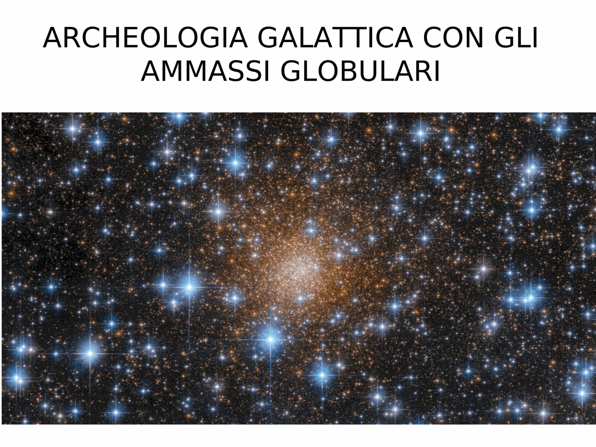
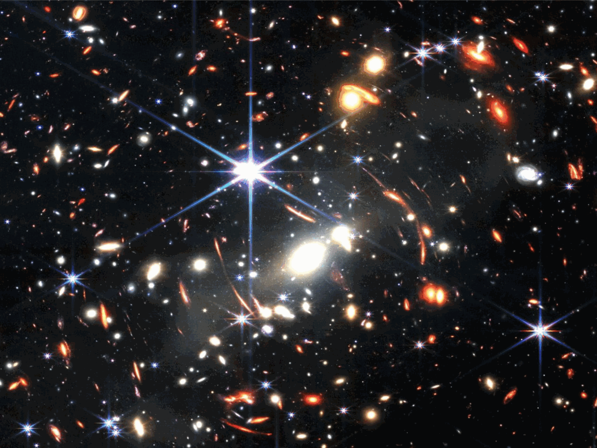
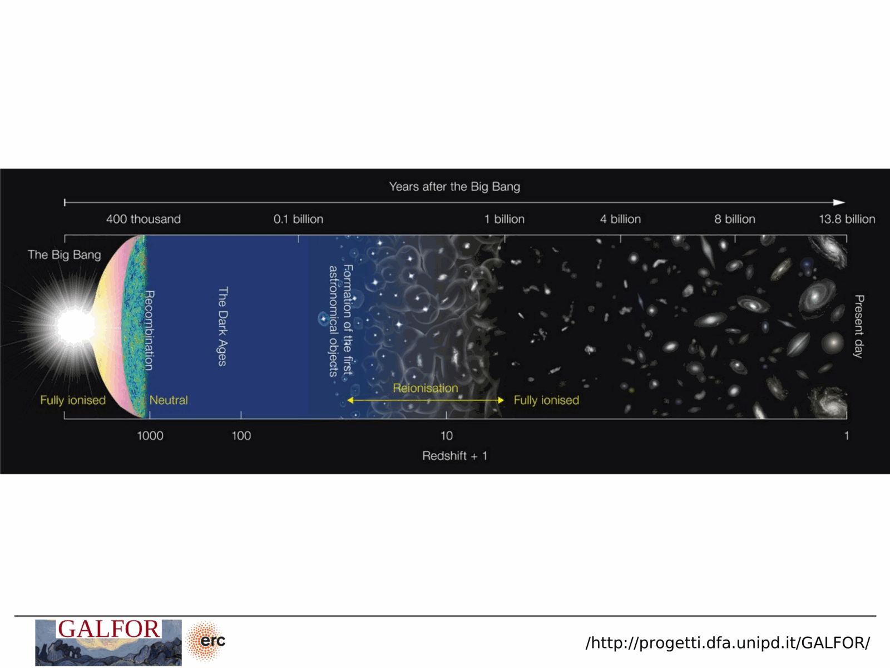


the milky way's $\sim 150$ globulars and $\sim 10^3$ catalogued open clusters are a small, biased local sample. the population, age, and metallicity distribution of *extragalactic* clusters expand the SSP laboratory to environments the milky way does not provide: starburst dwarfs, ellipticals, intracluster space, and high-redshift proto-galaxies.

**M31 and the PHAT survey.** the panchromatic hubble andromeda treasury (PHAT, dalcanton et al. 2012) imaged ~ a third of M31's disk in six bands from NUV to NIR with HST, resolving $\sim 10^8$ stars and catalogueing $\sim 2700$ star clusters spanning $10^7$ to $10^{10}$ yr (the BEAST and PHAT cluster catalogue work). because M31 is at $d \approx 780$ kpc, the photometric depth reaches the red clump and the upper RGB but typically not the MS turn-off for old populations. PHAT recovers cluster ages, masses, and reddenings via integrated SED fitting (since individual MS stars below $M \sim 2 \, M_\odot$ are blended at this distance), making it the canonical *unresolved-but-spatially-resolved* dataset that bridges the resolved/unresolved divide of [Resolved vs unresolved stellar populations](./Resolved%20vs%20unresolved%20stellar%20populations.html). PHATTER does the same for M33.

**M87 and the giant ellipticals.** M87 in the virgo cluster sits at $d \approx 16.5$ Mpc and hosts a globular cluster system of $\sim 14000$ GCs (peng et al. 2008), an order of magnitude richer than the milky way's. these GCs appear as point sources in HST imaging, indistinguishable from foreground stars except via colour and magnitude in $g$ and $z$. their colour distribution is *bimodal*: a blue, metal-poor population that follows the halo light, and a red, metal-rich population that follows the galaxy's stellar mass. the bimodality is universal in giant ellipticals and is interpreted as evidence for two-phase galaxy assembly, where the metal-poor GCs are accreted from disrupted dwarfs and the metal-rich GCs formed in-situ during the main galaxy's star-formation episode. dynamical masses of M87 from GC kinematics give one of the cleanest probes of dark-matter halos in ellipticals.

**dwarf galaxies and ultra-faint dwarfs** sample the *low-metallicity, low-mass* end of GC formation. fornax has $\sim 5$ GCs, sagittarius dSph contributed at least 4 GCs to the milky way during disruption (M54 still sits at the dSph nucleus), the LMC has the unique pop of *young massive clusters* like NGC 1866 that are intermediate-age GC analogues. canes venatici I and reticulum II are too small to host bound clusters but their *field* CMDs are still readable as composite SSPs.

**JWST and the high-redshift frontier.** the **sparkler galaxy** is a strongly lensed background source behind the SMACS 0723 cluster, observed by JWST in 2022 (mowla et al. 2022). its lens-magnified image at $z \approx 1.4$ shows compact knots interpreted as proto-globular cluster candidates with stellar masses $10^6$ to $10^7 \, M_\odot$ and ages of a few hundred Myr at the time of observation, implying formation redshifts $z_\mathrm{form} \sim 9$. if confirmed, sparkler is the first direct view of GCs *during their main star-forming epoch* and connects the formation channel inferred from local GCs (massive, metal-poor, dense, formed at $z > 6$) to a directly observed analogue. several follow-up JWST programmes (claws-jwst, GLASS, UNCOVER) target similar candidates at $z \sim 6$ to $10$.

**intracluster GCs** are observed in coma, virgo, and fornax cluster cores: GCs that sit between galaxies, presumably stripped from now-disrupted dwarfs. they trace the build-up of the intracluster light and the tidal history of the cluster.

the take-home: the milky way's GCs are old, accreted, and chemically simple; M31 and M87 reveal the *system-level* properties (specific frequency $S_N$, colour bimodality); and JWST is starting to deliver *temporal* constraints on when and how GCs formed in the first place.

## see also
- [Stellar_Astrophysics_MOC](../../04_Atlas/Stellar_Astrophysics_MOC.html)
- [Globular clusters as SSP laboratories](./Globular%20clusters%20as%20SSP%20laboratories.html)
- [Single stellar population SSP](./Single%20stellar%20population%20SSP.html)
- [Star cluster types](./Star%20cluster%20types.html)
- [Color-magnitude diagrams of clusters](./Color-magnitude%20diagrams%20of%20clusters.html)

---

## Complete Lecture Slide Panels & Observational Evidence (Lecture 21 — Extragalactic Stellar Populations & Modern Telescopes)

> **Context**: *Resolving stars beyond the Milky Way (M31, Local Group), HST UV Legacy Surveys, and JWST NIRCam deep resolved CMD frontiers.*

The following slides from Prof. Antonino Milone's lecture series provide the direct observational, photometric, and theoretical foundations for this topic:

*Figure P21-01: LAntonino_p21_01.png — Observational data, CMD morphology, and diagnostics from Lecture 21 — Extragalactic Stellar Populations & Modern Telescopes.*

*Figure P21-02: LAntonino_p21_02.png — Observational data, CMD morphology, and diagnostics from Lecture 21 — Extragalactic Stellar Populations & Modern Telescopes.*

*Figure P21-03: LAntonino_p21_03.png — Observational data, CMD morphology, and diagnostics from Lecture 21 — Extragalactic Stellar Populations & Modern Telescopes.*

*Figure P21-04: LAntonino_p21_04.png — Observational data, CMD morphology, and diagnostics from Lecture 21 — Extragalactic Stellar Populations & Modern Telescopes.*

*Figure P21-05: LAntonino_p21_05.png — Observational data, CMD morphology, and diagnostics from Lecture 21 — Extragalactic Stellar Populations & Modern Telescopes.*

*Figure P21-06: LAntonino_p21_06.png — Observational data, CMD morphology, and diagnostics from Lecture 21 — Extragalactic Stellar Populations & Modern Telescopes.*

*Figure P21-07: LAntonino_p21_07.png — Observational data, CMD morphology, and diagnostics from Lecture 21 — Extragalactic Stellar Populations & Modern Telescopes.*

*Figure P21-08: LAntonino_p21_08.png — Observational data, CMD morphology, and diagnostics from Lecture 21 — Extragalactic Stellar Populations & Modern Telescopes.*

*Figure P21-09: LAntonino_p21_09.png — Observational data, CMD morphology, and diagnostics from Lecture 21 — Extragalactic Stellar Populations & Modern Telescopes.*

*Figure P21-10: LAntonino_p21_10.png — Observational data, CMD morphology, and diagnostics from Lecture 21 — Extragalactic Stellar Populations & Modern Telescopes.*

*Figure P21-11: LAntonino_p21_11.png — Observational data, CMD morphology, and diagnostics from Lecture 21 — Extragalactic Stellar Populations & Modern Telescopes.*

*Figure P21-12: LAntonino_p21_12.png — Observational data, CMD morphology, and diagnostics from Lecture 21 — Extragalactic Stellar Populations & Modern Telescopes.*

*Figure P21-13: LAntonino_p21_13.png — Observational data, CMD morphology, and diagnostics from Lecture 21 — Extragalactic Stellar Populations & Modern Telescopes.*

*Figure P21-14: LAntonino_p21_14.png — Observational data, CMD morphology, and diagnostics from Lecture 21 — Extragalactic Stellar Populations & Modern Telescopes.*

*Figure P21-15: LAntonino_p21_15.png — Observational data, CMD morphology, and diagnostics from Lecture 21 — Extragalactic Stellar Populations & Modern Telescopes.*

*Figure P21-16: LAntonino_p21_16.png — Observational data, CMD morphology, and diagnostics from Lecture 21 — Extragalactic Stellar Populations & Modern Telescopes.*

*Figure P21-17: LAntonino_p21_17.png — Observational data, CMD morphology, and diagnostics from Lecture 21 — Extragalactic Stellar Populations & Modern Telescopes.*

*Figure P21-18: LAntonino_p21_18.png — Observational data, CMD morphology, and diagnostics from Lecture 21 — Extragalactic Stellar Populations & Modern Telescopes.*

*Figure P21-19: LAntonino_p21_19.png — Observational data, CMD morphology, and diagnostics from Lecture 21 — Extragalactic Stellar Populations & Modern Telescopes.*

*Figure P21-20: LAntonino_p21_20.png — Observational data, CMD morphology, and diagnostics from Lecture 21 — Extragalactic Stellar Populations & Modern Telescopes.*

*Figure P21-21: LAntonino_p21_21.png — Observational data, CMD morphology, and diagnostics from Lecture 21 — Extragalactic Stellar Populations & Modern Telescopes.*

*Figure P21-22: LAntonino_p21_22.png — Observational data, CMD morphology, and diagnostics from Lecture 21 — Extragalactic Stellar Populations & Modern Telescopes.*

*Figure P21-23: LAntonino_p21_23.png — Observational data, CMD morphology, and diagnostics from Lecture 21 — Extragalactic Stellar Populations & Modern Telescopes.*

*Figure P21-24: LAntonino_p21_24.png — Observational data, CMD morphology, and diagnostics from Lecture 21 — Extragalactic Stellar Populations & Modern Telescopes.*

*Figure P21-25: LAntonino_p21_25.png — Observational data, CMD morphology, and diagnostics from Lecture 21 — Extragalactic Stellar Populations & Modern Telescopes.*


  <h4 class="backlinks-title">Linked References (3)</h4>
  <ul class="backlinks-list">
    <li class="backlink-item-wrap"><a href="./JWST%20and%20the%20first%20stars.html" class="backlink-item">JWST and the first stars</a></li>
    <li class="backlink-item-wrap"><a href="./Multiple%20populations%20in%20extragalactic%20GCs.html" class="backlink-item">Multiple populations in extragalactic GCs</a></li>
    <li class="backlink-item-wrap"><a href="../../04_Atlas/Stellar_Astrophysics_MOC.html" class="backlink-item">Stellar_Astrophysics_MOC</a></li>
  </ul>

