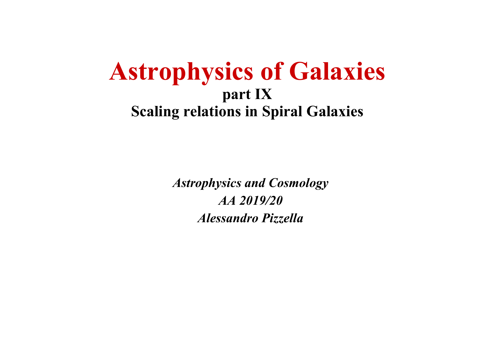
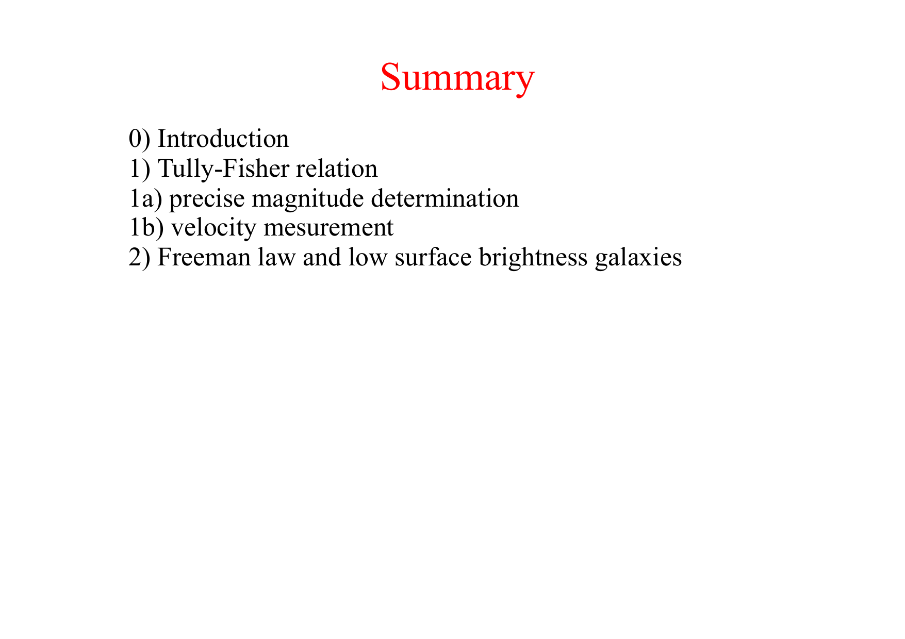
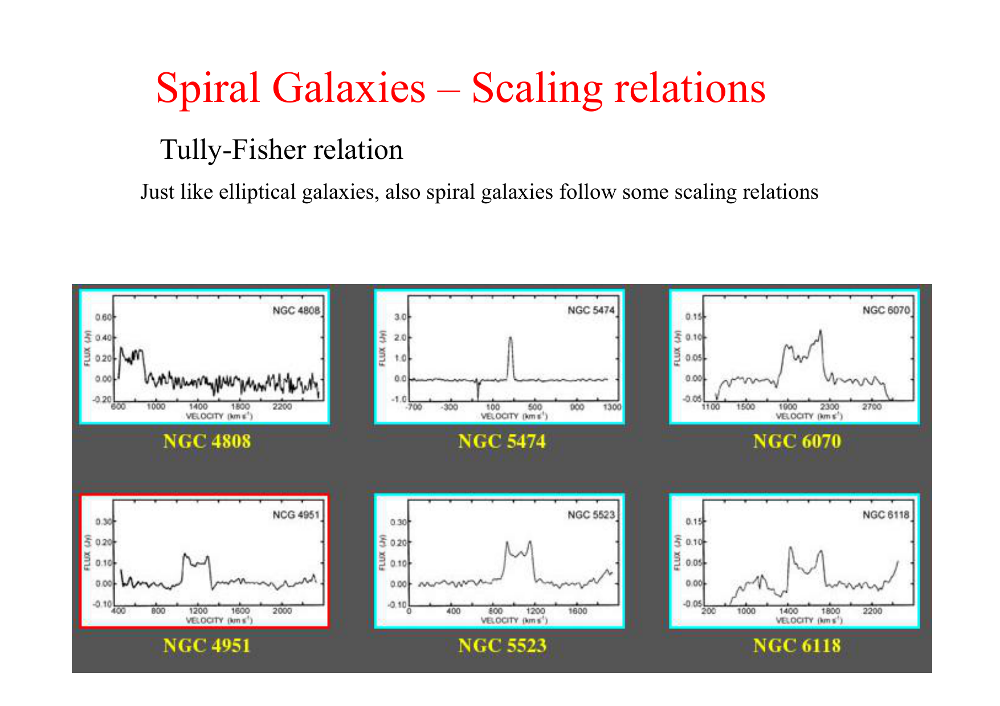
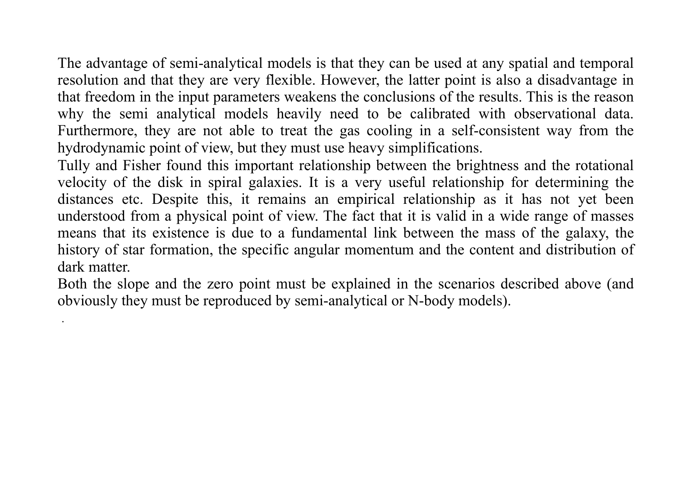
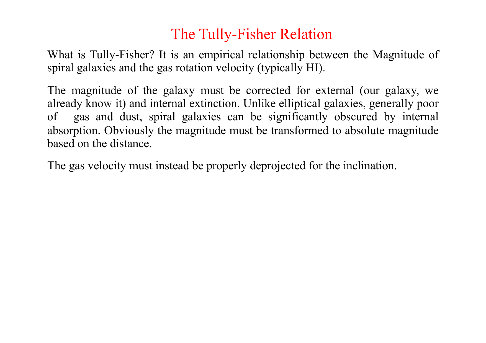
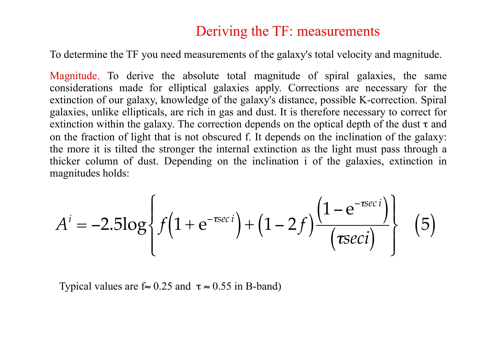
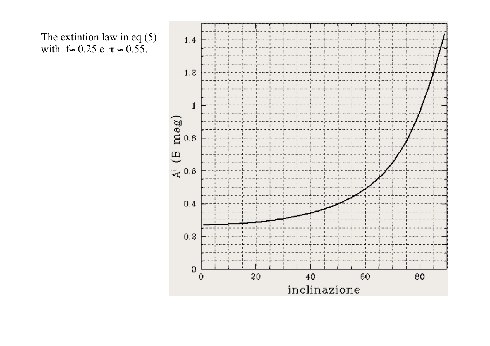
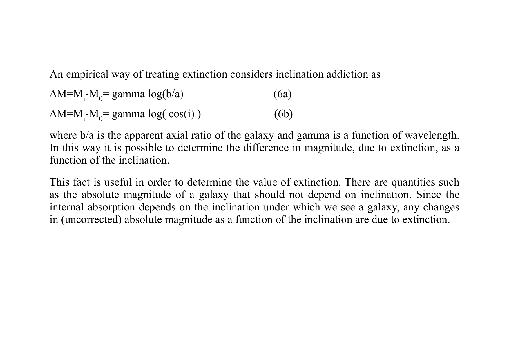

# The Faber-Jackson Relation

## 1. Empirical Definition and Classical Scaling

The **Faber-Jackson relation** (Faber & Jackson 1976) is the fundamental scaling relation for early-type galaxies (ellipticals and lenticulars S0), establishing that total optical luminosity $L$ is proportional to the fourth power of the central stellar velocity dispersion $\sigma$.

$$\boxed{L \propto \sigma^\gamma \qquad \text{with } \gamma \approx 4}$$

In astronomical absolute magnitudes, Pogson's formula ($M = -2.5 \log_{10} L + C$) yields.

$$M_B = -10 \log_{10}\left( \frac{\sigma}{\mathrm{km\,s^{-1}}} \right) + \text{const}$$

In the classical B-band calibration.

$$M_B \approx -19.55 - 10 \log_{10}\left( \frac{\sigma}{200\,\mathrm{km\,s^{-1}}} \right)$$

### Observed Scatter and Distance Indicator
The observed scatter in luminosity at fixed velocity dispersion is $\sigma_{\log L} \approx 0.4$ to $0.5$ dex ($\sim 1.0 - 1.2\,\mathrm{mag}$ in magnitude).
When employed as a primary extragalactic distance indicator.
1. The line-of-sight velocity dispersion $\sigma$ is measured directly from the Doppler broadening of photospheric absorption lines (e.g. Ca II H&K, Mg b, Na I D) using the pPXF technique.
2. The intrinsic luminosity $L$ is inferred from $\sigma^4$.
3. Comparing intrinsic luminosity to observed apparent flux yields the luminosity distance $d_L$ with an uncertainty of approximately $25\%$ per galaxy.

---

## 2. Unbroken Mathematical Derivation from the Virial Theorem

The physical origin of $L \propto \sigma^4$ is rooted in the Virial theorem governing self-gravitating, collisionless stellar spheroids.

### Step 1 - Virial Equilibrium and Structural Homology
For a stationary, isolated collisionless stellar system in virial equilibrium.

$$2 K + W = 0$$

where.
- $K = \frac{1}{2} M \langle v^2 \rangle = \frac{3}{2} M \sigma_0^2$ is the total stellar kinetic energy (assuming an isotropic 1D velocity dispersion $\sigma_0$)
- $W = -\frac{G M^2}{r_g} = -c_2 \frac{G M^2}{R_e}$ is the gravitational potential energy, where $r_g$ is the gravitational radius, $R_e$ is the effective half-light radius, and $c_2$ is a dimensionless structure constant determined by the 3D density profile $\rho(r)$

Equating $2 K = -W$.

$$3 M \sigma_0^2 = c_2 \frac{G M^2}{R_e}$$

Solving for the total dynamical mass $M$.

$$M = \left(\frac{3}{c_2}\right) \frac{R_e \sigma_0^2}{G} \equiv c_1 \frac{R_e \sigma_0^2}{G}$$

where $c_1 \equiv 3/c_2$ is the **virial form factor**.
For an elliptical galaxy obeying a de Vaucouleurs $R^{1/4}$ surface brightness profile and isotropic Jeans dynamics, analytical integration gives $c_1 \approx 5.0$.
Under the assumption of **structural homology**, all elliptical galaxies are assumed to have the same normalized density profile, orbital distribution, and spatial light distribution, meaning.

$$c_1 = \text{constant}$$

### Step 2 - Introducing the Mass-to-Light Ratio
Define the total mass-to-light ratio $\Upsilon \equiv M / L$.
Express the mass in terms of luminosity.

$$M = \Upsilon \, L$$

Substitute this into the virial mass equation.

$$\Upsilon L = \frac{c_1 R_e \sigma_0^2}{G} \implies L = \frac{c_1 R_e \sigma_0^2}{G \Upsilon}$$

### Step 3 - Eliminating the Radius via Mean Surface Brightness
The total luminosity of a circular galaxy profile is related to the effective radius $R_e$ and the mean surface brightness $\langle I_e \rangle \equiv \langle I(<R_e) \rangle$ enclosed within $R_e$ by.

$$L = 2\pi R_e^2 \langle I_e \rangle$$

Invert this relationship to express $R_e$ as a function of luminosity and surface brightness.

$$R_e^2 = \frac{L}{2\pi \langle I_e \rangle} \implies R_e = \left( \frac{L}{2\pi \langle I_e \rangle} \right)^{1/2}$$

### Step 4 - Algebraic Derivation of the $\sigma^4$ Power Law
Substitute this expression for $R_e$ back into the luminosity equation.

$$L = \frac{c_1 \sigma_0^2}{G \Upsilon} \left( \frac{L}{2\pi \langle I_e \rangle} \right)^{1/2}$$

Divide both sides of the equation by $L^{1/2}$.

$$L^{1/2} = \frac{c_1 \sigma_0^2}{G \Upsilon \sqrt{2\pi \langle I_e \rangle}}$$

Square both sides.

$$\boxed{L = \left( \frac{c_1^2}{2\pi G^2} \right) \frac{\sigma_0^4}{\Upsilon^2 \langle I_e \rangle}}$$

### Step 5 - The Three Homology Assumptions
To reduce this exact virial expression to the simple Faber-Jackson law ($L \propto \sigma_0^4$), three conditions must hold simultaneously.
1. **Constant Mass-to-Light Ratio** - $\Upsilon \equiv M/L = \text{constant}$ across all galaxies.
2. **Constant Mean Surface Brightness** - $\langle I_e \rangle = \text{constant}$ across all galaxies.
3. **Strict Structural Homology** - $c_1 = \text{constant}$ across all galaxies.

When these three conditions are satisfied, all terms in parentheses are constants, and.

$$\boxed{L \propto \sigma_0^4}$$

---

## 3. Why the Relation Has Scatter - The Fundamental Plane Projection

In real galaxies, the three assumptions break down.
1. **Surface Brightness is Not Constant** - Giant ellipticals are systematically less dense than intermediate ellipticals ($\langle I_e \rangle \propto R_e^{-0.83}$; the Kormendy relation).
2. **Mass-to-Light Ratio is Not Constant** - $\Upsilon \propto M^{0.2} \propto L^{0.25}$ due to increasing dark matter fractions and higher stellar metallicities in more massive galaxies (the "tilt" of the Fundamental Plane).
3. **Non-Homology** - The Sersic index $n$ varies continuously from $n \approx 2$ in dwarf ellipticals to $n \approx 6$ in giant cD galaxies.

### The Fundamental Plane 2D Projection
Because early-type galaxies occupy a tight two-dimensional manifold in the three-dimensional space $(\log R_e, \log \sigma_0, \log \langle I_e \rangle)$, the Faber-Jackson relation is simply the **1D edge-on projection** of the Fundamental Plane onto the $(L, \sigma)$ plane.
The entire observed scatter of $\sim 0.5\,\mathrm{dex}$ in the Faber-Jackson relation is accounted for by the variations in mean surface brightness $\langle I_e \rangle$ across galaxies of the same velocity dispersion.

### Variations in the Slope $\gamma$
- For luminous giant ellipticals ($M_r < -21$), the slope steepens to $\gamma \approx 4.5 - 5.0$.
- For low-luminosity spheroids and dwarf ellipticals ($M_r > -18$), the relation flattens to $\gamma \approx 2.0 - 2.5$.

---

## 4. Connection to Black Hole Scaling Relations

The Faber-Jackson relation provides the physical bridge connecting the $M_\bullet - \sigma$ relation to the Magorrian relation ($M_\bullet - M_{\rm bulge}$).
1. Faber-Jackson establishes $M_{\rm bulge} \propto \sigma^4$ (assuming slowly varying $M/L$).
2. The momentum-driven feedback limit establishes $M_\bullet \propto \sigma^4$.
3. Combining the two immediately yields the linear Magorrian co-evolution.
   $$M_\bullet \propto M_{\rm bulge} \sim 10^{-3} M_{\rm bulge}$$
This demonstrates that black hole growth and galaxy bulge assembly are coupled through the same gravitational and feedback physics.

---

## 5. Blackboard Observational Blueprint

When sketching the Faber-Jackson relation on the blackboard.

```text
       log10(L / L_sun)
         ^
    12.0 |                                       / (Giant Ellipticals like M87)
         |                                     /
    11.0 |                                   /   Slope gamma ~ 4.0
         |                                 /     (M_B ~ -10 log sigma)
    10.0 |                               /
         |                             /   Scatter ~ 0.5 dex
     9.0 |                           /     (Driven by surface brightness spread)
         |                         /
     8.0 |                       / (Dwarf Spheroids flatten to gamma ~ 2)
         +=========+=========+=========+=========+======-===> log10(sigma / [km/s])
                  1.6       1.8       2.0       2.2       2.4
                 (40)      (63)      (100)     (160)     (250 km/s)
```

### Key Blackboard Features
- **Horizontal Axis** - Logarithmic velocity dispersion $\log_{10}(\sigma / \mathrm{km\,s^{-1}})$ from $1.5$ ($30\,\mathrm{km\,s^{-1}}$) to $2.5$ ($300\,\mathrm{km\,s^{-1}}$).
- **Vertical Axis** - Logarithmic luminosity $\log_{10}(L / L_\odot)$ from $8.0$ to $12.0$.
- **Slope** - Draw a straight line with slope $\gamma = 4.0$. Note the magnitude slope $-10$.
- **Scatter Shading** - Draw a shaded envelope of width $\pm 0.5\,\mathrm{dex}$ around the line, explaining that this scatter collapses to $\sim 0.08\,\mathrm{dex}$ when surface brightness is included via the Fundamental Plane.
- **Dwarf Regime Turnover** - Show the curve flattening toward slope $\sim 2$ below $\sigma \approx 70\,\mathrm{km\,s^{-1}}$.

---

## 6. Textbook and Course Citations

- **Prof. Alessandro Pizzella Course Dispensa**
  - File - `Notes_FP_2_0eng.pdf`
  - Pages 1-13 (formal derivation from Virial theorem, structural homology factors, projection of the Fundamental Plane, and scatter analysis).
- **Student Synthesis Document**
  - File - `Astrophysics_of_Galaxies.tex`
  - Section 7.1 "Scaling Relations of Elliptical Galaxies", pages 30-33.
- **Mo, van den Bosch & White (2010), *Galaxy Formation and Evolution***
  - File - `Houjun Mo, Frank van den Bosch, Simon White - Galaxy Formation and Evolution (2010, Cambridge University Press) - libgen.li.pdf`
  - Chapter 2, Section 2.3.4 "Elliptical Galaxies", pages 76-83; Chapter 13, Section 13.3 "The Fundamental Plane", pages 624-628.
- **Binney & Merrifield (1998), *Galactic Astronomy***
  - File - `Binney J., Merrifield M. - Galactic Astronomy (1998, Princeton).pdf`
  - Chapter 4, Section 4.3.4 "Scaling Relations", pages 204-210.
- **Peter Schneider (2015), *Extragalactic Astronomy and Cosmology***
  - File - `Extrag_Astro_144-171.pdf`
  - Chapter 3, Section 3.7 "Scaling Relations for Early-Type Galaxies", pages 144-155.
- **Primary Literature Reference**
  - Faber, S. M., & Jackson, R. E. 1976, ApJ, 204, 668.

---

## 7. See Also

- [[Fundamental plane of ellipticals]]
- [[Kormendy relation]]
- [[Tully-Fisher relation]]
- [[M sigma relation]]
- [[Magorrian relation]]
- [[LOSVD]]
- [[Astrophysics_of_Galaxies_MOC]]

---

## 8. Astrophysics of Galaxies Figures and Slides (Prof. Alessandro Pizzella)


*Lecture 9 - Scaling Relations in Early-Type Galaxies (Prof. Alessandro Pizzella).*


*Sandra Faber & Robert Jackson (1976) - L proportional to sigma^4 for elliptical galaxies.*


*Virial theorem foundation - sigma^2 ~ G M / R combined with constant M/L and constant surface brightness I_0.*

---

## 9. Lecture Slides and Reference Figures (Prof. Alessandro Pizzella)














## Linked References

- [[Alpha-Fe enhancement]]
- [[Dark matter in elliptical galaxies]]
- [[Early-type galaxy stellar populations]]
- [[Kormendy relation]]
- [[LOSVD]]
- [[M sigma relation]]
- [[MOND]]
- [[Magorrian relation]]
- [[Red sequence and blue cloud]]
- [[Astrophysics_of_Galaxies_MOC]]


