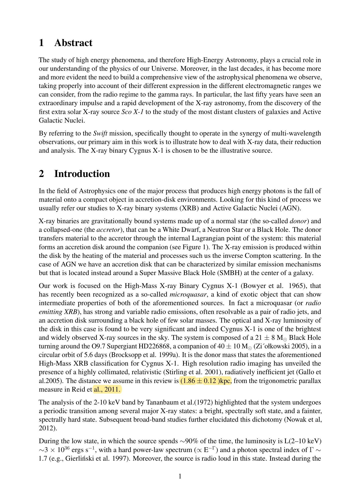
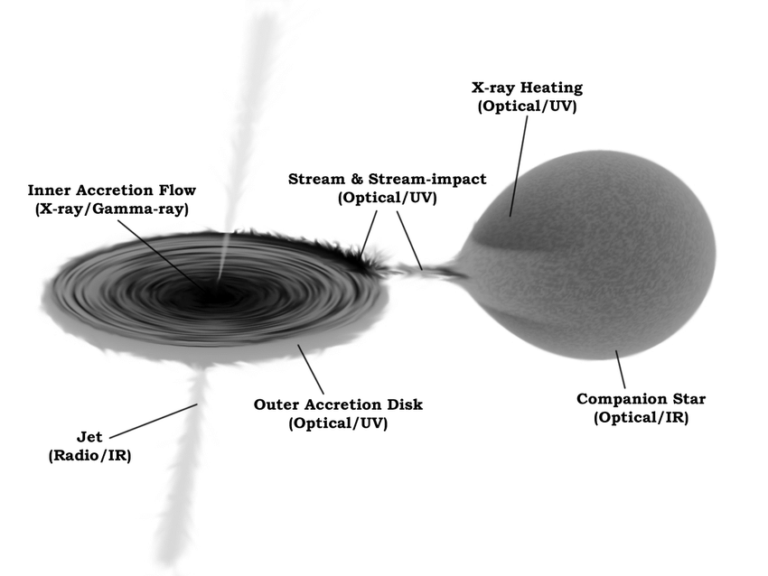
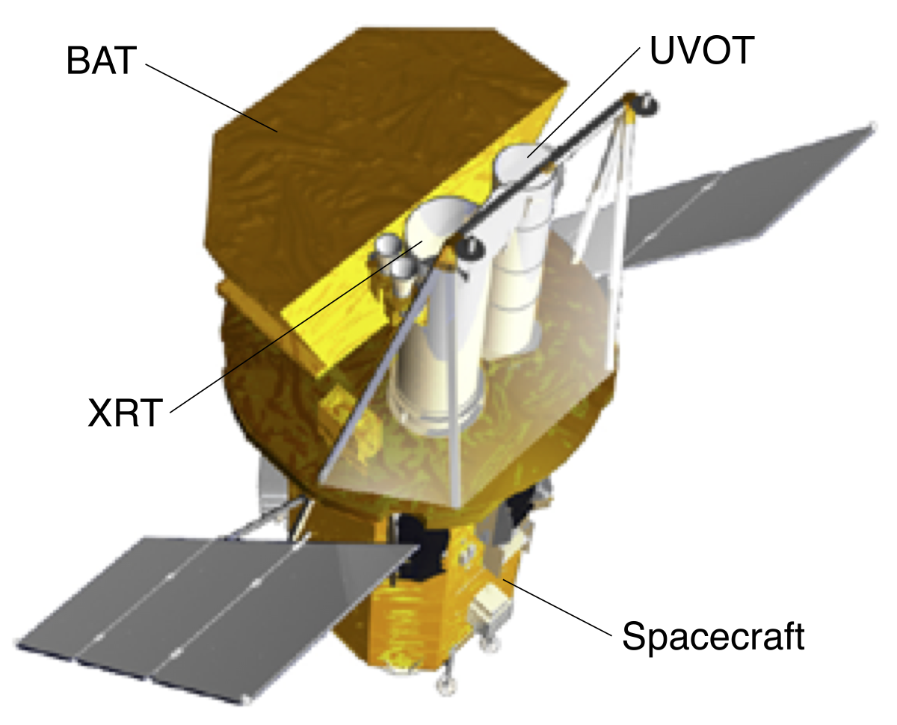
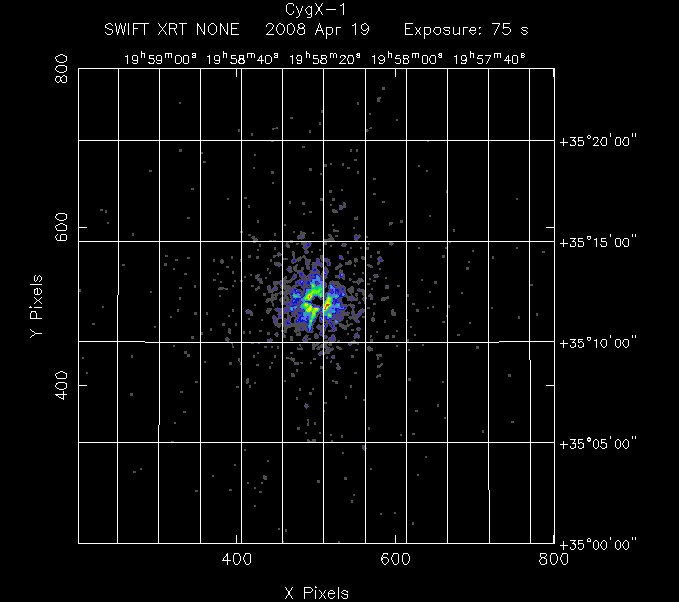

We have a set of measurements that we want to compare with an astrophysical model
	which is a function of several variables, also called **parameters**
		we must determine which values of the parameters **better describe the data**

---

## Least square method

In case of a simple linear regression,
	we want to find the line $y = mx + c$ that best fits the data
		we minimize the sum of squared residuals:
$$L = \sum_i (y_i - mx_i - c)^2$$

this is called the **least square method**

However, if the errors vary considerably among the data,
	this treats all points equally — which is not ideal
		a point with large uncertainty should contribute less to the fit

---

## $\chi^2$ statistics

The solution is to divide each squared deviation by its variance:
$$\chi^2 = \sum_i \frac{(D_i - M_i)^2}{\sigma_i^2}$$

where $D_i$ is the data and $M_i$ is the model prediction

**Why is this the right thing to do?**
	the expression $\chi^2$ corresponds to the exponent of the Gaussian probability density:
$$\chi^2 = -2\sum_i \ln(f(x_i, \mu_i, \sigma_i^2))$$

since the Gaussian probability density is a measure of the **likelihood** of the data for the model,
	minimizing $\chi^2$ is equivalent to **maximizing the likelihood**

The $\chi^2$ is appropriate when fitting data whose errors are **normally distributed**

---

## Degrees of freedom

When a model with $m$ parameters is fitted to a dataset with $N$ bins:
$$\nu = N - m$$

a fit is only possible if $N > m$

Very often the result depends on the **initial guess parameters**
	we obtain an ensemble of good fits
		and need to analyze the distribution of $\chi^2$

The $\chi^2$ distribution is a special case of the $\gamma$ distribution:
$$\gamma\left(\chi^2;\frac{\nu}{2},\frac{1}{2}\right) = \frac{1}{2^{\frac{\nu}{2}}\Gamma\left(\frac{\nu}{2}\right)} (\chi^2)^{\frac{\nu}{2}-1} e^{-\frac{\chi^2}{2}}$$

with:
	mean: $E(\chi^2) = \nu$
	variance: $V(\chi^2) = 2\nu$

When the observed $\chi^2$ lies in the range $\nu \pm \sqrt{2\nu}$,
\tour best fit belongs to the set of **good fits**

---

## Reduced-$\chi^2$

The **reduced-$\chi^2$** is normalized to the degrees of freedom:
$$\chi^2_{red} = \frac{\chi^2}{\nu}$$

a good fit gives $\chi^2_{red} \approx 1$

The fit is **not good** when:
$$\frac{\chi^2}{\nu} \gg 1 + \sqrt{\frac{2}{\nu}}$$

---

## C-statistics (for low counts)

High energy data often have a **small number of counts per bin**
	in this regime:
		$\sigma_i^2 = M_i$ (Poisson variance)
		if $D_i$ is large: Poisson $\approx$ Gaussian, $\chi^2$ minimization works
		if $D_i$ is small: $\sigma_i$ becomes very small and minimization **fails**

**Cash (1979)** proposed the C-statistics, built from the Poisson likelihood:
$$Cstat = -2\sum_i \ln P(D_i, M_i) = -2\sum_i (D_i \ln M_i - M_i - \ln D_i!)$$

since $\ln D_i!$ does not depend on parameters, the simpler form is:
$$Cstat = 2\sum_i (M_i - D_i \ln M_i) = 2\left(D - \sum_i D_i \ln M_i\right)$$

**Kaastra (2017)** modified version using Stirling's approximation ($\ln D! \approx D_i \ln D_i - D_i$):
$$Cstat = 2\sum_i \left[M_i - D_i + D_i \ln(D_i/M_i)\right]$$

this version has a known expected mean $C_\mu$ and variance $C_\sigma^2$
	if the C-statistics value for the best fit is outside $C_\mu \pm 3C_\sigma$,
		the model fit is **improbable at a level less than 0.3%**

---

### High-Energy Laboratory Diagnostics & Instrument Panels

*Forward folding spectral fitting in XSPEC: true sky photon spectrum $F(E)$ convolved with Ancillary Response File $A(E)$ and Redistribution Matrix File $R(I, E)$ into observed channel count spectrum $C(I)$.*

*XMM-Newton EPIC pn spectrum: absorbed powerlaw fitting ($N_H$, $\Gamma$) with prominent neutral iron Fe K$\alpha$ fluorescence emission line at 6.4 keV.*

*Residual analysis: $\chi = (C_{\rm obs} - C_{\rm model})/\sigma$ across energy bins from 0.3 to 10 keV, identifying systematic calibration features.*

*Cash statistic (C-stat) vs Pearson $\chi^2$ confidence contour maps in the $(N_H, \Gamma)$ parameter plane for Poisson low-count data.*

  <h4 class="backlinks-title">Linked References (2)</h4>
  <ul class="backlinks-list">
    <li class="backlink-item-wrap"><a href="Astrostatistics.html" class="backlink-item">Astrostatistics</a></li>
    <li class="backlink-item-wrap"><a href="../../04_Atlas/Lab_High-Energy_MOC.html" class="backlink-item">Lab_High-Energy_MOC</a></li>
  </ul>

