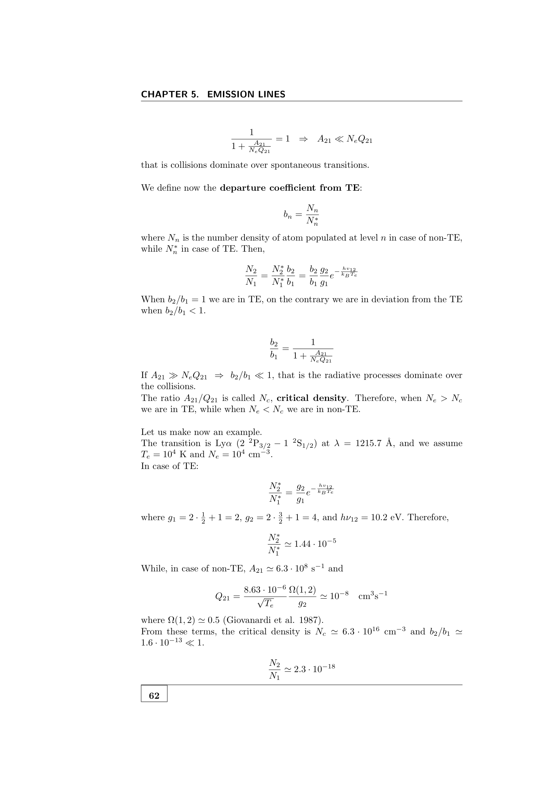

a tier list of atomic transitions by their Einstein $A$ coefficients (radiative decay rates), driven by which selection rules they satisfy.

## the three tiers

| type | symbol | typical $A$ rate | naming convention |
|---|---|---|---|
| permitted | E1 | $10^7$ to $10^9$ s$^{-1}$ | bare wavelength: $H\alpha\,\lambda 6563$, He I $\lambda 5876$ |
| semi-forbidden (intersystem) | E1 with $\Delta S \ne 0$ | $10^2$ to $10^5$ s$^{-1}$ | single bracket: $C\,\textsc{iii}]\,\lambda 1909$ |
| forbidden | M1 or E2 | $10^{-5}$ to $10^0$ s$^{-1}$ | square brackets: $[O\,\textsc{iii}]\,\lambda 5007$ |

ratio of total strengths: permitted $\gg$ semi-forbidden $\gg$ forbidden, by factors of $\sim 10^3$ each.

## permitted transitions

satisfy all electric dipole (E1) selection rules:
- parity changes.
- $\Delta\ell = \pm 1$ for the jumping electron.
- $\Delta L = 0, \pm 1$ (not $0\to 0$).
- $\Delta J = 0, \pm 1$ (not $0\to 0$).
- $\Delta S = 0$.

the bulk of stellar absorption / emission spectroscopy is permitted. Balmer lines, He I lines, Na D doublet, all permitted.

## semi-forbidden (intersystem) transitions

violate $\Delta S = 0$ but otherwise satisfy E1 rules. spin-orbit coupling mixes singlet and triplet states slightly, so what looks pure-singlet has a small triplet admixture. transitions between "different" multiplicities then proceed at small but non-zero rate.

notation: square bracket on the right side of the species, e.g.
$$\text{C}\,\textsc{iii}]\,\lambda 1909, \quad \text{N}\,\textsc{iv}]\,\lambda 1486, \quad \text{C}\,\textsc{ii}]\,\lambda 2326$$
(the "]" originally from typewriter notation for "intersystem.")

importance: prominent in the **UV spectra of AGN broad-line regions and starburst galaxies**, where they coexist with strong permitted lines and provide independent diagnostics.

## forbidden transitions

violate parity-change requirement. proceed only by **magnetic dipole** (M1) or **electric quadrupole** (E2), $10^5$ to $10^8$ times weaker than E1.

notation: square brackets on both sides of the species:
$$[\text{O}\,\textsc{iii}]\,\lambda 4959, 5007, \quad [\text{S}\,\textsc{ii}]\,\lambda 6716, 6731, \quad [\text{N}\,\textsc{ii}]\,\lambda 6548, 6584$$

at terrestrial-laboratory densities, forbidden states are collisionally de-excited before they radiate (lifetime $\sim 1$ s vs collision timescale $\sim 10^{-9}$ s). they were dubbed "nebulium" lines for decades until Bowen 1927 identified them as forbidden $[OIII]$ transitions in low-density nebulae.

## why both forbidden and permitted matter

the **two together** give complementary diagnostics:
- **permitted lines** are reliable column-density indicators (always at full strength).
- **forbidden lines** are reliable density indicators (suppressed above $n_c$, so their ratios discriminate $n_e$ over $\sim 10^2$ to $10^7$ cm$^{-3}$).
- **forbidden line ratios from different upper levels of the same ion** (e.g. $[OIII]\,\lambda 4363/(\lambda 4959+5007)$) measure $T_e$.

so the entire framework of nebular diagnostics ($T_e$, $n_e$, abundances) hinges on knowing which lines are permitted, which forbidden, and how each behaves.

## see also

- [[Selection rules]]
- [[Atomic term symbols]]
- [[Russell-Saunders LS coupling]]
- [[jj coupling]]
- [[Forbidden lines]]
- [[OIII forbidden lines]]
- [[SII forbidden lines]]
- [[Forbidden line diagnostics]]
- [[Critical density]]

---

### Astronomical Spectroscopy Diagnostic Panels

*Transition probabilities: E1 permitted ($A_{ki} \sim 10^7-10^9\,{\rm s}^{-1}$), M1 magnetic dipole ($A_{ki} \sim 10^{-2}-10^2\,{\rm s}^{-1}$), and E2 electric quadrupole ($A_{ki} \sim 10^{-4}-10^0\,{\rm s}^{-1}$) forbidden transitions.*

## Linked References

- [[AGN spectroscopy]]
- [[Absorption coefficient and oscillator strength]]
- [[Atomic term symbols]]
- [[Forbidden lines]]
- [[Selection rules]]
- [[jj coupling]]
- [[Astronomical_Spectroscopy_MOC]]

