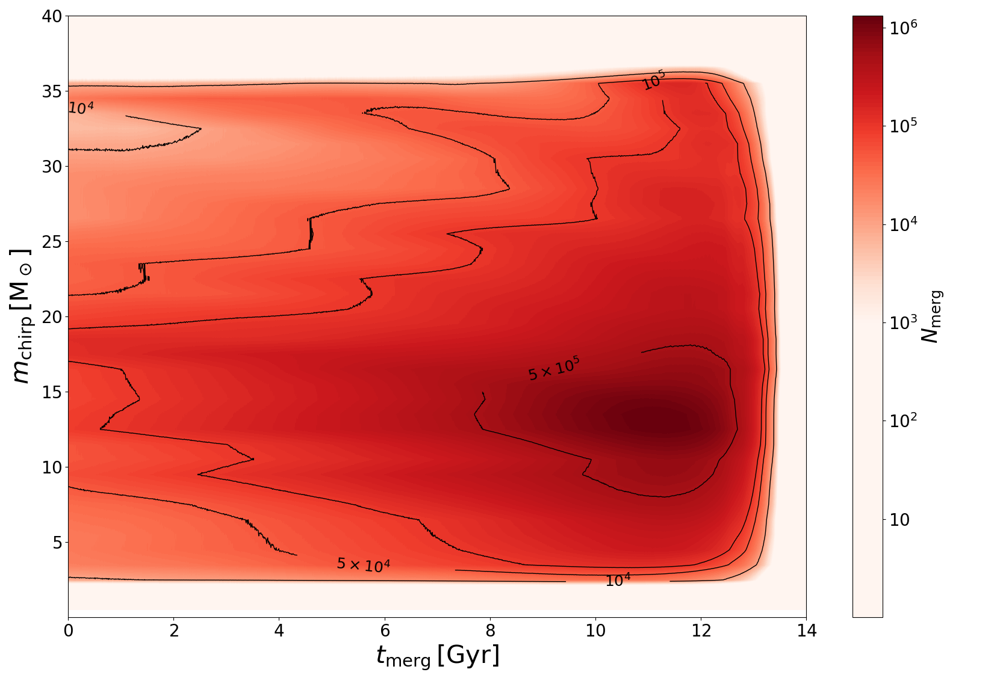

# Forward, backward, and central differences

three ways to estimate $f'(x)$ from samples of $f$. they differ in which neighbor I use, and in their order of accuracy.

## the three formulas

**forward difference**:
$$f'(x) \approx \frac{f(x + h) - f(x)}{h}$$

**backward difference**:
$$f'(x) \approx \frac{f(x) - f(x - h)}{h}$$

**central difference**:
$$f'(x) \approx \frac{f(x + h) - f(x - h)}{2h}$$

forward uses $x$ and $x + h$. backward uses $x - h$ and $x$. central uses $x - h$ and $x + h$ but *not* $x$ itself.

## why central is more accurate

Taylor expansions:

$$f(x + h) = f(x) + h f'(x) + \tfrac{h^2}{2} f''(x) + \tfrac{h^3}{6} f'''(x) + \cdots$$
$$f(x - h) = f(x) - h f'(x) + \tfrac{h^2}{2} f''(x) - \tfrac{h^3}{6} f'''(x) + \cdots$$

forward: $[f(x+h) - f(x)]/h = f'(x) + \tfrac{h}{2} f''(x) + O(h^2)$ → **first-order**, $O(h)$.

central: $[f(x+h) - f(x-h)]/(2h) = f'(x) + \tfrac{h^2}{6} f'''(x) + O(h^4)$ → **second-order**, $O(h^2)$.

the symmetric subtraction kills the $f''$ term. one extra function evaluation buys an extra order of accuracy.

## the U-shaped error

at finite step size, the total error has two pieces:
- **truncation** error: $O(h)$ (forward/backward) or $O(h^2)$ (central)
- **roundoff** error: $\sim \epsilon \lvert f\rvert/h$ from cancellation in the numerator

total error $E(h) = C h^p + \epsilon\lvert f\rvert/h$. minimize by setting $dE/dh = 0$:

| method | order $p$ | $h_{\rm opt}$ | minimum error |
|---|---|---|---|
| forward | 1 | $\sqrt{\epsilon/|f''|} \sim 10^{-8}$ | $\sim \sqrt{\epsilon \, |f''| \, |f|}$ |
| central | 2 | $(\epsilon/|f'''|)^{1/3} \sim 10^{-5}$ | $\sim \epsilon^{2/3}$ |

with $\epsilon \sim 10^{-16}$:
- forward: best error $\sim 10^{-8}$ at $h \sim 10^{-8}$
- central: best error $\sim 10^{-11}$ at $h \sim 10^{-5}$

central beats forward by 3 orders of magnitude in best achievable accuracy. **always use central differences for derivatives unless I have a reason not to.**

## when forward beats central

- **at a boundary**: if $x$ is at the edge of the data, only the forward (or backward) neighbor exists
- **time integration**: when computing $\dot y$ at the current time step from current and past values only (causal)
- **economy**: forward needs one extra evaluation, central needs two — sometimes the one matters more than the order

## python implementation

```python
def derivative(f, x, h=None, method='central'):
    if h is None:
        # heuristic: epsilon^(1/3) for central, sqrt(epsilon) for forward
        eps = np.finfo(float).eps
        h = eps**(1/3) if method == 'central' else np.sqrt(eps)
    if method == 'forward':
        return (f(x + h) - f(x)) / h
    elif method == 'backward':
        return (f(x) - f(x - h)) / h
    else:  # central
        return (f(x + h) - f(x - h)) / (2 * h)
```

scipy: `scipy.misc.derivative` (deprecated, use `scipy.optimize.approx_fprime` for multivariate).

## higher-order central differences

if I want even more accuracy, use a five-point stencil:

$$f'(x) \approx \frac{-f(x + 2h) + 8f(x + h) - 8f(x - h) + f(x - 2h)}{12 h}$$

$O(h^4)$. but four function evaluations and the optimal $h$ shifts to $\sim \epsilon^{1/5}$. rarely worth it in practice — usually the underlying physics is the bottleneck, not the derivative accuracy.

## astrophysics applications

- **gradient of a potential** for force computations: central difference of $\Phi(\mathbf{r})$
- **Jacobian for Newton-Raphson** when analytic derivative is unavailable
- **velocity from time series of positions**: central difference, with windowing if noisy
- **luminosity from time-series flux**: $dL/dt$ for transient classification

## see also

- [Truncation error and order of accuracy](Truncation%20error%20and%20order%20of%20accuracy.html)
- [Roundoff vs truncation balance](Roundoff%20vs%20truncation%20balance.html)
- [Second derivatives](Second%20derivatives.html)
- [Partial numerical derivatives](Partial%20numerical%20derivatives.html)
- [Derivatives of noisy data](Derivatives%20of%20noisy%20data.html)
- [Mathematical_Numerical_Methods_MOC](../../04_Atlas/Mathematical_Numerical_Methods_MOC.html)

---

### Numerical Methods & Algorithmic Diagnostics


*Finite difference stencil: forward, backward, and central difference error terms.*

<div class="backlinks-section">
  <h4 class="backlinks-title">Linked References (9)</h4>
  <ul class="backlinks-list">
    <li class="backlink-item-wrap"><a href="Derivatives%20of%20noisy%20data.html" class="backlink-item">Derivatives of noisy data</a></li>
    <li class="backlink-item-wrap"><a href="Finite%20difference%20discretization.html" class="backlink-item">Finite difference discretization</a></li>
    <li class="backlink-item-wrap"><a href="Initial%20value%20PDEs%20and%20FTCS.html" class="backlink-item">Initial value PDEs and FTCS</a></li>
    <li class="backlink-item-wrap"><a href="Optimal%20step%20size%20for%20derivatives.html" class="backlink-item">Optimal step size for derivatives</a></li>
    <li class="backlink-item-wrap"><a href="Partial%20numerical%20derivatives.html" class="backlink-item">Partial numerical derivatives</a></li>
    <li class="backlink-item-wrap"><a href="Roundoff%20vs%20truncation%20balance.html" class="backlink-item">Roundoff vs truncation balance</a></li>
    <li class="backlink-item-wrap"><a href="Second%20derivatives.html" class="backlink-item">Second derivatives</a></li>
    <li class="backlink-item-wrap"><a href="Truncation%20error%20and%20order%20of%20accuracy.html" class="backlink-item">Truncation error and order of accuracy</a></li>
    <li class="backlink-item-wrap"><a href="../../04_Atlas/Mathematical_Numerical_Methods_MOC.html" class="backlink-item">Mathematical_Numerical_Methods_MOC</a></li>
  </ul>
</div>

