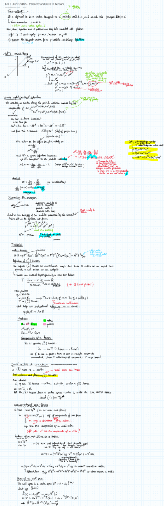

# Four-velocity and four-momentum

---

### General Relativity Mathematical & Oral Defense Panel

*Lecture 05 Blackboard Derivation: Four-velocity $u^\mu = dx^\mu/d\tau$, normalization $u^\mu u_\mu = -c^2$, four-acceleration $a^\mu = D u^\mu / d\tau$, and orthogonality $u^\mu a_\mu = 0$.*

## Linked References

- [[General_Relativity_MOC]]

