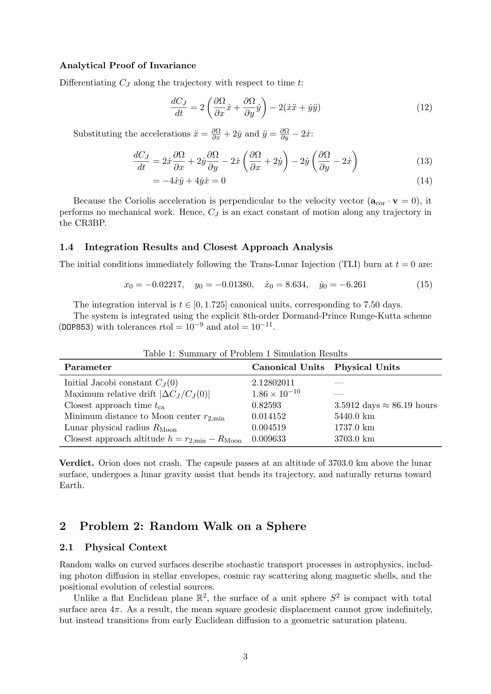


# Fourth-order Hermite predictor-corrector

a fourth-order ODE integrator that uses *both* the function $\mathbf{f}$ and its time derivative $\dot{\mathbf{f}}$. especially efficient for N-body problems where computing $\dot{\mathbf{f}}$ (the jerk, $\dot{\mathbf{a}}$) costs little extra after computing $\mathbf{f}$ (the acceleration). the standard integrator for **collisional** N-body simulations.

## the idea

at the start of the step, I have $(\mathbf{r}_n, \mathbf{v}_n, \mathbf{a}_n, \dot{\mathbf{a}}_n)$. the Hermite scheme:

1. **predict** $(\mathbf{r}, \mathbf{v})$ at time $t + h$ using Taylor expansion through $\dot{\mathbf{a}}$
2. **evaluate** the new acceleration $\mathbf{a}_{n+1}$ and jerk $\dot{\mathbf{a}}_{n+1}$ at the predicted position
3. **correct** using a Hermite interpolating polynomial of degree 3 between the start and end points

## the formulas

**predictor** (third-order Taylor):

$$\mathbf{r}_{n+1}^P = \mathbf{r}_n + \mathbf{v}_n h + \tfrac12 \mathbf{a}_n h^2 + \tfrac16 \dot{\mathbf{a}}_n h^3$$
$$\mathbf{v}_{n+1}^P = \mathbf{v}_n + \mathbf{a}_n h + \tfrac12 \dot{\mathbf{a}}_n h^2$$

**evaluate** at $\mathbf{r}_{n+1}^P$: get $\mathbf{a}_{n+1}, \dot{\mathbf{a}}_{n+1}$.

**corrector**:

$$\mathbf{v}_{n+1} = \mathbf{v}_n + \tfrac{h}{2}(\mathbf{a}_n + \mathbf{a}_{n+1}) + \tfrac{h^2}{12}(\dot{\mathbf{a}}_n - \dot{\mathbf{a}}_{n+1})$$
$$\mathbf{r}_{n+1} = \mathbf{r}_n + \tfrac{h}{2}(\mathbf{v}_n + \mathbf{v}_{n+1}) + \tfrac{h^2}{12}(\mathbf{a}_n - \mathbf{a}_{n+1})$$

note the asymmetric structure: positions are corrected using *velocity* and *acceleration* differences, velocities using *acceleration* and *jerk* differences.

## why fourth-order

the predictor has third-order Taylor accuracy ($O(h^4)$ local error). the corrector adds the new endpoint information to push the local error to $O(h^5)$, so global accuracy is $O(h^4)$.

## why two function evaluations are enough

a generic explicit fourth-order method (RK4) needs four force evaluations per step. Hermite needs only **two** force-and-jerk evaluations per step (one at start, one at predicted end), and the start one is reusable from the previous step. so effectively **one new evaluation per step** for fourth-order accuracy — twice as efficient as RK4.

the catch: I need the jerk $\dot{\mathbf{a}}$, which requires $\mathbf{v}$ as well as $\mathbf{r}$ at the evaluation point. for an N-body system, $\dot{\mathbf{a}}_i$ involves the relative velocities of all pairs:

$$\dot{\mathbf{a}}_i = -G \sum_{j \neq i} m_j \left[\frac{\mathbf{v}_i - \mathbf{v}_j}{r_{ij}^3} - 3 \frac{(\mathbf{v}_i - \mathbf{v}_j) \cdot (\mathbf{r}_i - \mathbf{r}_j)}{r_{ij}^5}(\mathbf{r}_i - \mathbf{r}_j)\right]$$

extra $O(N)$ work per particle on top of the $O(N^2)$ acceleration computation, so essentially free.

## python sketch (simplified)

```python
def hermite_step(r, v, a, adot, force_and_jerk, h):
    # predictor
    r_p = r + v*h + 0.5*a*h**2 + adot*h**3/6
    v_p = v + a*h + 0.5*adot*h**2
    # evaluate at predicted point
    a_new, adot_new = force_and_jerk(r_p, v_p)
    # corrector
    v_new = v + 0.5*h*(a + a_new) + h**2/12 * (adot - adot_new)
    r_new = r + 0.5*h*(v + v_new) + h**2/12 * (a - a_new)
    return r_new, v_new, a_new, adot_new
```

## adaptive timesteps in N-body

Aarseth's standard "individual timestep" formula:

$$\Delta t_i = \eta \sqrt{\frac{\lvert \mathbf{a}_i\lvert }{\rvert\ddot{\mathbf{a}}_i\rvert}}$$

with $\eta \sim 0.02$ a tuning parameter. each particle has its own timestep, scaled with the local dynamical timescale. close encounters get tiny $\Delta t$; particles in the cluster halo get large $\Delta t$. typically combined with **block timesteps** (each particle's step is $2^{-k}$ for some integer $k$) to allow synchronization.

this is the workhorse of collisional N-body codes: NBODY6, NBODY7, KIRA. [Adaptive step size control](./Adaptive%20step%20size%20control.html) discusses the general framework.

## comparison with leapfrog

| property | Hermite | leapfrog |
|---|---|---|
| order | 4 | 2 |
| evals per step | 1 (after first) | 1 |
| symplectic | almost (high order) | yes (exactly) |
| handles close encounters | yes (with adaptive Δt) | poorly without subcycling |
| memory per particle | $\mathbf{r}, \mathbf{v}, \mathbf{a}, \dot{\mathbf{a}}$ | $\mathbf{r}, \mathbf{v}$ |
| typical use | collisional N-body | collisionless / cosmological |

leapfrog wins for energy conservation over $10^9$ orbits at fixed timestep. Hermite wins for accuracy when individual timesteps are essential (binaries, triples, close approaches).

## astrophysics use cases

- **globular cluster N-body**: NBODY6 is the gold-standard code, uses Hermite + KS regularization
- **planetary system long-time integration with close encounters**
- **few-body resonant systems** (Kuiper belt dynamics, asteroidal resonances)
- **tidal disruption simulations** of stars by massive black holes

## limitations

- **not strictly symplectic**: long-time energy conservation is not as good as leapfrog
- **the jerk computation must be available** — fine for gravity, harder for other forces
- **doesn't help for stiff problems**: the error advantage is wasted

## see also

- [Leapfrog integrator](./Leapfrog%20integrator.html)
- [Runge-Kutta 4 method](./Runge-Kutta%204%20method.html)
- [Astrophysical N-body problem formulation](./Astrophysical%20N-body%20problem%20formulation.html)
- [Adaptive step size control](./Adaptive%20step%20size%20control.html)
- [Energy conservation as a diagnostic](./Energy%20conservation%20as%20a%20diagnostic.html)
- [Mathematical_Numerical_Methods_MOC](../../04_Atlas/Mathematical_Numerical_Methods_MOC.html)

---

### Numerical Methods & Algorithmic Diagnostics


*Exam Model Solution: Fourth-order Hermite scheme using explicit acceleration $\vec{a}_i$ and jerk $\dot{\vec{a}}_i$ to construct Hermite interpolation polynomials for high-precision collisional N-body dynamics.*


*Aarseth Hermite integration algorithm flow: predictor step, acceleration and jerk evaluation, and corrector step.*


<div class="backlinks-section">
  <h4 class="backlinks-title">Linked References (7)</h4>
  <ul class="backlinks-list">
    <li class="backlink-item-wrap"><a href="./Adaptive%20step%20size%20control.html" class="backlink-item">Adaptive step size control</a></li>
    <li class="backlink-item-wrap"><a href="./Adaptive%20timesteps%20near%20close%20encounters.html" class="backlink-item">Adaptive timesteps near close encounters</a></li>
    <li class="backlink-item-wrap"><a href="./Astrophysical%20N-body%20problem%20formulation.html" class="backlink-item">Astrophysical N-body problem formulation</a></li>
    <li class="backlink-item-wrap"><a href="./Collisional%20vs%20collisionless%20N-body.html" class="backlink-item">Collisional vs collisionless N-body</a></li>
    <li class="backlink-item-wrap"><a href="./Leapfrog%20integrator.html" class="backlink-item">Leapfrog integrator</a></li>
    <li class="backlink-item-wrap"><a href="../../04_Atlas/Mathematical_Numerical_Methods_MOC.html" class="backlink-item">Mathematical_Numerical_Methods_MOC</a></li>
    <li class="backlink-item-wrap"><a href="./N-body%20with%20Euler%20vs%20midpoint%20vs%20leapfrog.html" class="backlink-item">N-body with Euler vs midpoint vs leapfrog</a></li>
  </ul>
</div>
