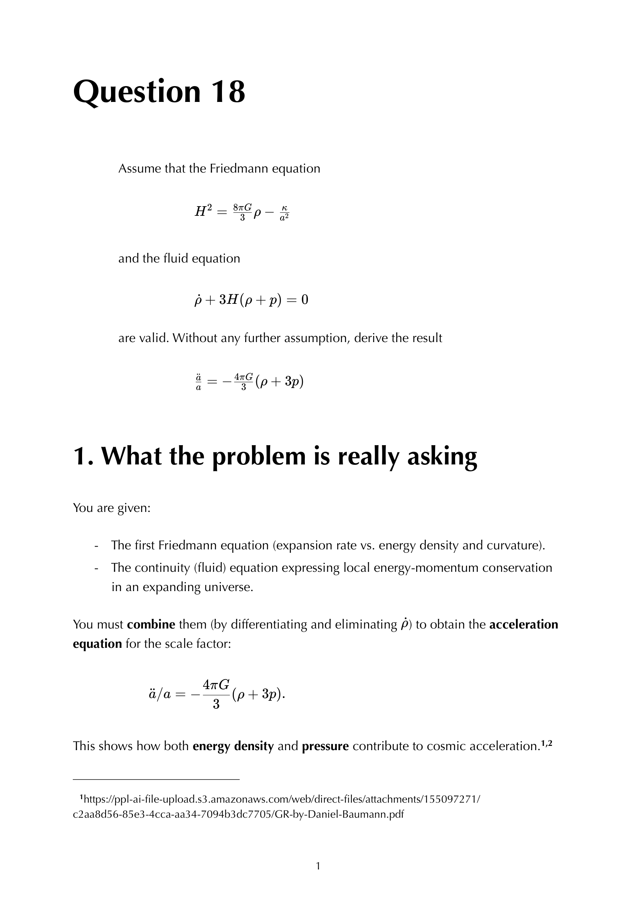

the **Friedmann equations** are Einstein's equations applied to the homogeneous-isotropic FLRW universe with a perfect-fluid stress-energy. two equations, governing the dynamics of the scale factor $a(t)$.

## the equations

### Friedmann equation (constraint)
$$\boxed{\, H^2 = \left(\frac{\dot a}{a}\right)^2 = \frac{8\pi G}{3}\rho - \frac{kc^2}{a^2} + \frac{\Lambda c^2}{3} \,}$$

with $H \equiv \dot a/a$ the Hubble parameter. the constraint relating the rate of expansion to energy density + spatial curvature + cosmological constant.

### acceleration equation (Raychaudhuri)
$$\boxed{\, \frac{\ddot a}{a} = -\frac{4\pi G}{3}(\rho + 3p) + \frac{\Lambda c^2}{3} \,}$$

the source of cosmic acceleration is $\rho + 3p$, not just $\rho$. for ordinary matter ($p > 0$), gravity decelerates. for dark energy ($p < -\rho/3$), gravity accelerates.

### continuity equation (conservation)

stress-energy conservation gives:
$$\dot \rho + 3H(\rho + p) = 0$$

see [[Continuity equation]].

## why two equations + one conservation = consistent

the **contracted Bianchi identity** ensures that two of the three equations are independent. given any two, the third follows. so:
- **Friedmann + continuity** $\to$ derive acceleration.
- **Friedmann + acceleration** $\to$ derive continuity.
- **acceleration + continuity** $\to$ derive Friedmann (up to a constant of integration, fixed by current conditions).

this redundancy is a feature, not a bug; it's what makes the system over-determined at the global level + uniquely solvable.

## the derivation

start with FLRW metric $ds^2 = -dt^2 + a^2(t)\gamma_{ij}\,dx^i dx^j$. compute Einstein tensor:
$$G_{00} = 3\!\left(\frac{\dot a}{a}\right)^2 + \frac{3 k}{a^2}, \quad G_{ij} = -\!\left(2\frac{\ddot a}{a} + \!\left(\frac{\dot a}{a}\right)^2 + \frac{k}{a^2}\right)g_{ij}$$

set equal to $8\pi G\,T_{\mu\nu}$ for a perfect fluid: $T_{00} = \rho$, $T_{ij} = p g_{ij}$.

$00$ component gives Friedmann.
spatial component combined with $00$ gives acceleration.

see Q18 - derive the acceleration equation.

## the equations in dimensionless form

defining critical density $\rho_c = 3H^2/(8\pi G)$ and $\Omega_X = \rho_X/\rho_c$:
$$1 = \sum_X \Omega_X = \Omega_m + \Omega_r + \Omega_\Lambda + \Omega_k$$

with $\Omega_k = -kc^2/(a_0^2 H_0^2)$. so the universe today has:
- $\Omega_m \approx 0.31$ (matter, dominantly cold dark matter + baryons).
- $\Omega_r \approx 9 \times 10^{-5}$ (radiation, photons + relativistic neutrinos).
- $\Omega_\Lambda \approx 0.69$ (dark energy).
- $\lvert \Omega_k\rvert < 0.005$ (curvature, ~zero).

summing: $\Omega_{\rm tot} \approx 1$, consistent with flatness.

## the Hubble equation in cosmology

writing the Friedmann equation in terms of redshift:
$$H(z)^2 = H_0^2\!\left[\Omega_r(1+z)^4 + \Omega_m(1+z)^3 + \Omega_\Lambda + \Omega_k(1+z)^2\right]$$

each species's contribution scales with $z$ according to its equation of state. used for distance + age calculations in cosmology.

## see also

- [[FLRW metric]]
- [[Spatial curvature parameter k]]
- [[Continuity equation]]
- [[Equation of state and density scaling]]
- [[Cosmic eras]]
- [[Matter radiation equality]]
- [[Hubble constant and deceleration parameter]]
- [[Newtonian Friedmann derivation]]
- Friedmann equations with Λ
- [[Cosmological constant]]
- Q18 - derive the acceleration equation
- Q19 - radiation universe
- Q20 - matter plus radiation universe
- [[General_Relativity_MOC]]
- [[Ch 7 - Cosmology]]

---

### General Relativity Mathematical & Oral Defense Panel

*Question 18 Oral Exam Model Solution: Friedmann equation $H^2 = \frac{8\pi G}{3}\rho - \frac{k}{a^2}$ and continuity equation $\dot{\rho} + 3H(\rho + p) = 0$, derivation of the acceleration equation $\frac{\ddot{a}}{a} = -\frac{4\pi G}{3}(\rho + 3p)$, and deceleration parameter $q_0 = \frac{1}{2}\Omega_m - \Omega_\Lambda$.*

## Linked References

- [[Continuity equation]]
- [[Cosmic eras]]
- [[Cosmic look-back time]]
- [[Cosmological constant]]
- [[Curvature-dynamics relation]]
- [[Deceleration parameter]]
- [[Density parameters]]
- [[Einstein equations]]
- [[Equation of state and density scaling]]
- [[FLRW metric]]
- [[Friedmann solutions]]
- [[GR Friedmann with Lambda]]
- [[Hubble law]]
- [[Lambda CDM current parameters]]
- [[Matter radiation equality]]
- [[Matter vs radiation density scaling]]
- [[Newtonian derivation of Friedmann]]
- [[Radial comoving distance]]
- [[Spatial curvature parameter k]]
- [[Stress-energy tensor]]
- [[Time-redshift relation]]
- [[Transition epochs]]
- [[Various models of the universe]]
- [[Cosmology_of_the_Early_Universe_MOC]]
- [[General_Relativity_MOC]]

