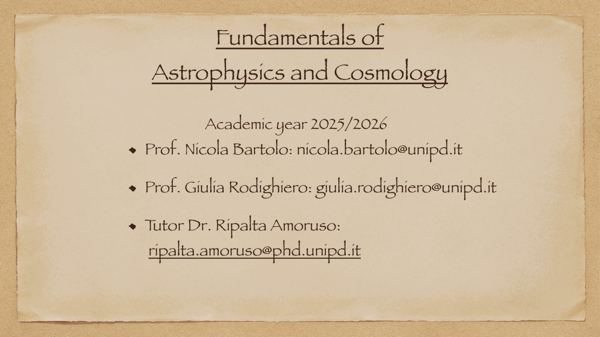
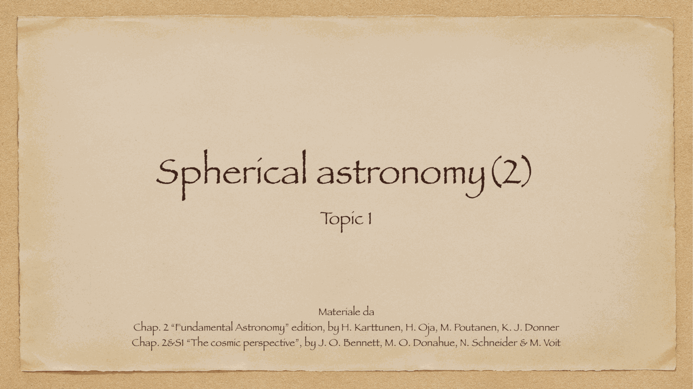
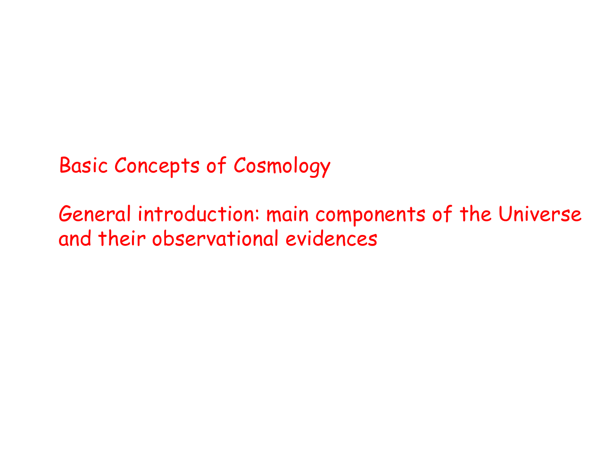
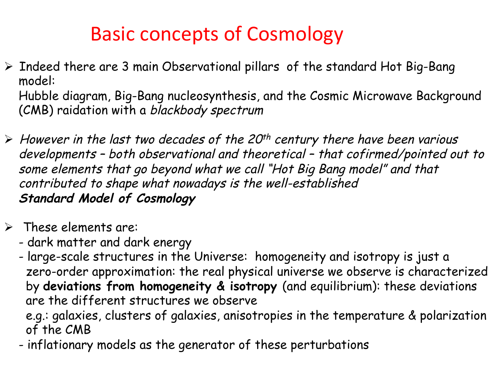
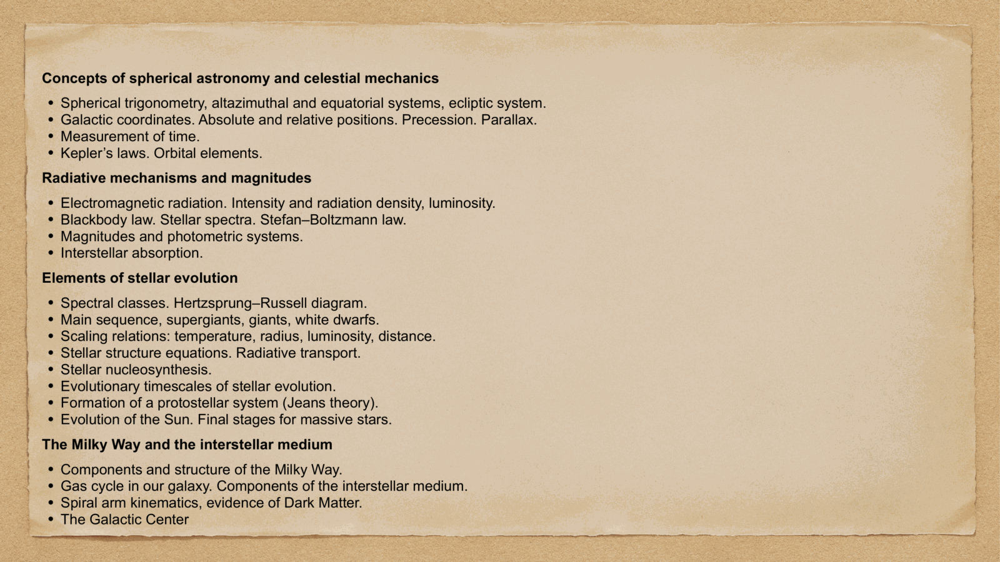
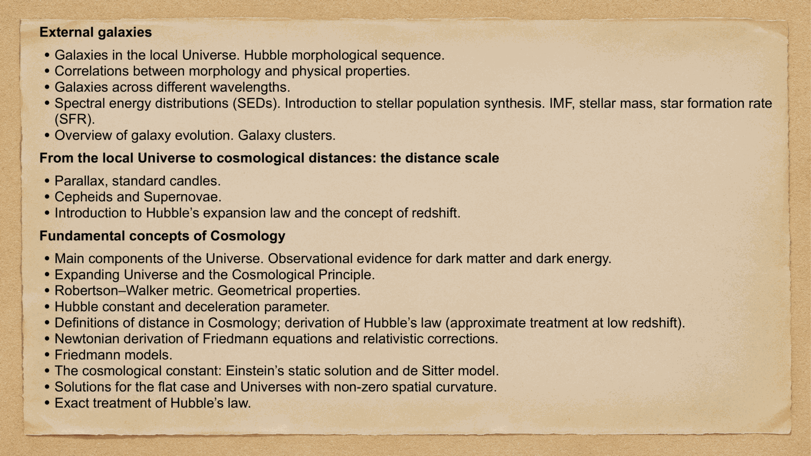
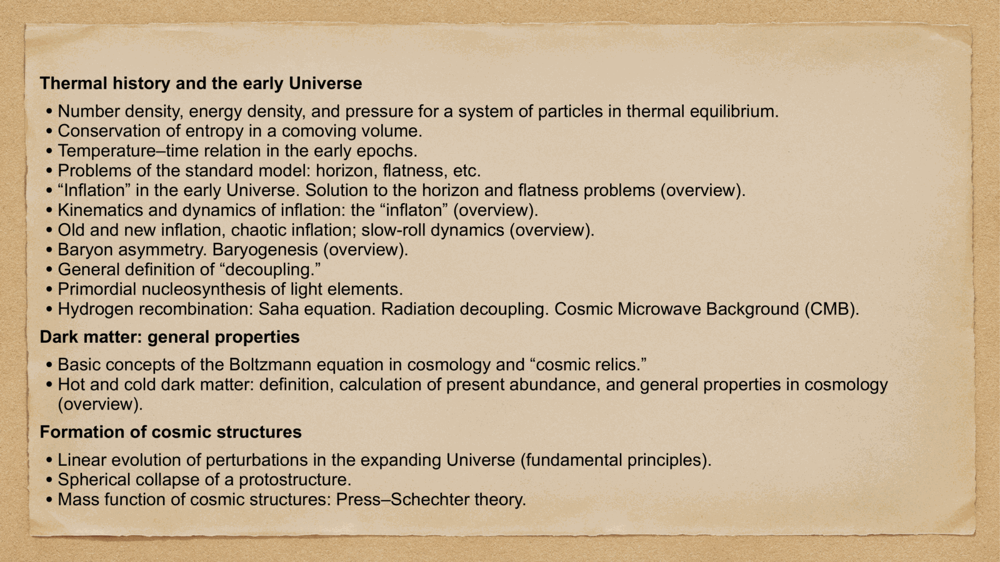
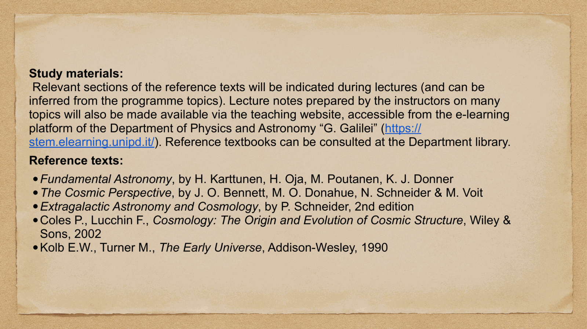


**Fundamentals of Astrophysics and Cosmology** — first-semester course, A.Y. 2025/2026, University of Padova.

teachers:
- **Prof. Nicola Bartolo** (cosmology block) — nicola.bartolo@unipd.it
- **Prof. Giulia Rodighiero** (astrophysics / observations block) — giulia.rodighiero@unipd.it
- tutor: **Dr. Ripalta Amoruso** — ripalta.amoruso@phd.unipd.it

---

## what the course covers

the course is a foundation, in two halves: a *classical* astronomy and stellar evolution side (Rodighiero) and a *modern* cosmology side (Bartolo). together they take me from the geometry of pointing at a star, through the stars themselves, to the entire universe and how we measure its age, expansion, and content.

### Concepts of spherical astronomy and celestial mechanics
- spherical trigonometry, alt-azimuthal and equatorial systems, ecliptic system
- galactic coordinates, absolute and relative positions, precession, parallax
- measurement of time
- Kepler's laws, orbital elements

→ see [Spherical_astronomy_complete](./Spherical_astronomy_complete.html)

### Radiative mechanisms and magnitudes
- electromagnetic radiation, intensity and radiation density, luminosity
- blackbody law, stellar spectra, Stefan-Boltzmann
- magnitudes and photometric systems
- interstellar absorption

### Elements of stellar evolution
- spectral classes, Hertzsprung-Russell diagram
- main sequence, supergiants, giants, white dwarfs
- scaling relations: temperature, radius, luminosity, distance
- stellar structure equations, radiative transport
- stellar nucleosynthesis
- evolutionary timescales of stellar evolution
- formation of a protostellar system (Jeans theory)
- evolution of the Sun, final stages for massive stars

### The Milky Way and the interstellar medium
- components and structure of the Milky Way
- gas cycle, components of the interstellar medium
- spiral arm kinematics, evidence of dark matter
- the Galactic Center

### External galaxies
- galaxies in the local universe, Hubble morphological sequence
- correlations between morphology and physical properties
- galaxies across different wavelengths
- spectral energy distributions (SEDs), stellar population synthesis, IMF, stellar mass, SFR
- overview of galaxy evolution, galaxy clusters

### From the local universe to cosmological distances: the distance scale
- parallax, standard candles
- Cepheids and supernovae
- introduction to Hubble's expansion law and the concept of redshift

### Fundamental concepts of cosmology
- main components of the universe, observational evidence for dark matter and dark energy

- expanding universe, cosmological principle
- Robertson-Walker metric, geometrical properties
- Hubble constant and deceleration parameter
- definitions of distance in cosmology, derivation of Hubble's law (approximate at low z)
- Newtonian derivation of Friedmann equations and relativistic corrections
- Friedmann models
- the cosmological constant: Einstein's static solution and de Sitter
- solutions for flat case and universes with non-zero spatial curvature
- exact treatment of Hubble's law

→ see [Cosmic_inventory_overview](./Cosmic_inventory_overview.html)

### Thermal history and the early universe
- number density, energy density, pressure for thermal-equilibrium particles
- conservation of entropy in a comoving volume
- temperature-time relation in early epochs
- problems of the standard model: horizon, flatness
- inflation: solution to horizon and flatness problems (overview)
- kinematics and dynamics of inflation: the inflaton (overview)
- old, new, chaotic inflation, slow-roll dynamics (overview)
- baryon asymmetry, baryogenesis (overview)
- general definition of decoupling
- primordial nucleosynthesis of light elements
- hydrogen recombination: Saha equation, radiation decoupling, CMB

→ see [BBN_overview](./BBN_overview.html)

### Dark matter: general properties
- basic concepts of the Boltzmann equation in cosmology and "cosmic relics"
- hot and cold dark matter: definition, calculation of present abundance, general properties (overview)

### Formation of cosmic structures
- linear evolution of perturbations in the expanding universe (fundamental principles)
- spherical collapse of a protostructure
- mass function of cosmic structures: Press-Schechter theory

---

## reference texts

- **Karttunen, Oja, Poutanen, Donner**, *Fundamental Astronomy* — the spherical astronomy and stellar evolution backbone
- **Bennett, Donahue, Schneider, Voit**, *The Cosmic Perspective* — accessible companion (chapters 2 and S1)
- **Schneider**, *Extragalactic Astronomy and Cosmology*, 2nd ed. — galaxies and cosmology rigorous treatment
- **Coles & Lucchin**, *Cosmology: The Origin and Evolution of Cosmic Structure* (Wiley, 2002)
- **Kolb & Turner**, *The Early Universe* (Addison-Wesley, 1990)
- **Baumann**, *Cosmology* (Part III Cambridge lecture notes) — the modern back-up text, see [Baumann_reference](./Baumann_reference.html)

slides and lecture notes are posted on the e-learning platform [stem.elearning.unipd.it](https://stem.elearning.unipd.it/).

---

## why this course matters to me

this is the *trunk* of the degree. spherical astronomy gives me coordinates. radiation gives me photons. stellar evolution gives me actors. galaxies give me a stage. the distance ladder gives me scale. Friedmann gives me dynamics. thermal history gives me time. perturbations give me structure.

every later course (Observational Cosmology, High Energy Instrumentation, GR) is a specialized refinement of one piece of this chain. so this is where I lay down the language in which everything else gets written.

---

## see also

- [Fundamentals_Astrophysics_Cosmology_MOC](../../04_Atlas/Fundamentals_Astrophysics_Cosmology_MOC.html)
- [Spherical_astronomy_complete](./Spherical_astronomy_complete.html)
- [Cosmic_inventory_overview](./Cosmic_inventory_overview.html)
- [BBN_overview](./BBN_overview.html)
- [Baumann_reference](./Baumann_reference.html)


  <h4 class="backlinks-title">Linked References (2)</h4>
  <ul class="backlinks-list">
    <li class="backlink-item-wrap"><a href="../../04_Atlas/Fundamentals_Astrophysics_Cosmology_MOC.html" class="backlink-item">Fundamentals_Astrophysics_Cosmology_MOC</a></li>
    <li class="backlink-item-wrap"><a href="./Obs_astro_course_intro.html" class="backlink-item">Obs_astro_course_intro</a></li>
  </ul>

